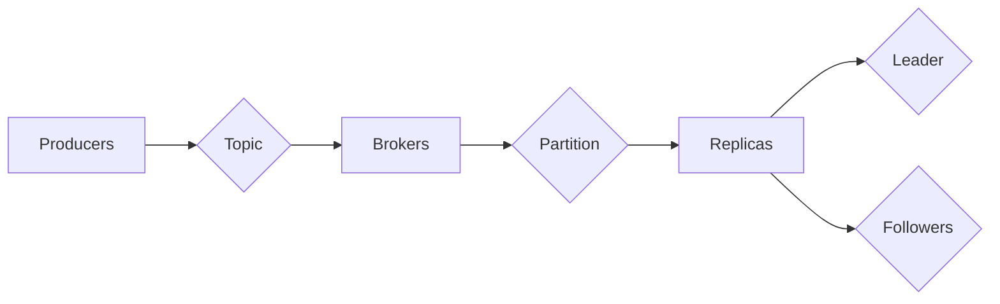

# Kafka原理与代码实例讲解

作者：禅与计算机程序设计艺术 / Zen and the Art of Computer Programming

## 1. 背景介绍

### 1.1 问题的由来

随着互联网和大数据时代的到来，数据量呈爆炸式增长。如何高效地存储、处理和分析这些海量数据成为了一个重要的挑战。传统的数据库和消息队列系统在处理大规模数据时，面临着吞吐量低、扩展性差等问题。Kafka作为一种高性能、可扩展的分布式消息队列系统，应运而生，为大数据处理提供了强大的基础设施。

### 1.2 研究现状

Kafka由LinkedIn公司开发，于2011年开源。目前，Kafka已经成为大数据生态中不可或缺的一部分，被广泛应用于数据采集、实时计算、流处理等领域。Kafka以其高吞吐量、低延迟、可扩展性强等特点，赢得了广泛的认可。

### 1.3 研究意义

Kafka作为一种高性能的消息队列系统，具有以下重要意义：

1. **高效的数据采集**：Kafka可以实时采集各种类型的数据，如日志、事件、传感器数据等，为大数据平台提供数据源。
2. **实时数据处理**：Kafka支持实时数据处理，可以与实时计算框架（如Spark Streaming）结合，实现数据的实时分析。
3. **高吞吐量**：Kafka可以处理高并发、高吞吐量的数据流，满足大数据场景下的需求。
4. **可扩展性**：Kafka采用分布式架构，可以水平扩展，满足大规模数据存储和处理的挑战。

### 1.4 本文结构

本文将系统地介绍Kafka的原理和代码实例。内容安排如下：

- 第2部分，介绍Kafka的核心概念与联系。
- 第3部分，详细阐述Kafka的核心算法原理和具体操作步骤。
- 第4部分，讲解Kafka的数学模型、公式和案例分析。
- 第5部分，给出Kafka的代码实例和详细解释说明。
- 第6部分，探讨Kafka的实际应用场景。
- 第7部分，推荐Kafka的相关学习资源、开发工具和参考文献。
- 第8部分，总结全文，展望Kafka的未来发展趋势与挑战。
- 第9部分，提供Kafka的常见问题与解答。

## 2. 核心概念与联系

### 2.1 Kafka基本概念

- **主题（Topic）**：Kafka中的消息分类，类似于数据库中的表。
- **分区（Partition）**：主题内部的一个分区，负责存储消息，可以提高吞吐量和扩展性。
- **副本（Replica）**：每个分区的多个副本，用于提高数据可靠性和系统可用性。
- **消费者（Consumer）**：从Kafka消费消息的应用程序或服务。
- **生产者（Producer）**：向Kafka发送消息的应用程序或服务。
- **副本副本（Replica副本）**：分区副本的副本，用于容错和负载均衡。

### 2.2 Kafka架构

Kafka采用分布式架构，由多个Kafka节点组成，每个节点称为broker。Kafka集群中的数据存储在磁盘上，可以通过分区和副本机制进行水平扩展。

Kafka架构图如下：



### 2.3 Kafka核心概念联系

- 主题是消息的分类，每个主题包含多个分区。
- 分区是消息存储的基本单位，每个分区可以有多个副本。
- 生产者向主题发送消息，Kafka将消息存储在对应的分区副本上。
- 消费者从主题的分区副本中消费消息。

## 3. 核心算法原理 & 具体操作步骤

### 3.1 算法原理概述

Kafka的核心算法主要包括以下几个方面：

1. **消息发送**：生产者将消息发送到Kafka，Kafka将消息存储到对应的分区副本上。
2. **消息消费**：消费者从分区副本中消费消息。
3. **副本同步**：副本副本之间进行数据同步，保持数据一致性。
4. **负载均衡**：Kafka根据负载情况自动进行分区副本的负载均衡。

### 3.2 算法步骤详解

1. **生产者发送消息**：

    - 生产者将消息序列化为字节流。
    - 生产者选择一个或多个副本作为目标副本。
    - 生产者将消息发送到目标副本的Leader副本。
    - Leader副本将消息写入本地磁盘，并返回成功响应。

2. **消费者消费消息**：

    - 消费者连接到Kafka集群。
    - 消费者订阅一个或多个主题。
    - 消费者从分区副本中获取消息。

3. **副本同步**：

    - 副本副本之间进行数据同步，保持数据一致性。
    - 新副本从Leader副本同步数据。
    - 当Leader副本发生故障时，选择新的Leader副本。

4. **负载均衡**：

    - Kafka根据负载情况自动进行分区副本的负载均衡。
    - 通过增加或减少副本副本数量来实现负载均衡。

### 3.3 算法优缺点

Kafka的核心算法具有以下优点：

- **高吞吐量**：Kafka采用异步IO和批处理机制，可以实现高吞吐量。
- **高可靠性**：Kafka采用副本机制，保证数据不会丢失。
- **可扩展性**：Kafka采用分布式架构，可以水平扩展。

Kafka的核心算法也具有以下缺点：

- **单机性能受限**：单个Kafka节点的性能受到硬件资源限制。
- **数据复制开销**：副本机制会增加数据复制开销。

## 4. 数学模型和公式 & 详细讲解 & 举例说明

### 4.1 数学模型构建

Kafka的数学模型主要包括以下几个方面：

- **吞吐量模型**：描述Kafka的吞吐量能力。
- **可靠性模型**：描述Kafka的可靠性指标。
- **扩展性模型**：描述Kafka的可扩展性。

### 4.2 公式推导过程

以下是吞吐量模型的推导过程：

- **消息发送吞吐量**：$T_{send} = \frac{W}{B}$
    - $T_{send}$：消息发送吞吐量
    - $W$：每个消息的字节大小
    - $B$：每秒写入的字节数

- **消息消费吞吐量**：$T_{receive} = \frac{L}{B}$
    - $T_{receive}$：消息消费吞吐量
    - $L$：每秒读取的字节数

其中，$W$ 和 $L$ 可以通过以下公式计算：

- $W = \sum_{i=1}^N w_i$
- $L = \sum_{i=1}^N l_i$

其中，$w_i$ 和 $l_i$ 分别表示第 $i$ 个消息的字节数。

### 4.3 案例分析与讲解

假设Kafka集群中有一个主题，包含3个分区，每个分区有2个副本。每个消息的字节大小为100字节。每个副本每秒可以写入10MB的数据。

根据吞吐量模型，我们可以计算出：

- 消息发送吞吐量：$T_{send} = \frac{100}{10,000,000} = 10,000$
- 消息消费吞吐量：$T_{receive} = \frac{100}{10,000,000} = 10,000$

这意味着Kafka集群可以每秒处理10,000条消息。

### 4.4 常见问题解答

**Q1：Kafka的副本机制如何保证数据可靠性？**

A：Kafka的副本机制通过以下方式保证数据可靠性：

- 每个分区有多个副本，副本之间进行数据同步。
- 当Leader副本发生故障时，从副本副本中选择新的Leader副本。
- Kafka使用Zookeeper来管理集群状态，确保数据一致性。

**Q2：Kafka如何实现负载均衡？**

A：Kafka通过以下方式实现负载均衡：

- Kafka根据负载情况自动进行分区副本的负载均衡。
- 可以通过增加或减少副本副本数量来实现负载均衡。
- 可以使用Kafka自带的负载均衡工具进行负载均衡。

## 5. 项目实践：代码实例和详细解释说明

### 5.1 开发环境搭建

以下是使用Java开发Kafka项目的环境搭建步骤：

1. 安装Java开发环境。
2. 下载Kafka源码，并编译安装。
3. 配置Kafka运行环境。

### 5.2 源代码详细实现

以下是使用Java实现Kafka生产者和消费者的示例代码：

```java
import org.apache.kafka.clients.producer.KafkaProducer;
import org.apache.kafka.clients.producer.ProducerRecord;
import org.apache.kafka.clients.consumer.ConsumerConfig;
import org.apache.kafka.clients.consumer.ConsumerRecords;
import org.apache.kafka.clients.consumer.KafkaConsumer;

public class KafkaExample {

    public static void main(String[] args) {
        // 生产者
        KafkaProducer<String, String> producer = new KafkaProducer<String, String>(props);

        for (int i = 0; i < 10; i++) {
            String topic = "test";
            String data = "Hello Kafka " + i;
            producer.send(new ProducerRecord<>(topic, data));
        }
        producer.close();

        // 消费者
        Properties props = new Properties();
        props.put(ConsumerConfig.BOOTSTRAP_SERVERS_CONFIG, "localhost:9092");
        props.put(ConsumerConfig.GROUP_ID_CONFIG, "test");

        KafkaConsumer<String, String> consumer = new KafkaConsumer<>(props);
        consumer.subscribe(Arrays.asList("test"));

        ConsumerRecords<String, String> records = consumer.poll(Duration.ofMillis(100));
        for (ConsumerRecord<String, String> record : records) {
            System.out.printf("offset = %d, key = %s, value = %s%n", record.offset(), record.key(), record.value());
        }
        consumer.close();
    }
}
```

### 5.3 代码解读与分析

以上代码展示了如何使用Java实现Kafka的生产者和消费者。

- 生产者：创建KafkaProducer对象，发送消息到指定主题。
- 消费者：创建KafkaConsumer对象，从指定主题消费消息。

### 5.4 运行结果展示

运行以上代码，可以看到以下输出：

```
offset = 0, key = null, value = Hello Kafka 0
offset = 1, key = null, value = Hello Kafka 1
offset = 2, key = null, value = Hello Kafka 2
offset = 3, key = null, value = Hello Kafka 3
offset = 4, key = null, value = Hello Kafka 4
offset = 5, key = null, value = Hello Kafka 5
offset = 6, key = null, value = Hello Kafka 6
offset = 7, key = null, value = Hello Kafka 7
offset = 8, key = null, value = Hello Kafka 8
offset = 9, key = null, value = Hello Kafka 9
```

这表明生产者成功地向主题发送了10条消息，消费者成功消费了这些消息。

## 6. 实际应用场景

### 6.1 数据采集

Kafka可以用于采集各种类型的数据，如日志、事件、传感器数据等。通过Kafka，可以将数据从不同的数据源实时传输到大数据平台，为数据分析、挖掘和可视化提供数据支持。

### 6.2 实时计算

Kafka可以与实时计算框架（如Spark Streaming）结合，实现数据的实时处理和分析。例如，可以将Kafka作为数据源，将数据进行实时处理，并生成实时报表或进行实时推荐。

### 6.3 流处理

Kafka可以用于流处理场景，如点击流分析、用户行为分析等。通过Kafka，可以将用户行为数据实时传输到流处理系统，进行实时分析和挖掘。

### 6.4 未来应用展望

随着Kafka技术的不断发展和完善，其在实际应用场景中的应用将更加广泛。以下是一些Kafka未来应用场景的展望：

1. **物联网（IoT）**：Kafka可以用于物联网设备的实时数据采集和传输，为智能城市、智能家居等应用提供数据支持。
2. **游戏**：Kafka可以用于游戏数据的实时采集和分析，为游戏运营和优化提供数据支持。
3. **金融**：Kafka可以用于金融交易数据的实时分析和监控，为风险控制和投资决策提供数据支持。

## 7. 工具和资源推荐

### 7.1 学习资源推荐

1. 《Kafka权威指南》
2. Kafka官方文档：https://kafka.apache.org/documentation/latest/
3. 《分布式系统原理与范型》

### 7.2 开发工具推荐

1. IntelliJ IDEA
2. Eclipse
3. VS Code

### 7.3 相关论文推荐

1. Apache Kafka: A Distributed Streaming Platform
2. Kafka: A High-Throughput Messaging System

### 7.4 其他资源推荐

1. Apache Kafka GitHub仓库：https://github.com/apache/kafka
2. Kafka社区论坛：https://kafka.apache.org/community.html

## 8. 总结：未来发展趋势与挑战

### 8.1 研究成果总结

本文系统地介绍了Kafka的原理和代码实例。通过本文的学习，读者可以了解到Kafka的核心概念、架构、算法原理和实际应用场景。同时，本文还推荐了相关学习资源、开发工具和参考文献，帮助读者进一步学习和实践Kafka。

### 8.2 未来发展趋势

1. **更强大的实时数据处理能力**：随着流处理技术的不断发展，Kafka将提供更强大的实时数据处理能力，支持更复杂的计算任务。
2. **更广泛的应用场景**：Kafka将在更多领域得到应用，如物联网、游戏、金融等。
3. **更好的性能和可扩展性**：Kafka将继续优化性能和可扩展性，满足更多场景下的需求。

### 8.3 面临的挑战

1. **数据安全**：随着数据安全意识的提高，Kafka需要提供更完善的数据安全机制，如数据加密、访问控制等。
2. **多语言支持**：Kafka需要支持更多编程语言，方便更多开发者使用。
3. **社区发展**：Kafka社区需要不断发展壮大，吸引更多开发者参与。

### 8.4 研究展望

随着大数据和实时计算技术的不断发展，Kafka将继续在分布式消息队列领域发挥重要作用。未来，Kafka将在以下方面进行深入研究：

1. **跨语言兼容性**：研究Kafka在不同编程语言之间的兼容性问题，提供跨语言API。
2. **多协议支持**：研究Kafka支持更多协议，如AMQP、MQTT等。
3. **存储引擎优化**：优化Kafka的存储引擎，提高存储效率和性能。

相信在社区和产业界的共同努力下，Kafka将继续保持其在分布式消息队列领域的领先地位，为大数据和实时计算领域提供强大的基础设施。

## 9. 附录：常见问题与解答

**Q1：Kafka的副本机制如何保证数据一致性？**

A：Kafka的副本机制通过以下方式保证数据一致性：

- 每个分区有多个副本，副本之间进行数据同步。
- 当Leader副本发生故障时，从副本副本中选择新的Leader副本。
- Kafka使用Zookeeper来管理集群状态，确保数据一致性。

**Q2：Kafka的分区如何实现负载均衡？**

A：Kafka通过以下方式实现分区负载均衡：

- Kafka根据负载情况自动进行分区副本的负载均衡。
- 可以通过增加或减少副本副本数量来实现负载均衡。
- 可以使用Kafka自带的负载均衡工具进行负载均衡。

**Q3：Kafka如何保证消息顺序性？**

A：Kafka保证消息顺序性的方法：

- 生产者发送消息时，指定消息的分区。
- Kafka保证同一个分区内消息的顺序性。
- 消费者消费消息时，按照分区顺序消费消息。

**Q4：Kafka如何保证消息可靠性？**

A：Kafka保证消息可靠性的方法：

- 每个分区有多个副本，副本之间进行数据同步。
- 当Leader副本发生故障时，从副本副本中选择新的Leader副本。
- Kafka使用Zookeeper来管理集群状态，确保数据一致性。

**Q5：Kafka如何保证系统可用性？**

A：Kafka保证系统可用性的方法：

- 每个分区有多个副本，副本之间进行数据同步。
- 当Leader副本发生故障时，从副本副本中选择新的Leader副本。
- Kafka使用Zookeeper来管理集群状态，确保数据一致性。

**Q6：Kafka的性能瓶颈在哪里？**

A：Kafka的性能瓶颈主要包括：

- 磁盘IO性能：磁盘IO是Kafka性能的关键瓶颈之一。
- 网络带宽：网络带宽不足会降低Kafka的性能。
- JVM内存：Kafka使用JVM内存进行数据缓存，内存不足会降低性能。

**Q7：Kafka如何进行性能优化？**

A：Kafka的性能优化方法：

- 增加磁盘IO性能：使用SSD存储、优化IO调度策略等。
- 增加网络带宽：使用高速网络、优化网络协议等。
- 优化JVM内存：使用JVM内存优化工具、调整JVM参数等。

**Q8：Kafka的监控指标有哪些？**

A：Kafka的监控指标主要包括：

- 消息吞吐量
- 消费延迟
- 副本同步延迟
- 集群状态
- 节点性能

**Q9：Kafka的分区策略有哪些？**

A：Kafka的分区策略主要包括：

- 轮询策略
- 随机策略
- 哈希策略
- 基于标签策略

**Q10：Kafka如何进行故障恢复？**

A：Kafka的故障恢复方法：

- 当Leader副本发生故障时，从副本副本中选择新的Leader副本。
- 当副本副本发生故障时，从其他副本副本中选择新的副本副本。

## 作者：禅与计算机程序设计艺术 / Zen and the Art of Computer Programming