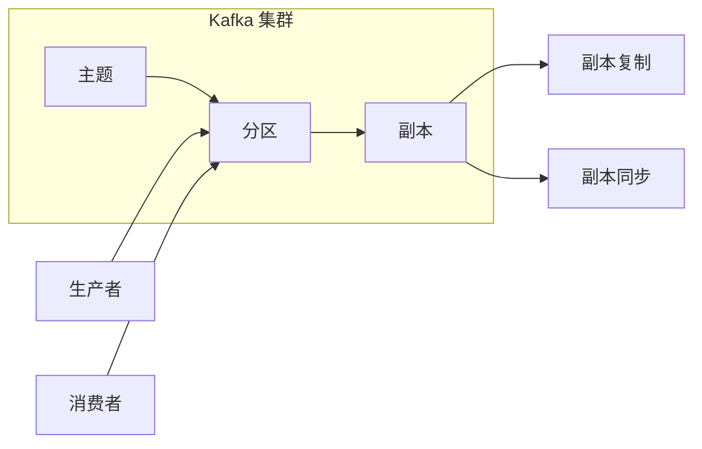

# Kafka生产者消费者API原理与代码实例讲解

作者：禅与计算机程序设计艺术 / Zen and the Art of Computer Programming

## 1. 背景介绍
### 1.1 问题的由来

随着大数据时代的到来，分布式系统的应用越来越广泛。在分布式系统中，数据的生产、传输、消费等环节都变得尤为重要。Kafka 作为一款高性能、可扩展、高吞吐量的消息队列系统，被广泛应用于分布式系统中。Kafka 提供了生产者消费者API，用于实现消息的生产和消费，本文将详细介绍 Kafka 生产者消费者API的原理和应用。

### 1.2 研究现状

Kafka 是由 LinkedIn 开发，目前由 Apache 软件基金会进行维护的开源分布式流处理平台。Kafka 设计之初就是为了处理高吞吐量的数据流，因此具有以下特点：

- 高性能：Kafka 可以支持每秒数百万条消息的吞吐量，并能够水平扩展。
- 可靠性：Kafka 保证消息的持久化和可靠性，即使发生系统故障，也不会丢失数据。
- 可扩展性：Kafka 可以通过增加副本和分区来水平扩展，以满足更大的负载。
- 容错性：Kafka 支持数据的分区和副本，即使某些节点出现故障，系统也能正常运行。
- 高效性：Kafka 支持多种消息压缩方式，减少网络传输的负担。

### 1.3 研究意义

Kafka 生产者消费者API是 Kafka 的核心组件之一，它提供了用于消息生产和消费的接口。研究 Kafka 生产者消费者API的原理和用法，对于开发分布式系统具有重要意义：

- 提高开发效率：使用 Kafka 生产者消费者API可以快速实现消息的生产和消费，降低开发成本。
- 提升系统性能：Kafka 高效的消息处理能力可以帮助提升系统的性能。
- 增强系统可靠性：Kafka 的可靠性和容错性可以增强系统的稳定性。

### 1.4 本文结构

本文将按照以下结构进行讲解：

- 第2部分，介绍 Kafka 生产者消费者API的核心概念和联系。
- 第3部分，详细阐述 Kafka 生产者消费者API的原理和具体操作步骤。
- 第4部分，介绍 Kafka 生产者消费者API的数学模型和公式，并结合实例讲解。
- 第5部分，给出 Kafka 生产者消费者API的代码实例和详细解释说明。
- 第6部分，探讨 Kafka 生产者消费者API在实际应用场景中的应用。
- 第7部分，推荐 Kafka 生产者消费者API相关的学习资源、开发工具和参考文献。
- 第8部分，总结 Kafka 生产者消费者API的未来发展趋势和挑战。
- 第9部分，提供 Kafka 生产者消费者API的常见问题与解答。

## 2. 核心概念与联系

为了更好地理解 Kafka 生产者消费者API，本节将介绍几个密切相关的核心概念：

- 主题（Topic）：Kafka 中消息的分类方式，类似于数据库中的表。
- 分区（Partition）：每个主题可以包含多个分区，分区是 Kafka 中的逻辑存储单位，每个分区存储着主题的一部分消息。
- 副本（Replica）：每个分区可以有多个副本，副本用于保证数据的高可靠性和可用性。
- 生产者（Producer）：负责生产消息并写入到 Kafka 集群的实例。
- 消费者（Consumer）：负责从 Kafka 集群中读取消息的实例。
- 消息（Message）：Kafka 中的数据单元，包含消息内容和相关元信息。
- 偏移（Offset）：标识消息在特定分区中的位置。

它们之间的逻辑关系如下图所示：



- 生产者将消息发送到主题，消息会被分配到相应的分区。
- 消费者从分区中读取消息。
- 副本用于保证数据的可靠性和可用性，副本之间通过副本复制和副本同步保持数据一致性。

## 3. 核心算法原理 & 具体操作步骤
### 3.1 算法原理概述

Kafka 生产者消费者API的核心原理是基于分区和副本的分布式存储机制。每个分区存储着消息的有序序列，副本用于保证数据的可靠性和可用性。

- 生产者通过 Kafka API 发送消息到指定的主题和分区。
- 消息会被写入到分区的Leader副本中。
- Leader副本负责处理读写请求，Follower副本负责从Leader副本复制数据。
- 当Leader副本发生故障时，Kafka 会从Follower副本中选取一个新的Leader副本，保证系统的可用性。

### 3.2 算法步骤详解

以下是 Kafka 生产者消费者API的基本操作步骤：

**生产者**：

1. 连接到 Kafka 集群。
2. 选择要发送消息的主题和分区。
3. 构造消息对象，包括消息内容和相关元信息。
4. 发送消息到 Kafka 集群。

**消费者**：

1. 连接到 Kafka 集群。
2. 订阅要消费的主题。
3. 获取分区列表。
4. 从指定的分区中读取消息。

### 3.3 算法优缺点

Kafka 生产者消费者API具有以下优点：

- 高性能：Kafka 支持每秒数百万条消息的吞吐量，并能够水平扩展。
- 可靠性：Kafka 保证消息的持久化和可靠性，即使发生系统故障，也不会丢失数据。
- 可扩展性：Kafka 可以通过增加副本和分区来水平扩展，以满足更大的负载。
- 容错性：Kafka 支持数据的分区和副本，即使某些节点出现故障，系统也能正常运行。

Kafka 生产者消费者API的缺点：

- 学习成本较高：Kafka 的配置和调优较为复杂，需要一定的时间学习。
- 系统复杂度较高：Kafka 是一个分布式系统，其系统复杂度较高。

### 3.4 算法应用领域

Kafka 生产者消费者API可以应用于以下领域：

- 日志收集和聚合
- 实时数据流处理
- 消息队列
- 分布式系统通信

## 4. 数学模型和公式 & 详细讲解 & 举例说明
### 4.1 数学模型构建

Kafka 生产者消费者API的数学模型主要涉及以下几个概念：

- 消息速率：单位时间内生产或消费的消息数量。
- 系统吞吐量：单位时间内系统处理的消息数量。
- 系统延迟：消息从生产到消费的延迟时间。

### 4.2 公式推导过程

以下是一个简单的数学模型，用于描述 Kafka 生产者消费者API的性能：

$$
\text{系统吞吐量} = \text{消息速率} \times \text{并发数}
$$

其中：

- 消息速率：单位时间内生产或消费的消息数量。
- 并发数：同时生产和消费消息的线程或进程数量。

### 4.3 案例分析与讲解

假设一个 Kafka 集群有 4 个节点，每个节点有 8 个分区，共有 32 个分区。生产者和消费者各使用 4 个线程，并发数均为 4。每个消息大小为 1KB。

- 消息速率：每个线程每秒生产 1000 消息，共 4000 消息/秒。
- 系统吞吐量：4000 消息/秒。

### 4.4 常见问题解答

**Q1：Kafka 的消息顺序性如何保证？**

A：Kafka 保证每个分区内的消息顺序性，但不同分区之间的消息顺序性无法保证。如果需要保证全局顺序性，可以将消息发送到同一个分区。

**Q2：Kafka 的分区数量越多越好吗？**

A：分区数量过多可能会导致系统复杂度增加，降低系统性能。一般来说，根据系统负载和硬件资源，每个节点可以处理 100 个左右的分区。

**Q3：Kafka 的副本数量越多越好吗？**

A：副本数量越多，系统的可靠性和可用性越高。但过多的副本会增加存储和计算资源消耗。一般来说，每个分区可以配置 2-3 个副本。

## 5. 项目实践：代码实例和详细解释说明
### 5.1 开发环境搭建

以下是使用 Java 编写 Kafka 生产者和消费者的示例代码，需要安装 Kafka 和 Kafka 客户端库。

```java
// 1. 添加 Kafka 客户端库依赖
<dependency>
    <groupId>org.apache.kafka</groupId>
    <artifactId>kafka-clients</artifactId>
    <version>2.8.0</version>
</dependency>

// 2. 生产者代码示例
Properties props = new Properties();
props.put("bootstrap.servers", "localhost:9092"); // Kafka 集群地址
props.put("key.serializer", "org.apache.kafka.common.serialization.StringSerializer");
props.put("value.serializer", "org.apache.kafka.common.serialization.StringSerializer");

Producer<String, String> producer = new KafkaProducer<>(props);

// 3. 发送消息
String topic = "test-topic";
String message = "Hello, Kafka!";
producer.send(new ProducerRecord<>(topic, null, message));
producer.flush();
producer.close();

// 4. 消费者代码示例
Properties props = new Properties();
props.put("bootstrap.servers", "localhost:9092"); // Kafka 集群地址
props.put("group.id", "test-group");
props.put("key.deserializer", "org.apache.kafka.common.serialization.StringDeserializer");
props.put("value.deserializer", "org.apache.kafka.common.serialization.StringDeserializer");

Consumer<String, String> consumer = new KafkaConsumer<>(props);

// 5. 订阅主题
List<String> topics = Arrays.asList("test-topic");

consumer.subscribe(topics);

// 6. 消费消息
while (true) {
    ConsumerRecord<String, String> record = consumer.poll(Duration.ofMillis(100));
    if (record.value() != null) {
        System.out.println("Received message: " + record.value());
    }
}

consumer.close();
```

### 5.2 源代码详细实现

以上代码演示了 Kafka 生产者和消费者的基本使用方法。

- 生产者代码示例：
  1. 创建 Properties 对象，设置 Kafka 集群地址和生产者配置。
  2. 创建 KafkaProducer 实例。
  3. 创建 ProducerRecord 对象，指定主题、键和值。
  4. 发送消息到 Kafka 集群，并刷新缓冲区。
  5. 关闭生产者。

- 消费者代码示例：
  1. 创建 Properties 对象，设置 Kafka 集群地址、消费者配置和反序列化器。
  2. 创建 KafkaConsumer 实例。
  3. 订阅主题。
  4. 循环读取 Kafka 集群中的消息，并打印消息内容。

### 5.3 代码解读与分析

以上代码展示了 Kafka 生产者和消费者的基本使用方法。在实际应用中，可以根据需求进行扩展和优化。

### 5.4 运行结果展示

运行以上代码，可以看到生产者发送的消息被消费者接收并打印出来。

```
Received message: Hello, Kafka!
```

## 6. 实际应用场景
### 6.1 日志收集和聚合

Kafka 可以作为日志收集和聚合的平台，将来自各个系统的日志数据实时收集到 Kafka 集群中，然后通过消费者进行统一处理和分析。

### 6.2 实时数据流处理

Kafka 可以作为实时数据流处理平台，将来自各个系统的实时数据实时写入 Kafka 集群，然后通过消费者进行实时处理和分析。

### 6.3 消息队列

Kafka 可以作为消息队列，用于异步解耦各个系统，实现系统之间的解耦和松耦合。

### 6.4 分布式系统通信

Kafka 可以作为分布式系统通信平台，实现系统之间的消息传递和同步。

## 7. 工具和资源推荐
### 7.1 学习资源推荐

以下是 Kafka 相关的学习资源推荐：

- 《Kafka权威指南》：全面介绍了 Kafka 的原理、架构、应用等。
- Kafka 官方文档：Kafka 的官方文档，提供了详细的技术说明和示例代码。
- Kafka 官方社区：Kafka 的官方社区，可以获取最新的技术动态和问题解答。

### 7.2 开发工具推荐

以下是 Kafka 开发工具推荐：

- Kafka Manager：Kafka 的管理工具，可以方便地监控和管理 Kafka 集群。
- Kafka Tools：Kafka 的命令行工具，可以方便地操作 Kafka 集群。
- Kafka Connect：Kafka 的连接器，可以将数据源和目标系统集成到 Kafka 集群。

### 7.3 相关论文推荐

以下是 Kafka 相关的论文推荐：

- Kafka: A Distributed Streaming Platform

### 7.4 其他资源推荐

以下是 Kafka 其他资源推荐：

- Kafka 官方博客：Kafka 的官方博客，可以获取 Kafka 的最新动态和技术文章。
- Kafka 社区论坛：Kafka 的社区论坛，可以获取 Kafka 的技术交流和问题解答。

## 8. 总结：未来发展趋势与挑战
### 8.1 研究成果总结

本文对 Kafka 生产者消费者API的原理和应用进行了详细介绍，包括核心概念、算法原理、代码实例和实际应用场景。通过学习本文，读者可以全面了解 Kafka 生产者消费者API，并能够将其应用于实际项目中。

### 8.2 未来发展趋势

Kafka 作为一款成熟的分布式流处理平台，其未来发展趋势如下：

- 持续优化性能：Kafka 将持续优化性能，提高吞吐量和降低延迟。
- 扩展功能：Kafka 将扩展新的功能，如支持多租户、支持更多数据格式等。
- 生态建设：Kafka 将加强生态建设，与其他开源项目进行集成。

### 8.3 面临的挑战

Kafka 在发展过程中也面临着一些挑战：

- 系统复杂性：Kafka 是一个复杂的分布式系统，其管理和维护需要专业的技术团队。
- 资源消耗：Kafka 需要大量的存储和计算资源，对于资源有限的企业来说，部署 Kafka 可能存在一定的挑战。
- 安全性：Kafka 的安全性需要进一步加强，以防止恶意攻击和数据泄露。

### 8.4 研究展望

为了应对未来的挑战，以下研究方向值得关注：

- 模型优化：通过模型优化，提高 Kafka 的性能和资源利用率。
- 生态扩展：加强 Kafka 与其他开源项目的集成，构建更加完善的生态系统。
- 安全性提升：加强 Kafka 的安全性，防止恶意攻击和数据泄露。

相信在未来的发展中，Kafka 将持续优化性能，扩展功能，为分布式系统提供更加高效、可靠的消息处理平台。

## 9. 附录：常见问题与解答

**Q1：Kafka 与其他消息队列的区别是什么？**

A：Kafka 与其他消息队列的区别主要体现在以下几个方面：

- Kafka 支持高吞吐量、高可靠性，适用于高并发的场景。
- Kafka 支持数据持久化和副本机制，保证数据可靠性。
- Kafka 支持多分区和副本，实现水平扩展。

**Q2：如何保证 Kafka 的高可靠性？**

A：Kafka 通过以下方式保证高可靠性：

- 数据持久化：Kafka 将消息持久化到磁盘，保证数据不丢失。
- 副本机制：Kafka 支持数据的分区和副本，保证数据在发生故障时仍可访问。
- 故障恢复：Kafka 可以自动从副本中选取新的 Leader 副本，保证系统可用性。

**Q3：如何提高 Kafka 的性能？**

A：以下是一些提高 Kafka 性能的方法：

- 调整分区数：根据系统负载和硬件资源，合理调整分区数。
- 调整副本数：根据系统负载和可靠性要求，合理调整副本数。
- 优化配置：根据系统负载和硬件资源，优化 Kafka 配置参数。

**Q4：如何监控 Kafka 集群？**

A：可以使用以下工具监控 Kafka 集群：

- Kafka Manager：Kafka 的管理工具，可以方便地监控和管理 Kafka 集群。
- JMX：JMX 是一种标准的监控和远程管理平台，可以用于监控 Kafka 集群。
- 自定义监控：可以根据需求开发自定义的监控工具。

**Q5：如何将 Kafka 应用于实际项目中？**

A：以下是一些将 Kafka 应用于实际项目的步骤：

- 确定项目需求和目标。
- 选择合适的 Kafka 版本和配置。
- 设计 Kafka 集群架构。
- 开发 Kafka 生产者和消费者。
- 部署和监控 Kafka 集群。

通过以上步骤，可以将 Kafka 应用于实际项目中，实现消息的生产、传输和消费。