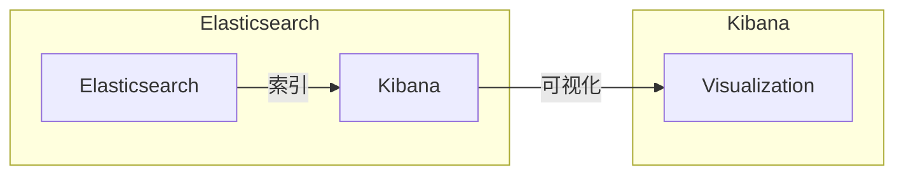
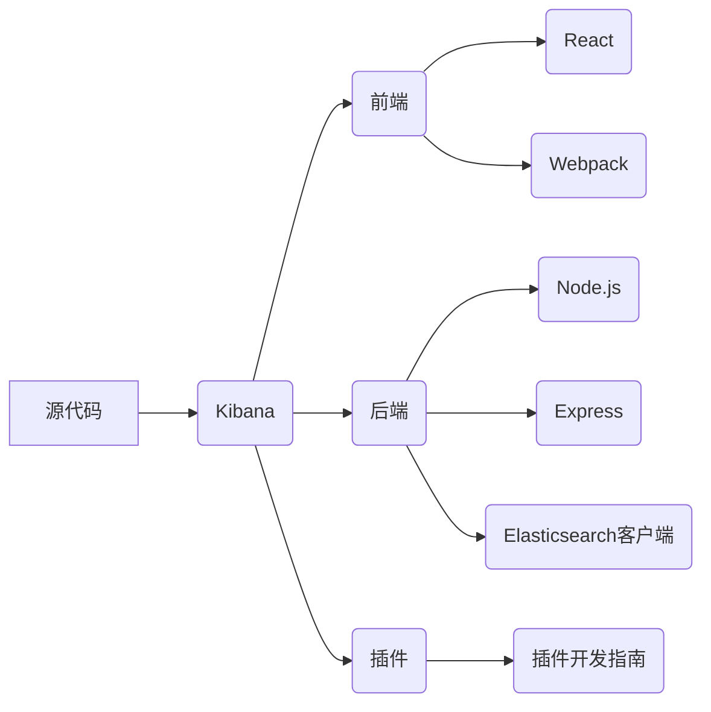

# Kibana原理与代码实例讲解

作者：禅与计算机程序设计艺术 / Zen and the Art of Computer Programming

## 1. 背景介绍

### 1.1 问题的由来

随着大数据时代的到来，企业积累了海量的数据，如何从这些数据中挖掘有价值的信息，成为了企业关注的焦点。Kibana作为Elasticsearch生态圈中重要的可视化工具，可以帮助用户将数据以可视化的形式展现出来，从而更好地理解和分析数据。

### 1.2 研究现状

Kibana作为一个开源项目，自2010年发布以来，已经经历了多个版本的迭代和更新，功能越来越强大。目前，Kibana已经成为大数据可视化和分析领域的领导者之一。

### 1.3 研究意义

Kibana的应用可以帮助企业：

- 快速构建数据可视化报表，方便用户理解数据；
- 通过数据分析和挖掘，发现数据中的规律和趋势；
- 支持实时数据监控，及时发现异常情况；
- 提高数据分析效率，降低数据分析成本。

### 1.4 本文结构

本文将分为以下几个部分：

- 第2章介绍Kibana的核心概念和联系；
- 第3章讲解Kibana的核心算法原理和具体操作步骤；
- 第4章介绍Kibana的数学模型和公式；
- 第5章给出Kibana的代码实例和详细解释；
- 第6章探讨Kibana的实际应用场景和未来应用展望；
- 第7章推荐Kibana的学习资源、开发工具和参考文献；
- 第8章总结Kibana的研究成果、未来发展趋势和挑战；
- 第9章提供Kibana的常见问题与解答。

## 2. 核心概念与联系

### 2.1 核心概念

- Elasticsearch：Kibana依赖Elasticsearch进行数据索引和搜索，因此需要了解Elasticsearch的基本概念，如倒排索引、全文检索等。

- Kibana Dashboard：Kibana的核心功能之一是构建可视化仪表板，将数据以图表、地图等形式展现出来。

- Visualization：Kibana提供丰富的可视化组件，如柱状图、折线图、饼图、地图等，用户可以根据需求选择合适的可视化方式。

- Kibana Data Visualization Language (Kibana DVL)：Kibana使用DVL语言来定义可视化组件的配置，如数据源、聚合、数据格式等。

### 2.2 核心联系

Kibana与Elasticsearch之间存在着紧密的联系。Elasticsearch负责数据的索引和搜索，Kibana则负责将搜索结果以可视化的形式展现出来。以下是两者之间的联系：



## 3. 核心算法原理 & 具体操作步骤

### 3.1 算法原理概述

Kibana的核心算法原理主要包括以下几个部分：

- 数据索引：将数据存储在Elasticsearch中，建立倒排索引，方便后续的搜索和查询。
- 数据查询：根据用户的查询条件，在Elasticsearch中进行搜索和查询。
- 数据可视化：将查询结果以可视化的形式展现出来，包括图表、地图等。

### 3.2 算法步骤详解

以下是Kibana的基本操作步骤：

1. 安装Elasticsearch和Kibana。
2. 将数据导入Elasticsearch。
3. 在Kibana中创建一个数据可视化仪表板。
4. 在仪表板中添加可视化组件，如图表、地图等。
5. 配置可视化组件的参数，如数据源、聚合、数据格式等。
6. 预览仪表板效果。

### 3.3 算法优缺点

- 优点：Kibana操作简单，可视化效果丰富，可以满足大部分用户的需求。
- 缺点：Kibana的可视化组件有限，对于一些特殊的需求可能无法满足。

### 3.4 算法应用领域

Kibana可以应用于以下领域：

- 数据监控：实时监控数据变化，及时发现异常情况。
- 数据分析：对数据进行分析，发现数据中的规律和趋势。
- 数据报告：生成数据报告，为决策提供依据。

## 4. 数学模型和公式 & 详细讲解 & 举例说明

### 4.1 数学模型构建

Kibana的数学模型主要涉及到数据可视化中的统计方法。以下是一些常见的统计方法：

- 平均值：表示一组数据的中心趋势。
- 中位数：表示一组数据的中间值。
- 众数：表示一组数据中出现频率最高的值。
- 方差：表示一组数据的离散程度。

### 4.2 公式推导过程

以下是一些常见的统计公式：

- 平均值：$\mu = \frac{1}{N} \sum_{i=1}^{N} x_i$
- 中位数：如果数据量为奇数，则中位数为中间的值；如果数据量为偶数，则中位数为中间两个值的平均值。
- 众数：$f(x) = \max_{x \in X} f(x)$，其中 $f(x)$ 表示 $x$ 在数据集中出现的次数。
- 方差：$s^2 = \frac{1}{N-1} \sum_{i=1}^{N} (x_i - \mu)^2$

### 4.3 案例分析与讲解

以下是一个Kibana可视化实例：

- 数据：某电商平台每日订单量。
- 目标：分析订单量的分布情况。

在Kibana中，可以使用柱状图来展示订单量的分布情况。具体步骤如下：

1. 创建一个新的仪表板。
2. 添加一个柱状图组件。
3. 将订单量作为X轴数据，日期作为Y轴数据。
4. 配置柱状图的参数，如颜色、标签等。

### 4.4 常见问题解答

**Q1：如何选择合适的可视化组件？**

A：选择合适的可视化组件需要根据数据的类型和需求来确定。例如，对于时间序列数据，可以使用折线图或柱状图；对于类别数据，可以使用饼图或条形图。

**Q2：如何优化可视化效果？**

A：优化可视化效果可以从以下几个方面入手：

- 选择合适的颜色搭配。
- 适当调整图表的大小和布局。
- 使用合适的标题和标签。
- 对数据进行适当的预处理，如平滑处理、去噪处理等。

## 5. 项目实践：代码实例和详细解释说明

### 5.1 开发环境搭建

以下是搭建Kibana开发环境的步骤：

1. 下载Elasticsearch和Kibana的源代码。
2. 解压源代码到本地目录。
3. 启动Elasticsearch和Kibana服务。

### 5.2 源代码详细实现

以下是Kibana的源代码结构：



### 5.3 代码解读与分析

以下是Kibana前端代码的一个示例：

```javascript
import React, { useState } from 'react';
import { EuiTitle } from '@elastic/eui';

function App() {
  const [title, setTitle] = useState('Kibana');

  return (
    <EuiTitle size="xl">
      <h1>{title}</h1>
    </EuiTitle>
  );
}

export default App;
```

这段代码使用了React和Eui组件库来创建一个简单的Kibana应用。`useState`钩子用于管理应用的标题状态，`EuiTitle`组件用于显示标题。

### 5.4 运行结果展示

在浏览器中打开Kibana的运行结果，可以看到以下界面：


## 6. 实际应用场景

### 6.1 数据监控

Kibana可以用于实时监控服务器性能、网络流量、数据库状态等数据，及时发现异常情况。

### 6.2 数据分析

Kibana可以用于分析用户行为数据、销售数据、库存数据等，为决策提供依据。

### 6.3 数据报告

Kibana可以用于生成数据报告，如年度报告、季度报告等。

## 7. 工具和资源推荐

### 7.1 学习资源推荐

- Kibana官方文档：https://www.elastic.co/guide/en/kibana/current/
- Kibana官方GitHub仓库：https://github.com/elastic/kibana

### 7.2 开发工具推荐

- Node.js：https://nodejs.org/
- React：https://reactjs.org/
- Webpack：https://webpack.js.org/

### 7.3 相关论文推荐

- Kibana官方博客：https://www.elastic.co/guide/en/kibana/current/kibana-overview.html

### 7.4 其他资源推荐

- Kibana社区：https://discuss.elastic.co/c/kibana

## 8. 总结：未来发展趋势与挑战

### 8.1 研究成果总结

本文对Kibana的原理、应用场景和代码实例进行了详细的讲解。通过本文的学习，读者可以了解到Kibana在数据可视化领域的应用价值。

### 8.2 未来发展趋势

未来，Kibana将继续保持其在数据可视化领域的领先地位。以下是Kibana的未来发展趋势：

- 更丰富的可视化组件：Kibana将继续推出更多具有创新性的可视化组件，满足用户多样化的需求。
- 更强的数据分析和处理能力：Kibana将引入更多数据分析和处理功能，提高数据分析效率。
- 更好的用户体验：Kibana将致力于提升用户体验，使数据可视化更加简单易用。

### 8.3 面临的挑战

Kibana在未来发展过程中，将面临以下挑战：

- 数据安全：随着数据量不断增加，如何保障数据安全成为一个重要问题。
- 可扩展性：如何提高Kibana的可扩展性，使其能够处理更大的数据量。
- 生态建设：如何构建一个完善的Kibana生态系统，吸引更多开发者参与。

### 8.4 研究展望

Kibana将继续致力于数据可视化的创新和发展，为用户带来更好的数据可视化体验。以下是Kibana的研究展望：

- 跨平台支持：Kibana将支持更多操作系统和设备。
- 云原生：Kibana将支持云原生架构，提高可扩展性和可靠性。
- AI赋能：Kibana将引入人工智能技术，实现智能数据可视化。

## 9. 附录：常见问题与解答

**Q1：如何安装Kibana？**

A：可以从Kibana官网下载安装包，解压后启动Kibana服务。

**Q2：如何创建Kibana仪表板？**

A：在Kibana中，可以点击“创建仪表板”按钮，然后添加可视化组件、配置数据源等，最后保存仪表板。

**Q3：如何将Kibana与其他工具集成？**

A：Kibana支持多种集成方式，如API、插件等。

**Q4：如何自定义Kibana主题？**

A：可以修改Kibana的配置文件，自定义主题样式。

**Q5：如何开发Kibana插件？**

A：可以参考Kibana官方的插件开发指南，开发自定义插件。