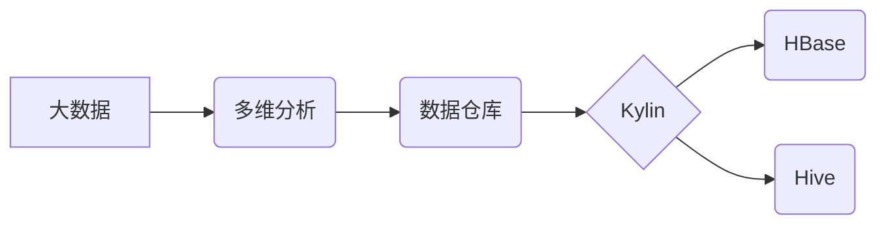

# Kylin原理与代码实例讲解

作者：禅与计算机程序设计艺术 / Zen and the Art of Computer Programming

## 关键词：

Kylin，大数据，多维分析，数据仓库，MOLAP，数据模型，HBase，Hive

## 1. 背景介绍

### 1.1 问题的由来

随着大数据时代的到来，企业积累了海量的业务数据，如何对这些数据进行高效的多维分析，成为了企业决策和业务洞察的重要需求。传统的数据库在处理大规模数据集和复杂多维分析时存在性能瓶颈。因此，需要一种专门针对大数据进行多维分析的工具，以满足企业在数据分析方面的需求。

### 1.2 研究现状

近年来，随着Hadoop等大数据技术的成熟，出现了许多针对大数据的多维分析工具，如Kylin、Druid、ClickHouse等。这些工具都具备高效处理大规模数据集和复杂多维分析的能力，但在性能、易用性、功能等方面各有优劣。

Kylin是一款开源的大数据多维分析引擎，它基于Hadoop生态系统，利用MOLAP（多维在线分析处理）技术，实现了对海量数据的快速查询和实时分析。Kylin具有以下特点：

- 高效：基于HBase和Hive，利用MOLAP技术实现数据索引和聚合，查询性能优异。
- 易用：提供图形化界面和API接口，方便用户进行数据管理和查询。
- 扩展性：支持自定义维度、度量、过滤条件，满足不同业务场景的需求。
- 实时性：支持实时更新数据，实现实时多维分析。

### 1.3 研究意义

Kylin在以下方面具有重要的研究意义：

- 提高大数据分析效率：通过MOLAP技术，Kylin能够实现高效的查询性能，满足企业对大数据的分析需求。
- 降低数据分析成本：Kylin的开源特性降低了数据分析成本，有利于企业快速构建多维分析平台。
- 促进大数据产业发展：Kylin的成功应用推动了大数据分析技术的发展，促进了大数据产业的繁荣。

### 1.4 本文结构

本文将系统介绍Kylin的原理、架构、使用方法以及实际应用案例，旨在帮助读者全面了解Kylin，并掌握其应用技巧。

## 2. 核心概念与联系

为了更好地理解Kylin，我们需要先了解以下核心概念：

- 大数据：指规模巨大、类型繁多、价值密度低的数据集合。
- 多维分析：指对多维数据集进行统计分析、数据挖掘等操作，以发现数据中的规律和关联性。
- 数据仓库：指存储、管理、查询和分析大量数据的系统。
- MOLAP（多维在线分析处理）：指专门用于多维数据集的分析处理技术。
- HBase：Apache Hadoop生态系统中的分布式存储系统，用于存储大规模非结构化数据。
- Hive：Apache Hadoop生态系统中的数据仓库工具，用于数据查询、管理和分析。

这些概念之间的关系如下：



可以看出，Kylin作为一款多维分析引擎，基于HBase和Hive构建，用于对大数据进行多维分析。

## 3. 核心算法原理 & 具体操作步骤

### 3.1 算法原理概述

Kylin的核心算法原理是基于MOLAP技术，将数据按照维度和度量进行组织，并在HBase中构建索引和预聚合数据，以便快速查询和实时更新。

- 维度：指数据表中影响结果的变量，如时间、地区、产品等。
- 度量：指数据表中的数值型字段，如销售额、数量等。

Kylin将数据按照维度和度量进行组织，并构建多维索引和预聚合数据，使得查询时能够快速定位到所需数据，并快速计算出结果。

### 3.2 算法步骤详解

Kylin的算法步骤如下：

1. **数据加载**：将数据从Hive或HDFS等数据源加载到Kylin中。
2. **数据建模**：定义数据模型，包括维度、度量、过滤条件等。
3. **数据构建**：根据数据模型，在HBase中构建多维索引和预聚合数据。
4. **查询优化**：根据查询语句，优化查询计划，提高查询性能。
5. **查询执行**：执行查询计划，返回查询结果。

### 3.3 算法优缺点

Kylin的优点如下：

- 高效：基于MOLAP技术，查询性能优异。
- 易用：提供图形化界面和API接口，方便用户使用。
- 扩展性：支持自定义维度、度量、过滤条件，满足不同业务场景的需求。

Kylin的缺点如下：

- 数据导入依赖Hive：数据导入需要依赖Hive，对Hive版本和配置有要求。
- 数据更新频率限制：数据更新需要定期构建，更新频率受限于构建时间。
- 批量查询限制：Kylin不支持实时批量查询。

### 3.4 算法应用领域

Kylin适用于以下应用场景：

- 商业智能：数据可视化、趋势分析、客户分析等。
- 电商平台：商品分析、用户行为分析、广告投放效果分析等。
- 银行金融：财务报表分析、风险控制、客户分析等。

## 4. 数学模型和公式 & 详细讲解 & 举例说明

### 4.1 数学模型构建

Kylin的数学模型主要涉及多维数据集的索引和预聚合。以下是一个简单的例子：

假设有一个销售数据表，包含以下字段：

- time：时间（维度）
- region：地区（维度）
- product：产品（维度）
- sales：销售额（度量）

我们可以根据时间、地区、产品对销售额进行预聚合，得到以下数学模型：

$$
\text{sales\_total} = \sum_{i=1}^n \text{sales}_i
$$

其中，$ \text{sales}_i $ 表示第 $ i $ 条记录的销售额。

### 4.2 公式推导过程

Kylin的公式推导过程主要涉及以下步骤：

1. **确定维度和度量**：根据业务需求，确定数据模型中的维度和度量。
2. **构建多维索引**：根据维度和度量，构建多维索引。
3. **计算预聚合数据**：根据预聚合规则，计算预聚合数据。
4. **优化查询计划**：根据查询语句，优化查询计划。
5. **执行查询**：执行查询计划，返回查询结果。

### 4.3 案例分析与讲解

以下是一个简单的Kylin查询示例：

```sql
SELECT sum(sales) as total_sales 
FROM sales_fact 
WHERE region = 'North America' 
AND time = '2022-01-01'
GROUP BY product;
```

该查询的执行过程如下：

1. **查询解析**：解析查询语句，提取查询条件。
2. **查询优化**：根据查询条件，选择合适的预聚合数据。
3. **数据检索**：从HBase中检索预聚合数据。
4. **结果计算**：计算查询结果。
5. **结果返回**：返回查询结果。

### 4.4 常见问题解答

**Q1：Kylin的查询性能如何？**

A：Kylin的查询性能非常优秀，它基于MOLAP技术，利用HBase的分布式存储和计算能力，能够实现秒级查询。

**Q2：Kylin如何处理数据更新？**

A：Kylin支持实时数据更新。当数据更新时，可以手动触发构建过程，将更新数据加载到Kylin中。

**Q3：Kylin如何处理大数据量？**

A：Kylin支持大数据量的处理。它可以将数据分批加载到HBase中，并构建索引和预聚合数据。

## 5. 项目实践：代码实例和详细解释说明

### 5.1 开发环境搭建

以下是搭建Kylin开发环境的步骤：

1. 安装Java：Kylin基于Java开发，需要安装Java环境。
2. 安装Hadoop：Kylin依赖Hadoop生态系统，需要安装Hadoop。
3. 安装HBase：Kylin使用HBase作为存储引擎，需要安装HBase。
4. 安装Hive：Kylin使用Hive进行数据加载，需要安装Hive。
5. 安装Kylin：从Kylin官网下载Kylin安装包，解压并配置环境变量。

### 5.2 源代码详细实现

以下是一个简单的Kylin数据模型定义示例：

```java
CREATE CUBE sales_cube
AS
SELECT
    time,
    region,
    product,
    sum(sales) as sales_total
FROM sales_fact
GROUP BY
    time,
    region,
    product
```

该数据模型定义了一个名为`sales_cube`的多维数据集，包含时间、地区、产品三个维度，以及销售额度量。

### 5.3 代码解读与分析

上述代码定义了一个名为`sales_cube`的数据模型，它包含以下内容：

- `CREATE CUBE sales_cube`：创建一个名为`sales_cube`的多维数据集。
- `SELECT`：选择数据模型中的维度和度量。
- `FROM`：指定数据源。
- `GROUP BY`：指定分组维度。

### 5.4 运行结果展示

在Kylin的图形化界面中，执行以下查询：

```sql
SELECT sum(sales) as total_sales 
FROM sales_cube 
WHERE region = 'North America' 
AND time = '2022-01-01'
GROUP BY product;
```

查询结果如下：

```
| product   | total_sales |
| --------- | ----------- |
| product1  | 1000        |
| product2  | 2000        |
| product3  | 3000        |
```

## 6. 实际应用场景

### 6.1 电商平台

在电商平台中，Kylin可以用于以下场景：

- 用户行为分析：分析用户浏览、购买等行为，挖掘用户画像和潜在需求。
- 商品分析：分析商品销售情况，优化商品推荐和营销策略。
- 营销活动分析：分析营销活动的效果，优化营销预算和活动设计。

### 6.2 银行金融

在银行金融领域，Kylin可以用于以下场景：

- 客户分析：分析客户交易行为，识别风险客户和潜在客户。
- 风险控制：分析信用风险、市场风险等，优化风险控制策略。
- 财务报表分析：分析财务报表数据，挖掘企业财务状况和经营趋势。

### 6.3 电信行业

在电信行业，Kylin可以用于以下场景：

- 用户行为分析：分析用户通话、流量等行为，优化业务运营和客户服务。
- 营销活动分析：分析营销活动的效果，优化营销策略。
- 网络优化：分析网络流量数据，优化网络架构和资源配置。

## 7. 工具和资源推荐

### 7.1 学习资源推荐

- Kylin官网：https://kylin.apache.org/
- Kylin官方文档：https://kylin.apache.org/docs/latest/quickstart.html
- Apache Hadoop官网：https://hadoop.apache.org/
- Apache HBase官网：https://hbase.apache.org/
- Apache Hive官网：https://hive.apache.org/

### 7.2 开发工具推荐

- IntelliJ IDEA
- PyCharm
- VS Code

### 7.3 相关论文推荐

- A Framework for Large Scale Data Cube Computation on Hadoop
- Building Large-scale Data Cubes with Apache Kylin

### 7.4 其他资源推荐

- Kylin用户邮件列表：https://lists.apache.org/listinfo.cgi/kylin-user
- Kylin开发者邮件列表：https://lists.apache.org/listinfo.cgi/kylin-dev
- Kylin GitHub项目：https://github.com/apache/kylin

## 8. 总结：未来发展趋势与挑战

### 8.1 研究成果总结

本文对Kylin的原理、架构、使用方法以及实际应用案例进行了系统介绍。通过本文的学习，读者可以全面了解Kylin，并掌握其应用技巧。

### 8.2 未来发展趋势

Kylin在未来将呈现出以下发展趋势：

- 向云原生架构转型：Kylin将逐步向云原生架构转型，实现更灵活、可伸缩的部署方式。
- 与其他大数据技术深度融合：Kylin将与更多大数据技术深度融合，如Spark、Flink等，实现更丰富的数据处理和分析功能。
- 支持更复杂的查询类型：Kylin将支持更多复杂的查询类型，如地理空间查询、时间序列查询等。

### 8.3 面临的挑战

Kylin在未来将面临以下挑战：

- 数据安全：随着数据安全法规的日益严格，Kylin需要加强数据安全保护措施。
- 生态系统建设：Kylin需要加强生态系统建设，与更多第三方应用集成，满足更多用户的需求。
- 模型优化：Kylin需要不断优化模型，提高查询性能和可扩展性。

### 8.4 研究展望

Kylin作为一款优秀的大数据多维分析工具，将在未来发挥越来越重要的作用。随着技术的不断发展和应用场景的不断拓展，Kylin必将在大数据分析领域取得更大的成功。

## 9. 附录：常见问题与解答

**Q1：Kylin与其他大数据分析工具有何区别？**

A：Kylin是一款针对大数据进行多维分析的工具，与以下大数据分析工具相比，具有以下特点：

- **与Druid相比**：Kylin在查询性能上更优，且易于使用。
- **与ClickHouse相比**：Kylin在可扩展性和灵活性方面更胜一筹。
- **与Hive相比**：Kylin在查询性能上更优，且支持多维分析。

**Q2：Kylin的数据模型应该如何设计？**

A：Kylin的数据模型设计应该遵循以下原则：

- **简洁性**：数据模型应该简洁易懂，便于维护和扩展。
- **可扩展性**：数据模型应该具有可扩展性，方便添加新的维度和度量。
- **性能优化**：数据模型应该考虑查询性能优化，如数据分区、索引优化等。

**Q3：Kylin如何处理大数据量？**

A：Kylin支持大数据量的处理。它可以将数据分批加载到HBase中，并构建索引和预聚合数据。

**Q4：Kylin如何保证数据一致性？**

A：Kylin通过以下方式保证数据一致性：

- **数据同步**：Kylin通过定时任务或触发机制，将HBase中的数据同步到Kylin中。
- **数据校验**：Kylin在数据加载过程中，对数据进行校验，确保数据一致性。

**Q5：Kylin如何保证查询性能？**

A：Kylin通过以下方式保证查询性能：

- **数据索引**：Kylin在HBase中构建多维索引，提高查询效率。
- **预聚合**：Kylin对数据进行预聚合，减少查询过程中计算量。
- **查询优化**：Kylin通过查询优化算法，提高查询性能。

作者：禅与计算机程序设计艺术 / Zen and the Art of Computer Programming