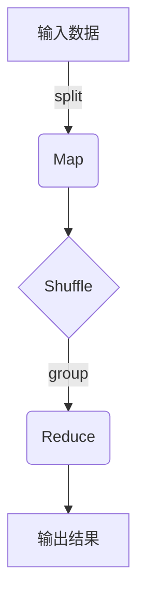

# MapReduce原理与代码实例讲解

## 1. 背景介绍

### 1.1 问题的由来

在大数据时代，海量的非结构化数据已经成为了一个巨大的挑战。传统的数据处理方式很难应对如此庞大的数据量和复杂的计算需求。这就催生了一种新的数据处理范式——MapReduce。

MapReduce最初是由Google公司提出的,旨在解决大规模数据集的并行处理问题。它的核心思想是将一个大的计算任务分解为多个小的任务,并行执行,最后将结果合并。这种思路极大地提高了数据处理的效率和可扩展性。

### 1.2 研究现状

自从MapReduce被提出以来,它已经成为了大数据处理的事实标准。Apache Hadoop是MapReduce最著名的开源实现,被广泛应用于各种大数据场景,如网络日志分析、推荐系统、基因组学等。除了Hadoop,还有其他一些MapReduce的实现,如Apache Spark、Apache Flink等。

### 1.3 研究意义

学习MapReduce的原理和实现对于理解大数据处理的核心思想至关重要。它不仅是一种编程模型,更是一种分布式计算的范式。掌握MapReduce,可以帮助我们更好地设计和优化大数据应用,提高数据处理的效率和可靠性。

### 1.4 本文结构

本文将从以下几个方面全面介绍MapReduce:

1. 核心概念与联系
2. 核心算法原理与具体操作步骤
3. 数学模型和公式详细讲解与案例分析
4. 项目实践:代码实例和详细解释说明
5. 实际应用场景
6. 工具和资源推荐
7. 总结:未来发展趋势与挑战
8. 附录:常见问题与解答

## 2. 核心概念与联系

MapReduce由两个核心概念组成:Map和Reduce。

**Map**阶段负责将输入数据切分,并对每个数据块进行转换处理,生成中间结果。这个过程可以并行执行,极大地提高了处理效率。

**Reduce**阶段则负责对Map阶段的输出结果进行汇总,得到最终结果。

这两个阶段通过中间结果连接在一起,构成了完整的数据处理流程。



上图展示了MapReduce的基本工作流程。输入数据首先被切分为多个数据块,并行执行Map操作。Map的输出结果会经过Shuffle过程,按照Key值进行分组,最后由Reduce任务对相同Key的值进行汇总计算,生成最终结果。

## 3. 核心算法原理与具体操作步骤

### 3.1 算法原理概述

MapReduce算法的核心原理可以概括为以下几个步骤:

1. **输入分片(Input Split)**: 将输入数据切分为多个数据块,为并行处理做准备。
2. **Map阶段**: 对每个数据块并行执行Map操作,生成键值对形式的中间结果。
3. **Shuffle阶段**: 对Map输出的中间结果按照Key值进行分组,为Reduce阶段做准备。
4. **Reduce阶段**: 对每一组键值对执行Reduce操作,进行求值或者汇总,得到最终结果。
5. **输出(Output)**: 将Reduce的输出结果写入到最终的目标位置。

### 3.2 算法步骤详解

1. **输入分片(Input Split)**

   MapReduce任务的输入数据通常存储在分布式文件系统(如HDFS)中。在执行之前,输入数据会被切分为多个数据块(通常为64MB或128MB),称为输入分片(Input Split)。每个输入分片将由一个独立的Map任务处理。

2. **Map阶段**

   Map阶段是MapReduce算法的第一个核心步骤。每个Map任务会读取一个输入分片,对其中的每条记录执行用户自定义的Map函数。Map函数的作用是从输入记录中提取关键信息,并生成键值对形式的中间结果。

   Map函数的输入是一对键值对:

   ```
   Map(key, value) → list(k2, v2)
   ```

   - `key`表示输入记录在文件中的偏移量
   - `value`表示输入记录的内容

   Map函数的输出是一个列表,其中每个元素都是一个键值对`(k2, v2)`。这些中间结果会被缓存在内存中,等待后续的Shuffle过程。

3. **Shuffle阶段**

   Shuffle阶段是Map和Reduce之间的桥梁。它的主要任务是对Map输出的中间结果进行分组,为Reduce阶段做准备。

   Shuffle过程包括以下几个步骤:

   - **分区(Partitioning)**: 根据分区函数,将Map输出的键值对分配到不同的分区(Partition)中。常用的分区函数是哈希分区,即根据Key的哈希值将数据分配到不同的Reducer上。
   - **排序(Sorting)**: 在每个分区内,按照Key值对键值对进行排序。
   - **合并(Combining)**: 对于相同Key的键值对,可以选择执行一个用户自定义的Combiner函数,对Value进行局部汇总,减少数据传输量。
   - **复制(Copying)**: 将每个分区的数据复制到对应的Reduce任务的输入缓冲区中。

4. **Reduce阶段**

   Reduce阶段是MapReduce算法的第二个核心步骤。每个Reduce任务会读取一个分区的数据,对相同Key的一组值执行用户自定义的Reduce函数,进行求值或者汇总,得到最终结果。

   Reduce函数的输入是一个迭代器,其中每个元素都是一对键值对:

   ```
   Reduce(key, values) → result
   ```

   - `key`表示当前要处理的Key
   - `values`是一个迭代器,包含了所有相同Key的Value列表

   Reduce函数的输出`result`就是最终的结果值。

5. **输出(Output)**

   最后,Reduce任务会将结果值写入到指定的输出位置,通常是分布式文件系统如HDFS。

### 3.3 算法优缺点

**优点**:

- **高度并行**: MapReduce算法可以充分利用集群资源,实现数据的并行处理,极大提高了处理效率。
- **容错性强**: MapReduce具有很强的容错能力,可以自动检测和重新执行失败的任务,确保计算的可靠性。
- **可扩展性好**: MapReduce可以轻松地通过增加机器节点来扩展计算能力,满足大数据场景的需求。
- **编程模型简单**: MapReduce提供了一种高度抽象的编程模型,屏蔽了分布式计算的复杂性,使开发者可以更专注于业务逻辑的实现。

**缺点**:

- **延迟较高**: MapReduce任务需要经历多个阶段(Map、Shuffle、Reduce),中间需要进行大量的数据读写操作,导致整体延迟较高,不适合需要低延迟的场景。
- **不支持迭代计算**: MapReduce更适合于一次性的批处理计算,对于需要多次迭代的算法(如机器学习)支持较差。
- **中间结果写入磁盘**: MapReduce的Shuffle过程需要将中间结果写入磁盘,会产生大量的I/O开销,影响性能。
- **不支持实时流式计算**: MapReduce是一种批处理模型,无法很好地支持实时的流式计算场景。

### 3.4 算法应用领域

MapReduce算法广泛应用于以下领域:

- **网络日志分析**: 分析海量的网络日志数据,用于网站优化、广告投放、安全监控等。
- **大数据分析**: 对结构化和非结构化的大数据进行分析和挖掘,发现隐藏的模式和规律。
- **推荐系统**: 基于用户的历史行为数据,构建推荐模型,为用户推荐感兴趣的内容。
- **生物信息学**: 处理基因组测序数据,用于基因分析和疾病研究。
- **地理信息系统**: 处理卫星图像和地理数据,用于地图绘制、路径规划等应用。
- **科学计算**: 进行大规模的科学模拟和数值计算。

## 4. 数学模型和公式 & 详细讲解 & 举例说明

在MapReduce中,常见的数学模型和公式主要用于描述和优化算法的性能和资源利用率。

### 4.1 数学模型构建

我们可以将MapReduce任务建模为一个优化问题,目标是最小化作业的总执行时间。

设有M个Map任务和R个Reduce任务,输入数据的总大小为D,中间结果的总大小为I。我们定义以下变量和参数:

- $t_m$: 单个Map任务的执行时间
- $t_r$: 单个Reduce任务的执行时间
- $t_s$: Shuffle过程的时间
- $C_m$: Map任务的集群资源(CPU、内存等)
- $C_r$: Reduce任务的集群资源

则MapReduce作业的总执行时间可以表示为:

$$T = \max\left\{\frac{M}{C_m}t_m, \frac{R}{C_r}(t_r + t_s)\right\} + t_s$$

其中:

- $\frac{M}{C_m}t_m$表示Map阶段的执行时间
- $\frac{R}{C_r}(t_r + t_s)$表示Reduce阶段的执行时间,包括Reduce计算时间和Shuffle时间
- $t_s$表示Shuffle过程的时间

我们的目标是最小化总执行时间T,可以通过调整M、R、$C_m$、$C_r$等参数来优化性能。

### 4.2 公式推导过程

下面我们来推导上述公式的过程。

1. Map阶段的执行时间:

   - 输入数据大小为D
   - 每个Map任务处理 $\frac{D}{M}$ 的数据
   - 单个Map任务的执行时间为 $t_m$
   - 集群提供 $C_m$ 个Map槽位(slots)
   - 则Map阶段的总执行时间为:

   $$T_{\text{map}} = \frac{M}{C_m}t_m$$

2. Reduce阶段的执行时间:

   - 中间结果的总大小为I
   - 每个Reduce任务处理 $\frac{I}{R}$ 的数据
   - 单个Reduce任务的执行时间为 $t_r$
   - Shuffle过程的时间为 $t_s$
   - 集群提供 $C_r$ 个Reduce槽位
   - 则Reduce阶段的总执行时间为:

   $$T_{\text{reduce}} = \frac{R}{C_r}(t_r + t_s)$$

3. 总执行时间:

   MapReduce作业的总执行时间是Map阶段和Reduce阶段的最大值,加上Shuffle过程的时间:

   $$T = \max\left\{\frac{M}{C_m}t_m, \frac{R}{C_r}(t_r + t_s)\right\} + t_s$$

通过这个公式,我们可以分析不同参数对执行时间的影响,并进行相应的优化。

### 4.3 案例分析与讲解

假设我们有一个WordCount任务,需要统计一个10TB的文本文件中每个单词出现的次数。我们将使用MapReduce来实现这个任务。

1. 输入数据:

   - 文件大小: 10TB
   - 输入分片大小: 128MB
   - 输入分片数量: $\frac{10 \times 10^{12}}{128 \times 10^6} = 78125$

2. Map阶段:

   - 每个Map任务处理一个输入分片
   - 假设单个Map任务的执行时间为1分钟
   - 集群提供100个Map槽位
   - 则Map阶段的执行时间为:

   $$T_{\text{map}} = \frac{78125}{100} \times 1 \text{min} = 781.25 \text{min} \approx 13 \text{hours}$$

3. Shuffle阶段:

   - 假设中间结果的总大小为1TB
   - Shuffle过程的时间为30分钟

4. Reduce阶段:

   - 假设有100个Reduce任务
   - 每个Reduce任务处理 $\frac{1 \times 10^{12}}{100 \times 10^9} = 10$GB的数据
   - 单个Reduce任务的执行时间为10分