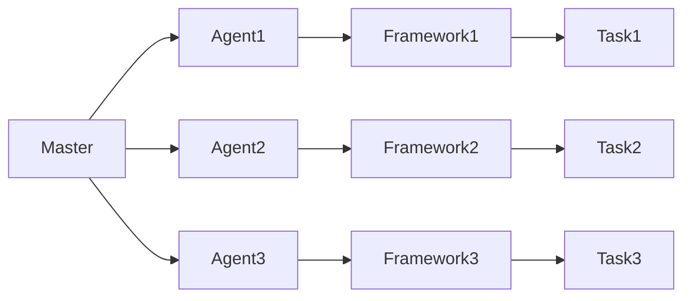

# Mesos原理与代码实例讲解

作者：禅与计算机程序设计艺术 / Zen and the Art of Computer Programming

## 1. 背景介绍
### 1.1 问题的由来

随着云计算的快速发展，分布式计算和资源管理成为了大数据、微服务、容器化等技术的核心。在分布式系统中，如何高效地管理和调度大量的计算资源，成为了亟待解决的问题。Mesos作为一种分布式资源调度框架，应运而生。

### 1.2 研究现状

近年来，分布式计算和资源管理技术取得了长足的进步。Mesos作为Apache软件基金会下的一个开源项目，已经成为业界广泛认可的分布式资源调度框架。许多知名企业，如Facebook、Twitter、Airbnb等，都将其作为核心基础设施之一。

### 1.3 研究意义

Mesos的原理和代码实例讲解对于理解分布式计算和资源管理具有重要意义。它可以帮助开发者更好地掌握分布式系统的设计和实现，提升大数据、微服务、容器化等技术的应用水平。

### 1.4 本文结构

本文将围绕Mesos的原理和代码实例进行讲解，内容安排如下：

- 第2章：介绍Mesos的核心概念和架构。
- 第3章：详细阐述Mesos的工作原理和操作步骤。
- 第4章：分析Mesos的优缺点及应用领域。
- 第5章：通过代码实例讲解Mesos的实践应用。
- 第6章：探讨Mesos在实际应用中的挑战和发展趋势。
- 第7章：推荐Mesos相关的学习资源、开发工具和参考文献。
- 第8章：总结全文，展望Mesos的未来发展趋势与挑战。
- 第9章：附录，常见问题与解答。

## 2. 核心概念与联系

### 2.1 Mesos核心概念

Mesos是一种分布式资源调度框架，它允许多个任务执行引擎（如Marathon、Mesos-DNS、Chronos等）共享一组计算资源。以下是一些Mesos的核心概念：

- **Master**：Mesos集群的中央控制节点，负责接受来自Agent的节点报告，维护集群状态，分配资源给任务执行引擎。
- **Agent**：在每个计算节点上运行，负责向Master报告其状态和资源，并接受Master的指令启动、停止任务。
- **Framework**：向Mesos注册任务执行引擎，负责在其分配的资源上运行任务。
- **Offer**：Master向Agent提供的可分配资源。
- **Task**：在Mesos中执行的具体工作单元，由Framework创建并分配给Agent执行。
- **Task Offer**：Master向Agent提供的可分配任务及其资源。

### 2.2 Mesos架构图

以下为Mesos的架构图，展示了Master、Agent、Framework之间的关系：



从图中可以看出，Master是集群的中央控制节点，负责资源分配和任务调度。Agent在每个计算节点上运行，负责向Master汇报节点状态和资源信息。Framework代表具体的任务执行引擎，向Master注册并提供任务。

## 3. 核心算法原理 & 具体操作步骤
### 3.1 算法原理概述

Mesos采用一种基于资源分配和任务调度的算法，具体步骤如下：

1. **资源上报**：Agent在启动时向Master上报其可用的资源信息。
2. **资源分配**：Master根据Frameworks的请求，将资源分配给相应的Frameworks。
3. **任务调度**：Frameworks将任务提交给Master，Master根据资源分配情况，将任务分配给相应的Agent。
4. **任务执行**：Agent在本地执行任务，并将任务状态反馈给Master。
5. **任务状态更新**：Master根据任务执行情况，更新任务状态。
6. **资源回收**：当任务完成后，Agent向Master汇报资源回收请求，Master更新资源状态。

### 3.2 算法步骤详解

以下是Mesos调度算法的详细步骤：

1. **Agent启动**：Agent在计算节点上启动，连接到Master，并上报其可用的资源信息。
2. **资源分配**：当Frameworks请求资源时，Master检查其是否有足够的资源分配，如果有，则返回相应的Offer；如果没有，则返回null。
3. **任务调度**：Frameworks根据Master返回的Offer，选择合适的Agent进行任务调度。
4. **任务启动**：Agent接收任务，并在本地启动任务执行。
5. **任务状态反馈**：任务执行过程中，Agent将任务状态反馈给Master。
6. **任务完成**：当任务完成后，Agent向Master汇报，Master更新任务状态。
7. **资源回收**：任务完成后，Agent向Master请求回收资源，Master更新资源状态。

### 3.3 算法优缺点

**优点**：

- **高效性**：Mesos采用高效的任务调度算法，能够快速将任务分配到合适的资源上。
- **可扩展性**：Mesos支持水平扩展，可轻松应对大规模集群。
- **资源隔离**：Mesos能够实现不同Frameworks之间的资源隔离，保证每个Framework都能获得足够的资源。
- **生态丰富**：Mesos拥有丰富的生态系统，支持多种任务执行引擎和资源隔离器。

**缺点**：

- **复杂性**：Mesos的架构相对复杂，需要一定的时间来学习和理解。
- **性能瓶颈**：在资源非常紧张的情况下，Mesos的性能可能会受到影响。

### 3.4 算法应用领域

Mesos适用于以下应用领域：

- **大数据处理**：如Hadoop、Spark等大数据处理框架，可以使用Mesos进行资源调度和管理。
- **微服务架构**：Mesos可以帮助微服务架构中的服务实例进行高效地资源调度和部署。
- **容器化技术**：Mesos可以与Docker、Kubernetes等容器化技术结合，实现容器资源的统一调度和管理。

## 4. 数学模型和公式 & 详细讲解 & 举例说明
### 4.1 数学模型构建

Mesos的资源分配和任务调度算法可以通过以下数学模型进行描述：

- **资源状态**：设Mesos集群中所有节点的资源状态为 $R = (R_1, R_2, ..., R_N)$，其中 $R_i$ 表示第 $i$ 个节点的资源总量。
- **任务需求**：设任务 $T$ 的需求为 $D = (D_1, D_2, ..., D_N)$，其中 $D_i$ 表示任务 $T$ 在第 $i$ 个节点的资源需求。
- **任务优先级**：设任务 $T$ 的优先级为 $P(T)$，表示任务 $T$ 的紧急程度。
- **资源分配策略**：设Mesos的资源分配策略为 $f(R, D, P(T))$，表示Mesos如何根据资源状态、任务需求和任务优先级进行资源分配。

### 4.2 公式推导过程

Mesos的资源分配策略可以采用以下公式进行推导：

$$
f(R, D, P(T)) = \{R_i \mid R_i \geq D_i\}
$$

该公式表示Mesos将任务 $T$ 分配到具有足够资源的节点 $R_i$ 上。

### 4.3 案例分析与讲解

以下是一个简单的Mesos资源分配案例：

假设Mesos集群中有3个节点，资源状态为 $R = (16, 12, 8)$。一个任务 $T$ 的需求为 $D = (8, 6, 4)$，优先级为 $P(T) = 1$。

根据上述公式，Mesos会将任务 $T$ 分配到具有足够资源的节点 $R_2$ 上。

### 4.4 常见问题解答

**Q1：Mesos如何保证任务的公平性？**

A：Mesos采用多种策略保证任务的公平性，如资源预留、优先级分配、任务分配算法等。资源预留可以保证关键任务获得足够的资源，优先级分配可以根据任务紧急程度进行调度，任务分配算法可以根据任务需求、资源状态和优先级等因素进行优化。

**Q2：Mesos如何处理资源争抢问题？**

A：Mesos采用多版本并发控制(MVCC)技术处理资源争抢问题。当一个任务需要资源时，Mesos会创建一个新的资源版本，并将该版本分配给任务。当多个任务同时请求同一资源时，Mesos会根据资源版本和优先级进行调度，确保资源分配的公平性。

## 5. 项目实践：代码实例和详细解释说明
### 5.1 开发环境搭建

在进行Mesos项目实践前，我们需要搭建开发环境。以下是使用Docker进行Mesos集群搭建的步骤：

1. **安装Docker**：从Docker官网下载并安装Docker。
2. **拉取Mesos镜像**：使用以下命令拉取Mesos镜像：

```bash
docker pull mesos/mesos
```

3. **启动Master节点**：使用以下命令启动Master节点：

```bash
docker run -d --name mesos-master --net host --restart=always mesos/mesos master
```

4. **启动Agent节点**：使用以下命令启动Agent节点：

```bash
docker run -d --name mesos-agent --net host --restart=always --link mesos-master:master mesos/mesos agent --master=master:5050
```

5. **启动Executor节点**：使用以下命令启动Executor节点：

```bash
docker run -d --name mesos-executor --net host --restart=always mesos/mesos executor --master=master:5050
```

完成以上步骤后，即可搭建一个简单的Mesos集群。

### 5.2 源代码详细实现

以下是一个简单的Mesos任务执行脚本示例：

```python
import subprocess

def run_task(task_id, command):
    # 启动Executor
    subprocess.run(f"docker run -d --name mesos-executor-{task_id} --net host --restart=always mesos/mesos executor --master=master:5050", shell=True)
    
    # 启动任务
    subprocess.run(f"docker exec mesos-executor-{task_id} {command}", shell=True)
    
    # 停止Executor
    subprocess.run("docker stop mesos-executor-{task_id}".format(task_id=task_id), shell=True)

if __name__ == "__main__":
    run_task(1, "python hello.py")
```

该脚本通过Docker启动Executor，并在Executor中执行指定命令。任务完成后，停止Executor。

### 5.3 代码解读与分析

该脚本主要包含以下功能：

- `run_task`函数：启动Executor，执行指定命令，并停止Executor。
- Docker命令：启动Executor、执行命令、停止Executor。

该示例展示了如何使用Python脚本和Docker命令实现Mesos任务的简单执行。在实际项目中，可以根据具体需求进行扩展和优化。

### 5.4 运行结果展示

假设我们在Docker容器中运行以下命令：

```bash
echo "Hello, Mesos!" > hello.py
python hello.py
```

当运行上述脚本时，Mesos将启动一个Executor，并在该Executor中执行`python hello.py`命令。执行完成后，停止Executor。

## 6. 实际应用场景
### 6.1 分布式计算

Mesos在分布式计算领域有着广泛的应用，如Hadoop、Spark等大数据处理框架都采用了Mesos进行资源调度和管理。以下是一些应用场景：

- **Hadoop**：Mesos可以为Hadoop的MapReduce、YARN等组件提供资源调度服务，实现更高效的数据处理。
- **Spark**：Mesos可以为Spark的弹性计算集群提供资源管理，实现更灵活的作业调度。

### 6.2 微服务架构

Mesos可以帮助微服务架构中的服务实例进行高效地资源调度和部署。以下是一些应用场景：

- **服务实例隔离**：Mesos可以将不同服务实例的资源进行隔离，避免互相干扰。
- **弹性伸缩**：Mesos可以根据负载情况动态调整服务实例的数量，实现弹性伸缩。

### 6.3 容器化技术

Mesos可以与Docker、Kubernetes等容器化技术结合，实现容器资源的统一调度和管理。以下是一些应用场景：

- **容器资源隔离**：Mesos可以将不同容器的资源进行隔离，保证容器之间互不干扰。
- **容器弹性伸缩**：Mesos可以根据负载情况动态调整容器数量，实现容器资源的弹性伸缩。

## 7. 工具和资源推荐
### 7.1 学习资源推荐

为了更好地学习和理解Mesos，以下是一些推荐的学习资源：

- **Apache Mesos官网**：提供Mesos的官方文档、教程和社区论坛。
- **Mesos用户指南**：介绍Mesos的基本概念、架构和操作步骤。
- **Mesos教程**：提供Mesos的实战教程，包括搭建集群、运行任务等。
- **Mesos最佳实践**：分享Mesos在实际项目中的应用经验。

### 7.2 开发工具推荐

以下是一些用于Mesos开发的工具：

- **Docker**：用于容器化Mesos集群和任务执行环境。
- **Marathon**：Mesos上的任务执行引擎，用于运行长生存周期的服务。
- **Chronos**：Mesos上的任务执行引擎，用于定时任务调度。
- **Mesos UI**：提供Mesos集群的图形化界面，方便管理和监控。

### 7.3 相关论文推荐

以下是一些与Mesos相关的论文：

- **Mesos: A Platform for Fine-Grained Resource Sharing in the Data Center**：Mesos的官方论文，介绍了Mesos的设计和实现。
- **Comparison of Resource Management Systems for Cloud Computing**：比较了Mesos与其他资源管理系统的性能和特点。

### 7.4 其他资源推荐

以下是一些与Mesos相关的其他资源：

- **Mesos社区论坛**：Mesos用户的交流平台，可以获取技术支持和学习资源。
- **Mesos Meetup**：Mesos社区举办的活动，可以结识业界同仁，交流经验。
- **Mesos GitHub仓库**：Mesos的源代码和文档。

## 8. 总结：未来发展趋势与挑战
### 8.1 研究成果总结

本文对Mesos的原理和代码实例进行了详细的讲解。通过本文的学习，读者可以全面了解Mesos的核心概念、架构、工作原理、操作步骤和应用场景。同时，本文还介绍了Mesos相关的学习资源、开发工具和参考文献，为读者提供了进一步学习的途径。

### 8.2 未来发展趋势

随着云计算和分布式计算技术的不断发展，Mesos在未来将呈现以下发展趋势：

- **容器化技术融合**：Mesos将更好地与容器化技术融合，实现容器资源的统一调度和管理。
- **服务网格技术融合**：Mesos将与服务网格技术（如Istio）融合，实现微服务架构的统一管理。
- **混合云和多云支持**：Mesos将支持混合云和多云环境，实现跨云资源的统一调度。

### 8.3 面临的挑战

Mesos在未来发展过程中也面临着以下挑战：

- **复杂性**：Mesos的架构和功能相对复杂，需要一定的时间来学习和理解。
- **性能瓶颈**：在资源非常紧张的情况下，Mesos的性能可能会受到影响。
- **生态系统扩展**：Mesos的生态系统需要进一步扩展，以支持更多类型的任务执行引擎和资源隔离器。

### 8.4 研究展望

为了应对未来发展趋势和挑战，以下是一些研究方向：

- **简化Mesos架构**：通过模块化、组件化等手段简化Mesos架构，降低学习门槛。
- **优化性能**：通过并行化、分布式等技术优化Mesos的性能，提高资源利用率。
- **扩展生态系统**：吸引更多开发者参与Mesos的生态系统建设，支持更多类型的任务执行引擎和资源隔离器。

相信通过不断的技术创新和社区努力，Mesos将在未来发挥更大的作用，推动云计算和分布式计算技术的发展。

## 9. 附录：常见问题与解答

**Q1：Mesos与YARN的区别是什么？**

A：Mesos和YARN都是分布式资源管理框架，但它们在架构和设计理念上有所不同。Mesos采用框架之间的资源隔离机制，允许多个框架共享同一组资源；而YARN采用单一的资源隔离机制，所有资源都由YARN管理。此外，Mesos更强调资源隔离和细粒度调度，而YARN更注重资源隔离和负载均衡。

**Q2：Mesos如何处理任务失败？**

A：Mesos通过以下方式处理任务失败：

- **任务重启**：当任务失败时，Mesos会尝试在同一个Agent上重启任务。
- **任务重试**：当重启任务失败时，Mesos会尝试在其他Agent上重试任务。
- **任务回滚**：当任务重试失败时，Mesos会将任务状态回滚到失败前的状态。

**Q3：Mesos如何保证任务调度的公平性？**

A：Mesos采用以下方式保证任务调度的公平性：

- **资源预留**：为关键任务预留足够的资源，确保其能够获得足够的资源。
- **优先级分配**：根据任务紧急程度和优先级进行调度，优先调度紧急任务。
- **任务分配算法**：采用公平性较好的任务分配算法，如最少分配算法等。

**Q4：Mesos如何处理资源争抢问题？**

A：Mesos采用多版本并发控制(MVCC)技术处理资源争抢问题。当一个任务需要资源时，Mesos会创建一个新的资源版本，并将该版本分配给任务。当多个任务同时请求同一资源时，Mesos会根据资源版本和优先级进行调度，确保资源分配的公平性。

**Q5：如何优化Mesos的性能？**

A：以下是一些优化Mesos性能的方法：

- **并行化**：将Mesos组件（如Master、Agent等）进行并行化处理，提高处理速度。
- **分布式**：将Mesos组件部署在多个节点上，实现分布式处理。
- **资源隔离**：通过资源隔离技术，将不同任务隔离在不同的资源上，提高资源利用率。
- **缓存**：对常用数据和应用进行缓存，减少资源访问时间。

通过优化Mesos的性能，可以提高资源利用率，降低计算成本，提高整体性能。

---

作者：禅与计算机程序设计艺术 / Zen and the Art of Computer Programming