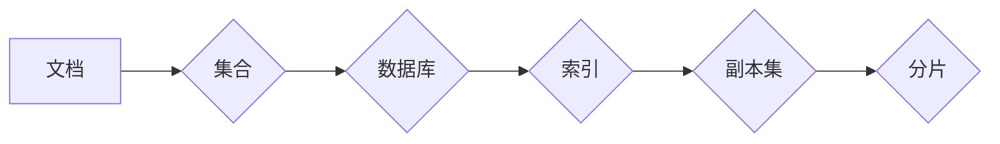

# MongoDB原理与代码实例讲解

作者：禅与计算机程序设计艺术 / Zen and the Art of Computer Programming

## 1. 背景介绍

### 1.1 问题的由来

随着互联网的飞速发展，数据量的激增给传统的数据库系统带来了巨大的挑战。传统的关系型数据库在处理海量数据时，往往存在性能瓶颈，难以满足现代应用的需求。为了解决这一问题，NoSQL数据库应运而生，其中MongoDB因其灵活的文档存储方式和强大的功能特性，成为了最受欢迎的NoSQL数据库之一。

### 1.2 研究现状

MongoDB自2009年发布以来，已经经历了多个版本的迭代和升级，功能不断完善，性能持续提升。目前，MongoDB已经成为许多企业级应用的数据库解决方案。在学术界和工业界，MongoDB的研究和应用都取得了丰硕的成果。

### 1.3 研究意义

本文旨在深入浅出地讲解MongoDB的原理和代码实例，帮助读者全面了解MongoDB的设计理念、工作原理和实际应用。通过学习本文，读者可以：

- 掌握MongoDB的核心概念和体系结构
- 理解MongoDB的存储机制、索引机制和复制机制
- 学会使用MongoDB进行数据存储、查询和操作
- 了解MongoDB在实际应用中的案例和最佳实践

### 1.4 本文结构

本文将分为以下几个部分：

- 2. 核心概念与联系：介绍MongoDB的核心概念，如文档、集合、数据库等，并阐述它们之间的关系。
- 3. 核心算法原理 & 具体操作步骤：讲解MongoDB的存储机制、索引机制和复制机制等核心算法原理，并给出具体操作步骤。
- 4. 数学模型和公式 & 详细讲解 & 举例说明：介绍MongoDB中常用的数学模型和公式，并结合实例进行讲解。
- 5. 项目实践：代码实例和详细解释说明：通过实际代码示例，展示如何使用MongoDB进行数据操作和开发。
- 6. 实际应用场景：探讨MongoDB在实际应用中的案例和最佳实践。
- 7. 工具和资源推荐：推荐学习MongoDB的学习资源、开发工具和相关论文。
- 8. 总结：对未来发展趋势和挑战进行分析和展望。
- 9. 附录：常见问题与解答。

## 2. 核心概念与联系

MongoDB是一种面向文档的NoSQL数据库，它将数据存储为文档的形式，支持多种数据类型，如字符串、数字、日期、布尔值等。以下是MongoDB的一些核心概念：

- **文档**：MongoDB的基本数据单元，类似于关系型数据库中的行。文档通常由键值对组成，键是字符串类型，值可以是各种数据类型。
- **集合**：一组文档的集合，类似于关系型数据库中的表。
- **数据库**：存储集合的容器，类似于关系型数据库中的数据库。
- **索引**：用于提高查询效率的数据结构，类似于关系型数据库中的索引。
- **副本集**：一组MongoDB实例的集合，用于实现数据备份和读写分离。
- **分片**：将数据分散到多个服务器上，提高数据存储和查询的并发能力。

这些概念之间的关系可以用以下Mermaid流程图表示：



## 3. 核心算法原理 & 具体操作步骤

### 3.1 算法原理概述

MongoDB的核心算法包括以下几部分：

- **存储机制**：MongoDB使用BSON格式存储文档，并将文档存储在磁盘上的文件中。
- **索引机制**：MongoDB支持多种索引类型，如单字段索引、复合索引、地理空间索引等，用于提高查询效率。
- **复制机制**：MongoDB支持副本集，通过复制实现数据的备份和读写分离。

### 3.2 算法步骤详解

#### 3.2.1 存储机制

MongoDB使用BSON格式存储文档。BSON是一种类似于JSON的序列化格式，但它支持更多的数据类型，如二进制数据、日期等。以下是BSON格式的示例：

```json
{
  "_id": ObjectId("5f0b1e0372b1b1c0a6f3ae76"),
  "name": "张三",
  "age": 28,
  "address": {
    "street": "上海市浦东新区世纪大道",
    "city": "上海"
  }
}
```

MongoDB将文档存储在磁盘上的文件中，每个文件包含一个或多个文档。为了提高查询效率，MongoDB会对文档进行分片存储。

#### 3.2.2 索引机制

MongoDB支持多种索引类型，如：

- **单字段索引**：针对单个字段创建索引。
- **复合索引**：针对多个字段创建索引。
- **地理空间索引**：用于地理空间数据的查询。

以下是创建单字段索引的示例：

```python
db.users.createIndex({name: 1})
```

#### 3.2.3 复制机制

MongoDB的复制机制基于副本集。副本集由多个MongoDB实例组成，其中一个实例为主节点，负责处理读写请求，其余实例为从节点，负责复制主节点的数据。

以下是创建副本集的示例：

```python
rs.initiate([
  {"_id": "rs0", "host": "mongodb://localhost:27017"},
  {"_id": "rs0", "host": "mongodb://localhost:27018"},
  {"_id": "rs0", "host": "mongodb://localhost:27019"}
])
```

### 3.3 算法优缺点

#### 3.3.1 优点

- **灵活的文档存储方式**：MongoDB的文档存储方式非常灵活，可以存储任意类型的数据。
- **高效的查询性能**：MongoDB的索引机制和查询优化器可以提供高效的查询性能。
- **强大的复制机制**：MongoDB的复制机制可以保证数据的可靠性和可用性。

#### 3.3.2 缺点

- **存储空间浪费**：由于文档存储方式灵活，可能会造成存储空间浪费。
- **查询性能受限**：对于复杂的查询，MongoDB的查询性能可能会受到影响。

### 3.4 算法应用领域

MongoDB适用于以下场景：

- **大数据存储**：MongoDB可以存储海量数据，并支持高效的数据查询。
- **实时应用**：MongoDB可以支持实时数据写入和查询。
- **内容管理系统**：MongoDB可以存储和查询各种内容，如文章、图片、视频等。

## 4. 数学模型和公式 & 详细讲解 & 举例说明

### 4.1 数学模型构建

MongoDB的数学模型可以简化为以下形式：

- **数据模型**：文档、集合、数据库
- **索引模型**：单字段索引、复合索引、地理空间索引
- **复制模型**：副本集

### 4.2 公式推导过程

MongoDB的数学模型没有复杂的公式推导过程，主要是基于实际应用场景进行设计。

### 4.3 案例分析与讲解

以下是一个MongoDB查询的示例：

```python
db.users.find({"age": {"$gt": 20}})
```

这个查询语句的意思是查询年龄大于20岁的用户。MongoDB会根据索引机制找到符合条件的文档，并将其返回给客户端。

### 4.4 常见问题解答

**Q1：MongoDB支持哪些索引类型？**

A：MongoDB支持以下索引类型：

- 单字段索引
- 复合索引
- 地理空间索引
- 全文索引
- 多键索引

**Q2：如何创建索引？**

A：可以使用以下命令创建索引：

```python
db.collection.createIndex({key: 1})
```

其中，`key` 是索引的字段，`1` 表示升序索引。

**Q3：如何删除索引？**

A：可以使用以下命令删除索引：

```python
db.collection.dropIndex("index_name")
```

其中，`index_name` 是要删除的索引的名称。

## 5. 项目实践：代码实例和详细解释说明

### 5.1 开发环境搭建

以下是使用Python操作MongoDB的步骤：

1. 安装PyMongo库：

```bash
pip install pymongo
```

2. 连接到MongoDB服务器：

```python
from pymongo import MongoClient

client = MongoClient("mongodb://localhost:27017")
db = client["mydatabase"]
collection = db["mycollection"]
```

### 5.2 源代码详细实现

以下是一个使用Python操作MongoDB的示例：

```python
from pymongo import MongoClient

client = MongoClient("mongodb://localhost:27017")
db = client["mydatabase"]
collection = db["mycollection"]

# 插入数据
collection.insert_one({"name": "张三", "age": 28, "address": "上海市浦东新区世纪大道"})

# 查询数据
results = collection.find({"age": {"$gt": 20}})
for result in results:
    print(result)

# 更新数据
collection.update_one({"name": "张三"}, {"$set": {"age": 30}})

# 删除数据
collection.delete_one({"name": "张三"})
```

### 5.3 代码解读与分析

以上代码演示了如何使用Python操作MongoDB。首先，我们连接到MongoDB服务器并选择数据库和集合。然后，我们执行插入、查询、更新和删除等操作。

### 5.4 运行结果展示

运行以上代码后，MongoDB中的数据将发生以下变化：

- 插入一条数据：{"name": "张三", "age": 28, "address": "上海市浦东新区世纪大道"}
- 查询年龄大于20岁的用户：{"name": "张三", "age": 28, "address": "上海市浦东新区世纪大道"}
- 更新张三的年龄为30岁：{"name": "张三", "age": 30, "address": "上海市浦东新区世纪大道"}
- 删除张三的数据：无

## 6. 实际应用场景

MongoDB在以下场景中得到了广泛应用：

- **电子商务**：存储商品信息、用户信息、订单信息等。
- **内容管理系统**：存储文章、图片、视频等。
- **社交媒体**：存储用户信息、动态信息、评论信息等。
- **物联网**：存储设备信息、传感器数据、日志信息等。

## 7. 工具和资源推荐

### 7.1 学习资源推荐

- 《MongoDB权威指南》
- 《MongoDB实战》
- 《MongoDB实战应用》
- MongoDB官方文档

### 7.2 开发工具推荐

- PyMongo
- MongoDB Compass
- Robo 3T

### 7.3 相关论文推荐

- 《The MongoDB Query Language》
- 《MongoDB: A Document-Oriented Database for High Performance and Scale》
- 《MongoDB: A Flexible Data Model for Big Data》

### 7.4 其他资源推荐

- MongoDB官网
- MongoDB社区
- MongoDB博客

## 8. 总结：未来发展趋势与挑战

### 8.1 研究成果总结

本文对MongoDB的原理和代码实例进行了详细的讲解，帮助读者全面了解MongoDB的设计理念、工作原理和实际应用。

### 8.2 未来发展趋势

- **云原生MongoDB**：随着云计算的普及，云原生MongoDB将成为主流。
- **多模型数据库**：MongoDB可能会引入更多的数据模型，如图数据库、时间序列数据库等。
- **人工智能**：MongoDB可能会与人工智能技术结合，实现更加智能化的数据管理。

### 8.3 面临的挑战

- **数据安全性**：随着数据安全问题的日益突出，MongoDB需要加强数据安全性。
- **数据一致性**：在分布式环境下，如何保证数据一致性是一个挑战。
- **性能优化**：随着数据量的增长，如何提高MongoDB的性能是一个挑战。

### 8.4 研究展望

MongoDB将继续发展，为用户提供更加便捷、高效、安全的数据管理解决方案。相信在未来的发展中，MongoDB将会发挥更大的作用。

## 9. 附录：常见问题与解答

**Q1：MongoDB和关系型数据库有什么区别？**

A：MongoDB和关系型数据库在数据模型、查询语言、事务等方面存在较大差异。MongoDB更灵活，适合存储非结构化和半结构化数据，而关系型数据库更适合存储结构化数据。

**Q2：MongoDB支持事务吗？**

A：MongoDB从4.0版本开始支持事务，但相比关系型数据库，MongoDB的事务支持功能相对较弱。

**Q3：如何备份和恢复MongoDB数据？**

A：可以使用MongoDB自带的备份和恢复工具进行数据备份和恢复。

**Q4：如何监控MongoDB的性能？**

A：可以使用MongoDB自带的监控工具进行性能监控，如MongoDB Compass。

**Q5：如何扩展MongoDB的存储容量？**

A：可以通过以下方式扩展MongoDB的存储容量：

- 添加新的物理服务器，扩展副本集规模。
- 使用分片机制，将数据分散到多个服务器上。

作者：禅与计算机程序设计艺术 / Zen and the Art of Computer Programming