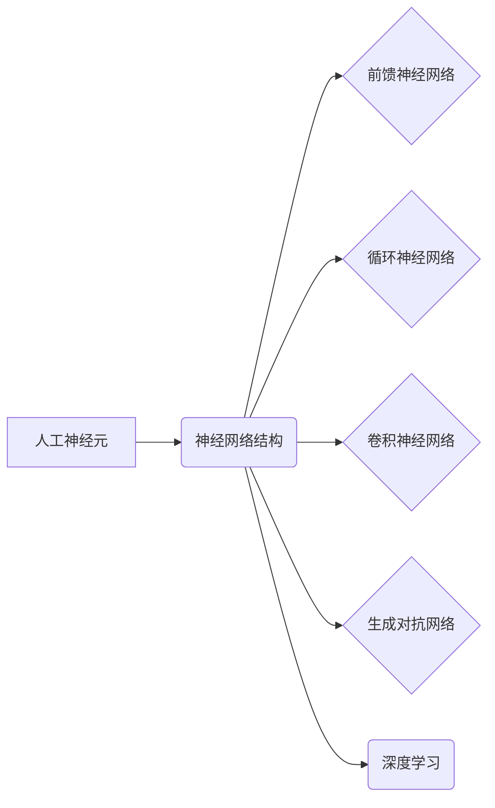

# Neural Network

作者：禅与计算机程序设计艺术 / Zen and the Art of Computer Programming


## 1. 背景介绍
### 1.1 问题的由来

神经网络（Neural Network，简称NN）作为一种模拟人脑神经元连接方式的计算模型，自20世纪50年代提出以来，经历了多次兴衰。近年来，随着深度学习技术的蓬勃发展，神经网络在各个领域取得了令人瞩目的成果，成为人工智能领域的核心技术之一。

### 1.2 研究现状

当前，神经网络在计算机视觉、自然语言处理、语音识别、推荐系统等领域取得了显著进展，并广泛应用于自动驾驶、医疗诊断、金融风控等实际场景。随着计算能力的提升和算法的优化，神经网络的性能不断提升，逐渐成为解决复杂问题的重要工具。

### 1.3 研究意义

神经网络的研究具有重要意义，主要体现在以下几个方面：

1. **智能计算**：神经网络能够模拟人脑神经元连接方式，实现复杂问题的求解，为智能计算提供了一种新的思路。
2. **数据驱动的决策**：神经网络能够从海量数据中学习规律，为数据驱动的决策提供有力支持。
3. **跨领域应用**：神经网络具有强大的泛化能力，能够在不同领域得到广泛应用。

### 1.4 本文结构

本文将围绕神经网络展开，内容安排如下：

- 第2部分，介绍神经网络的核心概念与联系。
- 第3部分，详细阐述神经网络的核心算法原理和具体操作步骤。
- 第4部分，介绍神经网络的数学模型和公式，并进行详细讲解和案例分析。
- 第5部分，给出神经网络的项目实践案例，并进行分析和解读。
- 第6部分，探讨神经网络在实际应用场景中的案例和未来应用展望。
- 第7部分，推荐神经网络相关的学习资源、开发工具和参考文献。
- 第8部分，总结神经网络的研究成果、未来发展趋势与挑战。
- 第9部分，提供神经网络常见问题与解答。

## 2. 核心概念与联系

为了更好地理解神经网络，本节将介绍一些核心概念及其相互关系。

### 2.1 人工神经元

人工神经元是神经网络的基本单元，通常由输入层、隐藏层和输出层组成。输入层接收外部输入信号，隐藏层进行特征提取和组合，输出层产生最终输出。

### 2.2 神经网络结构

神经网络的常见结构包括：

- **前馈神经网络**：信号从前向后传递，没有循环。
- **循环神经网络**：信号在神经网络中循环传递，适合处理序列数据。
- **卷积神经网络**：用于处理图像等网格数据，具有局部感知和权值共享的特点。
- **生成对抗网络**：由生成器和判别器两个网络组成，生成器和判别器相互对抗，生成具有真实感的数据。

### 2.3 神经网络与深度学习

深度学习是神经网络在近年来兴起的一种研究热点，其核心思想是使用深度神经网络处理海量数据，从而学习到更加复杂的特征和规律。

神经网络的逻辑关系可以用以下Mermaid流程图表示：



## 3. 核心算法原理 & 具体操作步骤

### 3.1 算法原理概述

神经网络通过模拟人脑神经元连接方式，利用数学公式进行特征提取和组合，从而实现复杂问题的求解。

### 3.2 算法步骤详解

神经网络的学习过程主要包括以下步骤：

1. **数据预处理**：对输入数据进行标准化、归一化等操作，提高模型的训练效果。
2. **前向传播**：将输入数据传递到神经网络，逐层计算输出结果。
3. **计算损失**：根据输出结果和真实标签计算损失函数，衡量模型预测与真实情况之间的差异。
4. **反向传播**：根据损失函数计算梯度，反向更新网络参数，以减小损失。
5. **迭代优化**：重复上述步骤，不断优化网络参数，直至模型收敛。

### 3.3 算法优缺点

神经网络的优点：

- **强大的学习能力和泛化能力**：能够从海量数据中学习到复杂的特征和规律。
- **可解释性**：可以通过可视化神经元权重，分析模型的学习过程。
- **适用于各种数据类型**：包括图像、文本、音频等。

神经网络的缺点：

- **数据需求量大**：需要大量标注数据进行训练。
- **训练时间长**：需要消耗大量计算资源。
- **可解释性较差**：神经网络的学习过程较为复杂，难以解释其内部机制。

### 3.4 算法应用领域

神经网络在各个领域都有广泛的应用，以下列举一些典型的应用场景：

- **计算机视觉**：图像识别、目标检测、图像分割等。
- **自然语言处理**：文本分类、情感分析、机器翻译等。
- **语音识别**：语音识别、语音合成等。
- **推荐系统**：商品推荐、电影推荐等。
- **医疗诊断**：疾病预测、药物发现等。

## 4. 数学模型和公式 & 详细讲解 & 举例说明

### 4.1 数学模型构建

神经网络的数学模型主要由以下部分组成：

- **神经元激活函数**：将输入信号转换为输出信号。
- **权重和偏置**：控制神经元之间的连接强度。
- **损失函数**：衡量模型预测与真实标签之间的差异。

### 4.2 公式推导过程

以下以全连接神经网络为例，介绍其数学模型的推导过程。

#### 4.2.1 前向传播

假设神经网络包含 $L$ 层，第 $l$ 层包含 $n_l$ 个神经元，第 $l$ 层的输入和输出分别为 $x_l$ 和 $y_l$，则：

$$
y_l = f(W_{l}x_{l-1} + b_l)
$$

其中，$W_l$ 为第 $l$ 层的权重矩阵，$b_l$ 为第 $l$ 层的偏置向量，$f$ 为激活函数。

#### 4.2.2 损失函数

常见的损失函数包括均方误差（MSE）和交叉熵损失（Cross-Entropy Loss）。

均方误差：

$$
MSE = \frac{1}{2} \sum_{i=1}^{N}(y_i - \hat{y}_i)^2
$$

其中，$y_i$ 为真实标签，$\hat{y}_i$ 为模型预测。

交叉熵损失：

$$
CE = -\sum_{i=1}^{N}y_i\log\hat{y}_i
$$

#### 4.2.3 反向传播

反向传播是神经网络训练的核心步骤，其目的是根据损失函数计算梯度，更新网络参数。

设第 $l$ 层的梯度为 $\frac{\partial L}{\partial y_l}$，则有：

$$
\frac{\partial L}{\partial y_l} = \frac{\partial L}{\partial y_i}\frac{\partial y_i}{\partial y_l}
$$

其中，$\frac{\partial L}{\partial y_i}$ 为损失函数关于第 $i$ 个样本的梯度，$\frac{\partial y_i}{\partial y_l}$ 为第 $i$ 个样本关于第 $l$ 层输出的梯度。

#### 4.3 案例分析与讲解

以下以手写数字识别任务为例，介绍神经网络的训练过程。

假设我们使用MNIST数据集进行手写数字识别，该数据集包含0-9的数字图像，每个图像的大小为28x28像素。

1. **数据预处理**：将图像像素值归一化到[0,1]范围内。
2. **构建神经网络**：使用全连接神经网络进行模型构建，包含输入层、隐藏层和输出层。
3. **训练模型**：使用均方误差损失函数和反向传播算法进行模型训练。
4. **评估模型**：使用测试集评估模型性能。

通过多次迭代训练，模型在测试集上的准确率达到较高水平。

### 4.4 常见问题解答

**Q1：神经网络中的激活函数有哪些？**

A：常见的激活函数包括：

- Sigmoid：输出值介于0和1之间，适用于二分类问题。
- ReLU：输出值大于0时等于输入值，否则为0，适用于深度神经网络。
- Tanh：输出值介于-1和1之间，适用于处理非线性问题。

**Q2：什么是梯度下降？**

A：梯度下降是一种优化算法，通过计算损失函数的梯度，更新网络参数，以减小损失。

**Q3：什么是反向传播？**

A：反向传播是一种计算损失函数关于网络参数梯度的方法，用于指导网络参数的更新。

## 5. 项目实践：代码实例和详细解释说明

### 5.1 开发环境搭建

在进行神经网络项目实践前，我们需要准备以下开发环境：

- 编程语言：Python
- 深度学习框架：TensorFlow或PyTorch
- 依赖包：NumPy、Matplotlib等

### 5.2 源代码详细实现

以下使用PyTorch框架，实现一个简单的全连接神经网络，用于手写数字识别任务。

```python
import torch
import torch.nn as nn
import torch.optim as optim

# 定义神经网络模型
class Net(nn.Module):
    def __init__(self):
        super(Net, self).__init__()
        self.fc1 = nn.Linear(28*28, 512)
        self.relu = nn.ReLU()
        self.fc2 = nn.Linear(512, 10)

    def forward(self, x):
        x = x.view(-1, 28*28)
        x = self.fc1(x)
        x = self.relu(x)
        x = self.fc2(x)
        return x

# 加载MNIST数据集
train_loader = torch.utils.data DataLoader(
    datasets.MNIST(
        root='./data',
        train=True,
        download=True,
        transform=torch.transforms.Compose([
            transforms.ToTensor(),
            transforms.Normalize((0.1307,), (0.3081,))
        ])
    ),
    batch_size=64,
    shuffle=True
)

# 初始化模型、损失函数和优化器
net = Net()
criterion = nn.CrossEntropyLoss()
optimizer = optim.SGD(net.parameters(), lr=0.01)

# 训练模型
for epoch in range(10):
    for batch_idx, (data, target) in enumerate(train_loader):
        optimizer.zero_grad()
        output = net(data)
        loss = criterion(output, target)
        loss.backward()
        optimizer.step()
        if batch_idx % 100 == 0:
            print(f"Train Epoch: {epoch} [{batch_idx * len(data)}/{len(train_loader.dataset)} ({100. * batch_idx / len(train_loader):.0f}%)]\tLoss: {loss.item():.6f}")

# 评估模型
test_loader = torch.utils.data DataLoader(
    datasets.MNIST(
        root='./data',
        train=False,
        transform=torch.transforms.Compose([
            transforms.ToTensor(),
            transforms.Normalize((0.1307,), (0.3081,))
        ])
    ),
    batch_size=1000,
    shuffle=True
)

net.eval()
test_loss = 0
correct = 0
with torch.no_grad():
    for data, target in test_loader:
        output = net(data)
        test_loss += criterion(output, target).item()
        pred = output.argmax(dim=1, keepdim=True)
        correct += pred.eq(target.view_as(pred)).sum().item()

test_loss /= len(test_loader.dataset)
print(f'\
Test set: Average loss: {test_loss:.4f}, Accuracy: {correct}/{len(test_loader.dataset)} ({100. * correct / len(test_loader.dataset):.0f}%)\
')
```

### 5.3 代码解读与分析

1. **Net类**：定义了全连接神经网络模型，包含输入层、ReLU激活函数和输出层。
2. **数据加载**：使用MNIST数据集进行模型训练和测试。
3. **模型训练**：使用SGD优化器和交叉熵损失函数进行模型训练。
4. **模型评估**：在测试集上评估模型性能。

### 5.4 运行结果展示

运行以上代码，可以在训练过程中查看损失函数的变化，并在训练结束后查看模型在测试集上的准确率。

## 6. 实际应用场景

神经网络在各个领域都有广泛的应用，以下列举一些典型的应用场景：

### 6.1 计算机视觉

- **图像识别**：识别图像中的物体、场景和动作。
- **目标检测**：检测图像中的物体位置和类别。
- **图像分割**：将图像划分为不同的区域。

### 6.2 自然语言处理

- **文本分类**：将文本分为不同的类别。
- **情感分析**：分析文本的情感倾向。
- **机器翻译**：将一种语言的文本翻译成另一种语言。

### 6.3 语音识别

- **语音识别**：将语音信号转换为文本。
- **语音合成**：将文本转换为语音信号。

### 6.4 推荐系统

- **商品推荐**：推荐用户可能感兴趣的物品。
- **电影推荐**：推荐用户可能喜欢的电影。

### 6.5 医疗诊断

- **疾病预测**：预测患者患某种疾病的可能性。
- **药物发现**：发现新的药物分子。

### 6.6 金融风控

- **信用评分**：评估用户的信用风险。
- **欺诈检测**：检测金融交易中的欺诈行为。

## 7. 工具和资源推荐

### 7.1 学习资源推荐

- 《深度学习》（Goodfellow等）
- 《神经网络与深度学习》（邱锡鹏）
- 《动手学深度学习》（花浩、李沐等）

### 7.2 开发工具推荐

- 深度学习框架：TensorFlow、PyTorch、Keras
- 机器学习库：NumPy、Pandas、Scikit-learn
- 数据可视化库：Matplotlib、Seaborn

### 7.3 相关论文推荐

- “A Learning Algorithm for Continually Running Fully Connected Neural Networks”（Sutskever等）
- “Deep Learning”（Goodfellow等）
- “Convolutional Neural Networks for Visual Recognition”（Krizhevsky等）

### 7.4 其他资源推荐

- GitHub：https://github.com/
- arXiv：https://arxiv.org/

## 8. 总结：未来发展趋势与挑战

### 8.1 研究成果总结

神经网络作为一种模拟人脑神经元连接方式的计算模型，在各个领域取得了显著进展，成为人工智能领域的核心技术之一。随着深度学习技术的不断发展，神经网络的性能不断提升，应用范围也越来越广泛。

### 8.2 未来发展趋势

1. **模型轻量化**：在保证性能的前提下，减小模型尺寸，加快推理速度。
2. **可解释性**：提高模型的可解释性，便于理解模型决策过程。
3. **鲁棒性**：提高模型对噪声、对抗样本等的鲁棒性。
4. **多模态学习**：融合不同模态的数据，提高模型的表达能力。

### 8.3 面临的挑战

1. **计算资源**：神经网络的训练需要大量计算资源，如何提高训练效率是一个重要挑战。
2. **数据标注**：神经网络的训练需要大量标注数据，如何高效地获取标注数据是一个重要挑战。
3. **过拟合**：如何避免模型过拟合是一个重要挑战。

### 8.4 研究展望

神经网络作为一种重要的计算模型，未来将在各个领域得到更广泛的应用。随着深度学习技术的不断发展，神经网络将变得更加轻量化、可解释和鲁棒，为构建更加智能的人工智能系统提供有力支持。

## 9. 附录：常见问题与解答

**Q1：什么是神经网络？**

A：神经网络是一种模拟人脑神经元连接方式的计算模型，通过学习数据中的特征和规律，实现复杂问题的求解。

**Q2：神经网络有哪些类型？**

A：神经网络的常见类型包括前馈神经网络、循环神经网络、卷积神经网络和生成对抗网络等。

**Q3：什么是深度学习？**

A：深度学习是神经网络在近年来兴起的一种研究热点，其核心思想是使用深度神经网络处理海量数据，从而学习到更加复杂的特征和规律。

**Q4：神经网络有哪些应用场景？**

A：神经网络在各个领域都有广泛的应用，包括计算机视觉、自然语言处理、语音识别、推荐系统、医疗诊断、金融风控等。

**Q5：如何训练神经网络？**

A：神经网络通过前向传播、反向传播和迭代优化等步骤进行训练。

**Q6：如何提高神经网络的可解释性？**

A：可以通过可视化神经元权重、解释模型决策过程等方法提高神经网络的可解释性。

**Q7：如何提高神经网络的鲁棒性？**

A：可以通过引入正则化、对抗训练等方法提高神经网络的鲁棒性。

**Q8：神经网络与机器学习有什么区别？**

A：神经网络是机器学习的一种方法，机器学习还包括其他方法，如决策树、支持向量机等。

**Q9：神经网络在工业界有哪些应用？**

A：神经网络在工业界有广泛的应用，如自动驾驶、智能语音助手、图像识别、医疗诊断、金融风控等。

**Q10：神经网络未来的发展趋势是什么？**

A：神经网络未来的发展趋势包括模型轻量化、可解释性、鲁棒性和多模态学习等。

作者：禅与计算机程序设计艺术 / Zen and the Art of Computer Programming