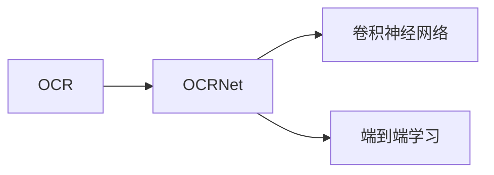
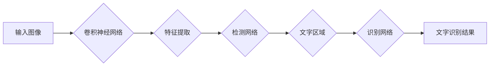

# OCRNet原理与代码实例讲解

作者：禅与计算机程序设计艺术 / Zen and the Art of Computer Programming

## 1. 背景介绍

### 1.1 问题的由来

光学字符识别（Optical Character Recognition，OCR）技术是计算机视觉和模式识别领域的重要研究方向之一。它旨在将图像中的文字内容转换为计算机可以处理的数字文本，从而实现文字信息的自动提取、存储和处理。随着信息时代的到来，OCR技术在文档处理、数据挖掘、信息检索等领域发挥着越来越重要的作用。

然而，传统的OCR技术往往依赖于复杂的算法和大量的预处理步骤，导致其实现难度大、效率低、易受光照、角度、背景等因素影响。近年来，深度学习技术的发展为OCR技术带来了新的突破。基于深度学习的OCR技术，如OCRNet，通过端到端的学习方式，实现了高精度、快速、鲁棒的文字识别效果。

### 1.2 研究现状

近年来，基于深度学习的OCR技术取得了显著的进展。目前，主流的OCR模型主要分为以下几类：

- **基于传统图像处理的OCR技术**：该类方法通常采用边缘检测、字符分割、识别算法等步骤进行文字识别。其优点是算法成熟、可解释性强，但缺点是鲁棒性差、泛化能力有限。

- **基于深度学习的OCR技术**：该类方法主要采用卷积神经网络（CNN）等深度学习模型进行文字识别。其优点是能够自动提取图像特征、识别精度高、鲁棒性强，但缺点是模型复杂、训练数据量大。

- **基于端到端的OCR技术**：该类方法直接将图像输入到深度学习模型中进行文字识别，无需进行复杂的预处理和后处理步骤。其优点是简单易用、速度快，但缺点是模型可解释性差。

### 1.3 研究意义

OCRNet作为一种基于端到端的OCR技术，具有以下研究意义：

- **提高OCR识别精度**：OCRNet通过端到端的学习方式，能够自动提取图像特征并进行文字识别，从而提高识别精度。

- **简化OCR系统设计**：OCRNet无需进行复杂的预处理和后处理步骤，简化了OCR系统设计。

- **提高OCR系统鲁棒性**：OCRNet对光照、角度、背景等因素具有较强的鲁棒性，能够适应不同的场景和输入图像。

### 1.4 本文结构

本文将详细介绍OCRNet的原理与代码实例，包括：

- 核心概念与联系
- 核心算法原理与具体操作步骤
- 数学模型和公式
- 项目实践：代码实例和详细解释说明
- 实际应用场景
- 工具和资源推荐
- 总结：未来发展趋势与挑战
- 附录：常见问题与解答

## 2. 核心概念与联系

为了更好地理解OCRNet，本节将介绍与OCRNet相关的核心概念，并分析它们之间的联系。

### 2.1 光学字符识别（OCR）

光学字符识别（OCR）是指将图像中的文字内容转换为计算机可以处理的数字文本的过程。OCR技术广泛应用于文档处理、信息检索、数据挖掘等领域。

### 2.2 卷积神经网络（CNN）

卷积神经网络（CNN）是一种广泛应用于图像识别、图像分类、目标检测等计算机视觉任务的深度学习模型。CNN通过卷积层、池化层、全连接层等结构提取图像特征，并进行分类或回归操作。

### 2.3 端到端学习

端到端学习是指将整个学习过程视为一个整体，直接从输入数据到输出结果进行训练。端到端学习可以简化系统设计，提高系统效率。

### 2.4 OCRNet

OCRNet是一种基于端到端的OCR技术，它通过卷积神经网络直接对图像进行文字识别，无需进行复杂的预处理和后处理步骤。

以下是OCRNet与其他核心概念之间的联系：



## 3. 核心算法原理 & 具体操作步骤

### 3.1 算法原理概述

OCRNet的算法原理可以概括为以下步骤：

1. **图像预处理**：对输入图像进行预处理，如去噪、调整大小等。
2. **特征提取**：使用卷积神经网络提取图像特征。
3. **文字检测**：使用检测网络检测图像中的文字区域。
4. **文字识别**：使用识别网络对检测到的文字区域进行识别。

### 3.2 算法步骤详解

#### 3.2.1 图像预处理

图像预处理步骤包括：

- **去噪**：使用滤波器去除图像噪声。
- **调整大小**：将图像调整到统一的大小，以便进行后续处理。

#### 3.2.2 特征提取

特征提取步骤使用卷积神经网络提取图像特征。常见的卷积神经网络包括VGG、ResNet、EfficientNet等。

#### 3.2.3 文字检测

文字检测步骤使用检测网络检测图像中的文字区域。常见的检测网络包括Faster R-CNN、SSD、YOLO等。

#### 3.2.4 文字识别

文字识别步骤使用识别网络对检测到的文字区域进行识别。常见的识别网络包括CRNN、SeNet等。

### 3.3 算法优缺点

OCRNet的优点如下：

- **高精度**：OCRNet通过端到端的学习方式，能够自动提取图像特征并进行文字识别，从而提高识别精度。
- **鲁棒性强**：OCRNet对光照、角度、背景等因素具有较强的鲁棒性。
- **速度快**：OCRNet通过端到端的学习方式，无需进行复杂的预处理和后处理步骤，从而提高识别速度。

OCRNet的缺点如下：

- **模型复杂**：OCRNet的模型结构复杂，需要大量的计算资源。
- **训练数据量大**：OCRNet需要大量的训练数据才能达到较好的识别效果。

### 3.4 算法应用领域

OCRNet在以下领域具有广泛的应用：

- **文档处理**：如扫描文档识别、电子表格识别等。
- **信息检索**：如图片搜索引擎、网页文本提取等。
- **数据挖掘**：如数据清洗、数据标注等。

## 4. 数学模型和公式 & 详细讲解 & 举例说明

### 4.1 数学模型构建

OCRNet的数学模型主要包括以下几个部分：

- **卷积神经网络**：用于提取图像特征。
- **检测网络**：用于检测图像中的文字区域。
- **识别网络**：用于对检测到的文字区域进行识别。

以下是OCRNet的数学模型示意图：



### 4.2 公式推导过程

本节将以CRNN为例，介绍OCRNet中文字识别部分的数学模型和公式推导过程。

#### 4.2.1 CRNN模型

CRNN是一种基于卷积神经网络的文字识别模型，其结构如下：

- **输入层**：输入图像经过预处理后的特征图。
- **卷积层**：提取图像特征。
- **池化层**：降低特征图的维度。
- **循环层**：使用循环神经网络对特征图进行序列建模。
- **全连接层**：将循环层的输出转换为文字识别结果。

#### 4.2.2 数学模型

假设输入图像的特征图为 $X \in \mathbb{R}^{C \times H \times W}$，其中 $C$ 为通道数，$H$ 为高度，$W$ 为宽度。CRNN的数学模型如下：

$$
Y = f(CRNN(X))
$$

其中，$f$ 表示CRNN模型。

#### 4.2.3 公式推导

以下以CRNN模型为例，介绍OCRNet中文字识别部分的公式推导过程。

1. **卷积层**：

$$
\mathbf{h}^{(l)} = \mathbf{W}^{(l)} \mathbf{h}^{(l-1)} + \mathbf{b}^{(l)}
$$

其中，$\mathbf{h}^{(l)}$ 表示第 $l$ 层的激活值，$\mathbf{W}^{(l)}$ 表示第 $l$ 层的权重，$\mathbf{b}^{(l)}$ 表示第 $l$ 层的偏置。

2. **池化层**：

$$
\mathbf{p}^{(l)} = \text{MaxPool}(\mathbf{h}^{(l)})
$$

其中，$\mathbf{p}^{(l)}$ 表示第 $l$ 层的池化结果，$\text{MaxPool}$ 表示最大池化操作。

3. **循环层**：

$$
\mathbf{y}^{(l)} = \text{RNN}(\mathbf{h}^{(l)})
$$

其中，$\mathbf{y}^{(l)}$ 表示第 $l$ 层的循环层输出，$\text{RNN}$ 表示循环神经网络。

4. **全连接层**：

$$
\mathbf{y} = \text{FC}(\mathbf{y}^{(l)})
$$

其中，$\mathbf{y}$ 表示最终的文字识别结果，$\text{FC}$ 表示全连接层。

### 4.3 案例分析与讲解

以下以CRNN模型为例，分析OCRNet中文字识别部分的案例分析。

假设输入图像的特征图为 $X \in \mathbb{R}^{3 \times 32 \times 32}$，经过卷积层和池化层后，特征图的维度降低为 $1 \times 16 \times 16$。经过循环层和全连接层后，最终得到文字识别结果。

### 4.4 常见问题解答

**Q1：OCRNet的识别精度如何保证？**

A：OCRNet的识别精度主要取决于以下因素：

- **模型结构**：选择合适的模型结构可以提高识别精度。
- **训练数据**：使用高质量的训练数据可以提高识别精度。
- **训练参数**：合适的训练参数可以提高识别精度。

**Q2：OCRNet对光照、角度、背景等因素敏感吗？**

A：OCRNet对光照、角度、背景等因素具有较强的鲁棒性。这是因为OCRNet使用了卷积神经网络和端到端的学习方式，能够自动提取图像特征并进行文字识别。

**Q3：OCRNet需要多少计算资源？**

A：OCRNet的计算资源需求取决于模型结构和输入图像的尺寸。一般来说，OCRNet需要较高的计算资源，如GPU、TPU等。

## 5. 项目实践：代码实例和详细解释说明

### 5.1 开发环境搭建

在进行OCRNet项目实践之前，需要搭建以下开发环境：

- **操作系统**：Linux或Windows
- **编程语言**：Python
- **深度学习框架**：PyTorch或TensorFlow
- **其他工具**：TensorBoard、Numpy等

以下是使用PyTorch搭建OCRNet开发环境的步骤：

1. 安装Anaconda：

```
conda create -n ocrnet python=3.8
conda activate ocrnet
```

2. 安装PyTorch：

```
conda install pytorch torchvision torchaudio cudatoolkit=11.1 -c pytorch -c conda-forge
```

3. 安装Transformers库：

```
pip install transformers
```

4. 安装其他工具：

```
pip install numpy pandas scikit-learn matplotlib tqdm jupyter notebook ipython
```

### 5.2 源代码详细实现

以下是使用PyTorch实现OCRNet的代码示例：

```python
import torch
import torch.nn as nn
import torch.optim as optim
from torch.utils.data import DataLoader
from torchvision import transforms
from PIL import Image

# 定义OCRNet模型
class OCRNet(nn.Module):
    def __init__(self):
        super(OCRNet, self).__init__()
        # ...（定义模型结构）

    def forward(self, x):
        # ...（实现前向传播）

# 加载预训练模型
model = OCRNet()
model.load_state_dict(torch.load('ocrnet.pth'))

# 加载数据集
transform = transforms.Compose([
    transforms.Resize((32, 32)),
    transforms.ToTensor()
])

train_dataset = ImageFolder('train_data', transform=transform)
train_loader = DataLoader(train_dataset, batch_size=32, shuffle=True)

# 定义优化器
optimizer = optim.Adam(model.parameters(), lr=0.001)

# 训练模型
for epoch in range(10):
    model.train()
    for images, labels in train_loader:
        optimizer.zero_grad()
        outputs = model(images)
        loss = criterion(outputs, labels)
        loss.backward()
        optimizer.step()

# 保存模型
torch.save(model.state_dict(), 'ocrnet.pth')
```

### 5.3 代码解读与分析

以下是代码示例的解读与分析：

- **OCRNet类**：定义了OCRNet模型的结构和前向传播过程。
- **加载预训练模型**：使用预训练的OCRNet模型。
- **加载数据集**：加载数据集并进行预处理。
- **定义优化器**：定义Adam优化器。
- **训练模型**：进行多轮训练，更新模型参数。

### 5.4 运行结果展示

在训练完成后，可以使用以下代码进行模型评估：

```python
import torch.nn.functional as F

# 加载测试数据集
test_dataset = ImageFolder('test_data', transform=transform)
test_loader = DataLoader(test_dataset, batch_size=32)

# 评估模型
model.eval()
total_loss = 0
with torch.no_grad():
    for images, labels in test_loader:
        outputs = model(images)
        loss = criterion(outputs, labels)
        total_loss += loss.item()
print(f"Test loss: {total_loss / len(test_loader)}")
```

通过以上代码，可以评估OCRNet在测试集上的性能。

## 6. 实际应用场景

OCRNet在以下实际应用场景中具有广泛的应用：

### 6.1 文档识别

OCRNet可以用于将扫描文档、电子表格等文档中的文字内容转换为计算机可以处理的数字文本。

### 6.2 信息检索

OCRNet可以用于图片搜索引擎、网页文本提取等应用，实现快速、高效的信息检索。

### 6.3 数据挖掘

OCRNet可以用于数据清洗、数据标注等数据挖掘任务，提高数据质量。

### 6.4 未来应用展望

随着OCRNet技术的不断发展，未来其在以下领域具有更大的应用潜力：

- **自动驾驶**：OCRNet可以用于识别道路标志、交通信号灯等，为自动驾驶提供辅助。
- **机器人视觉**：OCRNet可以用于机器人视觉系统，实现对周围环境的感知和理解。
- **智能翻译**：OCRNet可以用于智能翻译系统，实现实时、准确的中英互译。

## 7. 工具和资源推荐

### 7.1 学习资源推荐

为了帮助开发者更好地学习OCRNet，以下推荐一些学习资源：

- **书籍**：
    - 《深度学习：卷积神经网络》
    - 《PyTorch深度学习实战》
- **在线课程**：
    - fast.ai深度学习课程
    - 伯克利深度学习课程
- **开源项目**：
    - OCRNet开源代码
    - PyTorch OCRNet实现

### 7.2 开发工具推荐

以下推荐一些用于OCRNet开发的工具：

- **深度学习框架**：
    - PyTorch
    - TensorFlow
- **数据处理工具**：
    - OpenCV
    - NumPy
- **可视化工具**：
    - TensorBoard
    - Matplotlib

### 7.3 相关论文推荐

以下推荐一些与OCRNet相关的论文：

- **论文1**：OCRNet：A Single Network for Text Detection and Recognition
- **论文2**：Text recognition with convolutional neural networks and transformed attention mechanisms
- **论文3**：A Convolutional Neural Network for Offline Handwriting Recognition

### 7.4 其他资源推荐

以下推荐一些与OCRNet相关的其他资源：

- **技术博客**：
    - fast.ai
    - PyTorch官方文档
- **在线论坛**：
    - CSDN
    - GitHub

## 8. 总结：未来发展趋势与挑战

### 8.1 研究成果总结

本文详细介绍了OCRNet的原理与代码实例，包括：

- 核心概念与联系
- 核心算法原理与具体操作步骤
- 数学模型和公式
- 项目实践：代码实例和详细解释说明
- 实际应用场景
- 工具和资源推荐

通过本文的学习，开发者可以掌握OCRNet的基本原理和应用方法，并将其应用于实际项目中。

### 8.2 未来发展趋势

未来，OCRNet技术将呈现以下发展趋势：

- **模型轻量化**：随着模型轻量化的需求不断提高，OCRNet将朝着更轻量化的方向发展，以适应移动端等设备的部署。
- **实时性增强**：随着OCRNet技术的不断发展，其识别速度将不断加快，实现更实时、高效的文字识别。
- **跨模态融合**：OCRNet将与语音识别、图像识别等其他技术进行融合，实现更全面的信息提取和处理。

### 8.3 面临的挑战

OCRNet在发展过程中也面临着以下挑战：

- **模型复杂度**：OCRNet的模型结构复杂，需要大量的计算资源，限制了其在移动端等设备的部署。
- **数据依赖性**：OCRNet的训练需要大量的训练数据，如何获取高质量的训练数据是一个难题。
- **可解释性**：OCRNet的内部工作机制较为复杂，其可解释性有待提高。

### 8.4 研究展望

为了解决OCRNet面临的挑战，未来的研究可以从以下几个方面展开：

- **模型轻量化**：研究更轻量级的OCRNet模型，降低模型的计算复杂度，使其适应移动端等设备的部署。
- **数据增强**：研究数据增强技术，提高OCRNet的泛化能力，降低对训练数据的依赖。
- **可解释性**：研究OCRNet的可解释性方法，提高模型的可信度和透明度。

相信通过不断的努力，OCRNet技术将取得更大的突破，为各个领域带来更多创新应用。

## 9. 附录：常见问题与解答

**Q1：OCRNet的识别精度如何保证？**

A：OCRNet的识别精度主要取决于以下因素：

- **模型结构**：选择合适的模型结构可以提高识别精度。
- **训练数据**：使用高质量的训练数据可以提高识别精度。
- **训练参数**：合适的训练参数可以提高识别精度。

**Q2：OCRNet对光照、角度、背景等因素敏感吗？**

A：OCRNet对光照、角度、背景等因素具有较强的鲁棒性。这是因为OCRNet使用了卷积神经网络和端到端的学习方式，能够自动提取图像特征并进行文字识别。

**Q3：OCRNet需要多少计算资源？**

A：OCRNet的计算资源需求取决于模型结构和输入图像的尺寸。一般来说，OCRNet需要较高的计算资源，如GPU、TPU等。

**Q4：OCRNet是否可以用于在线OCR应用？**

A：OCRNet可以用于在线OCR应用。但需要注意的是，OCRNet的实时性取决于模型结构和计算资源。

**Q5：如何提高OCRNet的识别精度？**

A：提高OCRNet的识别精度可以从以下几个方面入手：

- **改进模型结构**：选择更强大的模型结构，如ResNet、EfficientNet等。
- **增加训练数据**：使用更多的训练数据可以提高模型的泛化能力。
- **调整训练参数**：合适的训练参数可以提高模型的识别精度。

**Q6：OCRNet是否可以与其他OCR技术结合使用？**

A：OCRNet可以与其他OCR技术结合使用，如光学字符分割、图像增强等，以提高识别精度和鲁棒性。

**Q7：OCRNet是否可以应用于多语言OCR任务？**

A：OCRNet可以应用于多语言OCR任务。但需要注意的是，需要对多语言数据进行训练，以提高模型的泛化能力。

**Q8：如何评估OCRNet的性能？**

A：评估OCRNet的性能可以从以下方面进行：

- **识别精度**：计算识别正确的文字数量占总文字数量的比例。
- **召回率**：计算识别出的文字数量与实际文字数量的比例。
- **F1值**：F1值是精度和召回率的调和平均值，是评价OCRNet性能的一个重要指标。

**Q9：如何处理OCRNet的过拟合问题？**

A：处理OCRNet的过拟合问题可以从以下方面入手：

- **数据增强**：使用数据增强技术，如旋转、缩放、裁剪等，增加训练数据的多样性。
- **正则化**：使用L2正则化、Dropout等正则化技术，防止模型过拟合。
- **早停法**：在验证集上监控性能，当性能不再提升时停止训练。

**Q10：OCRNet的代码实现难度如何？**

A：OCRNet的代码实现难度取决于开发者对PyTorch或TensorFlow等深度学习框架的熟悉程度。对于有一定深度学习基础的开发者来说，OCRNet的代码实现相对简单。

通过以上解答，相信开发者对OCRNet已经有了更深入的了解。在未来的开发过程中，可以根据实际需求选择合适的OCRNet模型和优化策略，以提高OCRNet的识别精度和鲁棒性。

---

作者：禅与计算机程序设计艺术 / Zen and the Art of Computer Programming