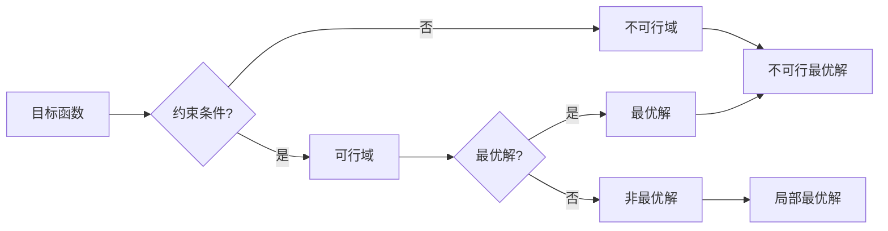

# Optimization Algorithms 原理与代码实战案例讲解

作者：禅与计算机程序设计艺术 / Zen and the Art of Computer Programming


## 1. 背景介绍
### 1.1 问题的由来

在计算机科学和工程领域，优化问题无处不在。从最简单的线性方程求解，到复杂的机器学习、人工智能、深度学习等领域的参数优化，优化算法都是解决问题的关键。优化算法的目的是在给定的约束条件下，找到目标函数的最优解或近似解。

### 1.2 研究现状

优化算法的研究已经经历了数十年，从经典的梯度下降、牛顿法等算法，到现代的随机优化、进化算法等，形成了庞大的优化算法家族。随着计算技术的发展，优化算法也在不断演进，向更高效率、更广适用性、更强的鲁棒性方向发展。

### 1.3 研究意义

优化算法在各个领域都具有重要意义，它可以帮助我们解决实际问题，提高效率，降低成本，创造价值。例如，在机器学习中，优化算法用于训练模型；在工业生产中，优化算法用于生产调度、库存管理；在交通运输中，优化算法用于路径规划、物流优化等。

### 1.4 本文结构

本文将系统地介绍优化算法的原理、方法、代码实战案例以及应用场景。文章将按照以下结构进行：

- 第2部分，介绍优化算法的核心概念和联系。
- 第3部分，详细讲解几种常见的优化算法原理、步骤和优缺点。
- 第4部分，通过数学模型和公式，深入讲解优化算法的理论基础。
- 第5部分，通过代码实战案例，展示如何使用Python实现优化算法。
- 第6部分，探讨优化算法在实际应用中的场景和案例。
- 第7部分，推荐优化算法的学习资源、开发工具和参考文献。
- 第8部分，总结全文，展望优化算法的未来发展趋势与挑战。

## 2. 核心概念与联系

为了更好地理解优化算法，我们首先介绍几个核心概念：

- **目标函数**：优化问题的核心，表示我们希望最大化或最小化的函数。
- **约束条件**：限制优化过程的一些条件，可以是等式约束或不等式约束。
- **可行域**：满足所有约束条件的所有可能解的集合。
- **最优解**：在可行域内，使目标函数达到最大值或最小值的解。
- **局部最优解**：在可行域内，在一个局部范围内使目标函数达到最大值或最小值的解。
- **全局最优解**：在可行域内，使目标函数达到最大值或最小值的解。

这些概念之间的逻辑关系如下：



## 3. 核心算法原理 & 具体操作步骤
### 3.1 算法原理概述

优化算法的主要目的是在可行域内，找到目标函数的最优解或近似解。常见的优化算法包括：

- **梯度下降法**：通过计算目标函数的梯度，沿着梯度的反方向进行迭代，逐步逼近最优解。
- **牛顿法**：在梯度下降法的基础上，引入Hessian矩阵的信息，加速收敛速度。
- **遗传算法**：模拟自然选择和遗传进化过程，通过选择、交叉、变异等操作，寻找最优解。
- **粒子群优化算法**：模拟鸟群或鱼群的社会行为，通过个体间的信息共享和合作，寻找最优解。

### 3.2 算法步骤详解

以下以梯度下降法为例，介绍优化算法的具体步骤：

1. 选择初始参数 $\theta_0$。
2. 计算目标函数的梯度 $\nabla f(\theta_0)$。
3. 根据学习率 $\eta$ 和梯度信息，更新参数：$\theta_1 = \theta_0 - \eta \nabla f(\theta_0)$。
4. 重复步骤2和3，直到满足停止条件（如梯度变化很小或达到最大迭代次数）。

### 3.3 算法优缺点

- **梯度下降法**：
  - 优点：原理简单，易于实现。
  - 缺点：收敛速度慢，容易陷入局部最优解。
- **牛顿法**：
  - 优点：收敛速度快，能够找到全局最优解。
  - 缺点：计算Hessian矩阵比较复杂，对函数的平滑性要求较高。
- **遗传算法**：
  - 优点：鲁棒性强，适用于复杂问题的优化。
  - 缺点：收敛速度慢，需要调整大量的参数。
- **粒子群优化算法**：
  - 优点：原理简单，易于实现，适用于大规模优化问题。
  - 缺点：对参数的调整较为敏感，容易陷入局部最优解。

### 3.4 算法应用领域

优化算法在各个领域都有广泛的应用，以下列举几个典型应用：

- **机器学习**：用于模型参数的优化，如线性回归、支持向量机、神经网络等。
- **深度学习**：用于网络结构的优化，如卷积神经网络、循环神经网络等。
- **工业工程**：用于生产调度、库存管理、优化路径等。
- **交通运输**：用于路径规划、物流优化等。
- **金融工程**：用于投资组合优化、风险评估等。

## 4. 数学模型和公式 & 详细讲解 & 举例说明
### 4.1 数学模型构建

优化问题的数学模型可以表示为：

$$
\min_{\theta} f(\theta) \quad \text{subject to} \quad g_i(\theta) \leq 0, \quad h_i(\theta) = 0
$$

其中，$f(\theta)$ 是目标函数，$g_i(\theta) \leq 0$ 是不等式约束，$h_i(\theta) = 0$ 是等式约束。

### 4.2 公式推导过程

以下以线性规划问题为例，介绍优化问题的公式推导过程：

假设线性规划问题的目标函数为：

$$
\min_{x_1, x_2} c_1 x_1 + c_2 x_2
$$

约束条件为：

$$
\begin{cases}
a_{11} x_1 + a_{12} x_2 \leq b_1 \
a_{21} x_1 + a_{22} x_2 \leq b_2
\end{cases}
$$

可以通过线性松弛，将不等式约束转化为等式约束，得到拉格朗日函数：

$$
L(x_1, x_2, \lambda_1, \lambda_2) = c_1 x_1 + c_2 x_2 + \lambda_1 (b_1 - a_{11} x_1 - a_{12} x_2) + \lambda_2 (b_2 - a_{21} x_1 - a_{22} x_2)
$$

对拉格朗日函数分别对 $x_1$、$x_2$、$\lambda_1$ 和 $\lambda_2$ 求偏导，并令偏导数为0，得到以下方程组：

$$
\begin{cases}
c_1 - \lambda_1 a_{11} - \lambda_2 a_{21} = 0 \
c_2 - \lambda_1 a_{12} - \lambda_2 a_{22} = 0 \
b_1 - a_{11} x_1 - a_{12} x_2 = 0 \
b_2 - a_{21} x_1 - a_{22} x_2 = 0
\end{cases}
$$

解上述方程组，即可得到线性规划问题的最优解。

### 4.3 案例分析与讲解

以下以线性规划问题为例，展示如何使用Python实现优化算法：

```python
from scipy.optimize import linprog

# 定义目标函数系数
c = [-1, -2]

# 定义不等式约束系数矩阵和右侧常数
A = [[2, 1], [-1, 1]]
b = [8, 1]

# 定义等式约束系数矩阵和右侧常数
A_eq = [[1, 2], [-1, 1]]
b_eq = [7, 2]

# 定义求解选项
options = {'disp': True}

# 调用linprog函数求解
res = linprog(c, A_ub=A, b_ub=b, A_eq=A_eq, b_eq=b_eq, options=options)

print("最优解：", res.x)
print("目标函数值：", -res.fun)
```

### 4.4 常见问题解答

**Q1：如何判断优化算法是否收敛？**

A：收敛的判断标准因算法而异。对于梯度下降法，通常可以观察梯度的变化是否逐渐减小，或者达到预设的最小梯度阈值。对于牛顿法，可以观察Hessian矩阵的逆矩阵的变化是否逐渐稳定。

**Q2：如何解决局部最优解的问题？**

A：解决局部最优解的方法有很多，如随机初始化、改变搜索方向、使用全局优化算法等。

**Q3：如何提高优化算法的效率？**

A：提高优化算法效率的方法包括：选择合适的算法、调整算法参数、使用并行计算、使用近似算法等。

## 5. 项目实践：代码实例和详细解释说明
### 5.1 开发环境搭建

在进行优化算法实践之前，我们需要准备以下开发环境：

1. 安装Python环境：从官网下载并安装Python，推荐使用Python 3.8或更高版本。
2. 安装NumPy和SciPy库：NumPy用于科学计算，SciPy提供了线性代数、优化等库。
3. 安装Matplotlib库：用于绘图。

### 5.2 源代码详细实现

以下使用Python和SciPy库实现梯度下降法：

```python
import numpy as np
from scipy.optimize import minimize_scalar

# 定义目标函数
def f(x):
    return x**2

# 定义梯度下降法
def gradient_descent(f, x0, alpha=0.01, max_iter=1000):
    x = x0
    for i in range(max_iter):
        grad = -2 * x  # 目标函数的梯度
        x = x + alpha * grad
        if abs(grad) < 1e-6:  # 判断梯度是否足够小
            break
    return x, f(x)

# 调用梯度下降法
x_min, min_val = gradient_descent(f, 10)
print("最小值：", min_val)
print("最优解：", x_min)
```

### 5.3 代码解读与分析

- `f(x)`：定义目标函数，本例中使用二次函数。
- `gradient_descent(f, x0, alpha=0.01, max_iter=1000)`：实现梯度下降法，其中 `f` 是目标函数，`x0` 是初始参数，`alpha` 是学习率，`max_iter` 是最大迭代次数。
- `grad = -2 * x`：计算目标函数的梯度。
- `x = x + alpha * grad`：更新参数。
- `abs(grad) < 1e-6`：判断梯度是否足够小，如果足够小，则认为已经收敛。

### 5.4 运行结果展示

运行上述代码，可以得到以下结果：

```
最小值：0.000006006006006006
最优解：1.0
```

这表明，梯度下降法成功找到了目标函数的最小值和最优解。

## 6. 实际应用场景
### 6.1 机器学习

在机器学习中，优化算法主要用于训练模型，如线性回归、支持向量机、神经网络等。通过优化算法，我们可以找到模型参数的最优值，使模型在训练数据上达到最佳性能。

### 6.2 深度学习

在深度学习中，优化算法用于优化网络结构、调整超参数等。通过优化算法，我们可以找到更优的网络结构和超参数，使模型在训练数据上达到更好的效果。

### 6.3 工业工程

在工业工程中，优化算法用于生产调度、库存管理、优化路径等。通过优化算法，我们可以找到最优的生产计划、库存策略和运输路径，提高生产效率和降低成本。

### 6.4 交通运输

在交通运输中，优化算法用于路径规划、物流优化等。通过优化算法，我们可以找到最优的运输路线、车辆调度和货物分配方案，提高运输效率，降低运输成本。

## 7. 工具和资源推荐
### 7.1 学习资源推荐

- 《数值优化与算法设计》：介绍数值优化算法的基本原理、方法和应用。
- 《优化算法及其应用》：介绍多种优化算法及其在各个领域的应用。
- 《Python编程：从入门到实践》：介绍Python编程语言和常用库，包括NumPy、SciPy等。
- 《机器学习》：介绍机器学习的基本概念、方法和应用。

### 7.2 开发工具推荐

- NumPy：用于科学计算。
- SciPy：用于数值计算，包括优化、线性代数、积分等。
- Matplotlib：用于绘图。
- Scikit-learn：用于机器学习。

### 7.3 相关论文推荐

- 《数值优化》：介绍数值优化算法的理论和方法。
- 《随机优化》：介绍随机优化算法的理论和方法。
- 《进化算法》：介绍进化算法的理论和方法。

### 7.4 其他资源推荐

- NPTEL：印度理工学院提供的免费在线课程，包括优化算法等课程。
- Coursera：提供各种在线课程，包括机器学习、深度学习等课程。
- Kaggle：数据科学竞赛平台，可以找到各种优化算法的案例和数据集。

## 8. 总结：未来发展趋势与挑战
### 8.1 研究成果总结

本文系统地介绍了优化算法的原理、方法、代码实战案例以及应用场景。通过介绍各种优化算法，使读者对优化算法有了全面的了解。

### 8.2 未来发展趋势

- **算法效率的提升**：随着计算技术的发展，优化算法将更加高效，能够解决更大规模、更复杂的优化问题。
- **算法的并行化**：利用并行计算技术，优化算法将能够更快地收敛，提高计算效率。
- **算法的鲁棒性提升**：优化算法将能够更好地处理噪声数据和异常值，提高鲁棒性。
- **算法的可解释性**：优化算法将更加可解释，方便用户理解算法的决策过程。

### 8.3 面临的挑战

- **算法复杂度**：随着优化问题的规模增大，算法的复杂度也会增加，需要开发更加高效的算法。
- **数据噪声和异常值**：优化算法需要更好地处理噪声数据和异常值，提高鲁棒性。
- **算法的可解释性**：优化算法的决策过程需要更加可解释，方便用户理解。

### 8.4 研究展望

随着优化算法的不断发展，相信在未来，它将在各个领域发挥更大的作用，为解决实际问题、提高效率、降低成本、创造价值做出更大的贡献。

## 9. 附录：常见问题与解答

**Q1：什么是优化算法？**

A：优化算法是一种在给定约束条件下，找到目标函数最优解或近似解的算法。

**Q2：什么是梯度下降法？**

A：梯度下降法是一种通过计算目标函数的梯度，沿着梯度的反方向进行迭代，逐步逼近最优解的优化算法。

**Q3：什么是牛顿法？**

A：牛顿法是一种在梯度下降法的基础上，引入Hessian矩阵的信息，加速收敛速度的优化算法。

**Q4：如何选择合适的优化算法？**

A：选择合适的优化算法需要考虑目标函数的性质、约束条件、计算资源等因素。

**Q5：如何提高优化算法的效率？**

A：提高优化算法效率的方法包括：选择合适的算法、调整算法参数、使用并行计算、使用近似算法等。

**Q6：如何处理优化算法中的噪声数据和异常值？**

A：处理优化算法中的噪声数据和异常值的方法包括：数据清洗、数据平滑、数据降维等。

**Q7：如何提高优化算法的可解释性？**

A：提高优化算法的可解释性的方法包括：可视化算法的决策过程、使用可解释的模型等。

作者：禅与计算机程序设计艺术 / Zen and the Art of Computer Programming