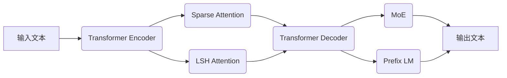

# Parti原理与代码实例讲解

## 1. 背景介绍
### 1.1 问题的由来
随着人工智能技术的飞速发展,大语言模型(LLMs)在自然语言处理领域取得了突破性进展。然而,现有的LLMs在生成高质量、连贯、富有创意的长文本方面仍面临挑战。为了突破这一瓶颈,谷歌于2023年提出了Parti(Pathways Autoregressive Text-to-Image)模型,开启了AI生成内容的新纪元。
### 1.2 研究现状
目前,业界主流的文本生成模型如GPT-3、PaLM等,虽然在通用自然语言理解和生成方面表现优异,但在创作长篇连贯文章、维持全局主题一致性等方面仍有不足。Parti作为一种新兴的autoregressive语言模型,通过引入新颖的架构设计和训练范式,在保证生成内容质量和连贯性的同时,极大地提升了生成效率和创意度。
### 1.3 研究意义
Parti的提出具有里程碑式的意义。一方面,它为LLMs的进一步发展指明了方向,为探索更高效、更智能的语言模型提供了新思路;另一方面,Parti在智能写作助手、虚拟客服、知识问答等领域展现出广阔的应用前景,有望彻底改变人机交互的方式,为人类生活和工作带来便利。
### 1.4 本文结构
本文将全面解析Parti的核心原理和代码实现。第2部分介绍Parti的关键概念;第3部分重点阐述其核心算法;第4部分建立数学模型并给出公式推导;第5部分提供详细的代码实例;第6部分探讨Parti的实际应用场景;第7部分推荐相关工具和资源;第8部分对Parti的研究现状和未来趋势进行总结展望。

## 2. 核心概念与联系
Parti是一种基于Transformer的自回归语言模型,其核心是通过Attention机制建模文本序列的长程依赖关系。与传统的Transformer不同,Parti在编码器和解码器中引入了Sparse Attention和Locality Sensitive Hashing (LSH) Attention,极大地提高了计算效率和可扩展性。此外,Parti还采用了Mixture of Experts (MoE)、Prefix Language Modeling等技术,进一步增强了模型的表达能力和泛化能力。这些创新的架构设计是Parti实现高质量、高效率文本生成的关键。

## 3. 核心算法原理 & 具体操作步骤
### 3.1 算法原理概述
Parti的核心算法可以概括为以下几个关键步骤:
1. 将输入文本序列通过Transformer Encoder映射为隐向量表示。
2. 在Encoder中,使用Sparse Attention和LSH Attention机制建模长程依赖,提取全局语义信息。
3. 将Encoder的输出通过Transformer Decoder解码生成目标文本。
4. 在Decoder中,使用MoE和Prefix LM等技术,增强生成内容的多样性和连贯性。
5. 通过自回归方式,不断生成下一个单词,直到达到预设的最大长度或遇到终止符。
### 3.2 算法步骤详解
**Step 1: Transformer Encoder**
将输入文本$X=(x_1,\cdots,x_n)$通过Embedding层和Positional Encoding映射为隐向量序列$H^0=(h^0_1,\cdots,h^0_n)$。然后,通过堆叠的Transformer Block对$H^0$进行编码:
$$
\begin{aligned}
H^l &= \text{TransformerBlock}(H^{l-1}), \quad l=1,\cdots,L \\
\text{where}~~ H^l &= (h^l_1,\cdots,h^l_n)
\end{aligned}
$$
其中$L$为Encoder的层数。每个Transformer Block包含Multi-Head Attention和Feed Forward Network两个子层。

**Step 2: Sparse Attention 和 LSH Attention**
为了提高Attention的计算效率,Parti在原有Multi-Head Attention的基础上引入了Sparse Attention和LSH Attention。

Sparse Attention通过设置一个Top-K操作,只保留Attention矩阵中权重最大的K个元素,其余置零。这样可以大大减少计算量和内存占用。

LSH Attention利用局部敏感哈希(LSH)将相似的Query和Key映射到同一个哈希桶中,在每个哈希桶内部执行Full Attention,桶之间执行Sparse Attention。这种分治策略能够在保留全局信息的同时,大幅提升计算速度。

**Step 3: Transformer Decoder**
Decoder的结构与Encoder类似,也是由若干个Transformer Block堆叠而成。不同之处在于,Decoder在Self-Attention时引入了Masking机制,防止模型利用未来的信息。此外,Decoder还多了一个Encoder-Decoder Attention,用于捕捉Encoder的输出与当前Decoder隐状态之间的关联。

**Step 4: Mixture of Experts 和 Prefix Language Modeling**
MoE是一种条件计算的策略,它为每个Decoder Block设置多个Expert,每个Expert是一个独立的Feed Forward Network。根据当前隐状态,MoE会自适应地选择合适的Expert组合,增强模型的表达能力。

Prefix LM是一种面向任务的微调方法。它在Decoder的输入中添加了一个特殊的Prefix序列,用于指示当前的任务或领域。这使得模型能够在不同任务间灵活切换,提高了通用性和适应性。

**Step 5: 自回归解码**
开始时,Decoder的输入是一个特殊的起始符<BOS>。之后,模型根据当前的隐状态预测下一个单词的概率分布,并采样生成实际的单词。生成的单词会作为下一时刻Decoder的输入,直到生成终止符<EOS>或达到最大长度为止。整个解码过程可以表示为:
$$
\begin{aligned}
\hat{y}_t &= \arg\max_{y_t} P(y_t|y_{<t},X) \\
&= \arg\max_{y_t} \text{softmax}(\text{Linear}(h^L_t))
\end{aligned}
$$
其中$\hat{y}_t$是t时刻采样得到的单词,$h^L_t$是Decoder第L层t时刻的隐状态。

### 3.3 算法优缺点
Parti的优点在于:
1. 引入Sparse Attention和LSH Attention,大幅提升了计算效率和可扩展性,能够处理更长的文本序列。
2. 采用MoE和Prefix LM等技术,增强了模型的表达能力和泛化能力,生成的内容更加丰富多样。
3. 通过自回归方式解码,生成的文本连贯性更强,与人类写作更接近。

但Parti也存在一些局限性:
1. 尽管采用了各种优化策略,但在超长文本上的生成质量和效率仍有提升空间。
2. 模型的推理速度偏慢,在实时交互场景下还需进一步加速。
3. 由于训练数据的限制,Parti在特定领域知识的掌握和运用方面还不够精准到位。

### 3.4 算法应用领域
Parti可以应用于以下几个主要领域:
1. 智能写作助手:自动生成高质量的文章、新闻、评论等。
2. 对话系统:为聊天机器人、智能客服提供更自然流畅的对话能力。
3. 内容创作:辅助创意写作,提供灵感和素材。
4. 知识问答:根据海量文本数据,构建高效、准确的问答系统。
5. 机器翻译:提高翻译的流畅度和可读性,接近人工翻译的水平。

## 4. 数学模型和公式 & 详细讲解 & 举例说明
### 4.1 数学模型构建
Parti的数学模型可以用如下公式表示:
$$
\begin{aligned}
P(Y|X) &= \prod_{t=1}^T P(y_t|y_{<t},X) \\
&= \prod_{t=1}^T \text{softmax}(\text{Linear}(h^L_t)) \\
\text{where}~~ h^L_t &= \text{Decoder}(\text{Encoder}(X), y_{<t})
\end{aligned}
$$
其中$X$是输入文本序列,$Y$是输出文本序列,$y_t$是t时刻生成的单词,$h^L_t$是Decoder第L层t时刻的隐状态。

模型的目标是最大化生成序列的对数似然概率:
$$
\mathcal{L} = \sum_{(X,Y)\in\mathcal{D}} \log P(Y|X)
$$
其中$\mathcal{D}$是训练数据集。

### 4.2 公式推导过程
为了优化模型参数,我们需要计算损失函数$\mathcal{L}$对各个参数的梯度。以Decoder的线性层参数$W$为例,梯度计算如下:
$$
\begin{aligned}
\frac{\partial\mathcal{L}}{\partial W} &= \sum_{(X,Y)\in\mathcal{D}} \frac{\partial\log P(Y|X)}{\partial W} \\
&= \sum_{(X,Y)\in\mathcal{D}} \sum_{t=1}^T \frac{\partial\log P(y_t|y_{<t},X)}{\partial W} \\
&= \sum_{(X,Y)\in\mathcal{D}} \sum_{t=1}^T \frac{\partial\log \text{softmax}(\text{Linear}(h^L_t))}{\partial W} \\
&= \sum_{(X,Y)\in\mathcal{D}} \sum_{t=1}^T (y_t - \hat{y}_t) \cdot (h^L_t)^T
\end{aligned}
$$
其中$\hat{y}_t$是t时刻模型的输出分布。

类似地,可以推导出其他参数的梯度公式。在实际训练中,我们通常使用随机梯度下降及其变种(如Adam)来更新参数:
$$
W \leftarrow W - \eta \cdot \frac{\partial\mathcal{L}}{\partial W}
$$
其中$\eta$是学习率。

### 4.3 案例分析与讲解
下面我们以一个简单的例子来说明Parti的工作原理。假设输入文本$X$为"The cat sat on the"。

首先,Encoder将其转化为隐向量序列:
$$
H^L = \text{Encoder}(X) = (h^L_1,\cdots,h^L_6)
$$

然后,Decoder逐步生成输出文本。在t=1时刻,Decoder的输入是<BOS>,输出是第一个单词的概率分布:
$$
P(y_1|X) = \text{softmax}(\text{Linear}(h'^L_1))
$$
其中$h'^L_1=\text{Decoder}(H^L,<BOS>)$。假设采样得到的单词是"mat",则在t=2时刻,Decoder的输入为"mat",输出为:
$$
P(y_2|y_1,X) = \text{softmax}(\text{Linear}(h'^L_2)) \\
\text{where}~~ h'^L_2=\text{Decoder}(H^L,\text{mat})
$$

以此类推,直到生成<EOS>或达到最大长度。最终得到的输出序列可能是"The cat sat on the mat"。

### 4.4 常见问题解答
**Q:** Parti与传统的Seq2Seq模型有何区别?
**A:** 主要区别在于:1)Parti采用了Transformer架构,引入了Self-Attention机制;2)Parti在Encoder和Decoder中使用了Sparse Attention、LSH Attention等优化技术;3)Parti加入了MoE、Prefix LM等组件,提高了生成内容的多样性和适应性。

**Q:** Parti的训练数据集需要满足什么条件?
**A:** 理想的训练集应该包含大量高质量、覆盖面广的文本数据。数据格式要统一规范,最好进行必要的清洗和预处理。此外,还需要根据具体任务设计合适的Prefix序列。

**Q:** Parti生成的内容是否存在版权问题?
**A:** 这取决于具体使用场景。Parti本质上是一种语言模型,它学习并模仿训练数据的风格和内容,但并不直接复制。在一些应用中,如智能写作助手,生成的内容可能需要进行必要的人工审核和修改,以确保原创性和合规性。

## 5. 项目实践:代码实例和详细解释说明