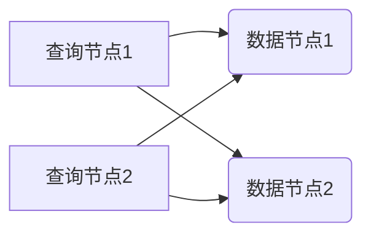

# Presto原理与代码实例讲解

作者：禅与计算机程序设计艺术 / Zen and the Art of Computer Programming 


## 1. 背景介绍
### 1.1 问题的由来

随着大数据技术的飞速发展，如何高效地处理和分析海量数据成为了学术界和工业界的共同关注点。传统的数据库系统在处理大规模数据集时，往往存在性能瓶颈，难以满足快速查询和实时分析的需求。为了解决这一问题，Presto应运而生。

Presto是一个开源的分布式查询引擎，可以处理数百万行数据，同时保持高并发和低延迟。它支持多种数据源，包括关系型数据库、NoSQL数据库、HDFS、Amazon S3等，可以轻松地与其他大数据平台集成。

### 1.2 研究现状

近年来，Presto在业界得到了广泛的应用，许多知名企业，如Netflix、Facebook、Uber等，都将其用于大数据查询和分析。Presto的性能和功能不断完善，已经成为大数据生态系统中的重要组成部分。

### 1.3 研究意义

Presto具有以下研究意义：

1. 提高大数据处理效率。Presto的高效查询能力，可以显著提升大数据分析速度，降低企业成本。
2. 支持多种数据源。Presto支持多种数据源，可以方便地与其他大数据平台集成，实现数据共享和交换。
3. 开源和社区活跃。Presto开源，拥有活跃的社区，可以方便地获取支持和技术交流。
4. 高扩展性和高可用性。Presto采用分布式架构，可以方便地进行横向扩展和故障转移，保证系统的高可用性。

### 1.4 本文结构

本文将围绕Presto的原理、代码实现和应用实践展开，具体内容包括：

- 第2部分，介绍Presto的核心概念和联系。
- 第3部分，详细阐述Presto的算法原理和具体操作步骤。
- 第4部分，讲解Presto的数学模型和公式，并结合实例进行说明。
- 第5部分，给出Presto的代码实例和详细解释说明。
- 第6部分，探讨Presto在实际应用场景中的应用案例。
- 第7部分，推荐Presto相关的学习资源、开发工具和参考文献。
- 第8部分，总结全文，展望Presto的未来发展趋势与挑战。
- 第9部分，附录，包含常见问题与解答。

## 2. 核心概念与联系

为了更好地理解Presto，本节将介绍几个密切相关的核心概念：

- 分布式计算：指将计算任务分解成多个子任务，在多个节点上并行执行，最终合并结果的技术。
- 内存计算：指将数据存储在内存中，以实现快速访问和计算的技术。
- 数据源：指存储数据的存储系统，如关系型数据库、NoSQL数据库、文件系统等。
- 批处理：指将数据分成多个批次进行处理的技术。
- 流处理：指实时处理数据的技术。

这些概念之间的逻辑关系如下图所示：


可以看出，分布式计算和内存计算是Presto的核心技术，用于实现高效的数据处理和计算。数据源是Presto的数据来源，批处理和流处理则是数据处理的两种方式。

## 3. 核心算法原理 & 具体操作步骤

### 3.1 算法原理概述

Presto的核心算法原理是：将查询任务分解成多个子任务，在多个节点上并行执行，最终合并结果。

具体而言，Presto采用以下技术：

- 查询解析：将SQL查询语句解析成查询计划，包括查询节点和数据节点。
- 数据路由：将查询计划中的数据节点路由到相应的数据源节点。
- 数据分片：将数据分片成多个子任务，在多个节点上并行执行。
- 结果合并：将多个子任务的结果合并成最终的查询结果。

### 3.2 算法步骤详解

Presto的算法步骤如下：

1. 用户发送SQL查询语句到Presto服务器。
2. Presto服务器解析SQL查询语句，生成查询计划。
3. Presto服务器将查询计划中的数据节点路由到相应的数据源节点。
4. Presto服务器将数据节点分片成多个子任务，并将子任务分配给不同的执行节点。
5. 执行节点并行执行子任务，将结果发送回Presto服务器。
6. Presto服务器将子任务的结果合并成最终的查询结果，并将结果返回给用户。

### 3.3 算法优缺点

Presto的算法具有以下优点：

- 高效：Presto采用分布式计算和内存计算技术，可以高效地处理大规模数据集。
- 扩展性强：Presto可以方便地进行横向扩展，以适应数据量的增长。
- 可靠性高：Presto采用分布式架构，可以保证系统的高可用性。
- 灵活性高：Presto支持多种数据源，可以方便地与其他大数据平台集成。

Presto的算法也存在以下缺点：

- 成本较高：Presto需要一定的硬件资源，如CPU、内存等。
- 依赖网络：Presto的分布式架构依赖网络通信，网络延迟会影响性能。
- 可视化能力有限：Presto的查询结果以文本形式展示，可视化能力有限。

### 3.4 算法应用领域

Presto的算法可以应用于以下领域：

- 大数据查询和分析：Presto可以高效地处理大规模数据集，适用于大数据查询和分析。
- 数据仓库：Presto可以作为数据仓库的查询引擎，实现数据分析和报表生成。
- 业务智能：Presto可以用于业务智能，如用户行为分析、市场分析等。

## 4. 数学模型和公式 & 详细讲解 & 举例说明

### 4.1 数学模型构建

Presto的数学模型可以抽象为一个图，其中节点表示查询节点和数据节点，边表示数据传输路径。



图中，查询节点1和查询节点2分别表示查询计划中的两个节点，数据节点1和数据节点2表示数据源中的两个数据集。查询节点1和查询节点2与数据节点1和数据节点2之间存在数据传输路径。

### 4.2 公式推导过程

Presto的查询计划可以抽象为一个有向图，其中节点表示操作，边表示数据传输路径。

假设查询计划中的节点数为 $n$，数据传输路径数为 $m$，则查询计划可以表示为一个 $n \times m$ 的矩阵 $A$，其中 $A_{ij}$ 表示节点 $i$ 到节点 $j$ 是否存在数据传输路径。

查询计划的时间复杂度可以表示为：

$$
T(n, m) = O(nm)
$$

### 4.3 案例分析与讲解

假设有一个包含两个节点的查询计划，查询节点1到查询节点2存在数据传输路径，查询节点1到数据节点1和数据节点2存在数据传输路径。

查询计划可以表示为以下矩阵：

$$
A = \begin{bmatrix}
1 & 0 \
0 & 1 \
1 & 1 \
\end{bmatrix}
$$

查询计划的时间复杂度为 $T(2, 3) = O(6) = O(2 \times 3)$。

### 4.4 常见问题解答

**Q1：Presto的查询计划是如何生成的？**

A：Presto的查询计划是通过解析SQL查询语句，然后根据查询计划优化器进行优化的。查询计划优化器会考虑查询语句的语法、语义和执行成本，生成最优的查询计划。

**Q2：Presto是如何进行数据路由的？**

A：Presto的数据路由是通过查询计划中的数据节点路由信息进行的。数据节点路由信息包括数据源类型、数据源地址、数据集等。

**Q3：Presto是如何进行数据分片的？**

A：Presto的数据分片是通过数据源的分片机制进行的。数据源需要提供分片信息，如数据集大小、分片键等。

## 5. 项目实践：代码实例和详细解释说明

### 5.1 开发环境搭建

在进行Presto项目实践之前，我们需要搭建开发环境。以下是使用Python进行Presto开发的步骤：

1. 安装Presto客户端：从Presto官方网站下载Presto客户端安装包，并解压到本地目录。
2. 安装Python和PyPresto库：从Python官网下载Python安装包并安装，然后使用pip安装PyPresto库。
3. 配置Presto客户端：修改Presto客户端的配置文件，设置Presto服务器的地址和端口。

### 5.2 源代码详细实现

以下是一个使用PyPresto库执行Presto查询的示例：

```python
import pyresto

# 连接到Presto服务器
client = pyresto.connect(host='localhost', port=8080)

# 执行查询
query = "SELECT * FROM my_table"
results = client.execute(query)

# 打印查询结果
for row in results:
    print(row)
```

上述代码首先连接到本地的Presto服务器，然后执行一个简单的查询语句，最后打印查询结果。

### 5.3 代码解读与分析

在上面的示例代码中，我们首先导入pyresto库，然后使用pyresto.connect函数连接到Presto服务器。接着，我们定义一个查询语句，并使用client.execute函数执行查询。最后，我们遍历查询结果，并打印每行数据。

### 5.4 运行结果展示

假设我们有一个名为my_table的表，其中包含以下数据：

```
+----+--------+
| id | name   |
+----+--------+
|  1 | Alice  |
|  2 | Bob    |
|  3 | Charlie|
+----+--------+
```

执行查询语句`SELECT * FROM my_table`后，我们将得到以下结果：

```
(1, Alice)
(2, Bob)
(3, Charlie)
```

## 6. 实际应用场景

### 6.1 数据仓库

Presto可以作为一个高效的数据仓库查询引擎，用于处理和分析大规模数据集。通过将Presto与数据仓库系统集成，可以实现对数据仓库数据的实时查询和分析。

### 6.2 机器学习

Presto可以用于机器学习任务的数据预处理和模型评估。通过将Presto与机器学习平台集成，可以实现对大规模数据集的快速预处理和模型评估。

### 6.3 业务智能

Presto可以用于业务智能，如用户行为分析、市场分析等。通过将Presto与业务系统集成，可以实现对业务数据的实时监控和分析。

## 7. 工具和资源推荐

### 7.1 学习资源推荐

为了更好地学习Presto，以下是一些推荐的资源：

- Presto官方文档：https://prestodb.io/docs/current/
- Presto社区论坛：https://prestodb.io/community/
- Presto技术博客：https://prestodb.io/blog/

### 7.2 开发工具推荐

- PyPresto：https://github.com/prestodb/presto-python-client
- Presto Notebook：https://prestodb.io/products/presto-notebook/

### 7.3 相关论文推荐

- [Presto: The Open-Source Distributed SQL Engine](https://www.beyondeucalyptus.com/posts/presto-paper.html)

### 7.4 其他资源推荐

- Presto GitHub仓库：https://github.com/prestodb/presto
- Presto问答社区：https://stackoverflow.com/questions/tagged/presto

## 8. 总结：未来发展趋势与挑战

### 8.1 研究成果总结

本文对Presto的原理、代码实现和应用实践进行了全面系统的介绍。首先介绍了Presto的背景、研究现状和意义，然后详细阐述了Presto的算法原理和具体操作步骤，接着讲解了Presto的数学模型和公式，并结合实例进行说明。最后，本文给出了Presto的代码实例和详细解释说明，并探讨了Presto在实际应用场景中的应用案例。

### 8.2 未来发展趋势

展望未来，Presto将呈现以下发展趋势：

1. 支持更多数据源：Presto将继续支持更多类型的数据源，如流数据、图数据等。
2. 改进性能：Presto将继续优化性能，以应对更大规模的数据集和更复杂的查询。
3. 加强社区建设：Presto将继续加强社区建设，吸引更多开发者参与。
4. 与其他技术融合：Presto将与其他大数据技术，如机器学习、流处理等，进行融合。

### 8.3 面临的挑战

Presto在发展过程中也面临着以下挑战：

1. 性能瓶颈：随着数据规模的扩大，Presto的性能可能会遇到瓶颈。
2. 可扩展性：Presto的可扩展性需要进一步提高，以满足更大规模的数据中心需求。
3. 可维护性：Presto的代码和架构需要进一步优化，以提高可维护性。

### 8.4 研究展望

为了应对上述挑战，未来的研究需要在以下方面取得突破：

1. 探索新的数据组织方式：通过优化数据组织方式，提高Presto的性能和可扩展性。
2. 研究新型查询优化算法：开发新的查询优化算法，提高Presto的性能和可扩展性。
3. 加强社区建设和生态建设：吸引更多开发者参与，共同推动Presto的发展。

相信在业界和学界的共同努力下，Presto将不断改进和完善，为大数据查询和分析领域做出更大的贡献。

## 9. 附录：常见问题与解答

**Q1：Presto与传统的数据库系统有什么区别？**

A：Presto与传统的数据库系统主要有以下区别：

- 数据源：Presto支持多种数据源，而传统的数据库系统通常只支持关系型数据库。
- 批处理：Presto支持批处理和流处理，而传统的数据库系统通常只支持批处理。
- 性能：Presto具有更高的查询性能，可以快速处理大规模数据集。

**Q2：Presto的架构是怎样的？**

A：Presto采用分布式架构，包括以下组件：

- Coordinating Node：协调节点，负责解析查询语句、生成查询计划、协调执行节点等。
- Worker Nodes：执行节点，负责执行查询计划中的子任务。

**Q3：Presto如何进行数据路由？**

A：Presto的数据路由是通过查询计划中的数据节点路由信息进行的。数据节点路由信息包括数据源类型、数据源地址、数据集等。

**Q4：Presto的查询优化器是如何工作的？**

A：Presto的查询优化器会考虑查询语句的语法、语义和执行成本，生成最优的查询计划。查询优化器包括以下步骤：

1. 解析查询语句。
2. 分析查询语句的语义。
3. 生成查询计划。
4. 优化查询计划。
5. 生成执行计划。

**Q5：Presto如何进行数据分片？**

A：Presto的数据分片是通过数据源的分片机制进行的。数据源需要提供分片信息，如数据集大小、分片键等。

**Q6：Presto如何进行数据加密？**

A：Presto支持数据加密，包括以下几种方式：

1. 数据库级别的加密：使用数据库自带的加密功能，对存储在数据库中的数据进行加密。
2. 集成SSL/TLS：使用SSL/TLS对Presto客户端和服务器之间的通信进行加密。
3. 数据加密：使用Presto的加密功能，对查询结果进行加密。

**Q7：Presto如何进行权限控制？**

A：Presto支持基于角色的访问控制(RBAC)，可以对不同用户和用户组分配不同的权限。

**Q8：Presto如何进行故障转移？**

A：Presto采用分布式架构，可以方便地进行故障转移。当协调节点或执行节点出现故障时，Presto会自动选择其他节点进行故障转移。

**Q9：Presto如何进行监控和告警？**

A：Presto支持多种监控和告警机制，包括以下几种：

1. Prometheus：使用Prometheus进行监控和告警。
2. Grafana：使用Grafana进行可视化监控。
3. JMX：使用JMX进行监控。
4. 自定义告警：自定义告警规则，实现对特定指标进行告警。