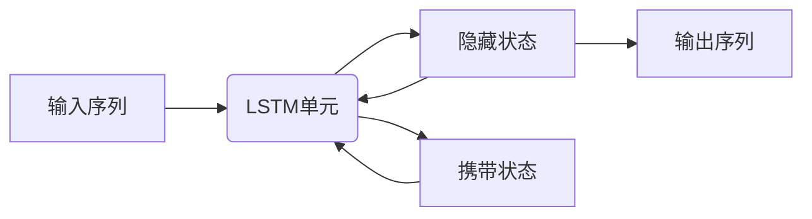

# Python机器学习实战：循环神经网络(RNN)与自然语言处理(NLP)

## 1. 背景介绍

### 1.1 问题的由来

在过去的几十年里，自然语言处理(NLP)一直是人工智能领域的一个重要挑战。作为人类与机器交互的桥梁,NLP技术的发展对于实现真正的人工智能至关重要。传统的NLP方法主要基于规则和统计模型,虽然取得了一些成果,但由于其本身的局限性,很难处理复杂的语义和上下文信息。

随着深度学习技术的兴起,循环神经网络(RNN)作为一种强大的序列建模工具,为解决NLP中的各种挑战提供了新的可能性。RNN能够有效地捕捉序列数据中的长期依赖关系,从而更好地理解和生成自然语言。

### 1.2 研究现状

近年来,RNN在NLP领域取得了令人瞩目的成就,包括机器翻译、语音识别、文本生成、情感分析等多个领域。著名的序列到序列(Seq2Seq)模型、注意力机制(Attention Mechanism)和Transformer等技术的出现,进一步推动了RNN在NLP中的应用。

然而,RNN在实际应用中仍然面临一些挑战,例如梯度消失/爆炸问题、长期依赖性建模能力的局限性等。研究人员不断探索新的RNN变体和训练技巧,以提高其性能和泛化能力。

### 1.3 研究意义

掌握RNN在NLP中的应用,对于构建智能系统、提高人机交互体验、挖掘语言数据中的潜在价值等方面具有重要意义。本文将全面介绍RNN在NLP领域的核心概念、算法原理、数学模型、实际应用场景等,为读者提供一个系统的学习路线。

### 1.4 本文结构

本文将从以下几个方面深入探讨RNN在NLP中的应用:

- 核心概念与联系
- 核心算法原理与具体操作步骤
- 数学模型和公式详细讲解与案例分析
- 项目实践:代码实例和详细解释说明
- 实际应用场景
- 工具和资源推荐
- 总结:未来发展趋势与挑战
- 附录:常见问题与解答

## 2. 核心概念与联系

在深入探讨RNN在NLP中的应用之前,我们需要先了解一些核心概念及其相互关系。

### 2.1 循环神经网络(RNN)

循环神经网络(Recurrent Neural Network, RNN)是一种特殊的人工神经网络,专门设计用于处理序列数据,如文本、语音、时间序列等。与传统的前馈神经网络不同,RNN在隐藏层之间引入了循环连接,使得网络能够捕捉序列数据中的动态行为和长期依赖关系。

RNN的核心思想是在每个时间步都将当前输入与前一时间步的隐藏状态结合,通过非线性函数计算出当前时间步的隐藏状态,并将其传递到下一时间步。这种循环结构使得RNN能够对任意长度的序列进行建模,并在理论上具有捕捉长期依赖关系的能力。

然而,在实践中,由于梯度消失/爆炸问题的存在,普通RNN很难学习到长期依赖关系。为了解决这个问题,研究人员提出了多种改进的RNN变体,如长短期记忆网络(LSTM)和门控循环单元(GRU)等。

### 2.2 长短期记忆网络(LSTM)

长短期记忆网络(Long Short-Term Memory, LSTM)是RNN的一种变体,旨在解决普通RNN在学习长期依赖关系时容易出现的梯度消失/爆炸问题。LSTM通过引入门控机制(Gate Mechanism)和携带状态(Carrying State),可以有效地控制信息的流动,从而更好地捕捉长期依赖关系。

LSTM的核心组成部分包括:

- 遗忘门(Forget Gate):决定舍弃或保留上一时间步的状态信息。
- 输入门(Input Gate):决定更新多少新的状态信息。
- 输出门(Output Gate):决定输出什么状态信息。
- 携带状态(Carrying State):用于存储长期信息。

通过这些门控机制和携带状态,LSTM可以灵活地控制信息的流动,从而更好地建模长期依赖关系。

### 2.3 门控循环单元(GRU)

门控循环单元(Gated Recurrent Unit, GRU)是另一种改进的RNN变体,与LSTM类似,也旨在解决普通RNN在学习长期依赖关系时容易出现的梯度消失/爆炸问题。相比LSTM,GRU的结构更加简单,只包含两个门控机制:更新门(Update Gate)和重置门(Reset Gate)。

更新门决定了保留多少上一时间步的状态信息,而重置门则控制了忘记多少之前的状态信息。GRU通过这两个门控机制,可以有效地捕捉长期依赖关系,同时减少了参数数量,降低了计算复杂度。

### 2.4 注意力机制(Attention Mechanism)

注意力机制(Attention Mechanism)是一种重要的神经网络技术,最初应用于机器翻译领域,后来也被广泛应用于其他NLP任务中。注意力机制的核心思想是允许模型在处理序列数据时,根据当前的上下文信息,动态地关注序列中的不同部分,从而更好地捕捉长期依赖关系。

在RNN中引入注意力机制后,模型不再完全依赖于隐藏状态来传递信息,而是可以直接从输入序列中选择相关的信息,从而提高了模型的表现能力。注意力机制有多种变体,如加性注意力(Additive Attention)、点积注意力(Dot-Product Attention)等。

### 2.5 Transformer

Transformer是一种全新的基于注意力机制的序列建模架构,由Google的Vaswani等人在2017年提出。与RNN不同,Transformer完全抛弃了循环结构,而是完全依赖于注意力机制来捕捉序列数据中的长期依赖关系。

Transformer的核心组成部分包括编码器(Encoder)和解码器(Decoder),它们都由多个注意力层和前馈网络层构成。通过自注意力(Self-Attention)机制,Transformer可以同时关注输入序列中的所有位置,从而更好地捕捉长期依赖关系。

Transformer在机器翻译、文本生成、语言理解等多个NLP任务中表现出色,并成为当前最先进的序列建模架构之一。

### 2.6 自然语言处理(NLP)

自然语言处理(Natural Language Processing, NLP)是人工智能的一个重要分支,旨在使计算机能够理解、处理和生成人类自然语言。NLP涉及多个子领域,如机器翻译、语音识别、文本生成、情感分析、问答系统等。

在NLP中,RNN及其变体(如LSTM、GRU)由于其强大的序列建模能力,被广泛应用于各种任务中。例如,在机器翻译任务中,RNN可以将源语言序列编码为隐藏状态,然后解码为目标语言序列;在语音识别任务中,RNN可以将音频序列转换为文本序列;在文本生成任务中,RNN可以根据给定的上下文生成连贯的自然语言文本。

随着注意力机制和Transformer等技术的出现,NLP领域取得了长足的进步,但同时也面临着新的挑战,如模型的可解释性、数据偏差、隐私保护等问题。

## 3. 核心算法原理与具体操作步骤

在了解了RNN在NLP中的核心概念及其相互关系之后,我们将深入探讨RNN及其变体的核心算法原理和具体操作步骤。

### 3.1 算法原理概述

#### 3.1.1 普通RNN

普通RNN的核心思想是在每个时间步将当前输入与前一时间步的隐藏状态结合,通过非线性函数计算出当前时间步的隐藏状态,并将其传递到下一时间步。具体来说,在时间步t,RNN的计算过程如下:

$$
h_t = f(W_{xh}x_t + W_{hh}h_{t-1} + b_h)
$$
$$
y_t = g(W_{hy}h_t + b_y)
$$

其中:

- $x_t$是时间步t的输入
- $h_t$是时间步t的隐藏状态
- $y_t$是时间步t的输出
- $W_{xh}$、$W_{hh}$、$W_{hy}$是权重矩阵
- $b_h$、$b_y$是偏置向量
- $f$和$g$是非线性激活函数,如tanh或ReLU

虽然普通RNN在理论上具有捕捉长期依赖关系的能力,但在实践中由于梯度消失/爆炸问题的存在,它很难有效地学习到长期依赖关系。

#### 3.1.2 LSTM

为了解决普通RNN在学习长期依赖关系时容易出现的梯度消失/爆炸问题,LSTM引入了门控机制和携带状态。在时间步t,LSTM的计算过程如下:

$$
f_t = \sigma(W_f \cdot [h_{t-1}, x_t] + b_f)
$$
$$
i_t = \sigma(W_i \cdot [h_{t-1}, x_t] + b_i)
$$
$$
\tilde{C}_t = \tanh(W_C \cdot [h_{t-1}, x_t] + b_C)
$$
$$
C_t = f_t \odot C_{t-1} + i_t \odot \tilde{C}_t
$$
$$
o_t = \sigma(W_o \cdot [h_{t-1}, x_t] + b_o)
$$
$$
h_t = o_t \odot \tanh(C_t)
$$

其中:

- $f_t$是遗忘门,控制舍弃或保留上一时间步的状态信息
- $i_t$是输入门,控制更新多少新的状态信息
- $\tilde{C}_t$是候选携带状态
- $C_t$是当前时间步的携带状态
- $o_t$是输出门,控制输出什么状态信息
- $h_t$是当前时间步的隐藏状态
- $\sigma$是sigmoid激活函数
- $\odot$表示元素wise乘积

通过引入门控机制和携带状态,LSTM可以有效地控制信息的流动,从而更好地捕捉长期依赖关系。

#### 3.1.3 GRU

GRU是另一种改进的RNN变体,与LSTM类似,也旨在解决普通RNN在学习长期依赖关系时容易出现的梯度消失/爆炸问题。相比LSTM,GRU的结构更加简单,只包含两个门控机制:更新门和重置门。在时间步t,GRU的计算过程如下:

$$
r_t = \sigma(W_r \cdot [h_{t-1}, x_t] + b_r)
$$
$$
z_t = \sigma(W_z \cdot [h_{t-1}, x_t] + b_z)
$$
$$
\tilde{h}_t = \tanh(W_h \cdot [r_t \odot h_{t-1}, x_t] + b_h)
$$
$$
h_t = (1 - z_t) \odot h_{t-1} + z_t \odot \tilde{h}_t
$$

其中:

- $r