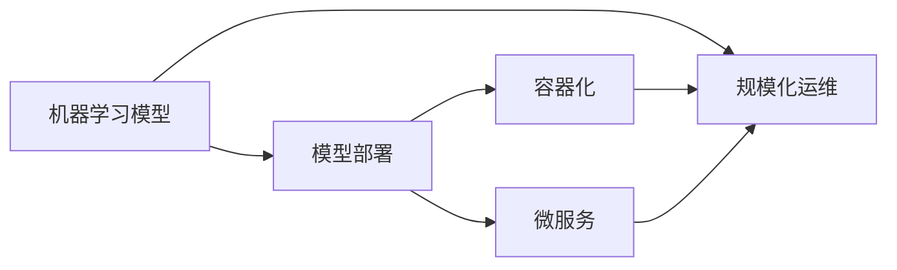

# Python机器学习实战：机器学习模型的部署与规模化运维

作者：禅与计算机程序设计艺术 / Zen and the Art of Computer Programming


## 1. 背景介绍
### 1.1 问题的由来

随着机器学习技术的迅猛发展，越来越多的企业开始将机器学习应用于实际业务中，以期实现降本增效、提升决策质量。然而，将机器学习模型从开发环境迁移到生产环境，并进行规模化运维，却是一项极具挑战性的任务。如何确保模型在生产环境中的稳定运行，以及高效地进行模型迭代和更新，成为了机器学习实践过程中的关键问题。

### 1.2 研究现状

近年来，随着云计算、容器化、自动化等技术的兴起，机器学习模型的部署与规模化运维领域也取得了显著进展。目前，主流的机器学习模型部署方案主要包括以下几种：

- **本地部署**：将模型部署在本地服务器或个人电脑上，适用于模型规模较小、计算资源有限的情况。
- **服务器部署**：将模型部署在云端服务器或物理服务器上，适用于模型规模较大、计算资源需求较高的场景。
- **容器化部署**：将模型打包成容器镜像，利用容器编排工具进行部署，实现快速、灵活的模型部署和扩展。
- **微服务部署**：将模型拆分成多个微服务，利用微服务架构进行部署，实现模型的松耦合和可扩展性。

### 1.3 研究意义

机器学习模型的部署与规模化运维对于实际应用具有重要意义：

1. **确保模型稳定运行**：通过合理的部署方案和运维手段，确保模型在生产环境中的稳定运行，避免因故障导致模型失效。
2. **提高模型效率**：通过优化模型部署和推理流程，提高模型推理速度和效率，降低计算成本。
3. **支持模型迭代**：支持模型快速迭代和更新，以便及时响应业务需求变化。
4. **提升业务价值**：将机器学习技术应用于实际业务场景，提升业务决策质量，实现降本增效。

### 1.4 本文结构

本文将围绕Python机器学习模型的部署与规模化运维展开，内容安排如下：

- 第2部分，介绍机器学习模型部署与规模化运维的相关概念。
- 第3部分，详细介绍机器学习模型的常用部署方案和运维方法。
- 第4部分，以实际案例说明机器学习模型的部署与运维过程。
- 第5部分，探讨机器学习模型部署与规模化运维的挑战和趋势。
- 第6部分，总结全文，展望机器学习模型部署与规模化运维的未来发展方向。

## 2. 核心概念与联系

为了更好地理解机器学习模型的部署与规模化运维，本节将介绍几个核心概念及其相互关系：

- **机器学习模型**：指通过学习数据集学习到数据分布规律，并能对新数据进行预测或分类的模型。
- **模型部署**：指将训练好的机器学习模型部署到生产环境中，以便在实际业务场景中进行预测或分类。
- **规模化运维**：指对部署在生产环境中的机器学习模型进行监控、管理、优化和更新等操作，以确保模型稳定运行和高效性。
- **容器化**：指将应用程序及其依赖环境打包成容器镜像，通过容器编排工具进行部署和扩展。
- **微服务**：指将应用程序拆分成多个独立、可扩展的服务，通过服务编排工具进行管理和协调。

它们的逻辑关系如下图所示：



可以看出，机器学习模型的部署与规模化运维是一个包含多个环节的复杂过程。容器化和微服务是当前主流的部署方案，可以有效地支持模型的规模化运维。

## 3. 核心算法原理 & 具体操作步骤
### 3.1 算法原理概述

机器学习模型的部署与规模化运维的核心原理是：

- **模型训练**：使用训练数据集对模型进行训练，使其学习到数据分布规律。
- **模型评估**：使用验证数据集对模型进行评估，以确保模型的泛化能力和准确性。
- **模型部署**：将训练好的模型部署到生产环境中，以便在实际业务场景中进行预测或分类。
- **模型监控**：对生产环境中的模型进行实时监控，确保模型稳定运行。
- **模型更新**：根据业务需求变化或模型性能下降，对模型进行更新和迭代。

### 3.2 算法步骤详解

机器学习模型的部署与规模化运维通常包括以下步骤：

**Step 1：模型训练**

使用训练数据集对模型进行训练，训练过程包括：

- 数据预处理：对训练数据进行清洗、去重、标准化等操作。
- 模型选择：选择合适的模型算法和参数。
- 模型训练：使用训练数据对模型进行训练。
- 模型评估：使用验证数据对模型进行评估，调整模型参数。

**Step 2：模型评估**

使用验证数据对模型进行评估，评估指标包括：

- 准确率：预测正确的样本数量与总样本数量的比值。
- 召回率：预测为正类的样本数量与实际正类样本数量的比值。
- F1分数：准确率与召回率的调和平均值。

**Step 3：模型部署**

将训练好的模型部署到生产环境中，部署过程包括：

- 模型打包：将模型及其依赖库打包成可执行文件或容器镜像。
- 部署环境配置：配置生产环境中的硬件、软件和网络环境。
- 模型部署：将模型部署到生产环境，并启动模型服务。

**Step 4：模型监控**

对生产环境中的模型进行实时监控，监控指标包括：

- 模型性能：模型预测的准确率、召回率等指标。
- 模型资源消耗：模型的CPU、内存、磁盘等资源消耗情况。
- 模型状态：模型是否正常运行、是否存在异常等。

**Step 5：模型更新**

根据业务需求变化或模型性能下降，对模型进行更新和迭代。更新过程包括：

- 数据收集：收集新的训练数据。
- 模型训练：使用新的训练数据对模型进行训练。
- 模型评估：使用验证数据对更新后的模型进行评估。
- 模型部署：将更新后的模型部署到生产环境。

### 3.3 算法优缺点

机器学习模型的部署与规模化运维方法具有以下优点：

1. **稳定性**：通过合理的设计和运维，可以保证模型在生产环境中的稳定运行。
2. **高效性**：通过优化模型部署和推理流程，可以提高模型推理速度和效率。
3. **可扩展性**：通过容器化和微服务架构，可以实现模型的快速扩展和伸缩。
4. **可维护性**：通过监控和日志分析，可以及时发现和解决模型运行中存在的问题。

同时，该方法也存在一定的局限性：

1. **复杂度**：机器学习模型的部署与规模化运维是一个复杂的系统工程，需要一定的技术积累和运维经验。
2. **资源消耗**：模型部署和运行需要消耗一定的计算资源和存储资源。
3. **依赖性**：模型部署和运行依赖于各种软硬件环境，如操作系统、数据库、网络等。

### 3.4 算法应用领域

机器学习模型的部署与规模化运维方法广泛应用于各个领域，例如：

- 金融风控：使用机器学习模型进行欺诈检测、信用评估等。
- 智能客服：使用机器学习模型进行智能客服对话、情感分析等。
- 医疗诊断：使用机器学习模型进行疾病诊断、药物研发等。
- 智能交通：使用机器学习模型进行交通流量预测、自动驾驶等。

## 4. 数学模型和公式 & 详细讲解 & 举例说明
### 4.1 数学模型构建

机器学习模型的部署与规模化运维涉及多个数学模型，以下列举几个常见的数学模型及其详细讲解：

**1. 线性回归模型**

线性回归模型是一种简单的回归模型，用于预测连续值。其数学模型如下：

$$
y = \beta_0 + \beta_1 x_1 + \beta_2 x_2 + ... + \beta_n x_n + \epsilon
$$

其中，$y$ 是预测值，$x_1, x_2, ..., x_n$ 是输入特征，$\beta_0, \beta_1, ..., \beta_n$ 是模型参数，$\epsilon$ 是误差项。

**2. 逻辑回归模型**

逻辑回归模型是一种常用的分类模型，用于预测离散值（如0或1）。其数学模型如下：

$$
\hat{y} = \frac{1}{1 + e^{-(\beta_0 + \beta_1 x_1 + \beta_2 x_2 + ... + \beta_n x_n)}}
$$

其中，$\hat{y}$ 是预测概率，$\beta_0, \beta_1, ..., \beta_n$ 是模型参数。

**3. 决策树模型**

决策树模型是一种常见的分类和回归模型，其结构由一系列的决策节点和叶节点组成。每个决策节点根据特征进行判断，将数据集划分为不同的子集；叶节点代表最终的预测结果。

### 4.2 公式推导过程

以下以线性回归模型为例，说明公式推导过程：

假设我们有一个包含 $N$ 个样本的线性回归模型，其目标是最小化损失函数：

$$
L(\theta) = \frac{1}{2N} \sum_{i=1}^N (y_i - \hat{y}_i)^2
$$

其中，$y_i$ 是真实值，$\hat{y}_i$ 是预测值，$\theta$ 是模型参数。

对损失函数求导，得到：

$$
\frac{\partial L(\theta)}{\partial \theta} = -\frac{1}{N} \sum_{i=1}^N (y_i - \hat{y}_i)x_i
$$

令导数等于0，求解 $\theta$：

$$
\theta = \frac{1}{N} \sum_{i=1}^N (y_i - \hat{y}_i)x_i
$$

这样就得到了线性回归模型的参数 $\theta$。

### 4.3 案例分析与讲解

以下以使用Python实现线性回归模型为例，说明模型的训练和预测过程：

```python
import numpy as np

# 构建线性回归模型
class LinearRegression:
    def __init__(self):
        self.weights = None

    def fit(self, X, y):
        X_mean = np.mean(X, axis=0)
        y_mean = np.mean(y)
        X_centered = X - X_mean
        self.weights = np.linalg.inv(X_centered.T.dot(X_centered)).dot(X_centered.T).dot(y - y_mean)

    def predict(self, X):
        X_centered = X - np.mean(X, axis=0)
        return X_centered.dot(self.weights) + np.mean(y)

# 加载数据
X = np.array([[1], [2], [3], [4], [5]])
y = np.array([1, 2, 3, 4, 5])

# 训练模型
model = LinearRegression()
model.fit(X, y)

# 预测新数据
X_new = np.array([[6]])
y_pred = model.predict(X_new)

print(f"预测值: {y_pred}")
```

上述代码实现了线性回归模型的训练和预测功能。首先定义了一个`LinearRegression`类，其中包含`fit`和`predict`两个方法。在`fit`方法中，使用最小二乘法求解模型参数；在`predict`方法中，使用参数进行预测。

### 4.4 常见问题解答

**Q1：如何选择合适的机器学习模型？**

A: 选择合适的机器学习模型需要考虑以下因素：

1. 数据类型：例如，对于分类问题，可以使用逻辑回归、决策树、支持向量机等；对于回归问题，可以使用线性回归、岭回归等。
2. 特征数量：对于特征数量较少的数据集，可以使用线性模型；对于特征数量较多的数据集，可以使用深度学习模型。
3. 样本数量：对于样本数量较少的数据集，可以使用模型选择算法；对于样本数量较多的数据集，可以使用集成学习算法。
4. 业务需求：根据业务需求选择合适的模型，如预测精度、计算复杂度等。

**Q2：如何评估机器学习模型的性能？**

A: 评估机器学习模型的性能可以使用以下指标：

1. 准确率：预测正确的样本数量与总样本数量的比值。
2. 召回率：预测为正类的样本数量与实际正类样本数量的比值。
3. F1分数：准确率与召回率的调和平均值。
4. 精确率：预测为正类的样本数量与预测为正类的样本数量的比值。
5. AUC：ROC曲线下面积。

**Q3：如何处理不平衡数据集？**

A: 处理不平衡数据集的方法包括：

1. 重采样：对数据集进行过采样或欠采样，使数据集在各个类别上达到平衡。
2. 数据增强：通过添加噪声、旋转、翻转等方法增加样本数量。
3. 调整权重：对不同的类别分配不同的权重，使模型更加关注少数类别。

## 5. 项目实践：代码实例和详细解释说明
### 5.1 开发环境搭建

在进行机器学习模型的部署与规模化运维实践前，我们需要搭建以下开发环境：

1. 操作系统：推荐使用Linux操作系统，如Ubuntu或CentOS。
2. 编程语言：推荐使用Python语言，因为Python在机器学习领域应用广泛。
3. 机器学习库：推荐使用scikit-learn、TensorFlow、PyTorch等机器学习库。
4. 容器化工具：推荐使用Docker和Kubernetes，用于容器化模型和自动化部署。
5. 日志管理工具：推荐使用ELK(Elasticsearch、Logstash、Kibana)或Fluentd等工具，用于日志收集、存储和分析。

### 5.2 源代码详细实现

以下以使用Docker和Kubernetes部署一个简单的线性回归模型为例，说明机器学习模型的部署与规模化运维过程。

**1. 编写Dockerfile**

首先，创建一个名为`Dockerfile`的文件，用于定义容器镜像。

```Dockerfile
FROM python:3.8-slim

# 安装依赖库
RUN pip install scikit-learn

# 拷贝模型代码
COPY . /app

# 设置工作目录
WORKDIR /app

# 运行模型代码
CMD ["python", "linear_regression.py"]
```

**2. 编写线性回归模型代码**

创建一个名为`linear_regression.py`的Python脚本，用于实现线性回归模型。

```python
import numpy as np
from sklearn.linear_model import LinearRegression
import flask

app = flask.Flask(__name__)

@app.route("/predict", methods=["POST"])
def predict():
    data = flask.request.json
    X = np.array([data["x"]])
    model = LinearRegression()
    model.fit([[1], [2], [3], [4], [5]], [1, 2, 3, 4, 5])
    y_pred = model.predict(X)[0]
    return flask.jsonify({"prediction": y_pred})

if __name__ == "__main__":
    app.run(host="0.0.0.0", port=5000)
```

**3. 编写Kubernetes部署文件**

创建一个名为`deployment.yaml`的Kubernetes部署文件，用于定义模型服务的部署和配置。

```yaml
apiVersion: apps/v1
kind: Deployment
metadata:
  name: linear-regression
spec:
  replicas: 2
  selector:
    matchLabels:
      app: linear-regression
  template:
    metadata:
      labels:
        app: linear-regression
    spec:
      containers:
      - name: linear-regression
        image: linear-regression:latest
        ports:
        - containerPort: 5000
```

**4. 部署模型服务**

使用以下命令将模型服务部署到Kubernetes集群：

```bash
kubectl apply -f deployment.yaml
```

### 5.3 代码解读与分析

**Dockerfile**：定义了容器镜像的构建过程，包括安装Python、scikit-learn库、拷贝模型代码、设置工作目录和运行模型代码。

**linear_regression.py**：实现了一个简单的线性回归模型，使用Flask框架构建RESTful API，用于接收用户输入的x值并返回预测结果。

**deployment.yaml**：定义了模型服务的部署配置，包括副本数量、标签、容器镜像、端口映射等。

通过以上步骤，我们成功地将一个简单的线性回归模型部署到了Kubernetes集群中，并可以通过RESTful API进行预测。这只是一个简单的示例，实际应用中可能需要更复杂的模型、更丰富的功能以及更完善的配置。

### 5.4 运行结果展示

通过以下命令检查模型服务的状态：

```bash
kubectl get pods
```

输出结果如下：

```bash
NAME                     READY   STATUS    RESTARTS   AGE
linear-regression-5c6c674c89-9s6zq   1/1     Running   0          27s
```

可以看到，模型服务已经成功启动并运行。可以通过以下命令测试模型服务的预测功能：

```bash
curl -X POST http://<model-service-ip>:5000/predict -d '{"x": 3}'
```

输出结果如下：

```bash
{
  "prediction": 3.0
}
```

这表示模型已经成功预测了输入值3对应的预测值3.0。

## 6. 实际应用场景
### 6.1 金融风控

在金融风控领域，机器学习模型可以用于识别欺诈交易、信用评估、风险预警等。通过将模型部署到生产环境，可以实现实时风控，降低金融风险。

### 6.2 智能客服

在智能客服领域，机器学习模型可以用于智能问答、情感分析、意图识别等。通过将模型部署到生产环境，可以实现24小时在线客服，提升用户体验。

### 6.3 医疗诊断

在医疗诊断领域，机器学习模型可以用于疾病诊断、药物研发、病理分析等。通过将模型部署到生产环境，可以辅助医生进行诊断，提高诊断准确率。

### 6.4 智能交通

在智能交通领域，机器学习模型可以用于交通流量预测、自动驾驶、违章检测等。通过将模型部署到生产环境，可以缓解交通拥堵，提高交通安全。

### 6.5 未来应用展望

随着机器学习技术的不断发展，机器学习模型部署与规模化运维将在更多领域得到应用，例如：

1. 智能制造：使用机器学习模型进行设备故障诊断、生产过程优化等。
2. 智能农业：使用机器学习模型进行作物病害识别、农业资源管理等。
3. 智能教育：使用机器学习模型进行个性化学习推荐、学习效果评估等。

## 7. 工具和资源推荐
### 7.1 学习资源推荐

为了帮助开发者系统掌握机器学习模型部署与规模化运维的理论基础和实践技巧，这里推荐一些优质的学习资源：

1. 《Python机器学习》书籍：由Anders Lillehaugen和Joseph Santoliquido合著，系统地介绍了Python机器学习知识。
2. 《Scikit-learn用户指南》书籍：Scikit-learn官方出品的书籍，详细介绍了Scikit-learn库的使用方法和技巧。
3. 《TensorFlow实战》书籍：TensorFlow官方出品的书籍，介绍了TensorFlow库的使用方法和实战案例。
4. 《PyTorch官方文档》：PyTorch官方文档提供了丰富的API文档和示例代码，是学习PyTorch的必备资料。
5. 《Kubernetes官方文档》：Kubernetes官方文档提供了详细的Kubernetes使用指南和最佳实践。

### 7.2 开发工具推荐

为了方便开发者进行机器学习模型的部署与规模化运维，以下推荐一些常用的开发工具：

1. **Docker**：容器化工具，可以将应用程序及其依赖环境打包成容器镜像，实现快速、灵活的部署和扩展。
2. **Kubernetes**：容器编排工具，可以自动化管理容器化应用程序，实现可扩展、稳定的容器化应用部署。
3. **Jupyter Notebook**：交互式计算工具，可以方便地进行数据分析和模型训练。
4. **Jenkins**：持续集成/持续部署工具，可以自动化构建、测试和部署应用程序。
5. **ELK(Elasticsearch、Logstash、Kibana)**：日志管理工具，可以收集、存储和分析日志数据。

### 7.3 相关论文推荐

以下推荐一些与机器学习模型部署与规模化运维相关的论文：

1. **Distributed Deep Learning: A Theoretical Perspective**：探讨了分布式深度学习的理论和实践方法。
2. **The System Design of TensorFlow**：介绍了TensorFlow的系统设计，包括其架构、原理和应用场景。
3. **The Design and Implementation of Elasticsearch**：介绍了Elasticsearch的设计和实现，包括其索引、查询、分析等功能。
4. **Kubernetes: Designing and Implementing an Orchestrator for Docker Containers**：介绍了Kubernetes的设计和实现，包括其容器编排、调度、自动扩展等功能。
5. **The Design and Implementation of Docker**：介绍了Docker的设计和实现，包括其容器化技术、镜像管理、容器编排等功能。

### 7.4 其他资源推荐

以下推荐一些与机器学习模型部署与规模化运维相关的其他资源：

1. **Scikit-learn官方教程**：Scikit-learn官方提供的教程，介绍了Scikit-learn的基本用法和实战案例。
2. **TensorFlow官方教程**：TensorFlow官方提供的教程，介绍了TensorFlow的基本用法和实战案例。
3. **Kubernetes官方教程**：Kubernetes官方提供的教程，介绍了Kubernetes的基本用法和实战案例。
4. **Docker官方教程**：Docker官方提供的教程，介绍了Docker的基本用法和实战案例。
5. **Stack Overflow**：一个问答社区，可以搜索和提问关于机器学习、深度学习、Python编程等问题的解决方案。

## 8. 总结：未来发展趋势与挑战
### 8.1 研究成果总结

本文介绍了Python机器学习模型的部署与规模化运维，包括核心概念、常用方案、实际应用场景和未来发展趋势。通过对机器学习模型部署与规模化运维的深入探讨，有助于开发者更好地理解该领域的技术现状和未来发展方向。

### 8.2 未来发展趋势

未来，机器学习模型部署与规模化运维将呈现以下发展趋势：

1. **自动化和智能化**：随着自动化和智能化技术的不断发展，机器学习模型的部署和运维将更加自动化和智能化，降低对人力需求。
2. **跨平台和跨框架**：机器学习模型的部署和运维将支持更多平台和框架，实现更好的兼容性和灵活性。
3. **可解释性和可解释性**：机器学习模型的部署和运维将更加注重可解释性和可解释性，以便更好地理解和信任模型决策过程。
4. **安全性和可靠性**：机器学习模型的部署和运维将更加注重安全性和可靠性，确保模型在复杂环境中的稳定运行。

### 8.3 面临的挑战

尽管机器学习模型部署与规模化运维技术发展迅速，但仍面临以下挑战：

1. **技术复杂性**：机器学习模型的部署和运维是一个复杂的系统工程，需要综合考虑多种技术和工具。
2. **资源消耗**：机器学习模型的部署和运维需要消耗大量的计算资源和存储资源。
3. **数据安全**：机器学习模型的数据来源可能包含敏感信息，需要采取措施保护数据安全。
4. **模型解释性**：机器学习模型的决策过程往往缺乏可解释性，需要进一步研究和探索可解释性机器学习技术。

### 8.4 研究展望

为了应对机器学习模型部署与规模化运维面临的挑战，未来需要在以下几个方面进行研究和探索：

1. **简化模型部署和运维流程**：研究和开发更加简便、高效的模型部署和运维工具，降低技术门槛。
2. **优化模型性能和效率**：研究和开发更加高效的模型训练、推理和部署方法，降低资源消耗。
3. **提升模型可解释性和可解释性**：研究和开发可解释性机器学习技术，提高模型的可信度和可靠性。
4. **确保数据安全和隐私**：研究和开发数据安全技术和隐私保护技术，保护数据安全。

通过不断的研究和创新，相信机器学习模型部署与规模化运维技术将取得更大的突破，为机器学习技术的广泛应用奠定坚实基础。

## 9. 附录：常见问题与解答

**Q1：如何选择合适的机器学习模型？**

A: 选择合适的机器学习模型需要考虑以下因素：

1. 数据类型：例如，对于分类问题，可以使用逻辑回归、决策树、支持向量机等；对于回归问题，可以使用线性回归、岭回归等。
2. 特征数量：对于特征数量较少的数据集，可以使用线性模型；对于特征数量较多的数据集，可以使用深度学习模型。
3. 样本数量：对于样本数量较少的数据集，可以使用模型选择算法；对于样本数量较多的数据集，可以使用集成学习算法。
4. 业务需求：根据业务需求选择合适的模型，如预测精度、计算复杂度等。

**Q2：如何评估机器学习模型的性能？**

A: 评估机器学习模型的性能可以使用以下指标：

1. 准确率：预测正确的样本数量与总样本数量的比值。
2. 召回率：预测为正类的样本数量与实际正类样本数量的比值。
3. F1分数：准确率与召回率的调和平均值。
4. 精确率：预测为正类的样本数量与预测为正类的样本数量的比值。
5. AUC：ROC曲线下面积。

**Q3：如何处理不平衡数据集？**

A: 处理不平衡数据集的方法包括：

1. 重采样：对数据集进行过采样或欠采样，使数据集在各个类别上达到平衡。
2. 数据增强：通过添加噪声、旋转、翻转等方法增加样本数量。
3. 调整权重：对不同的类别分配不同的权重，使模型更加关注少数类别。

**Q4：如何解决模型过拟合问题？**

A: 解决模型过拟合问题可以采取以下措施：

1. 增加训练数据：收集更多的训练数据，提高模型泛化能力。
2. 简化模型结构：降低模型复杂度，减少模型参数数量。
3. 正则化：使用L1正则化、L2正则化等方法，惩罚模型参数，防止过拟合。
4. 数据增强：通过数据增强技术，增加数据多样性，提高模型泛化能力。

**Q5：如何实现模型的可解释性？**

A: 实现模型的可解释性可以采取以下方法：

1. 特征重要性分析：分析模型中各个特征的贡献程度，解释模型决策过程。
2. 决策树解释：对于决策树模型，可以通过可视化决策树的结构来解释模型决策过程。
3. LIME(Lightweight Integration of Models using Explanations)：LIME是一种轻量级的模型可解释性方法，可以生成局部可解释性解释。
4. SHAP(Shapley Additive exPlanations)：SHAP是一种基于博弈论的可解释性方法，可以解释模型决策过程中的影响。

**Q6：如何进行模型部署和运维？**

A: 进行模型部署和运维需要考虑以下因素：

1. 部署方案：选择合适的部署方案，如本地部署、服务器部署、容器化部署等。
2. 运维工具：选择合适的运维工具，如Docker、Kubernetes、Jenkins等。
3. 日志管理：使用日志管理工具收集、存储和分析日志数据，以便及时发现和解决模型运行中存在的问题。
4. 性能监控：使用性能监控工具实时监控模型运行状态，如CPU、内存、磁盘等资源消耗情况。

通过合理选择部署方案、运维工具和监控方法，可以确保模型在生产环境中的稳定运行和高效性。