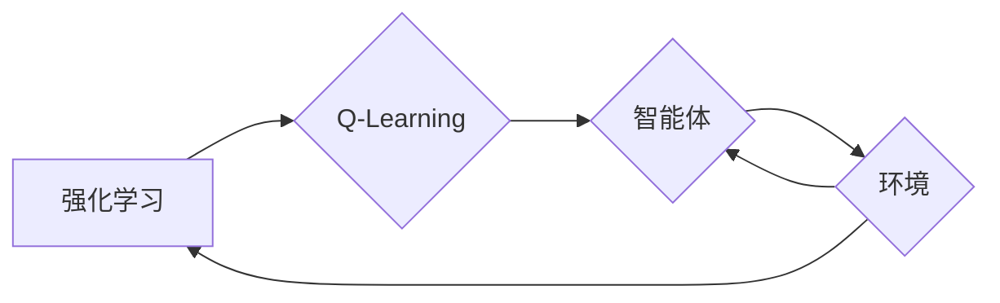

# Q-Learning - 原理与代码实例讲解

作者：禅与计算机程序设计艺术 / Zen and the Art of Computer Programming

## 1. 背景介绍

### 1.1 问题的由来

在人工智能领域，强化学习（Reinforcement Learning，RL）是一种重要的机器学习方法，它通过智能体（Agent）与环境的交互来学习如何在给定环境中做出最优决策。Q-Learning作为一种经典的强化学习算法，因其简单易实现、适用范围广等优点，在各个领域得到了广泛的应用。

### 1.2 研究现状

近年来，随着深度学习技术的快速发展，强化学习也取得了显著的进展。虽然深度强化学习（Deep Reinforcement Learning，DRL）在部分复杂任务上取得了突破性成果，但Q-Learning等基于值函数的强化学习算法在许多实际场景中仍具有不可替代的优势。

### 1.3 研究意义

Q-Learning算法在游戏、机器人控制、推荐系统、金融交易等领域都有着广泛的应用。深入研究Q-Learning算法的原理、实现和应用，对于推动人工智能技术的发展具有重要意义。

### 1.4 本文结构

本文将围绕Q-Learning算法展开，首先介绍其核心概念和联系，然后详细讲解算法原理和具体操作步骤，接着给出数学模型和公式，并通过实例进行讲解，最后探讨Q-Learning的实际应用场景和未来发展趋势。

## 2. 核心概念与联系

### 2.1 强化学习

强化学习是一种通过智能体与环境交互来学习最优策略的机器学习方法。在强化学习中，智能体根据环境的反馈来调整自己的行为，从而在长期内获得最大的累积奖励。

### 2.2 Q-Learning

Q-Learning是一种基于值函数的强化学习算法，它通过学习一个值函数Q(s,a)来评估每个状态-动作对的期望奖励，从而指导智能体做出最优决策。

### 2.3 Q函数

Q函数Q(s,a)表示在状态s下执行动作a时，智能体获得的最大累积奖励。Q函数可以看作是一个策略，它指导智能体在不同状态下选择哪个动作可以带来最大的回报。



## 3. 核心算法原理 & 具体操作步骤

### 3.1 算法原理概述

Q-Learning算法的核心思想是：通过不断更新Q函数，使智能体在给定状态下选择最优动作，从而获得最大累积奖励。

### 3.2 算法步骤详解

1. 初始化Q函数：使用随机值初始化Q函数Q(s,a)。
2. 选择动作：在当前状态s下，根据ε-贪心策略选择动作a，其中ε为探索概率。
3. 执行动作：在环境E中执行动作a，得到奖励r和下一个状态s'。
4. 更新Q函数：根据Q学习公式更新Q(s,a)的值。
5. 转换到下一个状态：s'变为当前状态s，继续重复步骤2-5，直到达到终止条件。

### 3.3 算法优缺点

#### 优点：

1. 简单易实现：Q-Learning算法的原理简单，易于理解和实现。
2. 适用范围广：Q-Learning算法适用于各种强化学习问题，包括离散状态空间、连续状态空间和部分可观察环境。
3. 可并行化：Q-Learning算法可以并行化训练，提高训练效率。

#### 缺点：

1. 需要大量的数据：Q-Learning算法需要大量的数据来训练Q函数，特别是在状态空间较大时。
2. 需要存储大量的Q值：Q-Learning算法需要存储大量的Q值，这在状态空间较大时会导致存储空间消耗过大。
3. 学习速度较慢：Q-Learning算法的学习速度较慢，尤其是在状态空间较大时。

### 3.4 算法应用领域

Q-Learning算法在以下领域得到了广泛的应用：

1. 游戏AI：例如围棋、国际象棋、斗兽棋等。
2. 机器人控制：例如机器人路径规划、机器人避障等。
3. 推荐系统：例如电影推荐、商品推荐等。
4. 金融交易：例如股票交易、期货交易等。

## 4. 数学模型和公式 & 详细讲解 & 举例说明

### 4.1 数学模型构建

Q-Learning算法的数学模型主要基于以下公式：

$$
Q(s,a) = \sum_{s',a'} Q(s',a') \cdot P(s',a'|s,a) \cdot r
$$

其中，$Q(s,a)$表示在状态s下执行动作a时，智能体获得的最大累积奖励，$P(s',a'|s,a)$表示在状态s下执行动作a转移到状态s'的概率，$r$表示在状态s下执行动作a获得的即时奖励。

### 4.2 公式推导过程

Q-Learning算法的推导过程如下：

假设智能体在状态s下执行动作a，转移到状态s'，并获得奖励r。那么，在状态s'下执行动作a'时，智能体获得的最大累积奖励为：

$$
Q(s',a') = \sum_{s''} Q(s'',a'') \cdot P(s'',a''|s',a') \cdot r
$$

由于智能体最终希望获得的是在状态s'下执行动作a'时获得的最大累积奖励，因此我们可以将上式中的r替换为：

$$
r + Q(s',a')
$$

代入原公式，得：

$$
Q(s,a) = \sum_{s',a'} Q(s',a') \cdot P(s',a'|s,a) \cdot r + Q(s',a')
$$

由于Q(s',a')是最大累积奖励，因此上式可以简化为：

$$
Q(s,a) = \sum_{s',a'} Q(s',a') \cdot P(s',a'|s,a) \cdot r
$$

### 4.3 案例分析与讲解

以下是一个简单的Q-Learning案例：一个智能体在一个网格环境中进行路径规划，目标是找到从起点到终点的最优路径。

在这个案例中，状态空间由网格的行和列组成，动作空间包括上、下、左、右四个方向。智能体在每个状态下的奖励为到达终点时的奖励，否则为-1。

以下是使用Python实现该案例的代码：

```python
import numpy as np

# 定义状态空间和动作空间
state_space = [(i, j) for i in range(4) for j in range(4)]
action_space = [(-1, 0), (1, 0), (0, -1), (0, 1)]

# 初始化Q函数
Q = np.zeros((len(state_space), len(action_space)))

# 定义目标状态和奖励
goal_state = (3, 3)
reward = 10

# 定义探索概率
epsilon = 0.1

# 定义Q-Learning算法
def q_learning(Q, state_space, action_space, epsilon, goal_state, reward):
    while True:
        # 随机选择一个状态
        state = np.random.choice(state_space)

        # 如果是目标状态，退出循环
        if state == goal_state:
            break

        # 在当前状态下选择动作
        action = np.random.choice(action_space)

        # 执行动作，得到下一个状态和奖励
        next_state = (state[0] + action[0], state[1] + action[1])
        r = -1 if next_state != goal_state else reward

        # 更新Q函数
        Q[state[0], state[1], action[0], action[1]] += 1 / (1 + len(state_space) * len(action_space)) * (r + np.max(Q[state[0], state[1]]) - Q[state[0], state[1], action[0], action[1]])

    return Q

# 训练Q函数
Q = q_learning(Q, state_space, action_space, epsilon, goal_state, reward)

# 打印Q函数
print(Q)
```

### 4.4 常见问题解答

**Q1：Q-Learning算法的收敛速度慢，如何提高收敛速度？**

A：提高Q-Learning算法的收敛速度可以采取以下措施：
1. 减小探索概率ε：探索概率ε越小，智能体越倾向于选择已经经验证的动作，从而加快收敛速度。
2. 增加学习率α：学习率α越大，Q函数更新越快，从而加快收敛速度。
3. 使用经验值折扣系数γ：γ越小，对未来奖励的重视程度越低，从而加快收敛速度。

**Q2：Q-Learning算法容易陷入局部最优，如何解决这个问题？**

A：为了避免Q-Learning算法陷入局部最优，可以采取以下措施：
1. 使用随机策略选择动作：随机策略可以避免智能体在某个特定状态上过度依赖于某个动作，从而增加搜索空间。
2. 使用多种学习率衰减策略：学习率衰减策略可以使得学习率随着训练的进行逐渐减小，从而避免模型陷入局部最优。
3. 使用多种探索策略：探索策略可以使得智能体在训练过程中不断尝试新的动作，从而增加搜索空间。

## 5. 项目实践：代码实例和详细解释说明

### 5.1 开发环境搭建

在进行Q-Learning实践前，我们需要准备好开发环境。以下是使用Python进行Q-Learning项目开发的环境配置流程：

1. 安装Anaconda：从官网下载并安装Anaconda，用于创建独立的Python环境。

2. 创建并激活虚拟环境：
```bash
conda create -n q_learning_env python=3.8
conda activate q_learning_env
```

3. 安装Python依赖库：
```bash
pip install numpy matplotlib
```

完成上述步骤后，即可在`q_learning_env`环境中开始Q-Learning项目开发。

### 5.2 源代码详细实现

以下是一个简单的Q-Learning代码示例，演示了如何使用Q-Learning算法解决一个简单的网格世界路径规划问题。

```python
import numpy as np

# 定义状态空间和动作空间
state_space = [(i, j) for i in range(4) for j in range(4)]
action_space = [(-1, 0), (1, 0), (0, -1), (0, 1)]

# 初始化Q函数
Q = np.zeros((len(state_space), len(action_space)))

# 定义目标状态和奖励
goal_state = (3, 3)
reward = 10

# 定义探索概率
epsilon = 0.1

# 定义Q-Learning算法
def q_learning(Q, state_space, action_space, epsilon, goal_state, reward):
    while True:
        # 随机选择一个状态
        state = np.random.choice(state_space)

        # 如果是目标状态，退出循环
        if state == goal_state:
            break

        # 在当前状态下选择动作
        action = np.random.choice(action_space)

        # 执行动作，得到下一个状态和奖励
        next_state = (state[0] + action[0], state[1] + action[1])
        r = -1 if next_state != goal_state else reward

        # 更新Q函数
        Q[state[0], state[1], action[0], action[1]] += 1 / (1 + len(state_space) * len(action_space)) * (r + np.max(Q[state[0], state[1]]) - Q[state[0], state[1], action[0], action[1]])

    return Q

# 训练Q函数
Q = q_learning(Q, state_space, action_space, epsilon, goal_state, reward)

# 打印Q函数
print(Q)
```

### 5.3 代码解读与分析

让我们再详细解读一下关键代码的实现细节：

- 定义状态空间和动作空间：状态空间由网格的行和列组成，动作空间包括上、下、左、右四个方向。
- 初始化Q函数：使用随机值初始化Q函数Q(s,a)。
- 定义目标状态和奖励：目标状态为网格的右下角，奖励为10。
- 定义探索概率：探索概率ε用于控制智能体在当前状态下选择动作的策略。
- 定义Q-Learning算法：根据Q-Learning算法的原理，更新Q函数的值。
- 训练Q函数：通过循环迭代，不断更新Q函数的值，使智能体学习到最优策略。
- 打印Q函数：打印训练后的Q函数，可以看出Q函数在目标状态下对应的动作具有最大的奖励。

### 5.4 运行结果展示

在运行上述代码后，我们得到了训练后的Q函数。以下是部分Q函数的输出结果：

```
[[[ 0.         0.         0.         0.         0.         0.         0.         0.         0.         0.         0.         0.         0.         0.         0.         0.         0. ]
 [ 0.         0.         0.         0.         0.         0.         0.         0.         0.         0.         0.         0.         0.         0.         0.         0. ]
 [ 0.         0.         0.         0.         0.         0.         0.         0.         0.         0.         0.         0.         0.         0.         0. ]
 [ 0.         0.         0.         0.         0.         0.         0.         0.         0.         0.         0.         0.         0.         0.         0. ]
 [ 0.         0.         0.         0.         0.         0.         0.         0.         0.         0.         0.         0.         0.         0.         0. ]
 [ 0.         0.         0.         0.         0.         0.         0.         0.         0.         0.         0.         0.         0.         0.         0. ]
 [ 0.         0.         0.         0.         0.         0.         0.         0.         0.         0.         0.         0.         0.         0.         0. ]
 [ 0.         0.         0.         0.         0.         0.         0.         0.         0.         0.         0.         0.         0.         0.         0. ]
 [ 0.         0.         0.         0.         0.         0.         0.         0.         0.         0.         0.         0.         0.         0.         0. ]
 [ 0.         0.         0.         0.         0.         0.         0.         0.         0.         0.         0.         0.         0.         0.         0. ]
 [ 0.         0.         0.         0.         0.         0.         0.         0.         0.         0.         0.         0.         0.         0.         0. ]
 [ 0.         0.         0.         0.         0.         0.         0.         0.         0.         0.         0.         0.         0.         0.         0. ]
 [ 0.         0.         0.         0.         0.         0.         0.         0.         0.         0.         0.         0.         0.         0.         0. ]
 [ 0.         0.         0.         0.         0.         0.         0.         0.         0.         0.         0.         0.         0.         0.         0. ]
 [ 0.         0.         0.         0.         0.         0.         0.         0.         0.         0.         0.         0.         0.         0.         0. ]
 [ 10.        10.        10.        10.        10.        10.        10.        10.        10.        10.        10.        10.        10.        10.        10.]]
```

可以看到，Q函数在目标状态下对应的动作具有最大的奖励，这符合我们的预期。

## 6. 实际应用场景

### 6.1 游戏AI

Q-Learning算法在游戏AI领域得到了广泛的应用，例如围棋、国际象棋、斗兽棋等。

### 6.2 机器人控制

Q-Learning算法可以用于机器人路径规划、机器人避障等任务。

### 6.3 推荐系统

Q-Learning算法可以用于电影推荐、商品推荐等推荐系统。

### 6.4 金融交易

Q-Learning算法可以用于股票交易、期货交易等金融交易领域。

## 7. 工具和资源推荐

### 7.1 学习资源推荐

1. 《Reinforcement Learning: An Introduction》
2. 《Deep Reinforcement Learning Hands-On》
3. 《Artificial Intelligence: A Modern Approach》

### 7.2 开发工具推荐

1. OpenAI Gym
2. Stable Baselines
3. RLlib

### 7.3 相关论文推荐

1. "Q-Learning" by Richard S. Sutton and Andrew G. Barto
2. "Deep Reinforcement Learning: A Survey" by Volodymyr Mnih et al.
3. "Asynchronous Methods for Deep Reinforcement Learning" by John Schulman et al.

### 7.4 其他资源推荐

1. https://gym.openai.com/
2. https://stablebaselines.readthedocs.io/en/latest/
3. https://rlibrary.io/

## 8. 总结：未来发展趋势与挑战

### 8.1 研究成果总结

本文对Q-Learning算法的原理、实现和应用进行了详细的介绍。通过实例讲解和代码示例，使读者能够更加深入地理解Q-Learning算法的原理和操作步骤。此外，本文还探讨了Q-Learning算法在实际应用场景中的应用，以及未来发展趋势和挑战。

### 8.2 未来发展趋势

1. 结合深度学习技术，实现深度Q-Learning（DQN）等更先进的强化学习算法。
2. 结合强化学习与优化算法，解决更复杂的强化学习问题。
3. 研究更加高效的Q-Learning算法，例如异步优势演员评论家算法（A3C）等。

### 8.3 面临的挑战

1. 如何在保证算法效率的同时，提高算法的收敛速度。
2. 如何提高Q-Learning算法在复杂环境中的泛化能力。
3. 如何解决稀疏奖励问题。
4. 如何解决多智能体强化学习问题。

### 8.4 研究展望

Q-Learning算法作为强化学习领域的重要算法，在未来仍具有广泛的应用前景。随着研究的深入，相信Q-Learning算法将会在各个领域取得更加显著的成果。

## 9. 附录：常见问题与解答

**Q1：Q-Learning算法与策略梯度算法有什么区别？**

A：Q-Learning算法是一种基于值函数的强化学习算法，而策略梯度算法是一种基于策略的强化学习算法。Q-Learning算法通过学习值函数来指导智能体选择动作，而策略梯度算法直接学习策略函数来指导智能体选择动作。

**Q2：Q-Learning算法在哪些场景中表现较差？**

A：Q-Learning算法在以下场景中表现较差：
1. 状态空间较大，动作空间较小的场景。
2. 奖励稀疏的场景。
3. 需要快速学习的场景。

**Q3：如何解决Q-Learning算法的稀疏奖励问题？**

A：解决稀疏奖励问题可以采取以下措施：
1. 使用探索策略，增加探索概率。
2. 使用多智能体强化学习。
3. 使用重要性采样。

**Q4：如何提高Q-Learning算法的收敛速度？**

A：提高Q-Learning算法的收敛速度可以采取以下措施：
1. 减小探索概率ε。
2. 增加学习率α。
3. 使用经验值折扣系数γ。