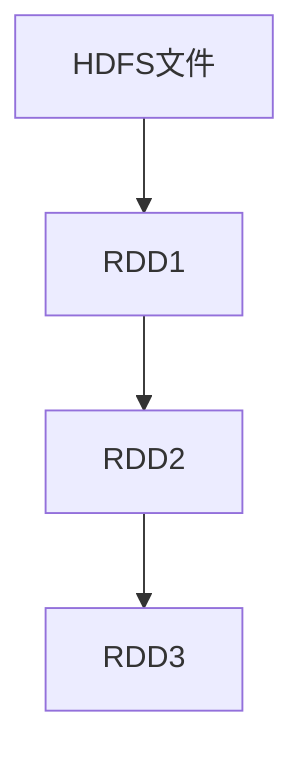
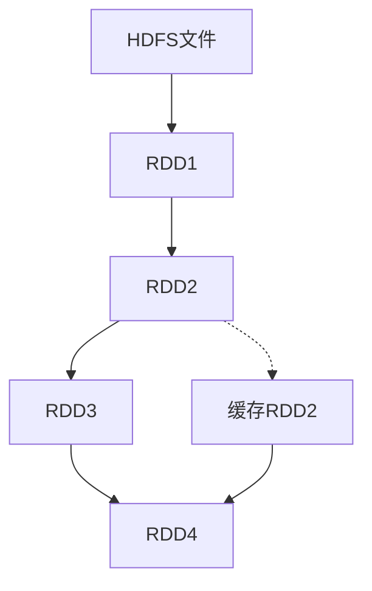

# RDD 原理与代码实例讲解

## 1. 背景介绍

### 1.1 问题的由来

在大数据时代，海量的数据已经成为了企业和组织的宝贵资源。然而，传统的数据处理方式往往无法满足大数据场景下的需求,例如处理速度慢、可扩展性差等。为了解决这些问题,Apache Spark 应运而生。作为一种快速、通用的大数据处理引擎,Spark 提供了多种高级API,其中 RDD (Resilient Distributed Dataset) 是 Spark 最核心的数据结构。

### 1.2 研究现状

RDD 最初由加州大学伯克利分校 AMPLab 提出,旨在支持迭代式计算和内存计算。自 2012 年发布以来,RDD 已成为 Spark 中最广泛使用的数据抽象,并在学术界和工业界得到了广泛的研究和应用。许多知名公司如 Netflix、Intel 和 Alibaba 等都在生产环境中使用 RDD。

### 1.3 研究意义

RDD 的引入为大数据处理带来了革命性的变化。它提供了一种高效、容错的数据处理方式,能够极大地提高计算性能和资源利用率。深入理解 RDD 的原理和实现对于开发高性能的大数据应用程序至关重要。本文将全面探讨 RDD 的核心概念、算法原理、数学模型、代码实现和实际应用,为读者提供一个系统的学习和参考资源。

### 1.4 本文结构

本文将分为以下几个部分:

1. 背景介绍
2. RDD 核心概念与联系
3. RDD 核心算法原理与具体操作步骤
4. RDD 数学模型和公式详细讲解与案例分析
5. RDD 项目实践:代码实例和详细解释
6. RDD 实际应用场景
7. RDD 相关工具和资源推荐
8. 总结:RDD 未来发展趋势与挑战
9. 附录:RDD 常见问题与解答

## 2. 核心概念与联系

在深入探讨 RDD 的细节之前,我们需要先了解一些核心概念和它们之间的联系。

### 2.1 RDD

RDD(Resilient Distributed Dataset)是 Spark 中最基本的数据抽象,它是一个不可变、分区的记录集合。RDD 可以从诸如HDFS、HBase等外部存储系统创建,也可以通过现有RDD转换而来。

RDD 具有以下几个关键特性:

- **不可变性(Immutable)**: 一旦RDD被创建,它就不能被修改。任何转换操作都会产生一个新的RDD。
- **分区(Partitioned)**: RDD被逻辑划分为多个分区,这些分区可以在集群的不同节点上并行计算。
- **容错(Fault-Tolerant)**: 由于RDD是不可变的,Spark可以通过重新计算丢失的分区来实现容错。
- **延迟计算(Lazy Evaluation)**: 转换操作只是记录应用于基础数据的操作,不会立即执行。只有遇到动作操作时,才会触发实际的计算。

### 2.2 RDD 的血统(Lineage)

RDD 的血统描述了如何从其他数据集(如文件或其他RDD)重新计算出该RDD的分区。Spark 通过记录这些血统关系来实现容错,当某个分区数据丢失时,可以根据血统重新计算该分区。

在上图中,`RDD3`的血统包括从`HDFS`文件创建`RDD1`,然后对`RDD1`应用某些转换得到`RDD2`,最后再对`RDD2`应用转换得到`RDD3`。如果`RDD3`的某个分区丢失,Spark 可以回溯这个血统,重新计算出丢失的分区。

### 2.3 RDD 的依赖关系

RDD 之间存在两种依赖关系:窄依赖(Narrow Dependency)和宽依赖(Wide Dependency)。

- **窄依赖**: 每个父RDD的分区最多被子RDD的一个分区使用。例如`map`和`filter`操作就会产生窄依赖。
- **宽依赖**: 每个父RDD的分区可能被子RDD的多个分区使用。例如`groupByKey`和`reduceByKey`操作会产生宽依赖。

依赖关系的类型会影响 RDD 的计算方式。窄依赖允许通过管道化(pipelining)的方式进行计算,而宽依赖则需要通过洗牌(shuffle)操作来重新分区数据。

### 2.4 RDD 的缓存

为了提高迭代计算的性能,Spark 允许开发者将 RDD 缓存在内存或磁盘中。缓存后的 RDD 可以在后续的操作中重复使用,避免重复计算。

在上图中,`RDD2`被缓存在内存或磁盘中。当计算`RDD4`时,可以直接从缓存中读取`RDD2`,而不需要重新计算。

## 3. 核心算法原理 & 具体操作步骤

### 3.1 算法原理概述

RDD 的核心算法原理主要包括三个方面:分区(Partitioning)、计算(Computing)和容错(Fault Tolerance)。

1. **分区(Partitioning)**

RDD 被逻辑划分为多个分区,这些分区可以在集群的不同节点上并行计算。分区的方式取决于 RDD 的创建方式和转换操作。例如,从 HDFS 文件创建的 RDD 通常会按照文件块进行分区,而`map`操作会保留父 RDD 的分区方式。

2. **计算(Computing)**

RDD 的计算过程由一系列确定性操作(如`map`、`filter`、`join`等)组成。这些操作会根据 RDD 的依赖关系,按照有向无环图(DAG)的方式进行计算。Spark 会根据操作的类型(窄依赖或宽依赖)选择不同的计算策略,如管道化或洗牌。

3. **容错(Fault Tolerance)**

由于 RDD 是不可变的,Spark 可以通过重新计算丢失的分区来实现容错。当某个分区数据丢失时,Spark 会根据该分区的血统关系,从最初的数据源(如 HDFS 文件)重新计算出丢失的分区。

### 3.2 算法步骤详解

RDD 的计算过程可以分为以下几个步骤:

1. **创建 RDD**

RDD 可以从外部存储系统(如 HDFS、HBase 等)创建,也可以通过对现有 RDD 进行转换而来。创建 RDD 时需要指定分区方式和计算所需的函数。

2. **记录血统关系**

Spark 会记录 RDD 的血统关系,即该 RDD 是如何从其他数据集(如文件或其他 RDD)计算而来的。这个血统关系用于容错恢复。

3. **划分阶段(Stage)**

Spark 会根据 RDD 之间的依赖关系,将计算过程划分为多个阶段(Stage)。每个阶段由一个或多个任务(Task)组成,这些任务可以在集群的不同节点上并行执行。

4. **任务调度**

Spark 的任务调度器(Task Scheduler)会根据集群资源情况,将任务分发到不同的执行器(Executor)上执行。

5. **结果持久化**

计算完成后,结果 RDD 可以持久化到外部存储系统中,或者缓存在内存/磁盘中,以供后续计算使用。

6. **容错恢复**

如果在计算过程中发生故障导致某些分区数据丢失,Spark 会根据该分区的血统关系,从最初的数据源重新计算出丢失的分区。

### 3.3 算法优缺点

RDD 算法的优点包括:

- **容错性强**: 通过记录血统关系,可以在发生故障时重新计算丢失的分区,从而实现容错。
- **延迟计算**: 只有在需要计算结果时才会触发实际的计算,避免了不必要的计算开销。
- **内存计算**: RDD 可以缓存在内存中,提高了迭代计算的性能。
- **并行计算**: RDD 的分区可以在集群的不同节点上并行计算,提高了计算效率。

RDD 算法的缺点包括:

- **不支持增量计算**: 由于 RDD 是不可变的,每次转换操作都会产生一个新的 RDD,无法实现增量计算。
- **内存开销大**: 为了实现容错,Spark 需要维护 RDD 的血统关系,这会占用一定的内存空间。
- **不适合低延迟场景**: RDD 的计算过程需要经过多个阶段,不适合对延迟要求较高的场景。

### 3.4 算法应用领域

RDD 算法广泛应用于以下领域:

- **大数据处理**: RDD 是 Spark 处理大数据的核心数据结构,可用于各种大数据处理场景,如日志分析、推荐系统、机器学习等。
- **机器学习**: RDD 支持迭代式计算,非常适合机器学习算法的实现,如逻辑回归、梯度下降等。
- **图计算**: 通过将图数据建模为 RDD,可以使用 Spark 进行高效的图计算,如PageRank、连通分量等。
- **流式计算**: Spark Streaming 基于 RDD 实现了流式数据的实时处理,可用于实时日志分析、实时监控等场景。

## 4. 数学模型和公式 & 详细讲解 & 举例说明

### 4.1 数学模型构建

为了更好地理解 RDD 的工作原理,我们可以将其建模为一个有向无环图(DAG)。

在这个模型中,每个 RDD 表示为一个节点,而 RDD 之间的依赖关系表示为有向边。根据依赖关系的类型(窄依赖或宽依赖),边可以标记为不同的颜色或样式。

我们定义一个 RDD 的血统(Lineage)为从该 RDD 追溯到初始数据源(如 HDFS 文件)的路径。容错恢复过程就是根据这个血统关系,从初始数据源重新计算出丢失的分区。

此外,我们还可以将 RDD 的计算过程建模为一系列确定性操作(如 map、filter、join 等)的组合。这些操作根据 DAG 的拓扑结构按顺序执行。

让我们用数学符号对上述模型进行形式化描述:

- 设 $R = \{r_1, r_2, \dots, r_n\}$ 表示 RDD 的集合
- 对于任意 $r_i, r_j \in R$,如果 $r_j$ 依赖于 $r_i$,则存在一条有向边 $e_{ij}$ 从 $r_i$ 指向 $r_j$
- 边 $e_{ij}$ 的类型为:
  - 窄依赖(Narrow Dependency),如果每个 $r_i$ 的分区最多被 $r_j$ 的一个分区使用
  - 宽依赖(Wide Dependency),如果 $r_i$ 的分区可能被 $r_j$ 的多个分区使用
- 一个 RDD $r_i$ 的血统(Lineage)定义为一个路径 $p_i = (r_i, r_j, \dots, r_k)$,其中 $r_k$ 是初始数据源
- 容错恢复过程就是根据血统 $p_i$ 重新计算出 $r_i$ 的丢失分区

此外,我们还可以将 RDD 的计算过程建模为一系列确定性操作的组合:

- 设 $O = \{o_1, o_2, \dots, o_m\}$ 表示 RDD 支持的操作集合
- 对于任意 $r_i, r_j \in R$,如果 $r_j = o_k(r_i)$,则存在一条有向边 $e_{ij}$ 从 $r_i$ 指向 $r_j$,边的标签为 $o_k$
- 一个 RDD $r_i$ 的计算过程可以表示为一个操作序列 $s_i = (o_1, o_2, \