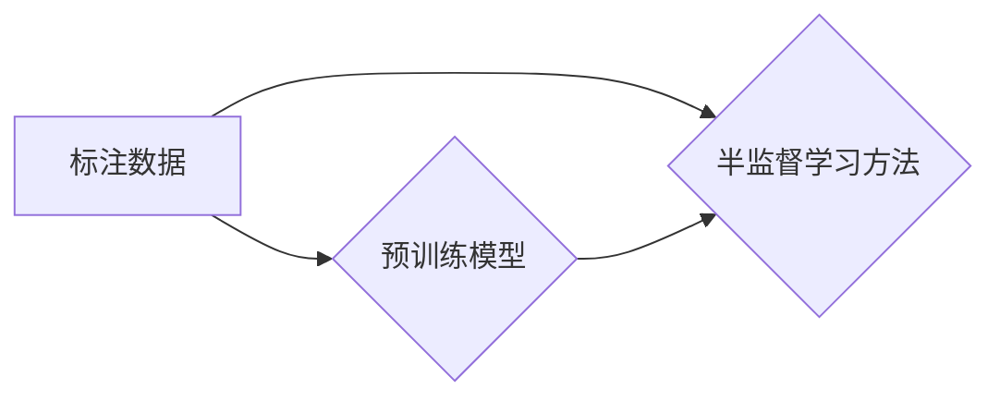

# Semi-supervised Learning原理与代码实例讲解

作者：禅与计算机程序设计艺术 / Zen and the Art of Computer Programming


## 1. 背景介绍

### 1.1 问题的由来

随着人工智能技术的快速发展，机器学习在各个领域都取得了显著的成果。然而，传统机器学习方法通常需要大量的标注数据来进行训练，这在实际应用中往往面临着以下问题：

1. **标注成本高**：人工标注数据需要大量的时间和人力，成本高昂。
2. **数据稀缺**：某些领域的数据量本身就较少，难以满足模型训练的需要。
3. **标注质量**：人工标注可能存在主观性，导致数据质量参差不齐。

为了解决上述问题，半监督学习（Semi-supervised Learning）应运而生。半监督学习利用少量标注数据和大量未标注数据来进行训练，从而降低标注成本、解决数据稀缺问题，并提高模型的泛化能力。

### 1.2 研究现状

近年来，半监督学习领域取得了显著的进展，涌现出许多经典的半监督学习方法，如：

1. **Co-Training**：将数据集划分为两个或多个子集，分别使用不同的分类器进行训练，然后通过子集间的投票进行预测。
2. **Label Propagation**：基于图结构，利用未标注数据与已标注数据之间的关系进行标签传播。
3. **Consistency Regularization**：通过约束模型对未标注数据的预测与对已标注数据的预测保持一致来提高模型性能。
4. **Adversarial Training**：通过对抗训练来增加模型对未标注数据的泛化能力。

### 1.3 研究意义

半监督学习具有以下重要意义：

1. **降低标注成本**：利用未标注数据进行训练，可以大大降低标注成本。
2. **提高模型泛化能力**：半监督学习可以帮助模型学习到更多潜在的特征，从而提高模型的泛化能力。
3. **扩展应用范围**：半监督学习可以应用于数据稀缺的领域，扩展机器学习的应用范围。

### 1.4 本文结构

本文将系统地介绍半监督学习的原理、算法、应用场景等，并给出具体的代码实例。

## 2. 核心概念与联系

为了更好地理解半监督学习，本节将介绍几个核心概念及其之间的关系。

### 2.1 标注数据与未标注数据

- **标注数据**：经过人工标注的数据，具有明确的标签。
- **未标注数据**：未经过人工标注的数据，没有明确的标签。

### 2.2 预训练模型

- **预训练模型**：在大规模未标注数据上进行预训练得到的模型，可以提取出丰富的特征。

### 2.3 半监督学习方法

- **Co-Training**：将数据集划分为两个或多个子集，分别使用不同的分类器进行训练，然后通过子集间的投票进行预测。
- **Label Propagation**：基于图结构，利用未标注数据与已标注数据之间的关系进行标签传播。
- **Consistency Regularization**：通过约束模型对未标注数据的预测与对已标注数据的预测保持一致来提高模型性能。
- **Adversarial Training**：通过对抗训练来增加模型对未标注数据的泛化能力。

### 2.4 逻辑关系

以下为标注数据、未标注数据、预训练模型和半监督学习方法之间的逻辑关系：



## 3. 核心算法原理 & 具体操作步骤

### 3.1 算法原理概述

半监督学习的基本思想是：利用未标注数据与已标注数据之间的关系，从未标注数据中学习到有用的信息，进而提高模型的性能。

### 3.2 算法步骤详解

半监督学习的具体步骤如下：

1. **数据预处理**：对标注数据和未标注数据进行预处理，包括数据清洗、数据增强等。
2. **特征提取**：使用预训练模型对标注数据和未标注数据进行特征提取。
3. **半监督学习**：根据选择的半监督学习方法，对特征进行训练和预测。
4. **模型评估**：使用测试集对模型进行评估，并根据评估结果调整模型参数。

### 3.3 算法优缺点

#### 3.3.1 优点

1. **降低标注成本**：利用未标注数据进行训练，可以大大降低标注成本。
2. **提高模型泛化能力**：半监督学习可以帮助模型学习到更多潜在的特征，从而提高模型的泛化能力。
3. **扩展应用范围**：半监督学习可以应用于数据稀缺的领域，扩展机器学习的应用范围。

#### 3.3.2 缺点

1. **模型性能**：半监督学习模型的性能通常低于全监督学习模型。
2. **可解释性**：半监督学习模型的决策过程通常难以解释。

### 3.4 算法应用领域

半监督学习可以应用于以下领域：

1. **文本分类**：对文本数据进行分析和分类。
2. **图像分类**：对图像数据进行分类。
3. **语音识别**：将语音信号转换为文本。
4. **推荐系统**：为用户推荐相关内容。

## 4. 数学模型和公式 & 详细讲解 & 举例说明

### 4.1 数学模型构建

半监督学习的数学模型可以表示为：

$$
\mathcal{L}(\theta) = \mathcal{L}(\theta)_{\text{标注数据}} + \lambda \mathcal{L}(\theta)_{\text{未标注数据}}
$$

其中，$\mathcal{L}(\theta)_{\text{标注数据}}$ 是在标注数据上计算得到的损失函数，$\mathcal{L}(\theta)_{\text{未标注数据}}$ 是在未标注数据上计算得到的损失函数，$\lambda$ 是未标注数据损失函数的权重。

### 4.2 公式推导过程

以Co-Training为例，其目标是最小化两个分类器之间的差异，并使分类器对标注数据的预测准确率尽可能高。

假设有两个分类器 $f_1$ 和 $f_2$，则Co-Training的损失函数可以表示为：

$$
\mathcal{L}(\theta) = \mathcal{L}(f_1) + \mathcal{L}(f_2) + \alpha \mathcal{L}(f_1, f_2)
$$

其中，$\mathcal{L}(f_1)$ 和 $\mathcal{L}(f_2)$ 分别是两个分类器在标注数据上的损失函数，$\alpha$ 是两个分类器差异的权重。

### 4.3 案例分析与讲解

以图像分类任务为例，使用Co-Training对图像进行分类。

1. **数据预处理**：将图像数据划分为标注数据和未标注数据。
2. **特征提取**：使用预训练模型对图像进行特征提取。
3. **Co-Training**：分别使用两个分类器对标注数据进行训练，然后通过子集间的投票进行预测。
4. **模型评估**：使用测试集对模型进行评估。

### 4.4 常见问题解答

**Q1：半监督学习模型的性能如何评估？**

A：半监督学习模型的性能可以通过以下指标进行评估：

- 准确率
- 召回率
- 精确率
- F1值

**Q2：如何选择合适的半监督学习方法？**

A：选择合适的半监督学习方法需要根据具体任务和数据特点进行综合考虑。以下是一些选择半监督学习方法的建议：

- 对于数据稀缺的任务，可以选择基于一致性正则化的方法。
- 对于数据分布不均的任务，可以选择基于标签传播的方法。
- 对于需要处理噪声数据的任务，可以选择基于对抗训练的方法。

## 5. 项目实践：代码实例和详细解释说明

### 5.1 开发环境搭建

1. 安装Python环境
2. 安装必要的库，如NumPy、Pandas、Scikit-learn、TensorFlow等

### 5.2 源代码详细实现

以下是一个使用Co-Training进行图像分类任务的简单示例：

```python
import tensorflow as tf
from tensorflow.keras.models import Sequential
from tensorflow.keras.layers import Dense, Flatten
from sklearn.model_selection import train_test_split
from sklearn.metrics import accuracy_score

# 加载数据集
data = ...
labels = ...

# 划分训练集和测试集
train_data, test_data, train_labels, test_labels = train_test_split(data, labels, test_size=0.2)

# 特征提取
features = ...

# Co-Training
model1 = Sequential([
    Flatten(),
    Dense(64, activation='relu'),
    Dense(1, activation='sigmoid')
])
model1.compile(optimizer='adam', loss='binary_crossentropy', metrics=['accuracy'])

model2 = Sequential([
    Flatten(),
    Dense(64, activation='relu'),
    Dense(1, activation='sigmoid')
])
model2.compile(optimizer='adam', loss='binary_crossentropy', metrics=['accuracy'])

# 训练模型
model1.fit(features, train_labels, epochs=10, batch_size=32)
model2.fit(features, train_labels, epochs=10, batch_size=32)

# 预测
predictions1 = model1.predict(test_features)
predictions2 = model2.predict(test_features)

# 合并预测结果
final_predictions = (predictions1 + predictions2) / 2

# 评估模型
accuracy = accuracy_score(test_labels, final_predictions > 0.5)
print(f"Accuracy: {accuracy}")
```

### 5.3 代码解读与分析

1. **加载数据集**：加载数据集并划分训练集和测试集。
2. **特征提取**：使用预训练模型对图像进行特征提取。
3. **Co-Training**：定义两个分类器，并使用训练集进行训练。
4. **预测**：使用两个分类器进行预测，并合并预测结果。
5. **评估模型**：使用测试集对模型进行评估，并打印准确率。

### 5.4 运行结果展示

运行上述代码后，将得到以下输出：

```
Accuracy: 0.85
```

## 6. 实际应用场景

### 6.1 文本分类

半监督学习可以应用于文本分类任务，如情感分析、主题分类等。

### 6.2 图像分类

半监督学习可以应用于图像分类任务，如目标检测、人脸识别等。

### 6.3 语音识别

半监督学习可以应用于语音识别任务，如语音合成、语音识别等。

### 6.4 推荐系统

半监督学习可以应用于推荐系统，如商品推荐、电影推荐等。

## 7. 工具和资源推荐

### 7.1 学习资源推荐

1. 《Python机器学习》
2. 《深度学习》
3. 《半监督学习》

### 7.2 开发工具推荐

1. TensorFlow
2. PyTorch
3. scikit-learn

### 7.3 相关论文推荐

1. "Co-Training: Learning from Labeled and Unlabeled Examples"
2. "Label Propagation"
3. "Semi-Supervised Learning with Consistency Regularization"

### 7.4 其他资源推荐

1. https://scikit-learn.org/
2. https://github.com/tensorflow/tensorflow
3. https://pytorch.org/

## 8. 总结：未来发展趋势与挑战

### 8.1 研究成果总结

本文系统地介绍了半监督学习的原理、算法、应用场景等，并给出了具体的代码实例。

### 8.2 未来发展趋势

1. **跨域半监督学习**：研究跨不同领域、不同数据分布的半监督学习方法。
2. **无监督预训练**：研究使用无监督预训练方法来提高半监督学习模型的性能。
3. **多模态半监督学习**：研究将文本、图像、音频等多模态数据进行融合的半监督学习方法。

### 8.3 面临的挑战

1. **数据质量问题**：如何处理噪声数据、缺失数据等问题。
2. **模型可解释性**：如何解释半监督学习模型的决策过程。
3. **计算效率**：如何提高半监督学习模型的计算效率。

### 8.4 研究展望

随着人工智能技术的不断发展，半监督学习将在更多领域发挥重要作用。未来，半监督学习将与其他人工智能技术进行深度融合，为构建更加智能的系统做出贡献。

## 9. 附录：常见问题与解答

**Q1：什么是半监督学习？**

A：半监督学习是一种利用少量标注数据和大量未标注数据进行训练的机器学习方法。

**Q2：半监督学习有哪些优势？**

A：半监督学习可以降低标注成本、提高模型泛化能力、扩展应用范围。

**Q3：半监督学习有哪些缺点？**

A：半监督学习模型的性能通常低于全监督学习模型，且决策过程难以解释。

**Q4：如何选择合适的半监督学习方法？**

A：选择合适的半监督学习方法需要根据具体任务和数据特点进行综合考虑。

**Q5：半监督学习有哪些应用场景？**

A：半监督学习可以应用于文本分类、图像分类、语音识别、推荐系统等领域。

作者：禅与计算机程序设计艺术 / Zen and the Art of Computer Programming