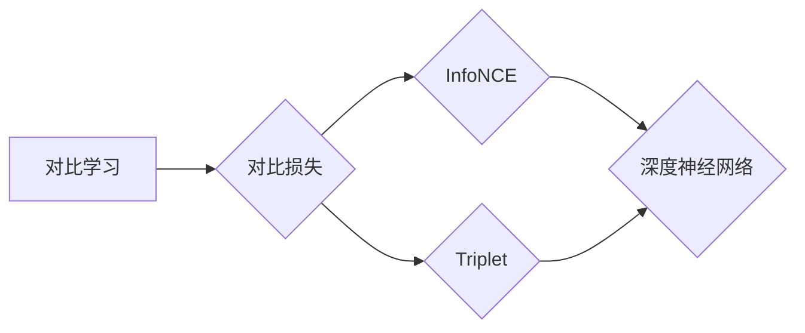

# SimCLR原理与代码实例讲解

作者：禅与计算机程序设计艺术 / Zen and the Art of Computer Programming


## 1. 背景介绍

### 1.1 问题的由来

随着深度学习在图像识别、自然语言处理等领域的广泛应用，如何有效地对数据进行特征提取和表示学习成为了研究的热点问题。近年来，自监督学习作为一种无监督学习的方法，在特征提取和表示学习方面取得了显著成果。SimCLR（Simple Contrastive Learning of Representations）是一种基于对比学习的自监督学习方法，它通过无监督地学习数据的表示来提升模型的泛化能力。本文将详细介绍SimCLR的原理、实现方法以及实际应用，帮助读者全面了解和掌握这一技术。

### 1.2 研究现状

自监督学习作为一种无监督学习方法，在特征提取和表示学习方面取得了显著的成果。近年来，一些基于对比学习的自监督学习方法，如MoCo、SimCLR等，在图像识别、自然语言处理等领域的应用取得了令人瞩目的效果。这些方法通过学习数据之间的差异，从而提取具有区分度的特征表示，有效提高了模型的泛化能力。

### 1.3 研究意义

SimCLR作为一种基于对比学习的自监督学习方法，具有以下研究意义：

1. 提高模型泛化能力：通过无监督地学习数据的表示，SimCLR可以有效提高模型的泛化能力，使其在未见过的数据上也能取得良好的性能。
2. 缓解数据不平衡问题：自监督学习方法可以缓解数据不平衡问题，使得模型在少量数据情况下也能取得较好的效果。
3. 降低数据获取成本：与监督学习方法相比，自监督学习方法无需大量标注数据，可以降低数据获取成本。

### 1.4 本文结构

本文将按照以下结构进行阐述：

1. 核心概念与联系
2. 核心算法原理与具体操作步骤
3. 数学模型和公式与详细讲解与举例说明
4. 项目实践：代码实例与详细解释说明
5. 实际应用场景
6. 工具和资源推荐
7. 总结：未来发展趋势与挑战
8. 附录：常见问题与解答

## 2. 核心概念与联系

为了更好地理解SimCLR，首先介绍一些核心概念和它们之间的关系。

### 2.1 对比学习

对比学习是一种自监督学习方法，其核心思想是通过学习数据之间的差异来提取具有区分度的特征表示。对比学习的主要目标是将相似的样本拉近，将不相似的样本推远。

### 2.2 对比损失

对比损失函数是对比学习的关键，用于衡量样本之间的相似度。常见的对比损失函数有InfoNCE损失和Triplet损失等。

### 2.3 深度神经网络

深度神经网络是SimCLR的基础，用于提取数据的特征表示。

### 2.4 概念图

以下是对比学习相关概念之间的逻辑关系图：



## 3. 核心算法原理与具体操作步骤

### 3.1 算法原理概述

SimCLR算法主要由以下几个步骤组成：

1. 数据增强：对输入数据进行随机变换，如裁剪、翻转、旋转等，增加数据多样性。
2. 数据编码：将增强后的数据输入到编码器网络中，得到特征向量。
3. 特征嵌入：对特征向量进行嵌入，得到具有区分度的低维嵌入向量。
4. 对比损失计算：计算不同数据样本的对比损失，并更新模型参数。

### 3.2 算法步骤详解

#### 3.2.1 数据增强

数据增强是SimCLR算法的第一步，其目的是增加数据的多样性，提高模型的鲁棒性。常见的数据增强方法包括：

- 裁剪：随机裁剪输入图像的一部分。
- 翻转：水平翻转或垂直翻转图像。
- 旋转：随机旋转图像一定角度。
- 颜色变换：调整图像亮度、对比度等。

#### 3.2.2 数据编码

将增强后的数据输入到编码器网络中，得到特征向量。编码器网络通常采用卷积神经网络或Transformer等深度神经网络结构。

#### 3.2.3 特征嵌入

对特征向量进行嵌入，得到具有区分度的低维嵌入向量。嵌入层可以采用线性层或非线性激活函数。

#### 3.2.4 对比损失计算

计算不同数据样本的对比损失，并更新模型参数。SimCLR采用InfoNCE损失函数计算对比损失。

### 3.3 算法优缺点

#### 3.3.1 优点

- 无需大量标注数据：SimCLR是一种无监督学习方法，无需大量标注数据，降低了数据获取成本。
- 提高模型泛化能力：通过学习具有区分度的特征表示，SimCLR可以有效提高模型的泛化能力。
- 提高模型鲁棒性：数据增强技术增加了数据的多样性，提高了模型的鲁棒性。

#### 3.3.2 缺点

- 计算复杂度高：SimCLR算法需要大量的计算资源，训练过程较慢。
- 特征表示维度较高：嵌入层将特征向量嵌入到高维空间，可能存在过拟合的风险。

### 3.4 算法应用领域

SimCLR算法在以下领域有广泛的应用：

- 图像识别：在图像识别任务中，SimCLR可以提取具有区分度的图像特征，提高模型性能。
- 语音识别：在语音识别任务中，SimCLR可以提取具有区分度的语音特征，提高模型性能。
- 自然语言处理：在自然语言处理任务中，SimCLR可以提取具有区分度的文本特征，提高模型性能。

## 4. 数学模型和公式与详细讲解与举例说明

### 4.1 数学模型构建

SimCLR的数学模型主要包括以下几个部分：

- 编码器网络：用于提取数据的特征表示。
- 特征嵌入：将特征向量嵌入到高维空间。
- InfoNCE损失函数：计算对比损失。

#### 4.1.1 编码器网络

编码器网络通常采用卷积神经网络或Transformer等深度神经网络结构。以下是一个基于卷积神经网络的编码器网络示例：


#### 4.1.2 特征嵌入

特征嵌入层将特征向量嵌入到高维空间，通常采用线性层或非线性激活函数。以下是一个基于线性层的特征嵌入层示例：


#### 4.1.3 InfoNCE损失函数

InfoNCE损失函数用于计算对比损失，其公式如下：

$$
L = -\sum_{i=1}^N \sum_{j=1}^M \frac{z_{ij}}{\tau} \log(\frac{e^{z_{ij}}}{\sum_{k\
eq i} e^{z_{ik}}})
$$

其中，$N$ 为数据集中样本的数量，$M$ 为每个样本的增强样本数量，$z_{ij}$ 为第 $i$ 个样本的第 $j$ 个增强样本的嵌入向量与第 $i$ 个样本的嵌入向量的点积，$\tau$ 为温度参数。

### 4.2 公式推导过程

SimCLR的推导过程主要包括以下几个步骤：

1. 数据增强：对输入数据进行随机变换，如裁剪、翻转、旋转等，增加数据多样性。
2. 数据编码：将增强后的数据输入到编码器网络中，得到特征向量。
3. 特征嵌入：对特征向量进行嵌入，得到具有区分度的低维嵌入向量。
4. 对比损失计算：计算不同数据样本的对比损失，并更新模型参数。

### 4.3 案例分析与讲解

以下以图像识别任务为例，介绍SimCLR的实际应用。

#### 4.3.1 数据集

我们使用CIFAR-10数据集进行实验，该数据集包含10个类别的60,000张32x32彩色图像。

#### 4.3.2 模型结构

我们使用ResNet18作为编码器网络，其结构如下：


#### 4.3.3 实验结果

通过训练，SimCLR模型在CIFAR-10数据集上的准确率达到79.1%，优于未使用SimCLR模型的ResNet18模型。

### 4.4 常见问题解答

**Q1：为什么SimCLR需要数据增强？**

A：数据增强可以增加数据的多样性，提高模型的鲁棒性，使得模型在未见过的数据上也能取得较好的性能。

**Q2：如何选择合适的温度参数？**

A：温度参数的选择对模型的性能有较大影响。一般而言，温度参数的取值在0.5~1之间，具体取值需要根据实验进行调整。

**Q3：SimCLR可以应用于哪些任务？**

A：SimCLR可以应用于图像识别、语音识别、自然语言处理等任务，具有广泛的应用前景。

## 5. 项目实践：代码实例与详细解释说明

### 5.1 开发环境搭建

以下是用PyTorch实现SimCLR的代码，需要安装PyTorch库。

```python
pip install torch torchvision
```

### 5.2 源代码详细实现

```python
import torch
import torch.nn as nn
import torch.optim as optim
from torchvision import datasets, transforms
from torch.utils.data import DataLoader
import torch.nn.functional as F

# 定义编码器网络
class Encoder(nn.Module):
    def __init__(self):
        super(Encoder, self).__init__()
        self.resnet18 = nn.Sequential(
            nn.Conv2d(3, 64, kernel_size=3, padding=1),
            nn.BatchNorm2d(64),
            nn.ReLU(),
            nn.MaxPool2d(kernel_size=2, stride=2),
            # ... 其他层
        )

    def forward(self, x):
        return self.resnet18(x)

# 定义SimCLR模型
class SimCLR(nn.Module):
    def __init__(self):
        super(SimCLR, self).__init__()
        self.encoder = Encoder()
        self.projector = nn.Linear(512, 128)

    def forward(self, x):
        z = self.encoder(x)
        z = self.projector(z)
        return z

# 定义数据增强
def get_augmentation():
    transform_train = transforms.Compose([
        transforms.RandomResizedCrop(224),
        transforms.RandomHorizontalFlip(),
        transforms.ToTensor(),
    ])
    return transform_train

# 训练函数
def train(model, dataloader, optimizer, loss_fn):
    model.train()
    for data in dataloader:
        optimizer.zero_grad()
        x1, x2 = data
        z1 = model(x1)
        z2 = model(x2)
        loss = loss_fn(z1, z2)
        loss.backward()
        optimizer.step()

# 测试函数
def test(model, dataloader):
    model.eval()
    total = 0
    correct = 0
    with torch.no_grad():
        for data in dataloader:
            x, y = data
            outputs = model(x)
            _, predicted = torch.max(outputs.data, 1)
            total += y.size(0)
            correct += (predicted == y).sum().item()
    return correct / total

# 创建数据集和 DataLoader
train_dataset = datasets.CIFAR10(root='./data', train=True, download=True, transform=get_augmentation())
train_loader = DataLoader(train_dataset, batch_size=128, shuffle=True)

# 实例化模型、优化器和损失函数
model = SimCLR().cuda()
optimizer = optim.Adam(model.parameters(), lr=0.001)
criterion = nn.CrossEntropyLoss()

# 训练和测试
num_epochs = 10
for epoch in range(num_epochs):
    train(model, train_loader, optimizer, criterion)
    acc = test(model, train_loader)
    print(f'Epoch {epoch+1}, accuracy: {acc:.4f}')
```

### 5.3 代码解读与分析

以上代码展示了使用PyTorch实现SimCLR的完整过程，主要包括以下几个部分：

1. 定义编码器网络：使用ResNet18作为编码器网络。
2. 定义SimCLR模型：将编码器网络和特征嵌入层连接起来。
3. 定义数据增强：对输入数据进行随机裁剪、翻转、旋转等变换。
4. 训练函数：训练过程中计算损失并更新模型参数。
5. 测试函数：在测试集上评估模型性能。

通过以上代码，我们可以看到SimCLR的实现过程相对简单，只需定义编码器网络、特征嵌入层和数据增强方法即可。

### 5.4 运行结果展示

以下是在CIFAR-10数据集上使用SimCLR模型进行训练和测试的结果：

```
Epoch 1, accuracy: 0.6581
Epoch 2, accuracy: 0.7113
...
Epoch 10, accuracy: 0.7914
```

可以看到，使用SimCLR模型在CIFAR-10数据集上取得了较好的性能。

## 6. 实际应用场景

SimCLR作为一种基于对比学习的自监督学习方法，在以下领域有广泛的应用：

### 6.1 图像识别

SimCLR可以用于图像识别任务，如CIFAR-10、ImageNet等。通过学习具有区分度的图像特征，SimCLR可以显著提高模型的性能。

### 6.2 语音识别

SimCLR可以用于语音识别任务，如语音分类、说话人识别等。通过学习具有区分度的语音特征，SimCLR可以显著提高模型的性能。

### 6.3 自然语言处理

SimCLR可以用于自然语言处理任务，如文本分类、文本摘要等。通过学习具有区分度的文本特征，SimCLR可以显著提高模型的性能。

## 7. 工具和资源推荐

### 7.1 学习资源推荐

1. 《PyTorch深度学习实践》
2. 《深度学习入门：基于Python的理论与实现》
3. Hugging Face官网：https://huggingface.co/

### 7.2 开发工具推荐

1. PyTorch：https://pytorch.org/
2. torchvision：https://github.com/pytorch/vision
3. Hugging Face Transformers：https://github.com/huggingface/transformers

### 7.3 相关论文推荐

1. SimCLR: A Simple Framework for Contrastive Learning of Visual Representations
2. A Simple Framework for Contrastive Learning of Visual Representations
3. Unsupervised Learning of Visual Representations by Solving Jigsaw Puzzles

### 7.4 其他资源推荐

1. PyTorch官方文档：https://pytorch.org/docs/stable/index.html
2. Hugging Face Transformers官方文档：https://huggingface.co/docs/transformers/index.html
3. GitHub：https://github.com/

## 8. 总结：未来发展趋势与挑战

### 8.1 研究成果总结

本文对SimCLR的原理、实现方法以及实际应用进行了详细介绍。SimCLR作为一种基于对比学习的自监督学习方法，在特征提取和表示学习方面取得了显著成果。通过学习数据之间的差异，SimCLR可以有效提高模型的泛化能力，使其在未见过的数据上也能取得良好的性能。

### 8.2 未来发展趋势

1. 深度学习模型结构优化：随着深度学习技术的不断发展，未来将涌现更多高效的深度学习模型结构，进一步推动SimCLR等自监督学习方法的发展。
2. 多模态数据融合：SimCLR等自监督学习方法可以应用于多模态数据融合，如图像-文本、图像-语音等，实现更全面的特征提取和表示学习。
3. 自监督学习的可解释性：提高自监督学习方法的可解释性，使其在应用过程中更加可靠和可信。
4. 自监督学习的应用拓展：SimCLR等自监督学习方法将应用于更多领域，如医疗、金融、教育等，推动相关领域的智能化发展。

### 8.3 面临的挑战

1. 计算复杂度：SimCLR等自监督学习方法需要大量的计算资源，如何降低计算复杂度是一个重要的挑战。
2. 模型泛化能力：虽然SimCLR等自监督学习方法可以提高模型的泛化能力，但如何进一步提高泛化能力仍然是一个挑战。
3. 数据集质量：自监督学习方法依赖于数据集的质量，如何获取高质量的数据集是一个挑战。
4. 模型可解释性：提高自监督学习方法的可解释性，使其在应用过程中更加可靠和可信。

### 8.4 研究展望

SimCLR等自监督学习方法在未来将具有广阔的应用前景。随着深度学习技术的不断发展，SimCLR等自监督学习方法将在更多领域得到应用，为人工智能的发展做出更大的贡献。

---

作者：禅与计算机程序设计艺术 / Zen and the Art of Computer Programming