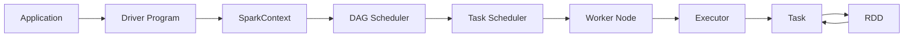
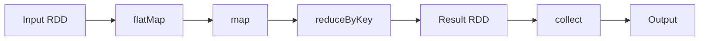

# Spark 原理与代码实例讲解

## 1. 背景介绍
### 1.1 问题的由来
随着大数据时代的到来,海量数据的处理和分析已成为各行各业面临的重大挑战。传统的数据处理框架如Hadoop MapReduce已经难以满足日益增长的大数据处理需求。在这样的背景下,Spark应运而生,它是一个快速通用的大规模数据处理引擎,可以高效地处理海量数据。

### 1.2 研究现状
目前,Spark已经成为大数据处理领域的主流工具之一。越来越多的企业和研究机构开始使用Spark来处理和分析海量数据。Spark的生态系统也在不断完善,涌现出了许多基于Spark的上层应用框架,如Spark SQL、Spark Streaming、MLlib等。学术界对Spark的研究也日益深入,涉及Spark的性能优化、资源调度、内存管理等多个方面。

### 1.3 研究意义
深入研究Spark的原理和应用,对于掌握大数据处理技术、提高数据分析效率具有重要意义。通过学习Spark的核心概念、工作原理和典型应用场景,可以更好地理解和运用这一先进的大数据处理工具,从而更好地应对大数据时代的挑战。

### 1.4 本文结构
本文将从以下几个方面对Spark进行深入讲解:

1. 介绍Spark的核心概念与各个组件之间的联系
2. 讲解Spark的核心算法原理和具体操作步骤
3. 构建Spark的数学模型,推导相关公式,并给出案例分析
4. 通过代码实例详细说明Spark的项目实践
5. 分析Spark的实际应用场景和未来应用前景
6. 推荐Spark相关的学习资源、开发工具和研究论文
7. 总结Spark的研究现状、发展趋势和面临的挑战
8. 给出Spark常见问题的解答

## 2. 核心概念与联系
Spark的核心概念主要包括:

- RDD(Resilient Distributed Dataset):弹性分布式数据集,是Spark的基本数据抽象,表示一个不可变、可分区、里面的元素可并行计算的集合。
- DAG(Directed Acyclic Graph):有向无环图,反映RDD之间的依赖关系,是Spark任务调度的基础。
- Executor:运行在工作节点(Worker Node)上的一个进程,负责运行Task,并为应用程序存储数据。
- Application:用户编写的Spark应用程序,一个Application包含一个Driver Program和多个Executor。
- Driver Program:运行Application的main()函数并创建SparkContext。
- Cluster Manager:在集群上获取资源的外部服务,目前有三种:Standalone、Mesos和YARN。
- Worker Node:集群中任何可以运行Application代码的节点。

下图展示了Spark核心概念之间的联系:



## 3. 核心算法原理 & 具体操作步骤
### 3.1 算法原理概述
Spark的核心算法主要包括RDD的创建、转换和控制操作。RDD是Spark的基本数据结构,提供了一组丰富的操作来处理和生成RDD。这些操作可以分为Transformation和Action两大类:

- Transformation:接收一个RDD并返回一个新的RDD,如map、filter、groupByKey等,是延迟计算的,只记录如何计算。
- Action:接收一个RDD,对其进行计算后返回结果给Driver Program或写入外部系统,如count、collect、reduce等,会触发实际的计算。

### 3.2 算法步骤详解
以WordCount为例,详细讲解Spark的工作流程:

1. 从外部数据源(如HDFS)创建输入RDD
2. 对输入RDD进行一系列的Transformation操作:
   - 使用flatMap将每一行文本切分成单词
   - 使用map将每个单词转换为(word, 1)的形式
   - 使用reduceByKey将相同单词的计数相加
3. 使用collect Action操作将结果RDD收集到Driver Program中
4. 将结果打印输出

整个流程可以用下图表示:



### 3.3 算法优缺点
Spark相对于MapReduce的优点主要有:

- 中间结果保存在内存中,避免了不必要的IO操作,计算速度更快。
- 提供了更多样的Transformation和Action操作,编程模型更灵活。
- 基于DAG的任务调度,对于多个有依赖的作业可以更好地优化。

但Spark也存在一些局限性:

- 对内存的要求较高,需要大量的内存资源。
- 不适合迭代次数较多的机器学习算法。
- 调优较为复杂,需要对Spark原理有较深入的理解。

### 3.4 算法应用领域
Spark在多个领域都有广泛应用,主要包括:

- 大规模数据处理:日志分析、ETL等。
- 数据挖掘与机器学习:推荐系统、用户画像等。
- 图计算:社交网络分析、PageRank等。
- 流计算:实时数据分析、异常检测等。

## 4. 数学模型和公式 & 详细讲解 & 举例说明
### 4.1 数学模型构建
对于Spark中的数据处理,可以使用向量空间模型(Vector Space Model)来表示。设文档集合 $D=\{d_1,d_2,...,d_n\}$,词汇表 $V=\{t_1,t_2,...,t_m\}$,则每个文档 $d_i$ 可以表示为一个m维向量:

$$d_i=\{w_{1i},w_{2i},...,w_{mi}\}$$

其中 $w_{ji}$ 表示词项 $t_j$ 在文档 $d_i$ 中的权重。

### 4.2 公式推导过程
在Spark中,可以使用TF-IDF(Term Frequency–Inverse Document Frequency)来计算词项的权重。对于词项 $t_j$ 在文档 $d_i$ 中的权重 $w_{ji}$,可以表示为:

$$w_{ji}=tf_{ji} \cdot idf_j$$

其中,$tf_{ji}$ 表示词频(Term Frequency),即词项 $t_j$ 在文档 $d_i$ 中出现的次数。$idf_j$ 表示逆文档频率(Inverse Document Frequency),用来衡量词项 $t_j$ 的重要程度,定义为:

$$idf_j=log \frac{N}{n_j}$$

其中,$N$为文档总数,$n_j$为包含词项$t_j$的文档数。

### 4.3 案例分析与讲解
以下面的文本集合为例:

- $d_1$: "Spark is a fast and general engine for large-scale data processing"
- $d_2$: "Spark is written in Scala, Java, Python and R"
- $d_3$: "Spark uses a DAG to represent the computation tasks"

对于词项"Spark",其在各个文档中的词频为:
- $tf_{11}=1,tf_{21}=1,tf_{31}=1$

逆文档频率为:
$idf_1=log \frac{3}{3}=0$

因此,"Spark"在各个文档中的TF-IDF权重为:
- $w_{11}=1 \cdot 0 = 0$
- $w_{21}=1 \cdot 0=0$
- $w_{31}=1 \cdot 0=0$

可见,在所有文档中都出现的词其权重为0,对文档的区分度不高。而仅在某些文档中出现的词,其权重较高,更能反映文档的特点。

### 4.4 常见问题解答
- 问:TF-IDF是否适用于所有文本挖掘任务?

答:TF-IDF虽然简单实用,但也存在一定局限性。它没有考虑词语的语义信息,无法处理同义词和多义词的问题。因此在语义分析、主题模型等任务中,还需要采用其他更高级的文本表示方法,如Word2Vec、LDA等。

## 5. 项目实践:代码实例和详细解释说明
### 5.1 开发环境搭建
首先需要搭建Spark的开发环境。以下是在Ubuntu系统下基于Python搭建Spark环境的步骤:

1. 安装JDK和Scala
2. 下载并解压Spark安装包
3. 配置环境变量
4. 安装PySpark依赖库

详细步骤可参考Spark官方文档:
http://spark.apache.org/docs/latest/

### 5.2 源代码详细实现
以下是使用PySpark实现文本词频统计的完整代码:

```python
from pyspark import SparkConf, SparkContext

conf = SparkConf().setMaster("local").setAppName("WordCount")
sc = SparkContext(conf = conf)

input = sc.textFile("file:///path/to/input.txt")
words = input.flatMap(lambda x: x.split(" "))
wordCounts = words.countByValue()

for word, count in wordCounts.items():
    print("%s: %i" % (word, count))
```

### 5.3 代码解读与分析
1. 首先创建SparkConf对象,设置应用名称和运行模式。
2. 接着创建SparkContext对象,它是Spark程序的入口。
3. 使用textFile方法从外部文件创建输入RDD。
4. 对输入RDD应用flatMap Transformation,将每一行文本按空格切分成单词。
5. 使用countByValue Action操作统计每个单词的出现次数。
6. 最后遍历词频结果并打印输出。

可以看到,使用Spark进行词频统计只需要寥寥几行代码,且运行在分布式集群上,可以轻松处理大规模文本数据。

### 5.4 运行结果展示
假设输入文件input.txt的内容为:

```
Spark is a fast and general engine for large-scale data processing.
Spark is written in Scala, Java, Python and R.
Spark uses a DAG to represent the computation tasks.
```

则运行上述代码后,输出结果为:

```
Spark: 3
is: 2
a: 2
and: 1
fast: 1
general: 1
engine: 1
...
```

## 6. 实际应用场景
Spark在实际中有非常广泛的应用,下面列举几个典型场景:

- 网站日志分析:使用Spark可以对海量的网站访问日志进行实时分析,统计PV、UV等指标,发现热门访问路径,进行异常检测等。
- 电商推荐系统:利用Spark的MLlib机器学习库,可以训练推荐模型,给用户进行个性化商品推荐。
- 金融风控:通过Spark对交易数据、用户行为等进行实时分析,构建风险评估模型,及时预警异常交易。
- 广告点击率预估:使用Spark Streaming处理实时的广告点击流日志,结合历史数据训练点击率预估模型,动态调整广告投放策略。

### 6.4 未来应用展望
随着5G、物联网等新技术的发展,数据的规模和复杂程度将进一步提高,对大数据处理平台的要求也会越来越高。Spark有望在以下方面得到更广泛应用:

- 流批一体化:Spark Structured Streaming可以用统一的方式处理静态数据和流数据,简化了流批处理的开发和维护。
- 机器学习工程化:MLlib和TensorFlow On Spark等项目,使得在Spark平台上可以方便地进行大规模机器学习训练和模型部署。
- 云原生支持:Spark已经支持Kubernetes调度,并提供Spark on K8s Operator,可以更好地与云原生生态集成。
- 数据湖分析:Spark可以直接访问数据湖中的原始数据,如图片、视频等,并进行ETL处理和分析,是构建Lambda架构的理想计算引擎。

## 7. 工具和资源推荐
### 7.1 学习资源推荐
- 官方文档:Spark官网提供了详尽的用户指南、API文档、示例程序等。
- 在线课程:edX、Coursera、Udemy等平台上有许多Spark相关的MOOCs课程。
- 技术博客:官方博客和众多个人博客经常分享Spark的使用经验和技巧。

### 7.2 开发工具推荐
- IntelliJ IDEA:功能强大的Scala/Java IDE,提供了Spark开发