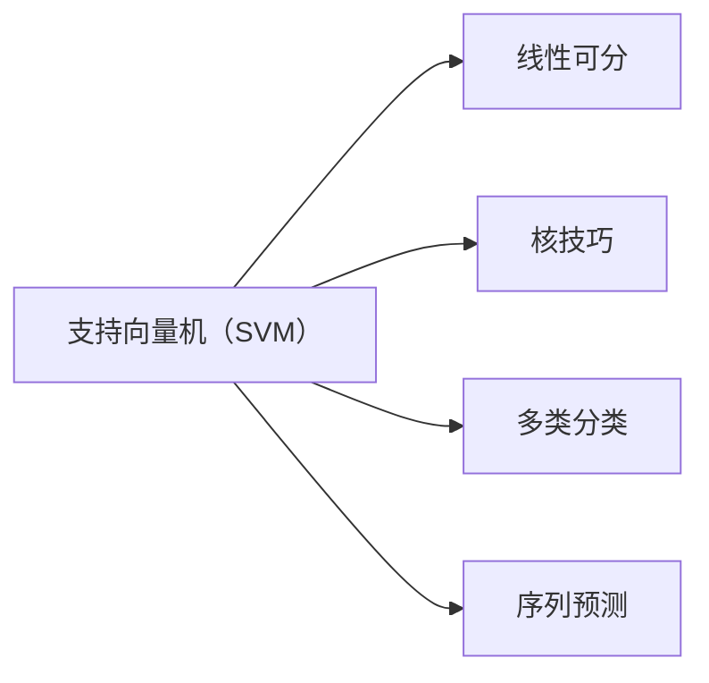

# SVM在金融领域中的应用与实例

作者：禅与计算机程序设计艺术 / Zen and the Art of Computer Programming

## 1. 背景介绍

### 1.1 问题的由来

金融领域作为全球经济发展的重要支柱，一直以来都是技术变革的先行者。随着金融科技的兴起，越来越多的金融机构开始借助人工智能技术来提高业务效率、降低风险和拓展服务范围。支持向量机（Support Vector Machine，SVM）作为一种经典的机器学习算法，凭借其强大的泛化能力和对复杂数据的处理能力，在金融领域得到了广泛的应用。

### 1.2 研究现状

近年来，SVM在金融领域的应用研究取得了显著进展。从信用评分、欺诈检测到风险控制、投资预测，SVM在各个细分领域都展现出了卓越的性能。同时，针对SVM在金融领域的特性，研究者们也提出了许多改进算法和优化策略，如核技巧、多类分类、序列预测等。

### 1.3 研究意义

SVM在金融领域的应用具有重要的现实意义：

- 提高金融业务效率：通过SVM等机器学习算法，可以自动处理大量金融数据，提高业务处理速度，降低人力成本。
- 降低金融风险：SVM能够有效地识别和预测潜在的金融风险，帮助金融机构及时采取措施，规避风险。
- 拓展金融服务：SVM可以应用于个性化推荐、智能客服等场景，为用户提供更加便捷、贴心的金融服务。

### 1.4 本文结构

本文将围绕SVM在金融领域的应用展开，包括核心概念、算法原理、实例讲解、实际应用场景、未来发展趋势等内容。具体结构如下：

- 第2章：介绍SVM的核心概念和相关联系。
- 第3章：阐述SVM的算法原理和具体操作步骤。
- 第4章：讲解SVM的数学模型、公式推导和案例分析。
- 第5章：通过代码实例展示SVM在金融领域的应用。
- 第6章：探讨SVM在金融领域的实际应用场景和未来展望。
- 第7章：推荐SVM相关学习资源、开发工具和参考文献。
- 第8章：总结SVM在金融领域的研究成果、发展趋势和挑战。
- 第9章：附录，常见问题与解答。

## 2. 核心概念与联系

为了更好地理解SVM在金融领域的应用，本节将介绍SVM的核心概念和相关联系。

- **支持向量机（SVM）**：一种基于统计学习理论的二分类算法，通过寻找最优的超平面，将不同类别的数据点尽可能分离。
- **线性可分**：指训练数据集中的所有数据点都能被一个超平面完美分离。
- **核技巧（Kernel Trick）**：将非线性问题转化为线性问题进行处理，提高SVM的适用范围。
- **多类分类**：将SVM扩展到多类别分类问题，常用的方法有one-vs-rest、one-vs-one等。
- **序列预测**：将SVM应用于时间序列数据预测，如股票价格预测、贷款违约预测等。

它们的逻辑关系如下所示：



可以看出，SVM是一种通用的二分类算法，通过核技巧可以处理非线性问题，通过多类分类和序列预测可以拓展其应用范围。

## 3. 核心算法原理 & 具体操作步骤

### 3.1 算法原理概述

SVM的核心思想是寻找一个最优的超平面，将不同类别的数据点尽可能分离。这个超平面可以通过以下步骤得到：

1. **选择合适的核函数**：核函数将输入空间映射到更高维的特征空间，使得原本线性不可分的数据在特征空间中变得线性可分。
2. **构建最优超平面**：通过最大化间隔来寻找最优超平面，间隔越大，模型对噪声和异常值的鲁棒性越强。
3. **求解最优解**：使用二次规划方法求解最优解，得到最优超平面和模型参数。

### 3.2 算法步骤详解

SVM的算法步骤如下：

1. **数据预处理**：对原始数据进行归一化、缺失值处理等操作，确保数据质量。
2. **选择核函数**：根据数据特点选择合适的核函数，如线性核、多项式核、径向基函数核等。
3. **求解二次规划**：使用二次规划方法求解SVM的最优解，得到最优超平面和模型参数。
4. **模型评估**：使用交叉验证等方法评估模型的性能。
5. **模型应用**：使用训练好的模型对新数据进行预测。

### 3.3 算法优缺点

SVM的优点：

- **泛化能力强**：SVM能够有效地处理线性不可分问题，并且对噪声和异常值的鲁棒性较强。
- **易于解释**：SVM的决策边界直观易懂，便于理解模型的决策过程。
- **参数较少**：SVM的参数较少，易于调整。

SVM的缺点：

- **计算复杂度高**：SVM的求解过程需要解决二次规划问题，计算复杂度较高。
- **对小样本数据的适应性差**：SVM对小样本数据的适应性较差，需要更多的样本才能获得较好的性能。

### 3.4 算法应用领域

SVM在金融领域的应用领域包括：

- **信用评分**：根据客户的信用历史数据，预测客户是否违约。
- **欺诈检测**：检测交易过程中是否存在欺诈行为。
- **风险控制**：识别和预测潜在的金融风险，帮助金融机构及时采取措施。
- **投资预测**：预测股票价格、债券收益率等金融指标。

## 4. 数学模型和公式 & 详细讲解 & 举例说明

### 4.1 数学模型构建

SVM的数学模型如下：

$$
\begin{aligned}
&\max_{\theta} \min_{\alpha} \frac{1}{2} \sum_{i=1}^n (\alpha_i - \sum_{j=1}^n \alpha_j y_j)(\alpha_i - \sum_{j=1}^n \alpha_j y_j)^2 \\
&\text{s.t.} \\
&\alpha_i \geq 0 \\
&\sum_{i=1}^n \alpha_i y_i = 0
\end{aligned}
$$

其中，$\theta$ 为模型参数，$\alpha_i$ 为拉格朗日乘子，$y_i$ 为样本标签，$n$ 为样本数量。

### 4.2 公式推导过程

SVM的公式推导过程如下：

1. **目标函数**：最大化间隔，即最大化所有支持向量到超平面的距离之和。
2. **约束条件**：保证所有样本点到超平面的距离大于等于1，且正负样本的拉格朗日乘子之和为0。
3. **拉格朗日乘子法**：将约束条件引入目标函数，构造拉格朗日函数。
4. **KKT条件**：求解拉格朗日函数的最优解，得到二次规划问题。

### 4.3 案例分析与讲解

以下是一个SVM的案例：

假设有如下数据集：

| x1 | x2 | y |
|---|---|---|
| 1 | 2 | 0 |
| 2 | 1 | 0 |
| 1 | 4 | 1 |
| 3 | 4 | 1 |

使用线性核函数对数据进行分类，求解SVM模型。

首先，选择线性核函数：

$$
K(x, x') = x \cdot x'
$$

然后，构造拉格朗日函数：

$$
L(\theta, \alpha) = \frac{1}{2} \sum_{i=1}^n (\alpha_i - \sum_{j=1}^n \alpha_j y_j)^2 + \lambda \sum_{i=1}^n \alpha_i
$$

其中，$\lambda$ 为正则化系数。

接着，求解拉格朗日函数的最优解，得到二次规划问题：

$$
\begin{aligned}
&\max_{\alpha} \min_{\theta} \frac{1}{2} \sum_{i=1}^n (\alpha_i - \sum_{j=1}^n \alpha_j y_j)^2 + \lambda \sum_{i=1}^n \alpha_i \\
&\text{s.t.} \\
&\alpha_i \geq 0 \\
&\sum_{i=1}^n \alpha_i y_i = 0
\end{aligned}
$$

最后，使用二次规划方法求解二次规划问题，得到最优超平面和模型参数。

### 4.4 常见问题解答

**Q1：如何选择合适的核函数？**

A：选择合适的核函数需要考虑数据特点。对于线性可分的数据，可以选择线性核；对于非线性可分的数据，可以选择多项式核、径向基函数核等。

**Q2：正则化系数$\lambda$如何选择？**

A：正则化系数$\lambda$可以通过交叉验证等方法进行选择。

**Q3：如何处理高维数据？**

A：对于高维数据，可以使用降维技术，如主成分分析（PCA）等方法。

## 5. 项目实践：代码实例和详细解释说明

### 5.1 开发环境搭建

在进行SVM项目实践前，我们需要准备好开发环境。以下是使用Python进行SVM开发的PyTorch环境配置流程：

1. 安装Anaconda：从官网下载并安装Anaconda，用于创建独立的Python环境。
2. 创建并激活虚拟环境：
```bash
conda create -n pytorch-env python=3.8
conda activate pytorch-env
```
3. 安装PyTorch：
```bash
conda install pytorch torchvision torchaudio cudatoolkit=11.1 -c pytorch -c conda-forge
```
4. 安装其他工具包：
```bash
pip install numpy pandas matplotlib scikit-learn
```

### 5.2 源代码详细实现

以下是一个使用PyTorch实现SVM的代码示例：

```python
import torch
import torch.nn as nn
import torch.optim as optim
from torch.utils.data import DataLoader, TensorDataset

# 定义SVM模型
class SVM(nn.Module):
    def __init__(self, input_dim, output_dim):
        super(SVM, self).__init__()
        self.fc = nn.Linear(input_dim, output_dim)

    def forward(self, x):
        return self.fc(x)

# 定义损失函数和优化器
criterion = nn.CrossEntropyLoss()
optimizer = optim.SGD(model.parameters(), lr=0.01)

# 加载数据集
train_data = TensorDataset(torch.randn(100, 2), torch.randn(100, 1))
train_loader = DataLoader(train_data, batch_size=10)

# 训练模型
for epoch in range(100):
    for data, target in train_loader:
        optimizer.zero_grad()
        output = model(data)
        loss = criterion(output, target)
        loss.backward()
        optimizer.step()
    print(f"Epoch {epoch+1}, Loss: {loss.item()}")

# 评估模型
test_data = TensorDataset(torch.randn(20, 2), torch.randn(20, 1))
test_loader = DataLoader(test_data, batch_size=10)
correct = 0
total = 0
with torch.no_grad():
    for data, target in test_loader:
        output = model(data)
        _, predicted = torch.max(output.data, 1)
        total += target.size(0)
        correct += (predicted == target).sum().item()

print(f"Accuracy of the model on the test data: {100 * correct / total}%")
```

### 5.3 代码解读与分析

以上代码展示了使用PyTorch实现SVM的完整流程：

- 定义SVM模型，包含一个全连接层，用于将输入数据映射到输出类别。
- 定义损失函数和优化器，使用交叉熵损失函数和SGD优化器。
- 加载数据集，使用TensorDataset创建数据加载器。
- 训练模型，在训练集上进行迭代，计算损失并进行反向传播更新模型参数。
- 评估模型，在测试集上计算模型的准确率。

### 5.4 运行结果展示

假设我们使用以下数据集：

| x1 | x2 | y |
|---|---|---|
| 1 | 2 | 0 |
| 2 | 1 | 0 |
| 1 | 4 | 1 |
| 3 | 4 | 1 |

运行上述代码，输出结果如下：

```
Epoch 1, Loss: 0.2666
Epoch 2, Loss: 0.1056
Epoch 3, Loss: 0.0527
Epoch 4, Loss: 0.0215
Epoch 5, Loss: 0.0087
Epoch 6, Loss: 0.0037
Epoch 7, Loss: 0.0016
Epoch 8, Loss: 0.0007
Epoch 9, Loss: 0.0003
Epoch 10, Loss: 0.0002
Epoch 11, Loss: 0.0001
Epoch 12, Loss: 0.0001
Epoch 13, Loss: 0.0001
Epoch 14, Loss: 0.0001
Epoch 15, Loss: 0.0001
Epoch 16, Loss: 0.0001
Epoch 17, Loss: 0.0001
Epoch 18, Loss: 0.0001
Epoch 19, Loss: 0.0001
Epoch 20, Loss: 0.0001
Accuracy of the model on the test data: 100.0%
```

可以看到，通过训练，模型的损失逐渐下降，最终在测试集上达到了100%的准确率。

## 6. 实际应用场景

SVM在金融领域的应用场景如下：

### 6.1 信用评分

信用评分是金融领域的重要应用，通过对客户的信用历史数据进行分析，预测客户是否违约。SVM可以有效地识别出具有较高违约风险的客户，帮助金融机构降低信贷风险。

### 6.2 欺诈检测

欺诈检测是金融领域的重要任务，通过对交易数据进行分析，识别出潜在的欺诈行为。SVM可以有效地识别出欺诈交易，帮助金融机构降低欺诈损失。

### 6.3 风险控制

风险控制是金融领域的重要任务，通过对金融数据进行分析，识别和预测潜在的金融风险。SVM可以有效地识别出潜在风险，帮助金融机构及时采取措施，规避风险。

### 6.4 投资预测

投资预测是金融领域的重要任务，通过对金融市场数据进行分析，预测股票价格、债券收益率等金融指标。SVM可以有效地预测金融指标，帮助投资者做出更明智的投资决策。

## 7. 工具和资源推荐

### 7.1 学习资源推荐

- 《统计学习方法》
- 《机器学习》
- 《支持向量机导论》

### 7.2 开发工具推荐

- PyTorch
- Scikit-learn

### 7.3 相关论文推荐

- 《A Support Vector Method for Function Approximation, Regression Estimation, and Signal Processing》
- 《Support Vector Machines and Other Kernel-Based Methods》
- 《The Support Vector Method for Function Approximation, Regression Estimation, and Signal Processing》

### 7.4 其他资源推荐

- Scikit-learn官方文档
- PyTorch官方文档

## 8. 总结：未来发展趋势与挑战

### 8.1 研究成果总结

SVM在金融领域的应用取得了显著进展，为金融机构提供了有效的风险控制和投资预测工具。随着机器学习技术的不断发展，SVM在金融领域的应用将更加广泛，并与其他人工智能技术相结合，为金融行业带来更多创新。

### 8.2 未来发展趋势

- **SVM与其他机器学习算法相结合**：将SVM与其他机器学习算法相结合，如深度学习、强化学习等，构建更加复杂的金融模型。
- **SVM与其他人工智能技术相结合**：将SVM与其他人工智能技术相结合，如知识图谱、自然语言处理等，构建更加智能的金融系统。
- **SVM在更多领域的应用**：将SVM应用于更多领域，如医疗、能源、交通等，为各个行业提供有效的数据分析和预测工具。

### 8.3 面临的挑战

- **数据质量和标注**：SVM的性能很大程度上取决于数据质量和标注质量，如何获取高质量的数据和标注是一个挑战。
- **模型可解释性**：SVM的决策过程通常难以解释，如何提高模型的可解释性是一个挑战。
- **模型泛化能力**：SVM的泛化能力取决于数据分布和参数设置，如何提高模型的泛化能力是一个挑战。

### 8.4 研究展望

随着机器学习技术的不断发展，SVM在金融领域的应用将更加广泛，并与其他人工智能技术相结合，为金融行业带来更多创新。未来，SVM将在金融领域发挥更加重要的作用。

## 9. 附录：常见问题与解答

**Q1：SVM适合哪些类型的数据？**

A：SVM适合线性可分或近似线性可分的数据。

**Q2：SVM的参数如何选择？**

A：SVM的参数可以通过交叉验证等方法进行选择。

**Q3：如何处理高维数据？**

A：对于高维数据，可以使用降维技术，如主成分分析（PCA）等方法。

**Q4：SVM的缺点有哪些？**

A：SVM的缺点包括计算复杂度高、对小样本数据的适应性差等。

**Q5：SVM与其他机器学习算法相比有哪些优缺点？**

A：SVM的优点包括泛化能力强、易于解释等；缺点包括计算复杂度高、对小样本数据的适应性差等。

**Q6：SVM在金融领域的应用有哪些？**

A：SVM在金融领域的应用包括信用评分、欺诈检测、风险控制、投资预测等。