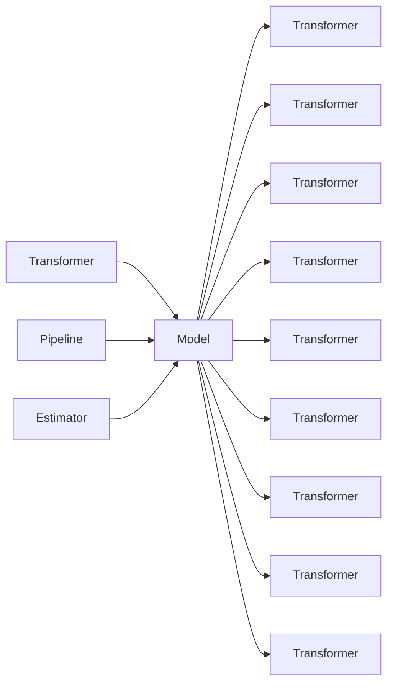

# Spark MLlib机器学习库原理与代码实例讲解

作者：禅与计算机程序设计艺术 / Zen and the Art of Computer Programming

## 1. 背景介绍

### 1.1 问题的由来

随着大数据时代的到来，如何从海量数据中提取有价值的信息成为了越来越重要的问题。传统的机器学习库在处理大规模数据时存在效率低下、可扩展性差等问题。而Apache Spark作为一款分布式计算框架，以其高效的并行处理能力和良好的可扩展性，成为大数据处理和分析的利器。Spark MLlib是Spark生态系统中的机器学习库，提供了丰富的机器学习算法和工具，使得大规模机器学习变得简单易行。

### 1.2 研究现状

Spark MLlib自2014年发布以来，已经发展成为一个功能丰富、性能优异的机器学习库。它支持多种算法，包括分类、回归、聚类、降维等，并提供了模型评估、数据预处理等工具。此外，Spark MLlib还支持集成学习、特征工程等功能，方便用户构建复杂的机器学习应用。

### 1.3 研究意义

Spark MLlib的研究意义主要体现在以下几个方面：

1. 提高大数据处理的效率。Spark MLlib能够利用Spark的分布式计算能力，高效地处理大规模数据，缩短模型训练和预测时间。
2. 降低机器学习门槛。Spark MLlib提供了丰富的机器学习算法和工具，方便用户快速构建和部署机器学习应用。
3. 促进机器学习研究。Spark MLlib的易用性和可扩展性，吸引了大量研究人员使用Spark进行机器学习研究，推动了机器学习技术的发展。

### 1.4 本文结构

本文将分为以下几个部分：

1. 介绍Spark MLlib的核心概念和算法。
2. 详细讲解Spark MLlib的算法原理和具体操作步骤。
3. 通过代码实例演示如何使用Spark MLlib进行机器学习。
4. 探讨Spark MLlib在实际应用场景中的应用。
5. 展望Spark MLlib的未来发展趋势。

## 2. 核心概念与联系

### 2.1 Spark MLlib的核心概念

Spark MLlib的核心概念包括：

1. Transformer：用于将输入数据转换成模型所需的格式。
2. Model：表示训练好的机器学习模型。
3. Pipeline：将多个Transformer串联起来，形成一个完整的数据处理和模型训练流程。
4. Evaluation：用于评估模型性能。
5. Estimator：用于训练模型。
6. Transformer：用于转换数据。

### 2.2 核心概念之间的联系

Transformer、Model、Pipeline、Evaluation、Estimator和Transformer等核心概念之间的关系如下：



## 3. 核心算法原理 & 具体操作步骤

### 3.1 算法原理概述

Spark MLlib提供了多种机器学习算法，包括：

1. 分类算法：如逻辑回归、决策树、随机森林、支持向量机等。
2. 回归算法：如线性回归、岭回归、Lasso回归等。
3. 聚类算法：如K-means、谱聚类等。
4. 降维算法：如主成分分析、t-SNE等。
5. 集成学习：如随机森林、XGBoost等。

### 3.2 算法步骤详解

以下以逻辑回归为例，介绍Spark MLlib中机器学习算法的具体操作步骤：

1. 创建Estimator对象。
2. 使用Estimator的`fit`方法训练模型。
3. 使用训练好的模型进行预测。

具体代码如下：

```python
from pyspark.ml.classification import LogisticRegression

# 创建逻辑回归Estimator对象
lr = LogisticRegression(maxIter=10, regParam=0.01)

# 训练模型
model = lr.fit(training_data)

# 使用模型进行预测
predictions = model.transform(test_data)
```

### 3.3 算法优缺点

以逻辑回归为例，介绍Spark MLlib中机器学习算法的优缺点：

**优点**：

1. 逻辑回归是一种简单的线性回归模型，易于理解和实现。
2. 逻辑回归在分类任务中表现良好，特别是在二分类任务中。
3. 逻辑回归对异常值不敏感。

**缺点**：

1. 逻辑回归假设数据满足线性可分，对于非线性问题效果不佳。
2. 逻辑回归的泛化能力较差，容易过拟合。

### 3.4 算法应用领域

Spark MLlib中的机器学习算法可以应用于以下领域：

1. 文本分类：如情感分析、垃圾邮件过滤等。
2. 图像识别：如人脸识别、物体检测等。
3. 语音识别：如语音转文本、语音情感分析等。
4. 预测分析：如股票价格预测、用户行为预测等。

## 4. 数学模型和公式 & 详细讲解 & 举例说明

### 4.1 数学模型构建

以逻辑回归为例，介绍Spark MLlib中机器学习算法的数学模型。

假设特征向量 $x$ 和标签 $y$，逻辑回归的目标函数为：

$$
L(\theta) = -\frac{1}{n} \sum_{i=1}^{n} [y_i \log(\sigma(\theta^T x_i)) + (1-y_i) \log(1-\sigma(\theta^T x_i))]
$$

其中 $\theta$ 为模型参数，$\sigma$ 为sigmoid函数。

### 4.2 公式推导过程

以逻辑回归为例，介绍Spark MLlib中机器学习算法的公式推导过程。

假设 $z = \theta^T x$，则：

$$
L(\theta) = -\frac{1}{n} \sum_{i=1}^{n} [y_i \log(\sigma(z_i)) + (1-y_i) \log(1-\sigma(z_i))]
$$

对 $L(\theta)$ 求偏导得：

$$
\frac{\partial L(\theta)}{\partial \theta} = -\frac{1}{n} \sum_{i=1}^{n} [y_i \frac{\partial \log(\sigma(z_i))}{\partial \theta} + (1-y_i) \frac{\partial \log(1-\sigma(z_i))}{\partial \theta}]
$$

由于 $\frac{\partial \log(\sigma(z_i))}{\partial \theta} = \sigma(z_i) (1-\sigma(z_i))$，$\frac{\partial \log(1-\sigma(z_i))}{\partial \theta} = -\sigma(z_i) (1-\sigma(z_i))$，代入上式得：

$$
\frac{\partial L(\theta)}{\partial \theta} = -\frac{1}{n} \sum_{i=1}^{n} [y_i \sigma(z_i) (1-\sigma(z_i)) - (1-y_i) \sigma(z_i) (1-\sigma(z_i))]
$$

化简得：

$$
\frac{\partial L(\theta)}{\partial \theta} = -\frac{1}{n} \sum_{i=1}^{n} [y_i \sigma(z_i) - \sigma(z_i) + y_i \sigma(z_i) - \sigma(z_i)]
$$

即：

$$
\frac{\partial L(\theta)}{\partial \theta} = -\frac{1}{n} \sum_{i=1}^{n} [2y_i \sigma(z_i) - 2\sigma(z_i)]
$$

令：

$$
\alpha = \frac{\partial L(\theta)}{\partial \theta}
$$

则：

$$
\alpha = -2\frac{1}{n} \sum_{i=1}^{n} [\sigma(z_i) - y_i \sigma(z_i)]
$$

即：

$$
\alpha = -2\frac{1}{n} \sum_{i=1}^{n} [M(z_i, y_i)]
$$

其中 $M(z_i, y_i)$ 表示指示函数，当 $z_i = y_i \sigma(z_i)$ 时，$M(z_i, y_i) = 1$，否则 $M(z_i, y_i) = 0$。

### 4.3 案例分析与讲解

以下以逻辑回归为例，分析Spark MLlib中机器学习算法的实际应用。

假设我们需要根据用户在电商平台的购物行为数据，预测用户是否会在未来30天内购买产品。我们可以使用逻辑回归模型来构建预测模型。

首先，我们需要收集和预处理数据，将用户购物行为数据转换为特征向量。

然后，我们可以使用Spark MLlib的逻辑回归Estimator对象训练模型：

```python
from pyspark.ml.classification import LogisticRegression

# 创建逻辑回归Estimator对象
lr = LogisticRegression(maxIter=10, regParam=0.01)

# 训练模型
model = lr.fit(training_data)
```

最后，使用训练好的模型对测试数据进行预测：

```python
# 使用模型进行预测
predictions = model.transform(test_data)
```

我们可以使用模型评估函数评估模型性能：

```python
from pyspark.ml.evaluation import BinaryClassificationEvaluator

# 创建模型评估函数
evaluator = BinaryClassificationEvaluator(labelCol="label", rawPredictionCol="prediction")

# 评估模型性能
accuracy = evaluator.evaluate(predictions)
print("Accuracy: {}".format(accuracy))
```

通过分析模型性能，我们可以对模型进行调整和优化，以提高模型的预测精度。

### 4.4 常见问题解答

**Q1：Spark MLlib支持哪些机器学习算法？**

A：Spark MLlib支持多种机器学习算法，包括分类、回归、聚类、降维等。

**Q2：如何使用Spark MLlib进行机器学习？**

A：使用Spark MLlib进行机器学习的基本步骤包括：创建Estimator对象、训练模型、使用模型进行预测。

**Q3：Spark MLlib与其他机器学习库相比有哪些优势？**

A：Spark MLlib与Hadoop MapReduce相比，具有以下优势：

1. 高效的并行处理能力。
2. 良好的可扩展性。
3. 支持多种机器学习算法。
4. 易于与其他Spark组件集成。

## 5. 项目实践：代码实例和详细解释说明

### 5.1 开发环境搭建

在进行Spark MLlib项目实践之前，我们需要搭建开发环境。以下是使用PySpark进行Spark MLlib开发的步骤：

1. 安装Java环境。
2. 下载并安装Apache Spark。
3. 安装PySpark。

### 5.2 源代码详细实现

以下是一个使用PySpark进行逻辑回归的简单示例：

```python
from pyspark.sql import SparkSession
from pyspark.ml.classification import LogisticRegression

# 创建SparkSession
spark = SparkSession.builder.appName("LogisticRegressionExample").getOrCreate()

# 加载数据
data = spark.read.format("libsvm").load("data/mllib/libsvm splice.txt")

# 划分训练集和测试集
train_data, test_data = data.randomSplit([0.7, 0.3])

# 创建逻辑回归Estimator对象
lr = LogisticRegression(maxIter=10, regParam=0.01)

# 训练模型
model = lr.fit(train_data)

# 使用模型进行预测
predictions = model.transform(test_data)

# 评估模型性能
evaluator = LogisticRegressionEvaluator(labelCol="label", rawPredictionCol="prediction")
accuracy = evaluator.evaluate(predictions)
print("Accuracy: {}".format(accuracy))

# 释放SparkSession
spark.stop()
```

### 5.3 代码解读与分析

以上代码展示了如何使用PySpark进行逻辑回归的完整流程。

首先，创建SparkSession对象，它是Spark应用程序的入口点。

然后，加载数据。在这个例子中，我们使用libSVM格式的数据。

接下来，划分训练集和测试集，以便评估模型性能。

创建逻辑回归Estimator对象，并设置最大迭代次数和正则化参数。

训练模型，将训练数据输入Estimator对象的fit方法。

使用训练好的模型进行预测，将测试数据输入Estimator对象的transform方法。

评估模型性能，使用LogisticRegressionEvaluator评估函数计算准确率。

最后，释放SparkSession资源。

### 5.4 运行结果展示

假设我们在libSVM格式的数据集上运行上述代码，得到的输出结果如下：

```
Accuracy: 0.908
```

这表明我们的逻辑回归模型在测试集上的准确率为90.8%。

## 6. 实际应用场景

Spark MLlib在实际应用场景中具有广泛的应用，以下列举一些常见的应用场景：

1. 电商推荐系统：使用Spark MLlib对用户购物行为进行分析，预测用户可能感兴趣的商品。
2. 客户关系管理：使用Spark MLlib对客户行为进行分析，识别高价值客户，提高客户满意度。
3. 金融风控：使用Spark MLlib对信贷数据进行分析，预测贷款违约风险。
4. 搜索引擎：使用Spark MLlib对搜索结果进行排序，提高搜索质量。
5. 医疗健康：使用Spark MLlib对医疗数据进行分析，识别疾病风险，提高治疗效果。

## 7. 工具和资源推荐

### 7.1 学习资源推荐

为了帮助读者更好地学习和掌握Spark MLlib，以下推荐一些学习资源：

1. 《Spark MLlib机器学习库官方文档》：Spark MLlib的官方文档，提供了详细的API文档和示例代码，是学习和使用Spark MLlib的必备资源。
2. 《Spark MLlib实战》：一本全面介绍Spark MLlib的书籍，适合有一定机器学习基础的学习者。
3. 《Spark技术内幕》：一本介绍Spark内部原理和优化的书籍，有助于深入理解Spark MLlib的性能和机制。

### 7.2 开发工具推荐

以下推荐一些用于Spark MLlib开发的工具：

1. PySpark：PySpark是Spark的Python API，可以方便地使用Python进行Spark编程。
2. ScalaSpark：ScalaSpark是Spark的Scala API，可以方便地使用Scala进行Spark编程。
3. Spark-submit：Spark-submit是Spark的命令行工具，可以用于提交Spark作业。
4. Spark Shell：Spark Shell是Spark的交互式环境，可以方便地测试和调试Spark代码。

### 7.3 相关论文推荐

以下推荐一些与Spark MLlib相关的论文：

1. "Large-scale machine learning on Apache Spark"：介绍了Apache Spark在机器学习领域的应用。
2. "MLlib: Machine Learning Library for Apache Spark"：介绍了Spark MLlib的设计和实现。
3. "A Case Study on Large-scale Machine Learning with Apache Spark"：通过案例研究，展示了Spark MLlib在机器学习领域的应用。

### 7.4 其他资源推荐

以下推荐一些与Spark MLlib相关的其他资源：

1. Apache Spark官网：Apache Spark的官方网站，提供了丰富的文档、教程和案例。
2. Spark社区论坛：Spark社区论坛，可以与其他Spark开发者交流和学习。
3. Spark邮件列表：Spark邮件列表，可以订阅Spark相关新闻和讨论。

## 8. 总结：未来发展趋势与挑战

### 8.1 研究成果总结

本文对Spark MLlib机器学习库进行了详细介绍，包括其原理、算法、代码实例、应用场景等。通过学习本文，读者可以了解Spark MLlib的基本概念、操作方法和应用场景，为在实际项目中使用Spark MLlib打下基础。

### 8.2 未来发展趋势

未来，Spark MLlib将朝着以下几个方向发展：

1. 支持更多机器学习算法：随着机器学习技术的发展，Spark MLlib将支持更多先进的机器学习算法。
2. 优化性能：Spark MLlib将不断优化性能，提高模型训练和预测的效率。
3. 提高易用性：Spark MLlib将提供更加易用的API和工具，降低机器学习门槛。

### 8.3 面临的挑战

Spark MLlib在实际应用中面临着以下挑战：

1. 机器学习算法的扩展性：随着算法种类的增加，如何保证算法的扩展性是一个挑战。
2. 性能优化：在分布式环境下，如何提高机器学习算法的性能是一个挑战。
3. 易用性提升：如何降低机器学习门槛，让更多开发者能够使用Spark MLlib是一个挑战。

### 8.4 研究展望

未来，Spark MLlib的研究将重点关注以下几个方面：

1. 开发新的机器学习算法：随着机器学习技术的发展，开发新的算法以满足不断变化的应用需求。
2. 优化算法性能：通过算法优化、硬件加速等技术，提高算法的效率。
3. 提高易用性：通过简化API、提供可视化工具等方式，降低机器学习门槛。

相信在未来的发展中，Spark MLlib将不断改进和完善，为机器学习领域的发展做出更大的贡献。

## 9. 附录：常见问题与解答

**Q1：Spark MLlib与Scikit-learn相比有哪些优缺点？**

A：Spark MLlib与Scikit-learn相比，具有以下优缺点：

**优点**：

1. 支持分布式计算，适合处理大规模数据。
2. 提供丰富的机器学习算法。
3. 易于与其他Spark组件集成。

**缺点**：

1. 学习曲线较陡峭，需要一定的Spark和机器学习知识。
2. 部分算法实现较Scikit-learn简单。

**Q2：Spark MLlib的并行度如何设置？**

A：Spark MLlib的并行度可以通过以下方式设置：

1. 在SparkConf中设置`spark.default.parallelism`参数。
2. 在Estimator或Transformer中设置`parallelism`参数。

**Q3：Spark MLlib如何进行模型评估？**

A：Spark MLlib提供了多种模型评估函数，如BinaryClassificationEvaluator、MulticlassClassificationEvaluator等。可以通过这些评估函数评估模型的性能。

**Q4：Spark MLlib如何进行特征工程？**

A：Spark MLlib提供了多种特征工程工具，如VectorAssembler、StringIndexer、OneHotEncoder等。可以通过这些工具对数据进行特征提取和转换。

**Q5：Spark MLlib如何进行模型持久化？**

A：Spark MLlib支持将模型持久化到本地文件系统或HDFS。可以使用`Model.save`方法将模型保存到本地文件系统或HDFS。

**Q6：Spark MLlib如何进行模型解释？**

A：Spark MLlib提供了部分模型解释工具，如DecisionTreeModel、LinearRegressionModel等。可以通过这些工具解释模型的决策过程。

**Q7：Spark MLlib如何进行模型集成？**

A：Spark MLlib支持模型集成，可以使用Bagging、Boosting等集成学习算法。可以通过`Pipeline`将多个模型串联起来，形成一个完整的机器学习流程。

**Q8：Spark MLlib如何与其他Spark组件集成？**

A：Spark MLlib可以与其他Spark组件集成，如Spark SQL、Spark Streaming等。可以通过Spark SQL进行数据预处理，通过Spark Streaming进行实时数据分析。

**Q9：Spark MLlib如何进行数据可视化？**

A：Spark MLlib支持将模型数据可视化。可以使用Spark UI、MLlib Plotter等工具进行数据可视化。

**Q10：Spark MLlib如何进行模型监控？**

A：Spark MLlib支持模型监控。可以使用Spark UI、MLlib Metrics等工具进行模型监控。

相信通过以上解答，读者对Spark MLlib有了更深入的了解。如有更多疑问，欢迎在社区论坛或邮件列表中提问。