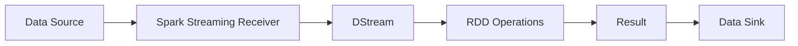

# Spark Streaming实时流处理原理与代码实例讲解

关键词：Spark Streaming, 实时流处理, DStream, 数据处理, 大数据

## 1. 背景介绍
### 1.1  问题的由来
在当今大数据时代,海量数据以前所未有的速度不断产生和累积。如何对这些实时产生的数据进行快速、高效地处理和分析,已成为众多企业和组织面临的重大挑战。传统的批处理模式难以满足实时性要求,因此流式数据处理应运而生。
### 1.2  研究现状
目前业界流行的实时流处理框架主要有Storm、Flink和Spark Streaming等。其中,Spark Streaming基于Spark平台,利用其快速调度能力和强大的内存计算引擎,能够以很低的延迟处理海量数据流,在实时流处理领域占据重要地位。
### 1.3  研究意义
深入研究Spark Streaming的实时流处理原理和应用实践,对于掌握大数据处理核心技术、应对海量实时数据挑战具有重要意义。同时也为相关企业应用Spark Streaming进行实时数据分析提供参考。
### 1.4  本文结构
本文将围绕Spark Streaming展开,首先介绍流处理的核心概念,然后深入剖析Spark Streaming的原理和数据处理流程,并通过数学模型讲解窗口计算等关键机制。接着给出具体的代码实例和应用场景,最后总结Spark Streaming的特点并展望其未来发展。

## 2. 核心概念与联系
在讨论Spark Streaming之前,我们先来了解一下流处理的几个核心概念：
- 数据流(Stream):是指随时间流动的、无界的数据序列。数据以事件(event)的形式持续到达。
- 数据源(Source):数据流的输入源,可以是消息队列(Kafka)、文件系统(HDFS)、网络套接字(Socket)等。
- 数据汇(Sink):数据经处理后的输出位置,如存储系统、数据库等。
- 窗口(Window):在无界数据流上进行操作时,需要划分数据片段,即窗口。窗口可以是时间窗口(如每5秒)或数量窗口(如每100个事件)。

Spark Streaming是建立在Spark之上的流处理框架,它将输入数据流以时间片(秒级)的方式切分并生成DStream(Discretized Stream),即转化为一系列连续的RDD(弹性分布式数据集),并对DStream进行类似RDD的操作,最终将结果输出。



## 3. 核心算法原理 & 具体操作步骤
### 3.1  算法原理概述
Spark Streaming的核心是将输入数据流切分为一系列时间片,每个时间片形成一个RDD,然后对DStream中的RDD进行类似批处理的操作,如map、reduce等转换操作(Transformation)和输出操作(Output)。多个RDD的转换形成有向无环图DAG(Directed Acyclic Graph)。
### 3.2  算法步骤详解
Spark Streaming的数据处理主要分为以下步骤:

1. 数据摄入:通过Receiver从数据源接收数据流,并将数据切分为时间片,每个时间片形成一个RDD。
2. 数据处理:对DStream中的RDD进行各种转换操作,如map、filter、reduce、join等,生成新的RDD。
3. 数据输出:将处理后的RDD结果输出到外部数据汇,如HDFS、数据库等。
4. 任务调度:Spark根据DStream的转换关系构建DAG图,并生成Job提交到集群运行,完成实时计算。

### 3.3  算法优缺点
Spark Streaming的优点主要有:

- 低延迟:秒级的数据处理延迟,满足实时性需求。
- 高吞吐:基于Spark的内存计算,具有很高的吞吐量。
- 容错性:自动容错机制,可从节点失效中恢复。
- 易用性:接口与Spark Core类似,学习成本低。

但Spark Streaming也存在一些局限:
- 不支持毫秒级别的流处理。
- 时间片的大小需要权衡延迟和吞吐量。

### 3.4  算法应用领域
Spark Streaming广泛应用于需要实时数据处理和分析的场景,如:
- 实时监控:如应用性能、服务器指标等的实时监控。
- 实时推荐:根据用户行为实时分析并推荐内容。
- 欺诈检测:实时识别异常行为和交易。
- 日志分析:网站点击流日志的实时分析。

## 4. 数学模型和公式 & 详细讲解 & 举例说明
### 4.1  数学模型构建
Spark Streaming的窗口计算是实时分析的重要手段。我们以时间窗口为例,建立如下数学模型:

设输入数据流 $S=\{s_1,s_2,...,s_n\}$,时间轴划分为等长度的时间片 $T=\{t_1,t_2,...,t_m\}$,窗口长度为 $L$,滑动步长为 $\delta$。则第 $i$ 个时间窗口 $w_i$ 包含的数据为:

$$w_i = \{s_j | (i-1)\delta \leq j < (i-1)\delta+L\}$$

### 4.2  公式推导过程
根据上述定义,我们可以推导出窗口的数量 $N$:

$$N = \lfloor \frac{m-L}{\delta} \rfloor + 1$$

其中 $\lfloor x \rfloor$ 表示对 $x$ 向下取整。

对于每个窗口 $w_i$,我们可以进行聚合计算,如求和:

$$sum(w_i) = \sum_{s_j \in w_i} s_j$$

### 4.3  案例分析与讲解
假设我们有一个数据流,每秒产生一个数值。现在要求每5秒计算一次过去10秒的数据之和,即窗口长度为10秒,滑动步长为5秒。

设第 $i$ 个窗口起始时间为 $t_i$,则该窗口包含的数据为 $\{s_{t_i},s_{t_i+1},...,s_{t_i+9}\}$。窗口的数量为:

$$N = \lfloor \frac{n-10}{5} \rfloor + 1$$

每个窗口的求和公式为:

$$sum(w_i) = \sum_{j=t_i}^{t_i+9} s_j$$

通过Spark Streaming的reduceByWindow算子,可以方便地实现上述窗口计算。

### 4.4  常见问题解答
Q:如何选择窗口的长度和滑动步长?
A:需要根据具体业务需求权衡。窗口越长,计算的数据量越大,延迟越高;步长越小,窗口重叠度越高,计算越频繁。一般可以将窗口长度设为分析所需的最小时间范围,滑动步长设为可接受的最大延迟。

Q:窗口是否支持并行计算?
A:支持。Spark Streaming会自动对窗口进行分区,在集群中并行计算。

## 5. 项目实践：代码实例和详细解释说明
### 5.1  开发环境搭建
首先需要搭建Spark Streaming的开发环境,主要包括:
- Java/Scala开发环境
- Spark发行版
- 数据源,如Kafka、Socket等

可以在本地模式或集群模式下运行Spark Streaming。

### 5.2  源代码详细实现
下面给出一个使用Spark Streaming进行单词计数的Scala代码示例:

```scala
import org.apache.spark._
import org.apache.spark.streaming._

object NetworkWordCount {
  def main(args: Array[String]) {
    // 创建SparkConf和StreamingContext
    val conf = new SparkConf().setAppName("NetworkWordCount")
    val ssc = new StreamingContext(conf, Seconds(1))

    // 创建DStream,连接到Socket数据源
    val lines = ssc.socketTextStream("localhost", 9999)

    // 对DStream进行操作
    val words = lines.flatMap(_.split(" "))
    val pairs = words.map(word => (word, 1))
    val wordCounts = pairs.reduceByKey(_ + _)

    // 打印结果
    wordCounts.print()

    // 启动流计算
    ssc.start()
    ssc.awaitTermination()
  }
}
```

### 5.3  代码解读与分析
上述代码主要步骤如下:

1. 创建SparkConf对象,设置应用名称。
2. 创建StreamingContext对象,传入SparkConf和批次时间间隔(1秒)。
3. 通过socketTextStream方法创建DStream,连接到指定主机和端口的Socket。
4. 对DStream进行类似RDD的转换操作:flatMap将每行切分为单词,map将每个单词转为(单词,1)的键值对,reduceByKey对相同单词的计数进行累加。
5. 打印每个批次的计算结果。
6. 启动流计算,并等待终止。

可以看到,Spark Streaming的编程模型与Spark Core类似,将对RDD的操作应用到DStream上即可实现流式计算。

### 5.4  运行结果展示
在本地运行上述代码,并通过netcat向指定端口发送数据:

```bash
$ nc -lk 9999
hello world
hello spark
```

在控制台可以看到每秒打印的单词计数结果:

```
-------------------------------------------
Time: 1539843601000 ms
-------------------------------------------
(hello,1)
(world,1)

-------------------------------------------
Time: 1539843602000 ms
-------------------------------------------
(hello,1)
(spark,1)
```

## 6. 实际应用场景
Spark Streaming在实际中有广泛的应用,下面列举几个典型场景:

- 网站实时统计分析:统计网站的PV、UV等指标,分析热门页面、访问来源等。
- 电商实时推荐:根据用户的浏览、购买行为,实时推荐相关商品。
- 物联网数据实时处理:对传感器采集的数据进行实时清洗、过滤、聚合分析。
- 金融风控实时监测:实时识别异常交易、防范金融欺诈。

### 6.4  未来应用展望
随着5G、人工智能等新技术的发展,Spark Streaming有望应用到更多实时处理场景:
- 自动驾驶:实时处理车载传感器数据,辅助决策。
- 智慧城市:实时分析交通流量、环境监测数据等,优化城市管理。
- 智能制造:设备状态实时监控,预测性维护。

## 7. 工具和资源推荐
### 7.1  学习资源推荐
- 官方文档:Spark Streaming Programming Guide
- 书籍:《Spark快速大数据分析》、《Spark: The Definitive Guide》
- 视频教程:Spark Streaming实战

### 7.2  开发工具推荐
- IDE:Intellij IDEA、Eclipse
- 构建工具:Maven、SBT
- 集群管理:Spark Standalone、YARN、Mesos

### 7.3  相关论文推荐
- Discretized Streams: Fault-Tolerant Streaming Computation at Scale
- Structured Streaming: A Declarative API for Real-Time Applications in Apache Spark

### 7.4  其他资源推荐
- Spark官网:http://spark.apache.org/
- Spark Github:https://github.com/apache/spark
- Spark社区:https://spark.apache.org/community.html

## 8. 总结：未来发展趋势与挑战
### 8.1  研究成果总结
本文系统地介绍了Spark Streaming的实时流处理原理,从核心概念、数据处理流程到窗口计算模型,结合代码实例讲解了Spark Streaming的编程和应用。Spark Streaming是流处理领域的重要工具,具有低延迟、高吞吐、易用等特点。

### 8.2  未来发展趋势
展望未来,Spark Streaming有以下发展趋势:
- 结构化流处理:Structured Streaming将成为主流的流处理API。
- 机器学习流处理:与MLlib深度集成,支持在线学习。
- 云原生部署:基于Kubernetes等云平台的自动化部署和管理。

### 8.3  面临的挑战
但Spark Streaming仍面临一些挑战:
- 流批一体:如何实现流处理与批处理的无缝集成。
- 低延迟优化:进一步降低端到端延迟,实现毫秒级处理。
- 资源动态调度:根据负载动态调整资源分