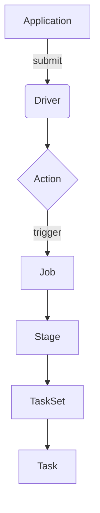

# Spark Task原理与代码实例讲解

## 1. 背景介绍

### 1.1 问题的由来

在大数据时代,海量数据的存储和处理成为了一个巨大的挑战。Apache Spark作为一种快速、通用的大规模数据处理引擎,凭借其优秀的性能和易用性,成为了当前最流行的大数据处理框架之一。Spark的核心抽象是弹性分布式数据集(Resilient Distributed Dataset, RDD),它将数据集划分为多个分区(Partition),并行处理这些分区。而Task正是Spark执行计划中最小的工作单元,负责对RDD分区进行转换操作。理解Task的原理对于充分利用Spark的并行计算能力至关重要。

### 1.2 研究现状  

Spark Task的执行涉及多个核心概念,如Job、Stage、TaskSet等,彼此之间存在复杂的关系。目前,已有不少研究对Spark Task的执行机制进行了探讨,但大多数只是对某一个特定方面进行了阐述,缺乏对整个执行流程的全面解析。此外,现有研究往往过于理论化,缺乏结合实际代码示例的深入剖析,给开发者的实践指导不足。

### 1.3 研究意义

深入剖析Spark Task的执行原理和实现细节,有助于开发者全面把握Spark的内在运行机制,进而能够编写出更高效的Spark应用程序。同时,结合代码实例的讲解也能够帮助开发者更好地将理论知识内化为实践经验,提高代码质量和开发效率。此外,本文还将探讨Spark Task的数学模型,有助于开发者从理论层面深入理解Task调度和执行的本质。

### 1.4 本文结构  

本文将从以下几个方面全面解析Spark Task:

- 核心概念与联系:介绍Task及其相关的核心概念,阐明它们之间的关系
- 核心算法原理:深入讲解Task的执行流程和调度算法原理  
- 数学模型和公式:构建Task调度的数学模型,并给出公式推导过程
- 项目实践:提供基于Spark的实际代码示例,并对关键代码进行解读分析
- 实际应用场景:介绍Task在实际大数据应用中的应用情况
- 工具和资源推荐:推荐相关的学习资源、开发工具和论文等
- 总结与展望:总结研究成果,并展望Spark Task未来的发展趋势和挑战

## 2. 核心概念与联系

在深入探讨Spark Task的原理之前,我们需要先了解与之密切相关的几个核心概念,以及它们之间的关联。

1. **Application**: Spark应用程序,是用户编写的Spark程序入口。

2. **Driver**: Application在Spark集群中的驱动进程,负责整个应用的调度和监控。

3. **Action**: 触发Spark作业(Job)执行的操作,如foreach、count、collect等。

4. **Job**: 由一个Action触发生成的并行计算任务,包含一个或多个Stage。

5. **Stage**: 每个Job会被拆分为更小的组成单元Stage,一个Stage由许多并行Task构成。

6. **TaskSet**: 一个Stage中并行的Task集合,按照分区(Partition)的数量进行划分。

7. **Task**: 最小的工作单元,负责对RDD分区执行具体的计算操作。

上图展示了Spark中这些核心概念之间的层级关系。当用户触发一个Action操作时,Spark会根据RDD的分区情况,将这个Action拆分为一个Job,再进一步拆分为多个Stage,每个Stage包含一个TaskSet,TaskSet中包含多个并行的Task。Task作为最小的工作单元,负责对RDD分区进行具体的计算和转换操作。

## 3. 核心算法原理 & 具体操作步骤  

### 3.1 算法原理概述

Spark Task的执行过程遵循一定的调度算法,这个算法的核心思想是尽可能地利用集群资源,实现数据局部性计算,从而最大化任务执行的并行度和效率。算法主要包括以下几个步骤:

1. **Task分发**:Driver根据TaskSet中的Task数量,以及Executor的空闲情况,将Task分发给各个Executor执行。

2. **数据本地化**:在分发Task时,Spark会尽量将Task分发到存有相应数据分区的节点上,以实现数据本地化,避免不必要的数据传输。

3. **动态负载均衡**:如果某个Executor空闲,而其他Executor仍有大量待执行的Task,Spark会动态地从繁忙的Executor中窃取部分Task,分配给空闲的Executor,从而实现负载均衡。

4. **容错与重试**:如果某个Task执行失败,Spark会自动对其进行重新调度和重试,直到成功执行为止。

5. **结果汇总**:所有Task执行完毕后,Spark会将各个Task的执行结果进行汇总,得到最终的计算结果。

### 3.2 算法步骤详解

下面我们对Spark Task调度算法的具体步骤进行详细解析:

1. **Task分发**

   Driver根据TaskSet中的Task数量,以及各个Executor的资源情况(CPU核数、内存等),将Task均匀地分发给Executor执行。分发策略采用轮询(Round-Robin)的方式,即将第1个Task分发给第1个Executor,第2个Task分发给第2个Executor,依次类推。当所有Executor都被分发了Task后,再从第1个Executor开始循环分发剩余的Task。

2. **数据本地化**

   在分发Task时,Spark会尽量将Task分发到存有相应数据分区的节点上,以实现数据本地化计算。Spark将数据本地化划分为几个级别:

   - PROCESS_LOCAL:数据分区存储在当前Executor的进程中
   - NODE_LOCAL:数据分区存储在同一台机器的另一个进程中 
   - NO_PREF:数据分区存储在集群的其他节点
   - ANY:不考虑数据本地性

   Spark会优先选择PROCESS_LOCAL级别的节点执行Task,如果没有,则选择NODE_LOCAL,再没有则选择NO_PREF,最后是ANY。这样可以最大限度地减少数据的网络传输,提高计算效率。

3. **动态负载均衡**

   为了充分利用集群资源,Spark采用动态负载均衡策略。具体来说,如果某个Executor空闲,而其他Executor仍有大量未完成的Task,Driver会从繁忙的Executor中窃取部分Task,分配给空闲的Executor执行。这样可以避免某些Executor长期空闲浪费资源,同时也能防止个别Executor过载导致性能下降。

   Spark采用延迟调度(Delay Scheduling)算法实现动态负载均衡。当一个Task准备就绪时,如果它所需的数据分区已经存在于某个Executor中,Spark会先将这个Task分配给该Executor。否则,Spark会将这个Task放入一个延迟调度池中等待。如果这个Task在一定时间内仍未被调度,Spark会尝试将其分配给任意一个空闲的Executor。

4. **容错与重试** 

   在分布式环境中,Task执行失败是不可避免的,比如由于节点故障、网络问题等原因。为了提高系统的容错能力,Spark采用了基于RDD的容错机制。具体来说,如果某个Task执行失败,Spark会根据该Task所处理的RDD分区,重新计算并生成这个分区的数据,然后启动一个新的Task来重新执行计算。

   此外,Spark还设置了Task最大重试次数的限制,默认为4次。如果某个Task连续重试4次仍然失败,Spark会直接放弃该Task,并将这个Job标记为失败状态。

5. **结果汇总**

   当所有Task执行完毕后,Spark会将各个Task的执行结果进行汇总,得到最终的计算结果。具体来说,每个Task在执行完毕后,会将其结果保存到自身的TaskResult对象中。Driver会定期从各个Executor中拉取TaskResult,并将这些结果进行合并,最终形成整个Job的最终结果。

### 3.3 算法优缺点

Spark Task调度算法的主要优点包括:

1. **高并行度**:通过将RDD划分为多个分区,并为每个分区分配一个Task,可以充分利用集群资源,实现高度并行计算。

2. **数据本地性**:优先将Task分发到存有相应数据分区的节点上执行,可以减少数据传输,提高计算效率。

3. **动态负载均衡**:采用延迟调度算法,可以动态地将Task从繁忙节点调度到空闲节点,充分利用集群资源。

4. **容错能力强**:基于RDD的容错机制,可以在Task执行失败时自动重试,提高系统的可靠性。

5. **易于扩展**:Spark采用了master-worker架构,新增或删除节点时无需重新启动应用,易于横向扩展。

但该算法也存在一些缺点和局限性:

1. **延迟较高**:由于需要进行数据本地化和动态负载均衡,会增加一定的调度延迟。对于需要实时响应的应用,延迟可能会成为瓶颈。

2. **内存开销大**:Spark采用了基于内存计算的架构,对内存的需求较大,可能会限制应用的规模。

3. **数据倾斜**:如果RDD分区的数据分布不均匀,会导致部分Task的计算量远大于其他Task,造成数据倾斜问题。

4. **容错代价高**:虽然Spark具有容错能力,但重新计算RDD分区的代价较高,对迭代型算法的性能影响较大。

### 3.4 算法应用领域

Spark Task调度算法主要应用于以下几个领域:

1. **大数据处理**:由于Spark具有高度的并行性和容错能力,非常适合用于大规模数据集的处理和分析,如日志分析、推荐系统等。

2. **机器学习**:Spark MLlib提供了丰富的机器学习算法,可以高效地对大规模数据进行训练和预测,如逻辑回归、决策树等。

3. **流式计算**:Spark Streaming可以实时地从各种数据源(如Kafka、Flume等)获取数据流,并进行实时处理和分析。

4. **图计算**:Spark GraphX提供了专门用于图数据处理的API,可以高效地执行图遍历、页面排名等算法。

5. **SQL查询**:Spark SQL支持使用SQL语句对结构化数据进行查询,并提供了性能优化功能,如代数优化、代码生成等。

总的来说,Spark Task调度算法的高度并行性和容错能力使其非常适合处理大规模、复杂的数据处理任务,在大数据、机器学习、流式计算等领域有着广泛的应用前景。

## 4. 数学模型和公式 & 详细讲解 & 举例说明

为了更好地理解Spark Task调度算法的本质,我们可以构建相应的数学模型,并给出公式推导过程。

### 4.1 数学模型构建

假设我们有一个Job需要执行,它被划分为m个Stage,每个Stage包含n个Task。我们的目标是最小化整个Job的执行时间。

令:

- $T_{ij}$ 表示第i个Stage的第j个Task的执行时间
- $S_i$ 表示第i个Stage的执行时间,等于该Stage中所有Task执行时间的最大值
- $J$ 表示整个Job的执行时间,等于所有Stage执行时间之和

则有:

$$J = \sum_{i=1}^{m}S_i$$
$$S_i = \max_{1 \leq j \leq n}T_{ij}$$

我们的目标是最小化J,即:

$$\min J = \min \sum_{i=1}^{m}\max_{1 \leq j \leq n}T_{ij}$$

对于每个Task $T_{ij}$,它的执行时间可以进一步拆分为:

- $D_{ij}$:Task读取输入数据的时间
- $C_{ij}$:Task执行计算的时间
- $W_{ij}$:Task等待被调度的时间

则有:

$$T_{ij} = D_{ij} + C_{ij} + W_{ij}$$

我们的目标就是最小化每个Task的执行时间之和,从而最小化整个