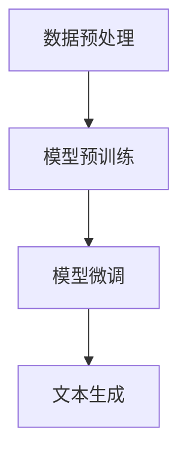

# AIGC从入门到实战：ChatGPT 简介：从 GPT-1 到 GPT-4 的发展历程和应用领域

## 1.背景介绍

### 1.1 人工智能生成内容（AIGC）的兴起

人工智能生成内容（AIGC，Artificial Intelligence Generated Content）是近年来人工智能领域的一个重要分支。AIGC技术通过机器学习和深度学习算法，能够自动生成文本、图像、音频和视频等多种形式的内容。随着计算能力的提升和算法的进步，AIGC在各个行业中的应用越来越广泛。

### 1.2 GPT 系列模型的诞生

GPT（Generative Pre-trained Transformer）系列模型是由OpenAI开发的一系列自然语言处理（NLP）模型。自2018年发布GPT-1以来，GPT系列模型在生成文本方面取得了显著的进展。GPT模型的核心思想是通过大规模预训练和微调，使模型能够生成高质量的自然语言文本。

### 1.3 文章目的

本文旨在介绍从GPT-1到GPT-4的发展历程，深入探讨其核心概念、算法原理、数学模型和实际应用场景，并提供代码实例和工具资源推荐，帮助读者全面了解和掌握ChatGPT技术。

## 2.核心概念与联系

### 2.1 生成式预训练模型

生成式预训练模型（Generative Pre-trained Model）是指通过大规模无监督预训练，然后在特定任务上进行微调的模型。GPT系列模型采用了这种方法，通过在海量文本数据上进行预训练，使模型具备生成自然语言文本的能力。

### 2.2 Transformer 架构

Transformer架构是GPT系列模型的基础。Transformer通过自注意力机制（Self-Attention Mechanism）和多头注意力机制（Multi-Head Attention Mechanism），能够高效地处理序列数据。其核心组件包括编码器（Encoder）和解码器（Decoder），但GPT模型只使用了解码器部分。

### 2.3 自回归模型

GPT模型是自回归模型（Autoregressive Model），即通过前一步的输出作为下一步的输入，逐步生成文本。自回归模型的优点是能够生成连贯的文本，但也存在生成速度较慢的问题。

### 2.4 预训练与微调

预训练（Pre-training）是指在大规模无标签数据上训练模型，使其学习通用的语言表示。微调（Fine-tuning）是指在特定任务上对预训练模型进行进一步训练，使其适应特定任务的需求。GPT模型通过预训练和微调相结合，能够在多种NLP任务中表现出色。

## 3.核心算法原理具体操作步骤

### 3.1 数据预处理

数据预处理是GPT模型训练的第一步。包括文本清洗、分词、去除停用词等步骤。预处理后的数据将用于模型的预训练。

### 3.2 模型预训练

模型预训练是指在大规模无标签数据上训练GPT模型。预训练的目标是使模型学习到通用的语言表示。预训练的具体步骤如下：

1. 初始化模型参数。
2. 输入预处理后的文本数据。
3. 通过自注意力机制计算每个词的表示。
4. 通过多头注意力机制整合不同注意力头的信息。
5. 通过前馈神经网络（Feed-Forward Neural Network）进行非线性变换。
6. 计算损失函数，更新模型参数。

### 3.3 模型微调

模型微调是指在特定任务上对预训练模型进行进一步训练。微调的具体步骤如下：

1. 加载预训练模型。
2. 输入特定任务的数据。
3. 通过前向传播计算输出。
4. 计算损失函数，更新模型参数。

### 3.4 文本生成

文本生成是GPT模型的最终目标。生成文本的具体步骤如下：

1. 输入初始文本。
2. 通过自回归机制逐步生成下一个词。
3. 重复步骤2，直到生成完整的文本。

以下是GPT模型的工作流程图：



## 4.数学模型和公式详细讲解举例说明

### 4.1 自注意力机制

自注意力机制是Transformer的核心组件。其计算公式如下：

$$
\text{Attention}(Q, K, V) = \text{softmax}\left(\frac{QK^T}{\sqrt{d_k}}\right)V
$$

其中，$Q$、$K$、$V$分别表示查询矩阵、键矩阵和值矩阵，$d_k$表示键矩阵的维度。

### 4.2 多头注意力机制

多头注意力机制通过并行计算多个自注意力头的信息，并将其整合。其计算公式如下：

$$
\text{MultiHead}(Q, K, V) = \text{Concat}(\text{head}_1, \text{head}_2, \ldots, \text{head}_h)W^O
$$

其中，$\text{head}_i = \text{Attention}(QW_i^Q, KW_i^K, VW_i^V)$，$W_i^Q$、$W_i^K$、$W_i^V$和$W^O$是可训练的权重矩阵。

### 4.3 损失函数

GPT模型的损失函数是交叉熵损失函数（Cross-Entropy Loss），其计算公式如下：

$$
L = -\sum_{i=1}^N y_i \log(\hat{y}_i)
$$

其中，$y_i$表示真实标签，$\hat{y}_i$表示模型预测的概率。

### 4.4 示例说明

假设我们有一个简单的句子生成任务，输入文本为“我爱”，目标是生成“我爱编程”。通过自回归机制，GPT模型逐步生成下一个词，直到生成完整的句子。

1. 输入初始文本“我爱”。
2. 通过自注意力机制计算“我爱”的表示。
3. 通过多头注意力机制整合不同注意力头的信息。
4. 通过前馈神经网络生成下一个词“编程”。
5. 重复步骤2-4，直到生成完整的句子“我爱编程”。

## 5.项目实践：代码实例和详细解释说明

### 5.1 环境配置

首先，我们需要配置Python环境，并安装相关的库：

```bash
pip install torch transformers
```

### 5.2 加载预训练模型

接下来，我们加载预训练的GPT模型：

```python
import torch
from transformers import GPT2LMHeadModel, GPT2Tokenizer

# 加载预训练模型和分词器
model_name = 'gpt2'
model = GPT2LMHeadModel.from_pretrained(model_name)
tokenizer = GPT2Tokenizer.from_pretrained(model_name)
```

### 5.3 文本生成

我们可以使用预训练模型生成文本：

```python
# 输入初始文本
input_text = "我爱"
input_ids = tokenizer.encode(input_text, return_tensors='pt')

# 生成文本
output = model.generate(input_ids, max_length=20, num_return_sequences=1)

# 解码生成的文本
generated_text = tokenizer.decode(output[0], skip_special_tokens=True)
print(generated_text)
```

### 5.4 代码解释

1. 加载预训练模型和分词器：我们使用`transformers`库加载预训练的GPT模型和分词器。
2. 输入初始文本：将初始文本编码为模型输入的张量。
3. 生成文本：使用模型生成文本，设置最大生成长度为20。
4. 解码生成的文本：将生成的张量解码为自然语言文本。

## 6.实际应用场景

### 6.1 文本生成

GPT模型可以用于生成高质量的自然语言文本，应用于新闻生成、小说创作、对话系统等领域。

### 6.2 机器翻译

通过微调，GPT模型可以用于机器翻译任务，实现多语言之间的自动翻译。

### 6.3 问答系统

GPT模型可以用于构建智能问答系统，回答用户提出的问题。

### 6.4 文本摘要

GPT模型可以用于生成文本摘要，提取长文档的关键信息。

### 6.5 情感分析

通过微调，GPT模型可以用于情感分析任务，判断文本的情感倾向。

## 7.工具和资源推荐

### 7.1 开源库

- [Transformers](https://github.com/huggingface/transformers)：由Hugging Face开发的开源库，支持多种预训练模型，包括GPT系列模型。
- [PyTorch](https://pytorch.org/)：深度学习框架，支持GPU加速，适用于训练和部署GPT模型。

### 7.2 数据集

- [OpenAI GPT-2 Dataset](https://github.com/openai/gpt-2-output-dataset)：OpenAI发布的GPT-2生成的文本数据集。
- [Common Crawl](https://commoncrawl.org/)：大规模网页抓取数据集，可用于GPT模型的预训练。

### 7.3 在线资源

- [OpenAI Blog](https://openai.com/blog/)：OpenAI官方博客，发布最新的研究成果和技术动态。
- [Hugging Face Model Hub](https://huggingface.co/models)：提供多种预训练模型和微调模型，方便用户下载和使用。

## 8.总结：未来发展趋势与挑战

### 8.1 未来发展趋势

1. **模型规模的进一步扩大**：随着计算能力的提升，未来的GPT模型将会更加庞大，具备更强的生成能力。
2. **多模态生成**：未来的AIGC技术将不仅限于文本生成，还将扩展到图像、音频和视频等多种模态的生成。
3. **个性化生成**：未来的GPT模型将能够根据用户的偏好和需求，生成个性化的内容。

### 8.2 面临的挑战

1. **计算资源的需求**：训练大规模GPT模型需要大量的计算资源，如何高效利用计算资源是一个重要挑战。
2. **生成内容的质量**：尽管GPT模型生成的文本质量已经很高，但仍然存在生成内容不连贯、不准确的问题。
3. **伦理和法律问题**：AIGC技术的广泛应用带来了伦理和法律问题，如生成虚假信息、侵犯版权等。

## 9.附录：常见问题与解答

### 9.1 GPT模型的训练需要多长时间？

训练GPT模型的时间取决于模型的规模和计算资源。一般来说，训练大规模GPT模型需要数周甚至数月的时间。

### 9.2 如何选择预训练模型？

选择预训练模型时，可以根据任务的需求和模型的性能进行选择。Hugging Face Model Hub提供了多种预训练模型，用户可以根据需要下载和使用。

### 9.3 如何提高生成文本的质量？

提高生成文本的质量可以通过以下方法：
1. 使用更大规模的预训练模型。
2. 在特定任务上进行微调。
3. 使用多样化的数据进行训练。

### 9.4 GPT模型可以用于哪些NLP任务？

GPT模型可以用于多种NLP任务，包括文本生成、机器翻译、问答系统、文本摘要和情感分析等。

### 9.5 如何部署GPT模型？

部署GPT模型可以使用深度学习框架（如PyTorch）和云服务（如AWS、GCP）进行部署。Hugging Face提供了多种部署工具和教程，方便用户将模型部署到生产环境中。

---

作者：禅与计算机程序设计艺术 / Zen and the Art of Computer Programming