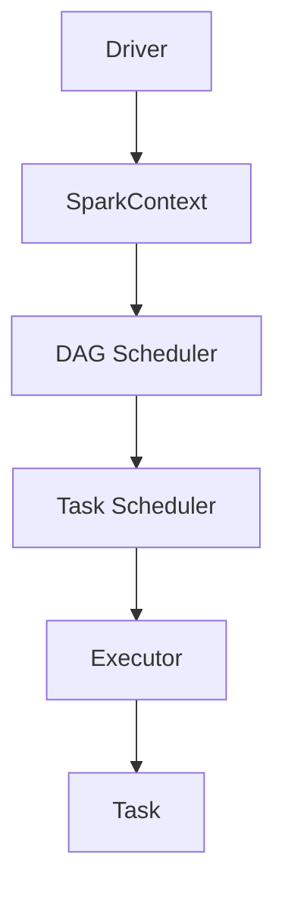

# Spark原理与代码实例讲解

## 1.背景介绍

Apache Spark 是一个快速、通用、可扩展的大数据处理引擎。自2014年开源以来，Spark迅速成为大数据处理领域的明星项目。其核心优势在于高效的内存计算能力、丰富的API支持以及强大的生态系统。Spark不仅支持批处理，还支持流处理、机器学习和图计算等多种计算模式。

### 1.1 大数据处理的挑战

在大数据时代，数据量的爆炸式增长给传统的数据处理工具带来了巨大的挑战。传统的MapReduce框架虽然强大，但其两次磁盘I/O操作导致了性能瓶颈。如何在保证数据处理能力的同时，提高计算效率，成为了大数据处理领域的核心问题。

### 1.2 Spark的诞生

Spark由加州大学伯克利分校的AMPLab实验室开发，旨在解决MapReduce的性能瓶颈问题。通过将数据加载到内存中进行计算，Spark显著提高了数据处理的速度。此外，Spark还提供了丰富的高级API，使得开发者可以更加方便地进行大数据处理。

## 2.核心概念与联系

在深入了解Spark的工作原理之前，我们需要掌握一些核心概念。这些概念是理解Spark如何高效处理大数据的基础。

### 2.1 RDD（弹性分布式数据集）

RDD是Spark的核心抽象，代表一个不可变的分布式数据集。RDD支持两种操作：转换（Transformation）和行动（Action）。转换操作会生成新的RDD，而行动操作则会触发实际的计算。

### 2.2 DAG（有向无环图）

Spark通过DAG来表示计算任务。每个RDD的转换操作都会生成一个新的DAG节点，而行动操作则会触发DAG的执行。DAG的设计使得Spark可以进行任务优化和调度，从而提高计算效率。

### 2.3 SparkContext

SparkContext是Spark应用的入口点。它负责与集群管理器（如YARN、Mesos）通信，分配资源并启动任务。通过SparkContext，用户可以创建RDD并执行转换和行动操作。

### 2.4 Executor

Executor是Spark的工作单元，负责执行具体的计算任务。每个Executor在启动时会分配一定的内存和CPU资源，并在任务完成后将结果返回给Driver。

### 2.5 Driver

Driver是Spark应用的主控程序，负责生成DAG、调度任务并收集结果。Driver通过SparkContext与集群管理器通信，并将任务分配给Executor执行。

以下是Spark核心组件的Mermaid流程图：



## 3.核心算法原理具体操作步骤

Spark的核心算法主要包括RDD的转换和行动操作。通过这些操作，用户可以对大数据进行高效的处理。

### 3.1 RDD的转换操作

转换操作是惰性执行的，即只有在行动操作触发时才会实际计算。常见的转换操作包括：

- `map`：对RDD中的每个元素进行操作，生成一个新的RDD。
- `filter`：对RDD中的每个元素进行过滤，保留满足条件的元素。
- `flatMap`：对RDD中的每个元素进行操作，生成一个新的RDD，并将结果展平。
- `groupByKey`：对RDD中的键值对进行分组，生成一个新的RDD。
- `reduceByKey`：对RDD中的键值对进行聚合，生成一个新的RDD。

### 3.2 RDD的行动操作

行动操作会触发实际的计算，并返回结果。常见的行动操作包括：

- `collect`：将RDD中的所有元素收集到Driver中。
- `count`：计算RDD中的元素个数。
- `reduce`：对RDD中的元素进行聚合，返回一个结果。
- `saveAsTextFile`：将RDD中的元素保存到文件中。

### 3.3 DAG的生成与执行

当用户对RDD进行转换操作时，Spark会生成一个DAG。DAG表示了RDD之间的依赖关系。当用户执行行动操作时，DAG会被提交给DAG调度器进行优化和调度。DAG调度器会将DAG分解成多个Stage，每个Stage包含一组可以并行执行的任务。任务调度器会将任务分配给Executor执行，并将结果返回给Driver。

## 4.数学模型和公式详细讲解举例说明

在大数据处理过程中，数学模型和公式是不可或缺的。下面我们通过一个具体的例子来说明Spark中的数学模型和公式。

### 4.1 线性回归模型

线性回归是一种常见的机器学习算法，用于预测连续值。其数学模型如下：

$$
y = \beta_0 + \beta_1 x_1 + \beta_2 x_2 + \cdots + \beta_n x_n + \epsilon
$$

其中，$y$ 是预测值，$x_1, x_2, \ldots, x_n$ 是特征值，$\beta_0, \beta_1, \ldots, \beta_n$ 是模型参数，$\epsilon$ 是误差项。

### 4.2 梯度下降算法

梯度下降是一种常见的优化算法，用于最小化损失函数。其更新公式如下：

$$
\beta_j := \beta_j - \alpha \frac{\partial J(\beta)}{\partial \beta_j}
$$

其中，$\alpha$ 是学习率，$J(\beta)$ 是损失函数，$\frac{\partial J(\beta)}{\partial \beta_j}$ 是损失函数对参数 $\beta_j$ 的偏导数。

### 4.3 线性回归在Spark中的实现

在Spark中，我们可以使用MLlib库来实现线性回归。以下是一个具体的代码示例：

```scala
import org.apache.spark.ml.regression.LinearRegression
import org.apache.spark.sql.SparkSession

val spark = SparkSession.builder.appName("Linear Regression Example").getOrCreate()
val training = spark.read.format("libsvm").load("data/mllib/sample_linear_regression_data.txt")

val lr = new LinearRegression()
val lrModel = lr.fit(training)

println(s"Coefficients: ${lrModel.coefficients} Intercept: ${lrModel.intercept}")
```

## 5.项目实践：代码实例和详细解释说明

为了更好地理解Spark的工作原理，我们通过一个具体的项目实例来进行讲解。假设我们有一个大规模的日志数据集，需要统计每个IP地址的访问次数。

### 5.1 数据准备

首先，我们需要准备一个日志数据集。假设数据格式如下：

```
192.168.1.1 - - [10/Oct/2020:13:55:36 +0000] "GET /index.html HTTP/1.1" 200 1043
192.168.1.2 - - [10/Oct/2020:13:55:37 +0000] "GET /about.html HTTP/1.1" 200 2048
...
```

### 5.2 代码实现

以下是使用Spark进行日志分析的代码示例：

```scala
import org.apache.spark.{SparkConf, SparkContext}

val conf = new SparkConf().setAppName("Log Analysis").setMaster("local")
val sc = new SparkContext(conf)

val logFile = "hdfs://path/to/logfile"
val logData = sc.textFile(logFile)

val ipCounts = logData
  .map(line => line.split(" ")(0))
  .map(ip => (ip, 1))
  .reduceByKey(_ + _)

ipCounts.saveAsTextFile("hdfs://path/to/output")
```

### 5.3 详细解释

1. **SparkContext初始化**：首先，我们创建一个SparkConf对象，并设置应用名称和运行模式。然后，通过SparkConf对象创建一个SparkContext对象。
2. **读取数据**：使用SparkContext的textFile方法读取日志数据。该方法会返回一个RDD，每个元素代表日志文件中的一行。
3. **数据处理**：通过map操作提取每行日志中的IP地址，并将其转换为键值对。然后，通过reduceByKey操作对相同IP地址的访问次数进行累加。
4. **保存结果**：使用saveAsTextFile方法将结果保存到HDFS中。

## 6.实际应用场景

Spark在实际应用中有着广泛的应用场景。以下是几个典型的应用场景：

### 6.1 数据处理与ETL

Spark可以高效地处理大规模数据，并支持多种数据源（如HDFS、S3、Cassandra等）。通过Spark的转换和行动操作，用户可以方便地进行数据清洗、转换和加载（ETL）操作。

### 6.2 实时流处理

Spark Streaming是Spark的实时流处理框架，可以处理实时数据流。通过将数据流分成小批次进行处理，Spark Streaming可以实现低延迟的实时数据处理。

### 6.3 机器学习

Spark MLlib是Spark的机器学习库，提供了丰富的机器学习算法（如分类、回归、聚类等）。通过MLlib，用户可以方便地进行大规模机器学习模型的训练和预测。

### 6.4 图计算

Spark GraphX是Spark的图计算框架，提供了丰富的图计算算法（如PageRank、Connected Components等）。通过GraphX，用户可以方便地进行大规模图数据的分析和处理。

## 7.工具和资源推荐

在使用Spark进行大数据处理时，以下工具和资源可以帮助你提高效率：

### 7.1 开发工具

- **IntelliJ IDEA**：一款强大的IDE，支持Scala和Java开发。
- **Jupyter Notebook**：一个交互式的笔记本，支持Python和Scala开发。

### 7.2 数据源

- **HDFS**：Hadoop分布式文件系统，适用于大规模数据存储。
- **S3**：Amazon的对象存储服务，支持大规模数据存储和访问。

### 7.3 资源推荐

- **Spark官方文档**：提供了详细的API文档和使用指南。
- **Databricks社区版**：一个免费的Spark集群，适用于学习和实验。

## 8.总结：未来发展趋势与挑战

Spark作为大数据处理领域的明星项目，已经在多个领域得到了广泛应用。然而，随着数据量的不断增长和应用场景的不断扩展，Spark也面临着一些挑战和发展机遇。

### 8.1 未来发展趋势

- **统一数据处理平台**：未来，Spark将进一步整合批处理、流处理、机器学习和图计算，成为一个统一的数据处理平台。
- **性能优化**：通过改进DAG调度器和任务调度器，Spark将进一步提高计算效率和资源利用率。
- **生态系统扩展**：随着社区的不断发展，Spark的生态系统将进一步扩展，提供更多的工具和库。

### 8.2 面临的挑战

- **资源管理**：在大规模集群中，如何高效地管理和调度资源是一个重要的挑战。
- **容错性**：在分布式环境中，如何保证任务的高可用性和容错性是一个重要的问题。
- **数据安全**：在处理敏感数据时，如何保证数据的安全性和隐私性是一个重要的挑战。

## 9.附录：常见问题与解答

### 9.1 Spark与Hadoop的区别是什么？

Spark和Hadoop都是大数据处理框架，但它们有一些关键区别。Hadoop主要依赖磁盘I/O进行数据处理，而Spark则通过内存计算提高了处理速度。此外，Spark提供了更丰富的高级API，支持多种计算模式。

### 9.2 如何调优Spark应用的性能？

调优Spark应用的性能可以从以下几个方面入手：

- **合理设置并行度**：通过调整分区数和并行任务数，提高资源利用率。
- **优化内存使用**：通过调整内存参数和缓存策略，提高内存利用率。
- **减少数据倾斜**：通过合理的分区策略和数据预处理，减少数据倾斜问题。

### 9.3 Spark支持哪些编程语言？

Spark支持多种编程语言，包括Scala、Java、Python和R。用户可以根据自己的需求选择合适的编程语言进行开发。

### 9.4 如何处理Spark中的数据倾斜问题？

数据倾斜是指某些分区的数据量过大，导致计算负载不均衡的问题。可以通过以下方法处理数据倾斜问题：

- **调整分区策略**：通过合理的分区策略，均衡数据分布。
- **数据预处理**：在数据处理前，对数据进行预处理，减少数据倾斜。
- **使用随机化算法**：通过引入随机化算法，均衡数据分布。

### 9.5 Spark的容错机制是怎样的？

Spark通过RDD的血统（Lineage）信息实现容错机制。当一个RDD的分区丢失时，Spark可以通过血统信息重新计算该分区的数据。此外，Spark还支持数据检查点（Checkpoint），可以将中间结果保存到磁盘，提高容错性。

---

作者：禅与计算机程序设计艺术 / Zen and the Art of Computer Programming