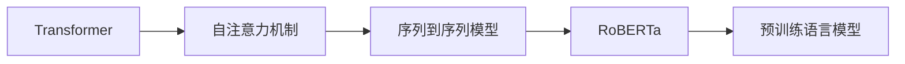

# Transformer大模型实战 了解RoBERTa

作者：禅与计算机程序设计艺术 / Zen and the Art of Computer Programming

## 1. 背景介绍
### 1.1 问题的由来

自从2017年Google提出Transformer模型以来，自然语言处理(NLP)领域发生了翻天覆地的变化。Transformer模型以其强大的并行计算能力和优秀的性能表现，成为了NLP领域的主流模型。基于Transformer的预训练语言模型，如BERT、GPT-3等，在多项NLP任务上取得了突破性的成果。然而，Transformer模型也存在一些问题，如训练效率低、计算量大、参数量庞大等。

为了解决这些问题，研究人员不断探索和改进Transformer模型。其中，RoBERTa模型是继BERT之后，又一个备受关注的Transformer模型。RoBERTa模型在多个NLP任务上取得了SOTA（State-of-the-Art）的成绩，并引发了学术界和工业界的广泛关注。本文将深入探讨RoBERTa模型的原理、实现和应用，帮助读者全面了解这一重要的NLP技术。

### 1.2 研究现状

目前，基于Transformer的预训练语言模型已经成为NLP领域的主流技术。除了BERT、GPT-3等模型之外，还有许多基于Transformer的改进模型，如RoBERTa、ALBERT、DistilBERT等。这些模型在各个NLP任务上都取得了显著的成果，推动了NLP技术的发展。

### 1.3 研究意义

RoBERTa模型作为Transformer模型的重要改进，具有重要的研究意义：

1. 提高模型性能：RoBERTa模型在多个NLP任务上取得了SOTA成绩，推动了NLP技术的发展。
2. 提升训练效率：RoBERTa模型通过改进训练策略，降低了训练时间和计算量，提高了训练效率。
3. 优化模型结构：RoBERTa模型对Transformer模型进行了优化，提高了模型的可解释性和鲁棒性。

### 1.4 本文结构

本文将按照以下结构展开：

1. 介绍Transformer模型和RoBERTa模型的原理。
2. 详细讲解RoBERTa模型的算法步骤和具体操作。
3. 分析RoBERTa模型的优缺点。
4. 展示RoBERTa模型在实际应用中的案例。
5. 推荐RoBERTa模型的学习资源和开发工具。
6. 总结RoBERTa模型的未来发展趋势和挑战。

## 2. 核心概念与联系

### 2.1 Transformer模型

Transformer模型是一种基于自注意力机制的深度神经网络，适用于序列到序列的任务。自注意力机制允许模型在处理序列数据时，考虑到序列中各个位置的上下文信息，从而捕捉到更丰富的语义信息。

### 2.2 RoBERTa模型

RoBERTa模型是基于Transformer模型改进的预训练语言模型。与BERT模型相比，RoBERTa模型在预训练过程中使用了更多的预训练数据和更先进的训练策略，从而取得了更好的性能。

### 2.3 关系图



## 3. 核心算法原理 & 具体操作步骤
### 3.1 算法原理概述

RoBERTa模型的核心原理是自注意力机制和预训练语言模型。

1. **自注意力机制**：自注意力机制允许模型在处理序列数据时，考虑到序列中各个位置的上下文信息，从而捕捉到更丰富的语义信息。
2. **预训练语言模型**：预训练语言模型通过在大规模语料库上预训练，学习到丰富的语言知识和常识，为下游任务提供强大的语义表示。

### 3.2 算法步骤详解

RoBERTa模型的训练过程分为两个阶段：

1. **预训练阶段**：在预训练阶段，RoBERTa模型使用大规模语料库进行预训练，学习到丰富的语言知识和常识。
2. **微调阶段**：在微调阶段，RoBERTa模型使用下游任务的标注数据进行微调，以适应特定的任务需求。

### 3.3 算法优缺点

#### 优点

1. **性能优异**：RoBERTa模型在多个NLP任务上取得了SOTA成绩。
2. **训练效率高**：RoBERTa模型通过改进训练策略，降低了训练时间和计算量，提高了训练效率。
3. **可解释性强**：RoBERTa模型的可解释性强，研究人员可以更容易地理解模型的决策过程。

#### 缺点

1. **计算量大**：RoBERTa模型的参数量庞大，训练和推理需要较高的计算资源。
2. **对预训练数据依赖性强**：RoBERTa模型在预训练阶段需要使用大量的预训练数据，数据获取成本较高。

### 3.4 算法应用领域

RoBERTa模型可以应用于以下NLP任务：

1. **文本分类**：如情感分析、主题分类、观点极性分类等。
2. **文本摘要**：如自动文摘、关键信息提取等。
3. **命名实体识别**：如人名识别、地点识别、组织机构识别等。
4. **问答系统**：如事实问答、机器阅读理解等。

## 4. 数学模型和公式 & 详细讲解 & 举例说明
### 4.1 数学模型构建

RoBERTa模型的核心是Transformer模型，其数学模型如下：

$$
y = f(x; \theta)
$$

其中，$x$ 表示输入序列，$y$ 表示输出序列，$\theta$ 表示模型参数。

### 4.2 公式推导过程

#### 自注意力机制

自注意力机制的计算公式如下：

$$
\text{query} = W_Q \text{key} = W_K \text{value} = \text{input}
$$

$$
\text{self-attention} = \text{softmax}\left(\frac{\text{query} \cdot \text{key}^T}{\sqrt{d_k}}\right) \cdot \text{value}
$$

其中，$W_Q$、$W_K$、$W_V$ 分别表示查询、键、值的权重矩阵，$d_k$ 表示键的维度。

#### Transformer模型

Transformer模型由多个自注意力层和前馈神经网络层堆叠而成。其计算公式如下：

$$
\text{output} = \text{Layer Normalization}\left(\text{Layer}\left(\text{input}\right)\right)
$$

其中，$\text{Layer}$ 表示一个包含自注意力层和前馈神经网络层的Transformer层，$\text{Layer Normalization}$ 表示层归一化。

### 4.3 案例分析与讲解

以情感分析任务为例，使用RoBERTa模型进行微调的过程如下：

1. **数据预处理**：将文本数据转换为词向量表示。
2. **模型初始化**：加载预训练的RoBERTa模型。
3. **数据加载**：将预处理后的数据加载到训练集中。
4. **模型训练**：使用训练数据对RoBERTa模型进行微调。
5. **模型评估**：使用测试数据评估模型的性能。

### 4.4 常见问题解答

**Q1：为什么自注意力机制比循环神经网络(RNN)更有效？**

A：自注意力机制可以并行计算，而RNN需要逐个处理序列中的元素，因此自注意力机制在处理长序列时具有更高的效率。

**Q2：RoBERTa模型的预训练数据如何获取？**

A：RoBERTa模型的预训练数据可以从预训练语言模型的官方网站下载。

**Q3：如何优化RoBERTa模型的性能？**

A：可以通过以下方法优化RoBERTa模型的性能：

1. 选择合适的预训练模型。
2. 使用更多的预训练数据。
3. 优化训练策略，如学习率调整、正则化等。
4. 使用更高级的模型结构，如Transformer-XL等。

## 5. 项目实践：代码实例和详细解释说明
### 5.1 开发环境搭建

1. 安装Python和PyTorch。
2. 安装Hugging Face的Transformers库。

### 5.2 源代码详细实现

以下是一个使用PyTorch和Transformers库进行RoBERTa微调的简单示例：

```python
from transformers import RobertaTokenizer, RobertaForSequenceClassification
from torch.utils.data import DataLoader, RandomSampler, SequentialSampler
from torch.optim import AdamW

# 加载预训练的RoBERTa模型和分词器
model = RobertaForSequenceClassification.from_pretrained('roberta-base')
tokenizer = RobertaTokenizer.from_pretrained('roberta-base')

# 加载数据集
train_dataset = ... # 加载训练数据集
test_dataset = ... # 加载测试数据集

# 初始化优化器
optimizer = AdamW(model.parameters(), lr=5e-5)

# 训练模型
for epoch in range(3): # 训练3个epoch
    # 训练数据集
    train_loader = DataLoader(train_dataset, batch_size=16, sampler=RandomSampler(train_dataset))
    # 遍历训练数据集
    for batch in train_loader:
        # 前向传播
        outputs = model(input_ids=batch['input_ids'], attention_mask=batch['attention_mask'], labels=batch['labels'])
        # 计算损失
        loss = outputs.loss
        # 反向传播
        loss.backward()
        optimizer.step()
        optimizer.zero_grad()
```

### 5.3 代码解读与分析

上述代码展示了使用PyTorch和Transformers库进行RoBERTa微调的简单流程：

1. 加载预训练的RoBERTa模型和分词器。
2. 加载数据集。
3. 初始化优化器。
4. 训练模型。

### 5.4 运行结果展示

在训练完成后，可以使用测试数据集评估模型的性能。以下是一个评估模型的示例：

```python
from sklearn.metrics import accuracy_score

# 评估模型
test_loader = DataLoader(test_dataset, batch_size=16, sampler=SequentialSampler(test_dataset))
model.eval()
y_true, y_pred = [], []
for batch in test_loader:
    # 前向传播
    outputs = model(input_ids=batch['input_ids'], attention_mask=batch['attention_mask'])
    # 获取预测结果
    y_pred.extend(outputs.logits.argmax(dim=-1).tolist())
    y_true.extend(batch['labels'].tolist())

# 计算准确率
accuracy = accuracy_score(y_true, y_pred)
print(f"Accuracy: {accuracy}")
```

## 6. 实际应用场景
### 6.1 情感分析

RoBERTa模型可以用于情感分析任务，如判断文本的情感倾向（正面、中性、负面）。

### 6.2 文本分类

RoBERTa模型可以用于文本分类任务，如将新闻标题分类到不同的主题。

### 6.3 问答系统

RoBERTa模型可以用于问答系统，如基于给定的问题和上下文，回答用户的问题。

## 7. 工具和资源推荐
### 7.1 学习资源推荐

1. 《Transformer：原理与实战》
2. 《NLP技术全解》
3. Hugging Face官网：https://huggingface.co/

### 7.2 开发工具推荐

1. PyTorch
2. Transformers库：https://huggingface.co/

### 7.3 相关论文推荐

1. "Attention is All You Need"（Transformer原论文）
2. "A Simple and General Method for Language Pre-training"（BERT论文）
3. "RoBERTa: A Robustly Optimized BERT Pretraining Approach"（RoBERTa论文）

### 7.4 其他资源推荐

1. arXiv论文预印本：https://arxiv.org/
2. NLP社区论坛：https://discuss.huggingface.co/

## 8. 总结：未来发展趋势与挑战
### 8.1 研究成果总结

RoBERTa模型作为Transformer模型的重要改进，在多个NLP任务上取得了SOTA成绩，推动了NLP技术的发展。RoBERTa模型的提出，使得基于Transformer的预训练语言模型在性能、效率、可解释性等方面取得了显著提升。

### 8.2 未来发展趋势

未来，基于Transformer的预训练语言模型将继续在以下方向取得进展：

1. 模型规模的扩大：随着计算资源的提升，模型规模将进一步扩大，以更好地捕捉语言知识。
2. 训练效率的提升：通过改进训练算法和硬件设施，提高模型训练效率。
3. 模型可解释性的增强：提高模型的可解释性，使模型决策过程更加透明。
4. 模型安全性的保障：提高模型安全性，防止恶意攻击和滥用。

### 8.3 面临的挑战

基于Transformer的预训练语言模型在发展过程中也面临着以下挑战：

1. 计算资源消耗：模型规模扩大将带来计算资源消耗的显著增加。
2. 数据隐私问题：模型训练需要大量数据，数据隐私问题需要得到关注。
3. 模型歧视和偏见：模型可能存在歧视和偏见，需要采取措施消除。

### 8.4 研究展望

未来，基于Transformer的预训练语言模型将在以下方向进行深入研究：

1. 模型压缩和加速：研究模型压缩和加速技术，降低模型复杂度和计算量。
2. 多模态预训练：将预训练扩展到多模态数据，如文本、图像、视频等。
3. 模型可解释性和鲁棒性：提高模型的可解释性和鲁棒性，使其更加安全可靠。

总之，基于Transformer的预训练语言模型在NLP领域具有广阔的应用前景。随着研究的不断深入，相信这些模型将在各个领域发挥更大的作用，为人类创造更多价值。

## 9. 附录：常见问题与解答

**Q1：RoBERTa模型的预训练数据如何获取？**

A：RoBERTa模型的预训练数据可以从预训练语言模型的官方网站下载。

**Q2：如何使用RoBERTa模型进行文本分类？**

A：使用RoBERTa模型进行文本分类需要以下步骤：

1. 加载预训练的RoBERTa模型和分词器。
2. 将文本数据转换为词向量表示。
3. 使用预处理后的数据对RoBERTa模型进行微调。
4. 使用微调后的模型对新的文本数据进行分类。

**Q3：RoBERTa模型在哪些NLP任务上取得了SOTA成绩？**

A：RoBERTa模型在多个NLP任务上取得了SOTA成绩，如文本分类、文本摘要、问答系统等。

**Q4：如何评估RoBERTa模型的性能？**

A：可以使用以下指标评估RoBERTa模型的性能：

1. 准确率
2. 召回率
3. F1值
4. AUC值

**Q5：RoBERTa模型的优缺点是什么？**

A：RoBERTa模型的优点包括：

1. 性能优异
2. 训练效率高
3. 可解释性强

RoBERTa模型的缺点包括：

1. 计算量大
2. 对预训练数据依赖性强

作者：禅与计算机程序设计艺术 / Zen and the Art of Computer Programming