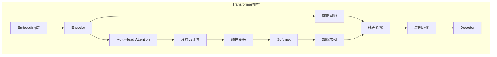

# Transformer大模型实战 多头注意力层

## 1. 背景介绍

### 1.1 问题的由来

在自然语言处理(NLP)和序列建模任务中,长期以来都存在一个核心挑战:如何有效地捕捉输入序列中的长程依赖关系。传统的循环神经网络(RNN)和长短期记忆网络(LSTM)在处理长序列时,由于梯度消失和爆炸问题,难以充分捕捉序列中的远程依赖关系。为了解决这一挑战,Transformer模型应运而生。

Transformer是一种全新的基于注意力机制的神经网络架构,它完全摒弃了RNN和卷积的结构,利用自注意力(Self-Attention)机制来直接建模序列中任意两个位置之间的依赖关系。这种全新的架构设计使得Transformer能够更高效地并行计算,同时也能更好地捕捉长程依赖关系,从而在诸多序列建模任务中取得了突破性的进展。

### 1.2 研究现状

自2017年Transformer模型被提出以来,它在机器翻译、文本生成、语音识别等多个NLP任务中表现出色,成为了该领域的主流模型之一。随后,Transformer的思想也被推广应用到了计算机视觉(CV)、推荐系统等其他领域,取得了卓越的成绩。

在NLP领域,以BERT、GPT、XLNet等为代表的大型预训练Transformer模型,通过在大规模无监督语料上预训练,再将预训练模型迁移到下游任务上进行微调,极大地提升了模型性能。这些大模型在多项公开基准测试中屡次刷新纪录,推动了NLP技术的飞速发展。

### 1.3 研究意义

作为Transformer模型的核心组件之一,多头注意力层(Multi-Head Attention)是整个模型的"大脑",它决定了模型能否高效地捕捉输入序列中的长程依赖关系。因此,深入理解多头注意力层的原理和实现细节,对于掌握Transformer模型的本质至关重要。

本文将全面解析多头注意力层的工作原理、数学模型、实现细节和代码实践,为读者提供一个完整的认知路径。通过理解这一核心组件,读者将能更好地把握Transformer模型的本质,从而在实际应用中更高效地利用和优化这一革命性的模型架构。

### 1.4 本文结构

本文将按照以下结构展开:

1. 背景介绍
2. 核心概念与联系
3. 核心算法原理与具体操作步骤
4. 数学模型和公式详细讲解与举例说明
5. 项目实践:代码实例和详细解释说明
6. 实际应用场景
7. 工具和资源推荐
8. 总结:未来发展趋势与挑战
9. 附录:常见问题与解答

## 2. 核心概念与联系

在深入探讨多头注意力层之前,我们先来回顾一下Transformer模型的核心概念和组件,以及它们之间的联系。

如上图所示,Transformer模型主要由以下几个核心组件构成:

- **Embedding层**: 将输入的词元(token)映射为向量表示
- **Encoder**: 编码输入序列,捕捉序列中的上下文信息
    - **Multi-Head Attention**: 核心注意力机制,用于建模序列中任意两个位置之间的依赖关系
    - **前馈网络(Feed-Forward Network)**: 对每个位置的表示进行非线性变换
    - **残差连接(Residual Connection)**: 将输入和输出相加,以更好地传递梯度
    - **层规范化(Layer Normalization)**: 对每层的输出进行归一化,提高模型稳定性
- **Decoder**: 基于Encoder的输出生成目标序列

其中,多头注意力层是Transformer模型的大脑和核心所在。它通过计算输入序列中每个位置与其他所有位置的注意力权重,从而捕捉序列中的长程依赖关系,这正是Transformer模型区别于RNN和CNN的关键所在。

## 3. 核心算法原理与具体操作步骤

### 3.1 算法原理概述

多头注意力层的核心思想是将注意力机制从单一注意力头扩展到多个并行的注意力头。每个注意力头都会从不同的表示子空间来捕捉输入序列中的依赖关系,最终将所有注意力头的结果拼接在一起,形成最终的注意力表示。

这种设计可以让模型同时关注来自不同表示子空间的信息,增强了模型对输入序列的建模能力。此外,多头注意力层还允许并行计算多个注意力头,从而提高了计算效率。

具体来说,多头注意力层包含以下几个关键步骤:

1. **线性投影**: 将输入分别投影到查询(Query)、键(Key)和值(Value)空间
2. **注意力计算**: 计算每个位置与其他所有位置的注意力权重
3. **加权求和**: 根据注意力权重对值向量进行加权求和,得到注意力表示
4. **拼接与线性变换**: 将多个注意力头的结果拼接,并进行线性变换

我们将在后续章节中详细解析每个步骤的数学原理和实现细节。

### 3.2 算法步骤详解

现在,我们来一步步剖析多头注意力层的具体实现过程:

1. **线性投影**

   给定一个输入序列 $X = (x_1, x_2, \ldots, x_n)$,其中 $x_i \in \mathbb{R}^{d_\text{model}}$ 表示第 $i$ 个位置的向量表示。我们将输入 $X$ 分别投影到查询(Query)、键(Key)和值(Value)空间,得到投影矩阵 $Q$、$K$ 和 $V$:

   $$
   \begin{aligned}
   Q &= XW^Q \\
   K &= XW^K \\
   V &= XW^V
   \end{aligned}
   $$

   其中 $W^Q \in \mathbb{R}^{d_\text{model} \times d_k}$、$W^K \in \mathbb{R}^{d_\text{model} \times d_k}$ 和 $W^V \in \mathbb{R}^{d_\text{model} \times d_v}$ 分别是可学习的投影矩阵。

2. **注意力计算**

   对于每个查询向量 $q_i \in Q$,我们需要计算它与所有键向量 $K$ 的相似性,得到一个注意力分数向量 $\alpha_i$:

   $$
   \alpha_i = \text{softmax}\left(\frac{q_i K^\top}{\sqrt{d_k}}\right)
   $$

   其中,分母 $\sqrt{d_k}$ 是为了防止点积的值过大导致梯度饱和。

3. **加权求和**

   利用注意力分数向量 $\alpha_i$,我们可以对值向量 $V$ 进行加权求和,得到第 $i$ 个位置的注意力表示 $z_i$:

   $$
   z_i = \alpha_i V
   $$

4. **多头注意力**

   为了捕捉更多不同的依赖关系,我们将上述过程重复执行 $h$ 次(即有 $h$ 个注意力头),得到 $h$ 个不同的注意力表示 $Z^1, Z^2, \ldots, Z^h$。然后,我们将这些注意力表示拼接在一起,并进行线性变换,得到最终的多头注意力表示 $Z$:

   $$
   Z = \text{Concat}(Z^1, Z^2, \ldots, Z^h)W^O
   $$

   其中 $W^O \in \mathbb{R}^{hd_v \times d_\text{model}}$ 是可学习的线性变换矩阵。

通过上述步骤,多头注意力层就能够高效地捕捉输入序列中的长程依赖关系,为Transformer模型的编码和解码过程提供了强大的表示能力。

### 3.3 算法优缺点

**优点**:

1. **并行计算能力强**: 与RNN不同,多头注意力层可以高效地并行计算,从而加快训练速度。
2. **长程依赖建模能力强**: 通过直接计算任意两个位置之间的注意力权重,多头注意力层能够有效捕捉输入序列中的长程依赖关系。
3. **表示能力强**: 多个注意力头从不同的表示子空间捕捉依赖关系,增强了模型的表示能力。

**缺点**:

1. **计算复杂度高**: 需要计算输入序列中每个位置与其他所有位置的注意力权重,计算量随序列长度的平方增长。
2. **缺乏位置信息**: 原始的注意力机制无法直接获取序列中元素的位置信息,需要额外引入位置编码。
3. **缺乏归纳偏置**: 与CNN不同,注意力机制缺乏对局部模式的归纳偏置,可能需要更多的数据和计算资源来学习有效的表示。

### 3.4 算法应用领域

多头注意力层作为Transformer模型的核心组件,其应用领域主要包括:

1. **自然语言处理(NLP)**
   - 机器翻译
   - 文本生成
   - 文本分类
   - 阅读理解
   - 等等

2. **计算机视觉(CV)**
   - 图像分类
   - 目标检测
   - 图像分割
   - 等等

3. **语音识别**
4. **推荐系统**
5. **生成对抗网络(GAN)**
6. **强化学习**
7. **等等**

总的来说,只要是涉及序列建模的任务,多头注意力层和Transformer模型都可能发挥重要作用。

## 4. 数学模型和公式详细讲解与举例说明

在上一节中,我们已经介绍了多头注意力层的核心算法原理和具体操作步骤。现在,我们将进一步深入探讨其背后的数学模型和公式,并通过具体案例来加深理解。

### 4.1 数学模型构建

我们将从输入序列 $X = (x_1, x_2, \ldots, x_n)$ 开始构建多头注意力层的数学模型,其中 $x_i \in \mathbb{R}^{d_\text{model}}$ 表示第 $i$ 个位置的向量表示。

首先,我们需要将输入 $X$ 分别投影到查询(Query)、键(Key)和值(Value)空间,得到投影矩阵 $Q$、$K$ 和 $V$:

$$
\begin{aligned}
Q &= XW^Q \\
K &= XW^K \\
V &= XW^V
\end{aligned}
$$

其中 $W^Q \in \mathbb{R}^{d_\text{model} \times d_k}$、$W^K \in \mathbb{R}^{d_\text{model} \times d_k}$ 和 $W^V \in \mathbb{R}^{d_\text{model} \times d_v}$ 分别是可学习的投影矩阵。

接下来,我们需要计算每个查询向量 $q_i \in Q$ 与所有键向量 $K$ 的相似性,得到一个注意力分数向量 $\alpha_i$:

$$
\alpha_i = \text{softmax}\left(\frac{q_i K^\top}{\sqrt{d_k}}\right)
$$

其中,分母 $\sqrt{d_k}$ 是为了防止点积的值过大导致梯度饱和。

利用注意力分数向量 $\alpha_i$,我们可以对值向量 $V$ 进行加权求和,得到第 $i$ 个位置的注意力表示 $z_i$:

$$
z_i = \alpha_i V
$$

为了捕捉更多不同的依赖关系,我们将上述过程重复执行 $h$ 次(即有 $h$ 个注意力头),得到 $h$ 个不同的注意力表示 $Z^1, Z^2, \ldots, Z^h$。然后,我们将这些注意力表示拼接在一起,并进行线性变换,得到最终的多头注意力表示 $Z