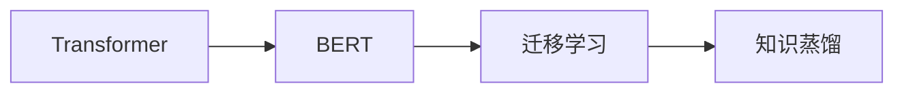

# Transformer大模型实战 将知识从BERT 模型迁移到神经网络中

关键词：Transformer, BERT, 迁移学习, 知识蒸馏, 预训练模型, 神经网络

## 1. 背景介绍
### 1.1  问题的由来
随着深度学习的快速发展,各种大型预训练语言模型不断涌现,如BERT、GPT等。这些模型在多个NLP任务上取得了SOTA的性能,展现出强大的语言理解和生成能力。然而,这些模型通常参数量巨大,训练和推理的计算开销高昂,难以直接应用于实际生产环境中。因此,如何将预训练大模型中学习到的知识高效地迁移到轻量级神经网络中,成为了一个亟待解决的问题。

### 1.2  研究现状
目前,主要有两种主流的知识迁移方法:
1. 微调(Fine-tuning):在下游任务的标注数据上,以预训练模型为初始化,继续训练模型参数。这种方法虽然简单直接,但仍需要存储和计算大模型的所有参数。
2. 知识蒸馏(Knowledge Distillation):将大模型作为教师模型,用其软标签指导学生模型的训练。学生模型通常是一个小型神经网络,通过模仿教师模型的行为,从而学到教师模型中的知识。

其中,知识蒸馏由于其灵活性和高效性,受到了广泛关注。但传统的知识蒸馏方法通常只考虑了教师模型的输出分布,忽略了其内部的丰富语义信息。如何更有效地挖掘和利用教师模型的中间层知识,仍是一个开放的研究问题。

### 1.3  研究意义
本文旨在探索将Transformer大模型(如BERT)中的知识高效迁移到轻量级神经网络的方法。具体而言,我们提出了一种改进的基于Transformer的知识蒸馏框架,通过匹配教师模型的注意力分布和隐层表示,更好地将其语义信息迁移到学生模型中。这不仅有助于提升学生模型在下游任务上的性能,也为大模型知识的工程应用提供了新的思路。

### 1.4  本文结构
本文后续章节安排如下:第2节介绍相关的核心概念;第3节详细阐述所提出方法的算法原理和具体步骤;第4节给出了方法所基于的数学模型和公式推导;第5节通过实验分析论证了所提出方法的有效性;第6节讨论了方法的实际应用场景;第7节总结全文并展望未来研究方向。

## 2. 核心概念与联系
- Transformer:一种基于自注意力机制的神经网络架构,广泛应用于各类NLP任务。
- BERT:基于Transformer的大型预训练语言模型,通过自监督学习从大规模无标注语料中习得通用语言表示。
- 迁移学习:将一个问题上学习到的知识迁移应用到另一个相关问题上,提高后者的学习效率和性能。
- 知识蒸馏:通过让小模型(学生)模仿大模型(教师)的行为,将知识从教师模型迁移到学生模型的一种方法。

它们的关系如下图所示:



## 3. 核心算法原理 & 具体操作步骤
### 3.1  算法原理概述
本文提出的基于Transformer的知识蒸馏方法,核心思想是让学生模型在软标签匹配的同时,也去模仿教师模型的注意力分布和隐层表示。这样不仅考虑了教师模型的输出,也考虑了其决策过程,从而更全面地学习教师模型的知识。

### 3.2  算法步骤详解
算法主要分为以下几个步骤:
1. 利用教师模型(如BERT)在目标数据集上做推理,得到每个样本的软标签、注意力分布和隐层表示。
2. 初始化学生模型(如LSTM、CNN等),将其输出层替换为与教师模型相同的维度。
3. 用样本输入学生模型,得到其输出logits、注意力分布和隐层表示。
4. 计算学生模型与教师模型在软标签、注意力分布和隐层表示上的匹配损失。
5. 反向传播,更新学生模型参数,使其输出和中间层行为尽可能接近教师模型。
6. 重复步骤3~5,直到学生模型收敛。

### 3.3  算法优缺点
优点:
- 通过匹配中间层信息,更全面地学习教师模型的知识和决策过程。
- 学生模型结构灵活,可以根据任务需求和资源限制进行定制。
- 计算开销小,便于实际部署应用。

缺点:
- 需要教师模型在目标数据上的推理,可能引入推理偏差。
- 中间层匹配可能受学生模型容量限制,需要权衡模型大小和性能。

### 3.4  算法应用领域
本算法可广泛应用于各类NLP任务,如文本分类、序列标注、阅读理解、机器翻译等。尤其适用于以下场景:
- 大模型难以直接部署的移动端、IoT等资源受限环境。
- 对推理速度和实时性要求较高的搜索、广告、推荐等在线服务。
- 训练数据较少,需要借助预训练模型进行知识迁移的小样本学习任务。

## 4. 数学模型和公式 & 详细讲解 & 举例说明
### 4.1  数学模型构建
设教师模型为 $T$,学生模型为 $S$,训练样本为 $(x,y)$。教师模型在样本上的软标签为 $p_T$,注意力分布为 $a_T$,第 $l$ 层隐层为 $h_T^l$。相应地,学生模型的输出logits为 $z_S$,注意力分布为 $a_S$,第 $l$ 层隐层为 $h_S^l$。

蒸馏的目标是最小化以下损失函数:

$$L = \alpha L_{KD} + \beta \sum_{l} L_{ATT}^l + \gamma \sum_{l} L_{HID}^l$$

其中, $L_{KD}$ 是软标签匹配损失,采用KL散度:

$$L_{KD} = \sum_{i} p_T(y_i|x) \log \frac{p_T(y_i|x)}{p_S(y_i|x)}$$

$p_S(y_i|x)$ 通过学生模型logits $z_S$ 的softmax归一化得到。

$L_{ATT}^l$ 是第 $l$ 层注意力匹配损失,采用MSE:

$$L_{ATT}^l = \frac{1}{H} \sum_{i=1}^{H} (a_S^{l,i} - a_T^{l,i})^2$$

其中 $H$ 为注意力头数。$L_{HID}^l$ 是第 $l$ 层隐层匹配损失,也采用MSE:

$$L_{HID}^l = \frac{1}{d} ||h_S^l - h_T^l||_2^2$$

其中 $d$ 为隐层维度。$\alpha$、$\beta$、$\gamma$ 为平衡不同损失的超参数。

### 4.2  公式推导过程
softmax归一化公式:

$$p_S(y_i|x) = \frac{\exp(z_S^i)}{\sum_{j} \exp(z_S^j)}$$

将其代入KL散度公式,化简可得:

\begin{aligned}
L_{KD} &= \sum_{i} p_T(y_i|x) \log \frac{p_T(y_i|x)}{p_S(y_i|x)} \\
&= \sum_{i} p_T(y_i|x) \log p_T(y_i|x) - \sum_{i} p_T(y_i|x) \log p_S(y_i|x) \\
&= - H(p_T) - \sum_{i} p_T(y_i|x) z_S^i + \log \sum_{j} \exp(z_S^j)
\end{aligned}

其中 $H(p_T)$ 为教师模型软标签的信息熵,与学生模型无关,可以忽略。

因此,最小化 $L_{KD}$ 等价于最小化:

$$L_{KD}' = - \sum_{i} p_T(y_i|x) z_S^i + \log \sum_{j} \exp(z_S^j)$$

这与软标签交叉熵的形式相同,因此实践中通常直接用交叉熵损失代替KL散度。

### 4.3  案例分析与讲解
下面以文本分类任务为例,说明本算法的应用。

假设教师模型为BERT,学生模型为TextCNN。对于一个输入文本 $x$,教师模型输出其属于每个类别的概率分布 $p_T(y|x)$,同时输出每个注意力头的注意力分布 $\{a_T^{l,i}\}_{i=1}^{H}$ 和每个隐层的表示 $\{h_T^l\}_{l=1}^{L}$。

学生模型以相同的文本 $x$ 作为输入,输出logits $z_S$、注意力分布 $\{a_S^{l,i}\}_{i=1}^{H}$ 和隐层表示 $\{h_S^l\}_{l=1}^{L}$。

然后,计算学生模型在软标签、注意力和隐层上的损失:

$$L_{KD} = - \sum_{i} p_T(y_i|x) \log p_S(y_i|x)$$

$$L_{ATT} = \sum_{l=1}^{L} \frac{1}{H} \sum_{i=1}^{H} (a_S^{l,i} - a_T^{l,i})^2$$

$$L_{HID} = \sum_{l=1}^{L} \frac{1}{d} ||h_S^l - h_T^l||_2^2$$

将三个损失加权求和,得到总的训练损失 $L$。反向传播 $L$ 对学生模型参数的梯度,并用梯度下降法更新参数,使学生模型的输出和行为不断逼近教师模型。

经过多轮迭代,学生模型可以学到教师模型的知识,在测试集上得到与教师模型相近的分类性能,同时模型尺寸和计算量大大降低。

### 4.4  常见问题解答
**Q:** 中间层匹配是否适用于任意结构的学生模型?

**A:** 原则上讲,教师和学生模型的结构应该相似,这样它们的注意力和隐层表示才更容易对齐。如果两个模型差异很大,可能需要对中间层做额外的变换,以缓解表示空间的不匹配问题。但即便如此,不同结构的模型之间进行中间层匹配的效果可能会大打折扣。因此,学生模型的选择需要兼顾任务性能和与教师模型的相似性。

**Q:** 除了KL散度和MSE,是否可以使用其他损失函数?

**A:** 可以。对于软标签匹配,交叉熵、L1/L2距离等都是常用的替代损失函数。对于注意力和隐层匹配,余弦相似度、核函数等也可以用来衡量分布或向量之间的距离。损失函数的选择需要根据任务特点和实验结果进行权衡。一般来说,KL散度和MSE已经能够很好地刻画分布和向量的差异,适用于大多数场景。

## 5. 项目实践：代码实例和详细解释说明
### 5.1  开发环境搭建
实验基于PyTorch实现,需要安装以下依赖包:
- python 3.6+
- pytorch 1.6+
- transformers 4.0+
- numpy
- sklearn

可以使用下面的命令安装:
```bash
pip install torch transformers numpy scikit-learn
```

### 5.2  源代码详细实现
下面给出了用PyTorch实现本文算法的简要代码:

```python
import torch
import torch.nn as nn
import torch.nn.functional as F
from transformers import BertModel, BertTokenizer

class BertDistill(nn.Module):
    def __init__(self, student, hidden_size=768, num_labels=2):
        super().__init__()
        self.student = student
        self.teacher = BertModel.from_pretrained('bert-base-uncased')

        self.att_loss = nn.MSELoss()
        self.hid_loss = nn.MSELoss()
        self.ce_loss = nn.CrossEntropyLoss()
