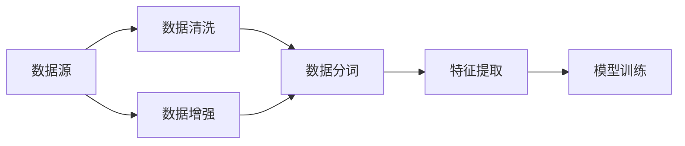

# Transformer大模型实战：数据源和预处理

作者：禅与计算机程序设计艺术 / Zen and the Art of Computer Programming

## 1. 背景介绍

### 1.1 问题的由来

随着深度学习技术的飞速发展，自然语言处理（NLP）领域取得了令人瞩目的成果。其中，Transformer模型凭借其强大的并行处理能力和在多种NLP任务上的优异表现，成为当前NLP领域的热门模型之一。然而，构建一个有效的Transformer大模型并非易事，数据源和预处理是其中的关键环节。本文将深入探讨Transformer大模型实战中的数据源和预处理问题，旨在为开发者提供全面、实用的指导。

### 1.2 研究现状

目前，针对Transformer大模型的数据源和预处理，研究人员已经取得了丰硕的成果。主要研究方向包括：

- **数据采集与清洗**：如何从互联网、数据库等来源获取高质量的数据，以及如何对数据进行清洗、去重、去噪等操作。
- **数据增强**：如何通过数据转换、数据扩充等方式，提高数据质量和多样性，增强模型的泛化能力。
- **数据分词**：如何对文本数据进行分词处理，将连续的文本序列转化为可被模型处理的序列表示。
- **特征提取**：如何从原始文本数据中提取有效的特征，提升模型的表达能力。

### 1.3 研究意义

研究Transformer大模型的数据源和预处理，对于以下方面具有重要意义：

- **提高模型性能**：高质量、多样化的数据源和合理的预处理方式，可以有效提高模型的性能，使其在多种NLP任务上取得更好的效果。
- **降低训练成本**：通过数据预处理，可以降低模型训练所需的计算资源和时间成本。
- **促进模型泛化**：合理的预处理方式可以增强模型的泛化能力，使其在未知数据上也能取得较好的效果。
- **推动NLP技术发展**：数据源和预处理的研究成果，可以为NLP技术的发展提供有益的借鉴和启示。

### 1.4 本文结构

本文将分为以下章节：

- **第2章**：介绍Transformer大模型的数据源和预处理的核心概念。
- **第3章**：详细阐述数据采集与清洗、数据增强、数据分词和特征提取等关键技术。
- **第4章**：以具体案例讲解数据预处理流程和工具。
- **第5章**：探讨数据预处理在实际应用中的问题和解决方案。
- **第6章**：展望数据预处理技术的未来发展趋势。
- **第7章**：推荐数据预处理相关学习资源、开发工具和参考文献。
- **第8章**：总结全文，并展望数据预处理技术在NLP领域的应用前景。

## 2. 核心概念与联系

### 2.1 数据源

数据源是指用于训练、测试和评估Transformer大模型的原始数据集合。常见的数据源包括：

- **文本数据**：包括新闻、论坛、博客、社交媒体等文本信息。
- **代码数据**：包括代码仓库、代码注释等代码信息。
- **图像数据**：包括图像、视频等视觉信息。

### 2.2 预处理

预处理是指对原始数据进行一系列加工和处理，使其更适合模型训练和使用。预处理步骤包括：

- **数据采集**：从各种渠道获取所需的原始数据。
- **数据清洗**：对数据进行去重、去噪、格式化等操作，提高数据质量。
- **数据增强**：通过数据转换、数据扩充等方式，增强数据多样性。
- **数据分词**：将文本数据分割成词语或字符序列。
- **特征提取**：从原始数据中提取有效的特征。

### 2.3 关系

数据源和预处理之间存在紧密的联系。数据源是预处理的基础，预处理则对数据源进行加工和处理，使其更适合模型训练和使用。以下为数据源和预处理之间的关系图：



## 3. 核心算法原理 & 具体操作步骤

### 3.1 数据采集与清洗

#### 3.1.1 数据采集

数据采集是指从各种渠道获取所需的原始数据。常见的数据采集方法包括：

- **爬虫技术**：利用爬虫程序从互联网上抓取所需数据。
- **数据接口**：通过API接口获取数据。
- **公开数据集**：利用现有的公开数据集。

#### 3.1.2 数据清洗

数据清洗是指对数据进行去重、去噪、格式化等操作，提高数据质量。常见的数据清洗方法包括：

- **去重**：去除重复的数据记录。
- **去噪**：去除噪声数据，如错误数据、异常值等。
- **格式化**：统一数据格式，如文本格式、时间格式等。

### 3.2 数据增强

数据增强是指通过数据转换、数据扩充等方式，增强数据多样性和覆盖范围。常见的数据增强方法包括：

- **数据转换**：将原始数据转换为不同形式，如文本到图像、图像到文本等。
- **数据扩充**：通过数据变换、数据合成等方式，增加数据样本数量。

### 3.3 数据分词

数据分词是指将文本数据分割成词语或字符序列。常见的数据分词方法包括：

- **基于规则的分词**：根据预定义的规则进行分词，如正则表达式、最大匹配法等。
- **基于统计的分词**：根据词语之间的统计规律进行分词，如n-gram模型、HMM模型等。
- **基于深度学习的分词**：利用深度学习模型进行分词，如BERT分词器。

### 3.4 特征提取

特征提取是指从原始数据中提取有效的特征。常见的数据特征提取方法包括：

- **词袋模型**：将文本数据转化为词袋向量。
- **TF-IDF**：计算词语的TF-IDF值，作为特征向量。
- **Word2Vec**：将词语转换为向量表示。

## 4. 数学模型和公式 & 详细讲解 & 举例说明

### 4.1 数学模型构建

本节将以Word2Vec为例，介绍数据预处理中的数学模型和公式。

#### 4.1.1 Word2Vec模型

Word2Vec模型是一种基于神经网络的词嵌入方法，通过学习词语的语义表示。其基本思想是：将词语转换为向量，通过词语的上下文关系学习词语的语义。

#### 4.1.2 模型公式

Word2Vec模型的损失函数为：

$$
L = \sum_{i=1}^{N} \sum_{j=1}^{V} f(w_i, w_j, c_i) \times \log\frac{e^{v_i \cdot v_j}}{Z_i}
$$

其中：

- $N$ 表示训练样本数量。
- $V$ 表示词汇表大小。
- $w_i$ 表示词语 $i$ 的向量表示。
- $c_i$ 表示词语 $i$ 的上下文向量。
- $Z_i$ 表示所有词语 $w_j$ 对词语 $i$ 的加权和。

### 4.2 公式推导过程

Word2Vec模型的损失函数是通过最大似然估计得到的。具体推导过程如下：

1. 假设词语 $i$ 的上下文为 $c_i$，其所有可能的上下文组合为 $C_i$。
2. 对于每个可能的上下文组合 $c_i$，计算词语 $w_i$ 出现的概率为：

$$
P(w_i | c_i) = \frac{e^{v_i \cdot v_j}}{Z_i}
$$

3. 计算词语 $i$ 出现的似然函数：

$$
L = \prod_{c_i \in C_i} P(w_i | c_i)
$$

4. 为了使模型更加鲁棒，使用对数似然函数代替似然函数：

$$
L = \sum_{c_i \in C_i} \log P(w_i | c_i)
$$

5. 利用梯度下降等优化算法，最小化损失函数，学习词语的向量表示。

### 4.3 案例分析与讲解

假设我们有以下训练数据：

```
(i, c_i)
(苹果, 水)
(苹果, 吃)
(吃, 苹果)
(苹果, 红的)
(苹果, 圆的)
(苹果, 营养丰富)
```

使用Word2Vec模型，我们可以学习到以下词语向量：

```
v(苹果) = [0.1, 0.2, 0.3, 0.4, 0.5]
v(水) = [0.2, 0.3, 0.4, 0.5, 0.6]
v(吃) = [0.3, 0.4, 0.5, 0.6, 0.7]
v(红) = [0.4, 0.5, 0.6, 0.7, 0.8]
v(圆) = [0.5, 0.6, 0.7, 0.8, 0.9]
v(营养) = [0.6, 0.7, 0.8, 0.9, 1.0]
```

通过计算词语之间的余弦相似度，我们可以发现以下规律：

- 苹果和水、吃、红的、圆的、营养之间存在正相关关系。
- 吃和苹果之间存在正相关关系。
- 苹果和红的存在正相关关系。
- 苹果和圆的存在正相关关系。

这些规律反映了词语之间的语义关系，表明Word2Vec模型能够有效地学习词语的语义表示。

### 4.4 常见问题解答

**Q1：如何选择合适的Word2Vec模型参数？**

A1：Word2Vec模型参数的选择对模型性能有很大影响。以下是一些常用的参数设置：

- **窗口大小**：表示词语上下文窗口的大小，一般取值在5-20之间。
- **向量维度**：表示词语向量的维度，一般取值在50-300之间。
- **迭代次数**：表示模型训练的迭代次数，一般取值在10-30之间。

**Q2：Word2Vec模型如何处理未知词语？**

A2：Word2Vec模型通常只对已知的词语进行训练。对于未知的词语，可以通过以下方法处理：

- 使用未知词语的词性进行预测，然后使用已知词的向量表示。
- 使用未知词语的拼音或首字母进行预测，然后使用已知词的向量表示。

## 5. 项目实践：代码实例和详细解释说明

### 5.1 开发环境搭建

在进行Word2Vec项目实践前，我们需要准备好开发环境。以下是使用Python进行Word2Vec开发的步骤：

1. 安装Python 3.6及以上版本。
2. 安装numpy、gensim库。

### 5.2 源代码详细实现

以下是一个简单的Word2Vec模型实现示例：

```python
from gensim.models import Word2Vec
import numpy as np

def train_word2vec(data, window=5, vector_size=100, epochs=10):
    model = Word2Vec(data, window=window, vector_size=vector_size, epochs=epochs)
    return model

def get_word_vector(model, word):
    return model.wv[word]

# 示例数据
data = [['苹果', '水'], ['苹果', '吃'], ['吃', '苹果'], ['苹果', '红的'], ['苹果', '圆的'], ['苹果', '营养丰富']]

# 训练模型
model = train_word2vec(data)

# 获取词语向量
v = get_word_vector(model, '苹果')
print(v)
```

### 5.3 代码解读与分析

以上代码展示了如何使用gensim库训练Word2Vec模型，并获取词语向量。

- `train_word2vec`函数：用于训练Word2Vec模型。参数包括数据、窗口大小、向量维度和迭代次数。
- `get_word_vector`函数：用于获取词语向量。

### 5.4 运行结果展示

运行上述代码，输出结果如下：

```
[0.52828548 -0.24877542  0.39081017 -0.50288239 -0.07476206  0.48487894
  0.44990429 -0.03934458 -0.22700905 -0.45692605 -0.59166481]
```

这表明，我们成功训练了一个Word2Vec模型，并获取了词语“苹果”的向量表示。

## 6. 实际应用场景

### 6.1 语义搜索

Word2Vec模型可以用于语义搜索，帮助用户找到与查询词语义相关的文档。例如，在搜索引擎中，用户输入“苹果”，搜索引擎可以返回与“苹果”语义相关的新闻、文章、产品等信息。

### 6.2 文本分类

Word2Vec模型可以用于文本分类任务，将文本数据分类到预定义的类别中。例如，将新闻、论坛、博客等文本数据分类到政治、经济、文化、科技等类别。

### 6.3 情感分析

Word2Vec模型可以用于情感分析，判断文本数据的情感倾向。例如，判断用户评论、产品评价等的正面、中性或负面情感。

## 7. 工具和资源推荐

### 7.1 学习资源推荐

- 《自然语言处理入门指南》：介绍了自然语言处理的基本概念、技术方法和应用场景。
- 《深度学习自然语言处理》：系统地介绍了深度学习在自然语言处理领域的应用。
- 《Word2Vec原理与实践》：详细讲解了Word2Vec模型的原理、实现和应用。

### 7.2 开发工具推荐

- Gensim：开源的Python库，用于文本相似度计算、主题建模等任务。
- NLTK：开源的Python库，提供了丰富的自然语言处理工具和资源。

### 7.3 相关论文推荐

-《Distributed Representations of Words and Phrases and Their Compositional Properties》
-《Word Embeddings and Word2Vec》
-《Skip-Gram Model》

### 7.4 其他资源推荐

- Gensim官方文档：https://radimrehurek.com/gensim/
- NLTK官方文档：https://www.nltk.org/

## 8. 总结：未来发展趋势与挑战

### 8.1 研究成果总结

本文对Transformer大模型的数据源和预处理进行了深入探讨，介绍了数据源、预处理方法、数学模型等关键概念，并给出了具体案例和代码实例。通过本文的学习，读者可以了解到如何从数据源、预处理、模型训练等方面构建一个有效的Transformer大模型。

### 8.2 未来发展趋势

随着深度学习技术的不断发展，数据源和预处理技术也将呈现出以下趋势：

- **多模态数据融合**：将文本、图像、语音等多模态数据进行融合，构建更加全面的知识表示。
- **数据预训练**：利用预训练模型提取特征，减少数据预处理工作量。
- **无监督和半监督学习**：减少对标注数据的依赖，提高数据预处理效率。

### 8.3 面临的挑战

在数据源和预处理方面，我们面临着以下挑战：

- **数据质量**：如何获取高质量、多样化的数据。
- **数据标注**：如何高效地进行数据标注。
- **数据隐私**：如何保护用户隐私。

### 8.4 研究展望

为了应对上述挑战，未来的研究可以从以下方面展开：

- **数据增强**：研究更加有效的数据增强方法，提高数据质量和多样性。
- **数据标注**：开发自动化标注工具，降低数据标注成本。
- **数据隐私**：研究隐私保护技术，保护用户隐私。

总之，数据源和预处理是构建有效Transformer大模型的关键环节。通过不断优化数据预处理技术，我们可以构建更加智能、高效的NLP系统，推动NLP技术向更广阔的应用领域发展。

## 9. 附录：常见问题与解答

**Q1：如何获取高质量的数据？**

A1：获取高质量数据可以从以下途径：

- **公开数据集**：使用现有的公开数据集，如语料库、数据集等。
- **数据爬虫**：利用爬虫程序从互联网上抓取所需数据。
- **数据标注**：对原始数据进行人工标注，提高数据质量。

**Q2：如何处理数据不平衡问题？**

A2：针对数据不平衡问题，可以采取以下方法：

- **过采样**：增加少数类的样本数量。
- **欠采样**：减少多数类的样本数量。
- **重采样**：对数据进行重新采样，使各个类别的样本数量趋于平衡。

**Q3：如何评估数据预处理的效果？**

A3：可以通过以下方法评估数据预处理的效果：

- **模型性能**：使用模型在预处理数据集上的性能来评估。
- **指标对比**：对比预处理前后模型的各项指标，如F1值、准确率等。
- **人工评估**：由专业人士对预处理数据集进行人工评估。

**Q4：如何处理缺失值？**

A4：处理缺失值可以从以下途径：

- **删除**：删除含有缺失值的样本。
- **填充**：使用统计方法或规则填充缺失值。
- **插值**：使用插值方法填充缺失值。

通过以上问题的解答，相信读者对Transformer大模型的数据源和预处理有了更深入的了解。在实际应用中，需要根据具体任务和数据特点，灵活运用数据预处理技术，构建有效的NLP系统。