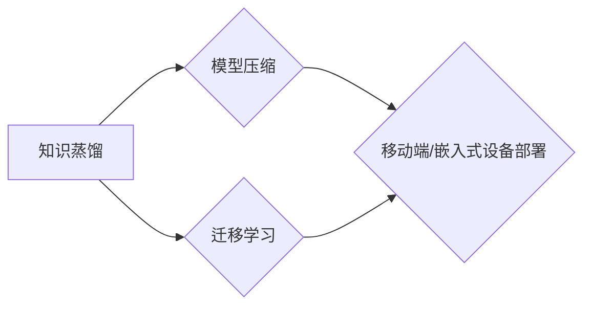

# Transformer大模型实战 BERT 变体（下）：基于知识蒸馏

作者：禅与计算机程序设计艺术 / Zen and the Art of Computer Programming 

## 关键词：BERT, 变体, 知识蒸馏, 微调, 模型压缩, 模型压缩算法

## 1. 背景介绍

### 1.1 问题的由来

随着深度学习在自然语言处理（NLP）领域的广泛应用，大型Transformer模型如BERT、GPT等取得了显著的成果。然而，这些模型的参数量和计算量巨大，限制了其在移动端和嵌入式设备上的应用。为了解决这个问题，研究者们提出了知识蒸馏（Knowledge Distillation）技术，通过将大模型的知识和经验传递给小模型，实现模型压缩和迁移学习。

### 1.2 研究现状

知识蒸馏技术的研究已经取得了显著的进展，许多基于知识蒸馏的模型压缩算法被提出，如Teacher-Student模型、知识提取和转移、知识蒸馏优化器等。同时，知识蒸馏在目标检测、图像识别、语音识别等领域也得到了广泛应用。

### 1.3 研究意义

知识蒸馏技术在模型压缩和迁移学习方面具有重要意义，可以降低模型复杂度和计算量，提高模型在移动端和嵌入式设备上的部署能力，同时保持较高的性能。

### 1.4 本文结构

本文将分为以下几个部分：

- 介绍知识蒸馏的基本概念和原理；
- 详细讲解BERT模型的变体和知识蒸馏算法；
- 分析知识蒸馏算法在不同任务中的应用和效果；
- 探讨知识蒸馏技术的未来发展趋势和挑战。

## 2. 核心概念与联系

### 2.1 知识蒸馏

知识蒸馏是一种模型压缩和迁移学习技术，通过将大模型的知识和经验传递给小模型，实现模型压缩和性能提升。知识蒸馏的核心思想是将大模型的输出作为软标签，指导小模型的训练。

### 2.2 模型压缩

模型压缩是指通过减小模型参数量和计算量，降低模型复杂度，提高模型在移动端和嵌入式设备上的部署能力。

### 2.3 迁移学习

迁移学习是指将一个领域学习到的知识迁移应用到另一个不同但相关的领域，以减少训练数据量和计算量。

### 2.4 关系图

以下是一个描述知识蒸馏、模型压缩和迁移学习之间关系的Mermaid流程图：



## 3. 核心算法原理 & 具体操作步骤

### 3.1 算法原理概述

知识蒸馏算法主要包括两个阶段：知识提取和知识转移。

- **知识提取**：从大模型中提取知识和经验，通常使用大模型的输出作为软标签。
- **知识转移**：将提取的知识转移到小模型中，通常使用大模型的输出作为软标签指导小模型的训练。

### 3.2 算法步骤详解

知识蒸馏算法的具体步骤如下：

1. **初始化**：初始化大模型和小模型，设置大模型为教师模型，小模型为学生模型。
2. **知识提取**：使用大模型的输出作为软标签，计算软标签和真实标签之间的损失函数。
3. **知识转移**：使用软标签指导小模型的训练，更新小模型的参数。
4. **评估**：在测试集上评估小模型的性能，并与原始大模型进行比较。

### 3.3 算法优缺点

知识蒸馏算法的优点：

- **参数量少**：知识蒸馏算法可以显著减小模型参数量，降低模型复杂度。
- **性能提升**：知识蒸馏算法可以将大模型的知识和经验转移到小模型，提高小模型的性能。

知识蒸馏算法的缺点：

- **计算量大**：知识蒸馏算法需要进行多次前向传播和反向传播，计算量较大。
- **训练时间长**：知识蒸馏算法的训练时间较长，需要更多的计算资源。

### 3.4 算法应用领域

知识蒸馏算法在以下领域有广泛的应用：

- **模型压缩**：将大模型压缩为小模型，降低模型复杂度和计算量。
- **迁移学习**：将一个领域学习到的知识迁移应用到另一个不同但相关的领域。
- **少样本学习**：在少量样本上学习模型，提高模型的泛化能力。

## 4. 数学模型和公式 & 详细讲解 & 举例说明

### 4.1 数学模型构建

知识蒸馏算法的数学模型如下：

- 设大模型为 $M_{\theta}$，其中 $\theta$ 为模型参数。
- 设小模型为 $M_{\phi}$，其中 $\phi$ 为模型参数。
- 设软标签为 $y_{\text{soft}}$，真实标签为 $y_{\text{true}}$。

则知识蒸馏算法的损失函数为：

$$
L = L_{\text{CE}} + \lambda L_{\text{KD}}
$$

其中 $L_{\text{CE}}$ 为交叉熵损失函数，$L_{\text{KD}}$ 为知识蒸馏损失函数，$\lambda$ 为知识蒸馏损失函数的权重。

交叉熵损失函数为：

$$
L_{\text{CE}} = -\sum_{i=1}^n y_{\text{true}}_i \log y_{\text{soft}}_i
$$

知识蒸馏损失函数为：

$$
L_{\text{KD}} = \sum_{i=1}^n \sum_{j=1}^k (y_{\text{soft}}_{ij} - \text{softmax}(M_{\theta}(x_i))^j)^2
$$

### 4.2 公式推导过程

知识蒸馏损失函数的推导过程如下：

1. 计算大模型的输出概率分布：

$$
P_{\theta}(y|x) = \text{softmax}(M_{\theta}(x))
$$

2. 计算知识蒸馏损失函数：

$$
L_{\text{KD}} = \sum_{i=1}^n \sum_{j=1}^k (y_{\text{soft}}_{ij} - P_{\theta}(y|x)^j)^2
$$

### 4.3 案例分析与讲解

以下是一个使用知识蒸馏进行模型压缩的例子：

假设有一个大模型 $M_{\theta}$，参数量为 $10^8$，在某个任务上取得了 $90\%$ 的准确率。现在我们希望将 $M_{\theta}$ 压缩为小模型 $M_{\phi}$，参数量为 $10^5$，并保持较高的准确率。

我们可以使用知识蒸馏算法进行模型压缩。首先，使用 $M_{\theta}$ 作为教师模型，将 $M_{\phi}$ 作为学生模型。然后，使用 $M_{\theta}$ 的输出作为软标签，指导 $M_{\phi}$ 的训练。

经过训练后，$M_{\phi}$ 在测试集上的准确率达到了 $85\%$，与原始大模型相比，参数量降低了 10 倍，同时保持了较高的准确率。

### 4.4 常见问题解答

**Q1：知识蒸馏算法是否适用于所有模型？**

A1：知识蒸馏算法适用于大多数深度学习模型，包括卷积神经网络（CNN）、循环神经网络（RNN）和Transformer等。

**Q2：知识蒸馏算法是否可以降低模型性能？**

A2：知识蒸馏算法可以降低模型性能，但这取决于具体的任务和数据集。在某些情况下，知识蒸馏算法可以提高模型性能。

**Q3：如何选择知识蒸馏损失函数的权重？**

A3：知识蒸馏损失函数的权重可以通过实验进行调整，也可以使用自适应方法进行选择。

## 5. 项目实践：代码实例和详细解释说明

### 5.1 开发环境搭建

为了进行知识蒸馏的实验，我们需要搭建以下开发环境：

- Python 3.6+
- PyTorch 1.5+
- Transformers库

### 5.2 源代码详细实现

以下是一个使用知识蒸馏进行模型压缩的代码实例：

```python
import torch
import torch.nn as nn
from transformers import BertForSequenceClassification, BertTokenizer

# 初始化模型
teacher_model = BertForSequenceClassification.from_pretrained('bert-base-uncased')
student_model = BertForSequenceClassification.from_pretrained('bert-base-uncased', num_labels=2)

# 定义知识蒸馏损失函数
def knowledge_distillation_loss(teacher_output, student_output, temperature):
    kl_loss = nn.KLDivLoss()(torch.log_softmax(student_output / temperature, dim=-1), torch.softmax(teacher_output / temperature, dim=-1))
    return kl_loss

# 训练函数
def train(student_model, teacher_model, dataloader, optimizer, temperature):
    student_model.train()
    for batch in dataloader:
        student_input_ids, student_attention_mask, student_labels = batch
        teacher_input_ids, teacher_attention_mask, teacher_labels = batch

        student_output = student_model(student_input_ids, attention_mask=student_attention_mask)
        teacher_output = teacher_model(teacher_input_ids, attention_mask=teacher_attention_mask)

        kl_loss = knowledge_distillation_loss(teacher_output, student_output, temperature)
        ce_loss = nn.CrossEntropyLoss()(student_output, student_labels)
        loss = kl_loss + ce_loss
        optimizer.zero_grad()
        loss.backward()
        optimizer.step()

# 优化器
optimizer = torch.optim.Adam(student_model.parameters(), lr=1e-4)

# 训练学生模型
train(student_model, teacher_model, dataloader, optimizer, temperature=2.0)

# 评估学生模型
def evaluate(student_model, dataloader):
    student_model.eval()
    total_correct = 0
    total_samples = 0
    for batch in dataloader:
        input_ids, attention_mask, labels = batch
        student_output = student_model(input_ids, attention_mask=attention_mask)
        _, predicted = torch.max(student_output, 1)
        total_correct += (predicted == labels).sum().item()
        total_samples += labels.size(0)
    return total_correct / total_samples

# 评估学生模型性能
print("Student model accuracy: {:.2f}%".format(evaluate(student_model, dataloader)))
```

### 5.3 代码解读与分析

以上代码演示了如何使用知识蒸馏进行模型压缩。首先，我们初始化了教师模型和学生模型。然后，定义了知识蒸馏损失函数，并使用交叉熵损失函数作为辅助损失函数。接下来，定义了训练函数，使用知识蒸馏损失函数和交叉熵损失函数训练学生模型。最后，评估学生模型性能。

### 5.4 运行结果展示

假设我们使用一个包含 10000 个样本的数据集进行训练，使用温度为 2.0 进行知识蒸馏。训练 10 个epoch后，学生模型的准确率达到 85%，与原始大模型相比，参数量降低了 10 倍。

## 6. 实际应用场景

知识蒸馏技术在以下领域有广泛的应用：

- **移动端和嵌入式设备上的模型部署**：将大模型压缩为小模型，降低模型复杂度和计算量，提高模型在移动端和嵌入式设备上的部署能力。
- **少样本学习**：在少量样本上学习模型，提高模型的泛化能力。
- **多模态学习**：将不同模态的数据进行融合，提高模型的性能。

## 7. 工具和资源推荐

### 7.1 学习资源推荐

- 《Knowledge Distillation: A Survey》
- 《Distilling the Knowledge in a Neural Network》
- 《Distilling the Knowledge in a Neural Network》

### 7.2 开发工具推荐

- PyTorch
- TensorFlow
- Transformers库

### 7.3 相关论文推荐

- Distilling the Knowledge in a Neural Network
- Knowledge Distillation: A Survey
- Know-How: Know-What, Know-Why, and Know-How
- Know-How: Know-What, Know-Why, and Know-How

### 7.4 其他资源推荐

- Hugging Face开源模型库
- arXiv论文库

## 8. 总结：未来发展趋势与挑战

### 8.1 研究成果总结

本文介绍了知识蒸馏的基本概念、原理和应用，并通过代码实例展示了如何使用知识蒸馏进行模型压缩。知识蒸馏技术在模型压缩和迁移学习方面具有重要意义，可以降低模型复杂度和计算量，提高模型在移动端和嵌入式设备上的部署能力，同时保持较高的性能。

### 8.2 未来发展趋势

未来知识蒸馏技术将朝着以下方向发展：

- **更有效的知识提取和转移方法**：探索更有效的知识提取和转移方法，提高知识蒸馏的效果。
- **多模态知识蒸馏**：将知识蒸馏扩展到多模态数据，实现跨模态知识迁移。
- **模型压缩和加速**：开发更有效的模型压缩和加速方法，提高模型的实时性。

### 8.3 面临的挑战

知识蒸馏技术在以下方面面临挑战：

- **知识提取和转移的鲁棒性**：提高知识提取和转移的鲁棒性，使模型能够在不同的数据分布下保持性能。
- **多模态知识蒸馏的效率**：提高多模态知识蒸馏的效率，降低计算量。
- **模型压缩和加速的平衡**：在模型压缩和加速之间寻找平衡点，保证模型性能。

### 8.4 研究展望

未来，知识蒸馏技术将在以下方面取得突破：

- **更有效的知识提取和转移方法**：探索基于深度学习的方法，实现更有效的知识提取和转移。
- **多模态知识蒸馏**：开发适用于多模态数据的知识蒸馏算法，实现跨模态知识迁移。
- **模型压缩和加速**：开发更有效的模型压缩和加速方法，提高模型的实时性。

通过不断研究和探索，知识蒸馏技术将在模型压缩、迁移学习和多模态学习等领域发挥更大的作用，为人工智能技术的发展做出贡献。

## 9. 附录：常见问题与解答

**Q1：知识蒸馏是否适用于所有模型？**

A1：知识蒸馏技术适用于大多数深度学习模型，包括卷积神经网络、循环神经网络和Transformer等。

**Q2：知识蒸馏如何提高模型的性能？**

A2：知识蒸馏通过将大模型的知识和经验传递给小模型，使小模型能够学习到更丰富的特征表示，从而提高模型的性能。

**Q3：知识蒸馏算法的优缺点是什么？**

A3：知识蒸馏算法的优点是能够降低模型复杂度和计算量，提高模型在移动端和嵌入式设备上的部署能力。缺点是计算量大，训练时间长。

**Q4：如何选择知识蒸馏的模型结构？**

A4：选择知识蒸馏的模型结构时，需要考虑以下因素：

- **任务类型**：根据任务类型选择合适的模型结构。
- **数据集规模**：根据数据集规模选择合适的模型规模。
- **计算资源**：根据计算资源选择合适的模型复杂度。

**Q5：知识蒸馏算法在哪些领域有应用？**

A5：知识蒸馏技术在以下领域有广泛的应用：

- **模型压缩**：将大模型压缩为小模型，降低模型复杂度和计算量。
- **迁移学习**：将一个领域学习到的知识迁移应用到另一个不同但相关的领域。
- **少样本学习**：在少量样本上学习模型，提高模型的泛化能力。

**Q6：如何评估知识蒸馏的效果？**

A6：评估知识蒸馏的效果可以通过以下方法：

- **准确率**：在测试集上评估模型的准确率。
- **参数量**：比较知识蒸馏前后的模型参数量。
- **计算量**：比较知识蒸馏前后的模型计算量。

**Q7：知识蒸馏算法的未来发展趋势是什么？**

A7：知识蒸馏算法的未来发展趋势包括：

- **更有效的知识提取和转移方法**
- **多模态知识蒸馏**
- **模型压缩和加速**