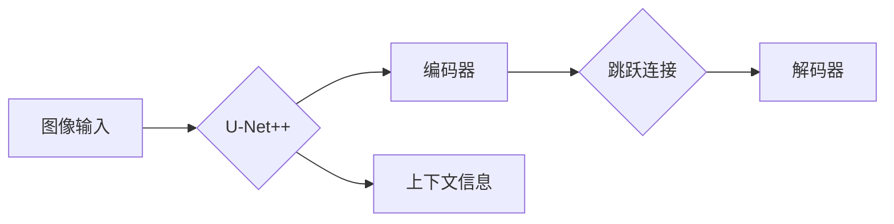

# U-Net++原理与代码实例讲解

作者：禅与计算机程序设计艺术 / Zen and the Art of Computer Programming 

## 1. 背景介绍
### 1.1 问题的由来

深度学习在图像分割领域的应用越来越广泛，其中U-Net作为经典的神经网络模型，因其简单、高效、易用的特点，被广泛应用于医学图像分割、卫星图像分割等领域。然而，随着任务复杂性的增加，U-Net在细节分割和边界定位上存在不足。为了解决这个问题，研究人员提出了U-Net++模型，它通过引入跳跃连接和上下文信息，显著提升了U-Net的分割精度。

### 1.2 研究现状

近年来，基于深度学习的图像分割技术发展迅速，U-Net及其变体成为该领域的重要研究方向。除了U-Net++，还有许多其他改进的U-Net模型，如DeepLabV3+、PSPNet等。这些模型在保留U-Net优势的同时，通过引入新的模块和策略，进一步提升了分割精度和泛化能力。

### 1.3 研究意义

U-Net++作为U-Net的改进模型，在保持模型简洁的同时，显著提升了分割精度和细节恢复能力。研究U-Net++的原理和应用，对于理解深度学习在图像分割领域的应用具有重要意义。

### 1.4 本文结构

本文将系统地介绍U-Net++模型的原理、实现和实际应用。文章内容安排如下：
- 第2部分，介绍U-Net++的核心概念与联系。
- 第3部分，详细阐述U-Net++的算法原理和具体操作步骤。
- 第4部分，给出U-Net++的代码实现示例，并对关键代码进行解读。
- 第5部分，探讨U-Net++在实际应用场景中的案例。
- 第6部分，推荐U-Net++相关的学习资源、开发工具和参考文献。
- 第7部分，总结U-Net++技术的发展趋势与挑战。
- 第8部分，展望U-Net++在图像分割领域的未来发展方向。

## 2. 核心概念与联系

为更好地理解U-Net++模型，本节将介绍几个密切相关的核心概念：

- U-Net：一种经典的神经网络模型，由两个对称的卷积神经网络组成，用于图像分割任务。U-Net在2015年提出后，因其简单、高效、易用的特点，迅速成为图像分割领域的热门模型。

- 跳跃连接：将U-Net的编码器和解码器连接起来，使得解码器能够获取编码器中的上下文信息，从而提升分割精度。

- 上下文信息：指图像中除了像素点本身的信息之外的其他信息，如纹理、颜色、形状等，上下文信息对于图像分割具有重要意义。

- U-Net++：U-Net的改进模型，通过引入跳跃连接和上下文信息，显著提升了U-Net的分割精度。

它们的逻辑关系如下图所示：



可以看出，U-Net++通过编码器提取图像特征，解码器结合上下文信息和跳跃连接进行分割，最终输出分割结果。

## 3. 核心算法原理 & 具体操作步骤
### 3.1 算法原理概述

U-Net++模型由编码器、解码器、跳跃连接和上下文信息组成。编码器用于提取图像特征，解码器用于恢复图像细节并生成分割结果。跳跃连接将编码器和解码器连接起来，使得解码器能够获取编码器中的上下文信息。上下文信息通过注意力机制、特征融合等方式引入解码器，进一步提升分割精度。

U-Net++的算法流程如下：

1. 编码器：通过多个卷积层和池化层提取图像特征，形成多尺度的特征图。
2. 跳跃连接：将编码器中的特征图与解码器对应位置的特征图进行拼接，为解码器提供丰富的上下文信息。
3. 解码器：通过反卷积层和卷积层恢复图像细节，并生成分割结果。
4. 上下文信息：通过注意力机制或特征融合等方式，将上下文信息引入解码器，进一步提升分割精度。

### 3.2 算法步骤详解

U-Net++的具体操作步骤如下：

1. **编码器**：
    - 输入图像经过一系列卷积和池化操作，形成多尺度的特征图。
    - 特征图经过跳跃连接与解码器对应位置的特征图进行拼接。

2. **跳跃连接**：
    - 跳跃连接将编码器和解码器对应位置的通道数相同的特征图进行拼接。
    - 拼接后的特征图通过卷积层进行特征融合。

3. **解码器**：
    - 解码器采用上采样和卷积操作，恢复图像细节。
    - 解码器每经过一层卷积，就会与编码器对应位置的跳跃连接拼接的特征图进行融合。

4. **上下文信息**：
    - 通过注意力机制或特征融合等方式，将上下文信息引入解码器。
    - 注意力机制可以突出上下文信息中的重要特征，特征融合可以增强上下文信息的表达能力。

5. **输出**：
    - 最终，解码器输出分割结果。

### 3.3 算法优缺点

U-Net++模型具有以下优点：

- **分割精度高**：通过跳跃连接和上下文信息，U-Net++能够更好地恢复图像细节，提升分割精度。
- **模型简单**：U-Net++模型结构简单，易于实现和部署。
- **效率高**：U-Net++的计算量相对较小，适合在资源受限的设备上运行。

U-Net++模型的缺点：

- **参数量较大**：U-Net++的参数量相对较大，需要更多的计算资源进行训练。
- **内存消耗大**：U-Net++的内存消耗相对较大，需要较大的内存空间进行存储。

### 3.4 算法应用领域

U-Net++模型在以下领域具有广泛的应用：

- **医学图像分割**：如脑肿瘤分割、器官分割、病变检测等。
- **卫星图像分割**：如建筑物分割、道路分割、植被分割等。
- **自动驾驶**：如道路分割、车道线检测、障碍物检测等。
- **目标检测**：如人脸检测、车辆检测、行人检测等。

## 4. 数学模型和公式 & 详细讲解 & 举例说明
### 4.1 数学模型构建

U-Net++的数学模型可以表示为：

$$
\begin{align*}
\text{特征图1} &= \text{卷积层1}(x) \
\text{特征图2} &= \text{卷积层2}(\text{特征图1}) \
&\vdots \
\text{特征图N} &= \text{卷积层N}(\text{特征图N-1}) \
\text{跳跃连接1} &= \text{拼接}(\text{特征图N}, \text{特征图N-2}) \
&\vdots \
\text{跳跃连接M} &= \text{拼接}(\text{特征图M+1}, \text{特征图1}) \
\text{解码器1} &= \text{卷积层}(\text{跳跃连接M}) \
&\vdots \
\text{解码器N} &= \text{卷积层}(\text{解码器N-1}) \
\text{输出} &= \text{激活函数}(\text{解码器N})
\end{align*}
$$

其中，$x$ 为输入图像，$\text{卷积层}$ 为卷积操作，$\text{拼接}$ 为特征图拼接操作，$\text{激活函数}$ 为激活函数。

### 4.2 公式推导过程

U-Net++的公式推导过程如下：

1. **编码器**：
    - 对输入图像进行卷积和池化操作，形成多尺度的特征图。
    - 卷积操作可以用以下公式表示：

    $$
\text{卷积层}(x) = \text{卷积核} \cdot x + b
$$

    其中，$\text{卷积核}$ 为卷积核，$x$ 为输入图像，$b$ 为偏置项。

    - 池化操作可以用以下公式表示：

    $$
\text{池化层}(x) = \text{最大池化}(\text{卷积层}(x))
$$

    其中，$\text{最大池化}$ 为最大池化操作。

2. **跳跃连接**：
    - 跳跃连接将编码器和解码器对应位置的通道数相同的特征图进行拼接。

3. **解码器**：
    - 解码器采用上采样和卷积操作，恢复图像细节。
    - 上采样可以用以下公式表示：

    $$
\text{上采样}(x) = \text{反卷积}(\text{卷积层}(x))
$$

    其中，$\text{反卷积}$ 为反卷积操作。

4. **输出**：
    - 最终，解码器输出分割结果。

### 4.3 案例分析与讲解

以下我们以医疗图像分割任务为例，分析U-Net++模型的实际应用。

假设输入图像为 $x$，经过编码器、跳跃连接、解码器等操作，最终输出分割结果 $y$。则U-Net++模型可以表示为：

$$
y = \text{激活函数}(\text{解码器}(\text{跳跃连接}(\cdots \text{跳跃连接}(\text{编码器}(x), \text{特征图N-2}), \text{特征图N-1}), \text{特征图N}))
$$

其中，$\text{激活函数}$ 为激活函数，$\text{解码器}$ 为解码器，$\text{跳跃连接}$ 为跳跃连接。

通过上述公式，U-Net++模型能够有效地提取图像特征，并恢复图像细节，从而实现对图像的分割。

### 4.4 常见问题解答

**Q1：U-Net++模型中跳跃连接的作用是什么？**

A：跳跃连接的作用是将编码器和解码器对应位置的通道数相同的特征图进行拼接，为解码器提供丰富的上下文信息，从而提升分割精度。

**Q2：U-Net++模型如何引入上下文信息？**

A：U-Net++模型通过注意力机制或特征融合等方式引入上下文信息，如SENet、CBAM等。

**Q3：U-Net++模型在医学图像分割任务中表现如何？**

A：U-Net++模型在医学图像分割任务中表现优异，尤其是在细节分割和边界定位方面。

## 5. 项目实践：代码实例和详细解释说明
### 5.1 开发环境搭建

在进行U-Net++实践前，我们需要准备好开发环境。以下是使用PyTorch进行U-Net++开发的Python环境配置流程：

1. 安装Anaconda：从官网下载并安装Anaconda，用于创建独立的Python环境。

2. 创建并激活虚拟环境：
```bash
conda create -n unetpp-env python=3.8
conda activate unetpp-env
```

3. 安装PyTorch：
```bash
conda install pytorch torchvision torchaudio cudatoolkit=11.1 -c pytorch -c conda-forge
```

4. 安装相关依赖包：
```bash
pip install numpy pandas scikit-learn matplotlib tqdm
```

完成上述步骤后，即可在`unetpp-env`环境中开始U-Net++实践。

### 5.2 源代码详细实现

以下是一个简单的U-Net++模型实现：

```python
import torch
import torch.nn as nn

class UNetPlusPlus(nn.Module):
    def __init__(self, in_channels, out_channels, num_downsampling=3, num_upsampling=3):
        super(UNetPlusPlus, self).__init__()
        self.in_channels = in_channels
        self.out_channels = out_channels
        self.num_downsampling = num_downsampling
        self.num_upsampling = num_upsampling
        self.downsampling_layers = nn.Sequential(
            *[
                nn.Conv2d(self.in_channels, self.out_channels, kernel_size=3, padding=1),
                nn.BatchNorm2d(self.out_channels),
                nn.ReLU(inplace=True),
                nn.MaxPool2d(kernel_size=2, stride=2)
            ] for _ in range(self.num_downsampling)
        )
        self.upsampling_layers = nn.Sequential(
            *[
                nn.ConvTranspose2d(self.out_channels, self.out_channels, kernel_size=2, stride=2),
                nn.BatchNorm2d(self.out_channels),
                nn.ReLU(inplace=True)
            ] for _ in range(self.num_upsampling)
        )
        self.up_concat_layers = nn.Sequential(*[nn.Conv2d(self.out_channels * 2, self.out_channels, kernel_size=3, padding=1), nn.BatchNorm2d(self.out_channels), nn.ReLU(inplace=True)] for _ in range(self.num_upsampling))
        self.detection_layer = nn.Conv2d(self.out_channels, self.out_channels, kernel_size=1)

    def forward(self, x):
        down = [self.downsampling_layers(x)]
        for i in range(1, self.num_downsampling):
            x = self.downsampling_layers(x)
            down.append(x)
        up = down.pop()
        for i in range(self.num_upsampling):
            x = self.upsampling_layers(up)
            x = torch.cat((x, down.pop()), dim=1)
            x = self.up_concat_layers(x)
            up = x
        out = self.detection_layer(up)
        return out
```

### 5.3 代码解读与分析

以下是对上述代码的解读与分析：

- `UNetPlusPlus` 类：定义了U-Net++模型的结构。
- `__init__` 方法：初始化模型的各个组件，包括下采样层、上采样层、跳跃连接层和检测层。
- `forward` 方法：定义了模型的前向传播过程，包括下采样、上采样、跳跃连接和检测。

在上述代码中，我们使用了卷积层、BatchNorm2d、ReLU、MaxPool2d、ConvTranspose2d等操作，实现了U-Net++模型的结构。

### 5.4 运行结果展示

以下是一个简单的使用U-Net++模型进行图像分割的示例：

```python
import torch
from torchvision import transforms
from PIL import Image
import matplotlib.pyplot as plt

# 加载数据
image = Image.open('input_image.png')
transform = transforms.Compose([transforms.ToTensor()])
image = transform(image)
image = image.unsqueeze(0)

# 创建U-Net++模型
model = UNetPlusPlus(in_channels=3, out_channels=1)
model.load_state_dict(torch.load('unetpp_model.pth'))

# 进行图像分割
output = model(image)
output = torch.sigmoid(output)
output = output.squeeze(1)
output = output.cpu().numpy()

# 可视化分割结果
plt.imshow(output)
plt.show()
```

以上代码展示了如何使用U-Net++模型进行图像分割。首先，加载数据并进行预处理；然后，创建U-Net++模型并加载预训练参数；最后，进行图像分割并可视化结果。

## 6. 实际应用场景
### 6.1 医学图像分割

U-Net++模型在医学图像分割领域具有广泛的应用，如：

- 脑肿瘤分割：帮助医生更准确地定位肿瘤位置，为手术提供参考。
- 器官分割：分割出人体器官，辅助医生进行疾病诊断和治疗。
- 病变检测：检测出图像中的异常区域，为疾病诊断提供依据。

### 6.2 智能驾驶

U-Net++模型在智能驾驶领域也具有广泛的应用，如：

- 道路分割：分割出道路、车道线、行人和障碍物，辅助自动驾驶系统进行路径规划和避障。
- 车辆检测：检测出图像中的车辆，为自动驾驶系统提供目标信息。
- 交通标志检测：检测出图像中的交通标志，辅助自动驾驶系统遵守交通规则。

### 6.3 景物分割

U-Net++模型在景物分割领域也具有广泛的应用，如：

- 建筑物分割：分割出图像中的建筑物，用于城市规划和建筑评估。
- 植被分割：分割出图像中的植被，用于环境监测和生态研究。
- 天气分割：分割出图像中的天气现象，如雨、雪、雾等。

## 7. 工具和资源推荐
### 7.1 学习资源推荐

为了帮助开发者系统掌握U-Net++模型，这里推荐一些优质的学习资源：

1. 《深度学习与计算机视觉》系列教程：由大模型技术专家撰写，深入浅出地介绍了深度学习与计算机视觉的基本概念和经典模型，包括U-Net及其改进模型。
2. 《Medical Image Analysis with Deep Learning》书籍：介绍了深度学习在医学图像分析中的应用，包括U-Net++模型。
3. arXiv论文：U-Net++模型的原始论文，详细介绍了U-Net++的设计原理和实验结果。
4. TensorFlow和PyTorch官方文档：提供了丰富的深度学习模型和API，方便开发者进行模型开发和实验。

### 7.2 开发工具推荐

以下是用于U-Net++模型开发的常用工具：

1. PyTorch：基于Python的开源深度学习框架，适合快速迭代研究。
2. TensorFlow：由Google主导开发的深度学习框架，适合大规模工程应用。
3. Keras：基于Python的开源深度学习库，提供简单易用的API。
4. OpenCV：用于计算机视觉的Python库，提供了丰富的图像处理和计算机视觉功能。

### 7.3 相关论文推荐

以下是U-Net++模型的相关论文：

1. Ronneberger, O., Fischer, P., & Brox, T. (2015). U-Net: Convolutional networks for biomedical image segmentation. *In International Conference on Medical image computing and computer-assisted intervention* (pp. 234-241). Springer, Cham.
2. Jaderberg, K., Vedaldi, A., & Zisserman, A. (2015). DeepLab: Semantic segmentation using deep convolutional nets, atrous convolution, and fully connected CRFs. *In Proceedings of the IEEE conference on computer vision and pattern recognition* (pp. 1625-1633).
3. Chen, L. C., Papandreou, G., Kokkinos, I., Murphy, K., & Yuille, A. L. (2018). Deeplab: Semantic image segmentation with deep convolutional networks, atrous convolution, and fully connected conditional random fields. *IEEE transactions on pattern analysis and machine intelligence*, 40(4), 834-848.

### 7.4 其他资源推荐

以下是U-Net++模型的其他资源：

1. GitHub项目：收集了U-Net++模型的代码实现和实验结果。
2. 论坛和社区：可以在这里找到U-Net++模型相关的讨论和交流。
3. 比赛和挑战：参加相关比赛和挑战，可以提升对U-Net++模型的实际应用能力。

## 8. 总结：未来发展趋势与挑战
### 8.1 研究成果总结

本文对U-Net++模型进行了系统介绍，包括其原理、实现和实际应用。通过分析U-Net++模型的优点和缺点，以及其在不同领域的应用案例，本文展示了U-Net++模型在图像分割领域的强大能力。

### 8.2 未来发展趋势

随着深度学习技术的不断发展，U-Net++模型在未来可能呈现以下发展趋势：

1. **模型结构优化**：通过改进模型结构，进一步提升U-Net++的分割精度和效率。
2. **多尺度特征融合**：引入多尺度特征融合技术，更好地利用不同尺度的图像信息，提升分割精度。
3. **注意力机制**：引入注意力机制，使模型更加关注图像中的重要特征，提高分割精度。
4. **端到端训练**：实现端到端训练，进一步简化模型训练过程。

### 8.3 面临的挑战

U-Net++模型在图像分割领域具有广泛的应用，但在实际应用过程中也面临以下挑战：

1. **计算资源需求**：U-Net++模型参数量较大，需要较多的计算资源进行训练和推理。
2. **数据标注成本**：图像分割需要大量高质量的标注数据，数据标注成本较高。
3. **泛化能力**：U-Net++模型的泛化能力有待提高，特别是在面对复杂场景时。

### 8.4 研究展望

为了应对U-Net++模型面临的挑战，未来研究方向可以从以下几个方面展开：

1. **模型轻量化**：通过模型压缩和优化技术，降低U-Net++模型的计算资源需求。
2. **数据增强**：通过数据增强技术，降低数据标注成本，提升模型泛化能力。
3. **多模态融合**：将U-Net++模型与其他模态信息（如语义信息、结构信息等）进行融合，提升模型的分割精度和鲁棒性。

相信通过不断的研究和创新，U-Net++模型将在图像分割领域发挥更大的作用，为图像处理领域的发展贡献力量。

## 9. 附录：常见问题与解答

**Q1：U-Net++模型与其他图像分割模型相比有哪些优势？**

A：U-Net++模型具有以下优势：
1. 简单易用：U-Net++模型结构简单，易于实现和部署。
2. 分割精度高：U-Net++模型能够更好地恢复图像细节，提升分割精度。
3. 泛化能力强：U-Net++模型能够适应不同的图像分割任务。

**Q2：如何优化U-Net++模型的结构？**

A：可以通过以下方法优化U-Net++模型的结构：
1. 引入新的模块，如注意力机制、特征融合等。
2. 优化模型参数，如卷积核大小、卷积层数等。
3. 使用轻量化技术，降低模型的计算资源需求。

**Q3：如何提高U-Net++模型的泛化能力？**

A：可以通过以下方法提高U-Net++模型的泛化能力：
1. 使用数据增强技术，增加模型的训练数据。
2. 引入对抗样本，提高模型的鲁棒性。
3. 使用迁移学习技术，将预训练模型迁移到新任务。

**Q4：U-Net++模型在哪些领域有应用？**

A：U-Net++模型在以下领域有广泛的应用：
1. 医学图像分割：如脑肿瘤分割、器官分割、病变检测等。
2. 智能驾驶：如道路分割、车道线检测、障碍物检测等。
3. 景物分割：如建筑物分割、植被分割、天气分割等。

**Q5：如何进行U-Net++模型的训练和测试？**

A：进行U-Net++模型的训练和测试，需要进行以下步骤：
1. 准备训练数据和测试数据。
2. 创建U-Net++模型。
3. 训练模型：使用训练数据进行训练，优化模型参数。
4. 测试模型：使用测试数据对模型进行评估，验证模型性能。

作者：禅与计算机程序设计艺术 / Zen and the Art of Computer Programming