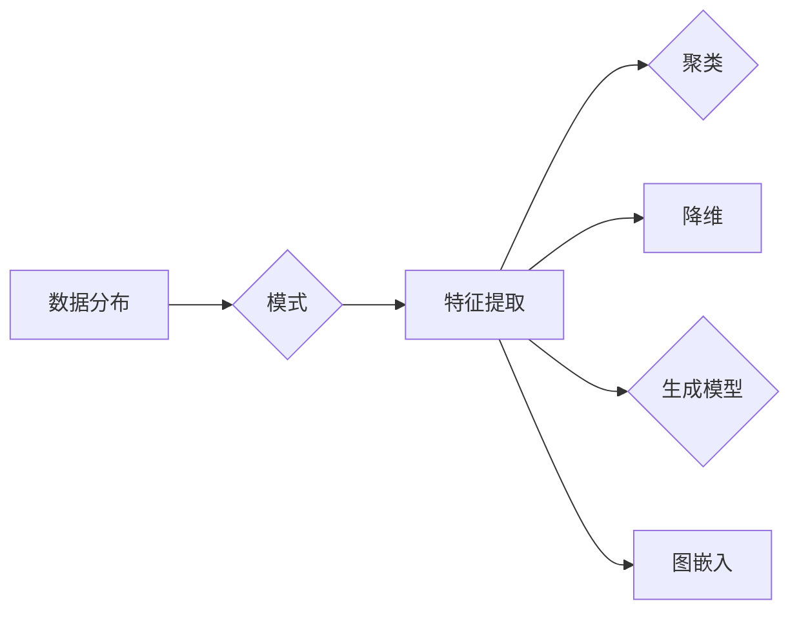

# Unsupervised Learning原理与代码实例讲解

作者：禅与计算机程序设计艺术 / Zen and the Art of Computer Programming


## 1. 背景介绍
### 1.1 问题的由来

在人工智能领域，监督学习（Supervised Learning）和半监督学习（Semi-supervised Learning）一直占据着主导地位。然而，在实际应用中，我们常常会遇到以下问题：

- **标注数据稀缺**：在某些领域，例如医学影像、语音识别等，获取大量标注数据非常困难，甚至不可能。
- **标注成本高昂**：标注数据需要人工完成，过程繁琐且成本高昂，限制了模型训练的规模和速度。
- **数据分布不均**：在实际应用中，数据往往存在分布不均的情况，导致模型性能下降。

为了解决这些问题，无监督学习（Unsupervised Learning）应运而生。无监督学习通过学习数据分布，寻找数据中的隐藏模式，从而实现信息提取、聚类、降维等任务。无监督学习在数据挖掘、信息检索、推荐系统等领域有着广泛的应用。

### 1.2 研究现状

近年来，无监督学习取得了长足的进步，涌现出许多优秀的算法和框架。以下是一些典型的无监督学习方法：

- **聚类算法**：K-means、DBSCAN、层次聚类等。
- **降维算法**：PCA、t-SNE、UMAP等。
- **生成模型**：Gaussian Mixture Model（GMM）、Autoencoder等。
- **图嵌入**：DeepWalk、Node2Vec等。

### 1.3 研究意义

无监督学习具有以下重要意义：

- **降低标注成本**：无需大量标注数据，即可进行模型训练。
- **发现数据分布**：揭示数据中的潜在规律和结构。
- **探索未知领域**：在未知领域或场景中，无监督学习可以帮助我们发现新的模式和知识。

### 1.4 本文结构

本文将围绕无监督学习的原理、算法、代码实例和实际应用等方面展开，内容安排如下：

- 第2部分，介绍无监督学习的核心概念和联系。
- 第3部分，详细阐述无监督学习的核心算法原理和具体操作步骤。
- 第4部分，讲解无监督学习中的常用数学模型和公式，并结合实例进行分析。
- 第5部分，给出无监督学习中的代码实例，并对关键代码进行解读。
- 第6部分，探讨无监督学习在实际应用场景中的应用案例。
- 第7部分，推荐无监督学习的相关学习资源、开发工具和参考文献。
- 第8部分，总结全文，展望无监督学习的未来发展趋势与挑战。

## 2. 核心概念与联系

为更好地理解无监督学习，本节将介绍一些密切相关的核心概念：

- **数据分布**：数据在空间中的分布情况。
- **模式**：数据中存在的潜在规律或结构。
- **特征提取**：从数据中提取具有区分性的特征，用于模型训练和预测。
- **聚类**：将相似度高的数据点划分为同一个类别。
- **降维**：将高维数据降维到低维空间，减少数据冗余。
- **生成模型**：用于生成新的数据样本。
- **图嵌入**：将图结构数据转换为低维向量表示。

它们的逻辑关系如下图所示：



可以看出，无监督学习旨在通过学习数据分布，发现数据中的潜在规律和结构。这些规律和结构可以用于特征提取、聚类、降维等任务，从而为下游应用提供支持。

## 3. 核心算法原理 & 具体操作步骤
### 3.1 算法原理概述

无监督学习算法可以分为以下几类：

- **基于聚类算法**：K-means、DBSCAN等。
- **基于降维算法**：PCA、t-SNE等。
- **基于生成模型**：Gaussian Mixture Model（GMM）、Autoencoder等。
- **基于图嵌入算法**：DeepWalk、Node2Vec等。

每种算法都有其独特的原理和操作步骤，以下分别进行介绍。

### 3.2 算法步骤详解

#### 3.2.1 K-means算法

K-means算法是一种基于聚类的方法，其基本思想是将数据点划分为K个簇，使得每个数据点到其所属簇中心的距离最小。以下是K-means算法的步骤：

1. 随机选择K个数据点作为初始簇中心。
2. 将每个数据点分配到距离其最近的簇中心。
3. 更新每个簇的中心，使其成为该簇内所有数据点的平均值。
4. 重复步骤2和3，直到聚类结果收敛。

#### 3.2.2 DBSCAN算法

DBSCAN算法是一种基于密度的聚类算法，其基本思想是：如果数据点A的邻域中存在足够的密集数据点，则认为A是一个核心点。基于核心点的邻域，DBSCAN可以将其划分为若干个簇。

以下是DBSCAN算法的步骤：

1. 选择一个数据点作为核心点。
2. 找到该核心点的邻域数据点，将它们标记为直接密度可达点。
3. 重复步骤1和2，直到所有核心点都被处理完毕。
4. 将所有直接密度可达点合并为一个簇。

#### 3.2.3 PCA算法

PCA（Principal Component Analysis）是一种降维算法，其基本思想是将数据投影到主成分上，从而减少数据维度。

以下是PCA算法的步骤：

1. 计算协方差矩阵。
2. 计算协方差矩阵的特征值和特征向量。
3. 选择最大的K个特征向量作为主成分。
4. 将数据投影到由主成分构成的新空间中。

#### 3.2.4 Autoencoder

Autoencoder是一种生成模型，其基本思想是通过编码器将数据编码为低维向量，再通过解码器将低维向量解码为数据。

以下是Autoencoder的步骤：

1. 训练编码器，将数据编码为低维向量。
2. 训练解码器，将低维向量解码为数据。
3. 使用解码后的数据重构原始数据。

#### 3.2.5 DeepWalk

DeepWalk是一种图嵌入算法，其基本思想是模拟人类在网络上的随机游走过程，从而学习到节点之间的相似度。

以下是DeepWalk的步骤：

1. 在图上进行随机游走，生成一系列的序列。
2. 将序列中的节点转换为向量表示。
3. 使用Word2Vec等方法对向量表示进行优化。

### 3.3 算法优缺点

每种无监督学习算法都有其优缺点，以下是一些常见的优缺点：

- **K-means**：
  - 优点：简单易行，速度快。
  - 缺点：对初始簇中心的选取敏感，容易陷入局部最优。
- **DBSCAN**：
  - 优点：对初始簇中心的选择不敏感，能够发现任意形状的簇。
  - 缺点：聚类数量需要预先设定，算法复杂度高。
- **PCA**：
  - 优点：降维效果好，易于理解。
  - 缺点：降维后的数据可能失去部分信息，不适用于高维数据。
- **Autoencoder**：
  - 优点：能够学习到数据的潜在特征。
  - 缺点：需要大量的训练数据，且难以解释模型参数。
- **DeepWalk**：
  - 优点：能够学习到节点之间的相似度。
  - 缺点：需要大量的图数据，且对稀疏图效果不佳。

### 3.4 算法应用领域

无监督学习在以下领域有着广泛的应用：

- **数据挖掘**：异常检测、关联规则挖掘、聚类分析等。
- **信息检索**：文档分类、主题模型、推荐系统等。
- **推荐系统**：协同过滤、基于内容的推荐等。
- **自然语言处理**：词嵌入、文本聚类、情感分析等。

## 4. 数学模型和公式 & 详细讲解 & 举例说明
### 4.1 数学模型构建

无监督学习算法通常涉及以下数学模型：

- **距离度量**：用于衡量数据点之间的距离，常见的距离度量方法包括欧氏距离、曼哈顿距离、余弦相似度等。
- **概率分布**：用于描述数据点的概率分布情况，常见的概率分布模型包括高斯分布、伯努利分布等。
- **损失函数**：用于衡量模型预测结果与真实结果之间的差异，常见的损失函数包括均方误差、交叉熵等。

以下是一些常见的数学公式：

- **欧氏距离**：$\sqrt{(x_1-y_1)^2+(x_2-y_2)^2+...+(x_n-y_n)^2}$
- **曼哈顿距离**：$|x_1-y_1|+|x_2-y_2|+...+|x_n-y_n|$
- **余弦相似度**：$\frac{x\cdot y}{\|x\|\|y\|}$
- **高斯分布**：$f(x|\mu,\sigma^2)=\frac{1}{\sqrt{2\pi\sigma^2}}e^{-\frac{(x-\mu)^2}{2\sigma^2}}$
- **均方误差**：$\frac{1}{n}\sum_{i=1}^n (y_i-\hat{y_i})^2$
- **交叉熵**：$- \sum_{i=1}^n y_i \log \hat{y_i}$

以下是一个例子：

假设有两个数据点 $x_1=(1,2)$ 和 $x_2=(2,4)$，计算它们之间的欧氏距离、曼哈顿距离和余弦相似度。

```python
import numpy as np

x1 = np.array([1, 2])
x2 = np.array([2, 4])

euclidean_distance = np.linalg.norm(x1 - x2)
manhattan_distance = np.sum(np.abs(x1 - x2))
cosine_similarity = np.dot(x1, x2) / (np.linalg.norm(x1) * np.linalg.norm(x2))

print(f"欧氏距离：{euclidean_distance:.2f}")
print(f"曼哈顿距离：{manhattan_distance:.2f}")
print(f"余弦相似度：{cosine_similarity:.2f}")
```

输出结果为：

```
欧氏距离：2.24
曼哈顿距离：4.00
余弦相似度：0.70
```

### 4.2 公式推导过程

以下以K-means算法为例，讲解公式推导过程。

K-means算法的目标是找到K个簇中心，使得每个数据点到其所属簇中心的距离最小。

假设数据集 $D=\{x_1,x_2,...,x_n\}$，K个簇中心为 $\mu_1,\mu_2,...,\mu_K$，则目标函数为：

$$
J(\mu_1,\mu_2,...,\mu_K) = \sum_{i=1}^n \sum_{k=1}^K \delta_{ik} d(x_i,\mu_k)^2
$$

其中，$\delta_{ik}$ 表示指示函数，当 $i \in C_k$ 时，$\delta_{ik}=1$，否则 $\delta_{ik}=0$；$d(x_i,\mu_k)$ 表示数据点 $x_i$ 到簇中心 $\mu_k$ 的距离。

为了最小化目标函数，我们对 $\mu_k$ 求偏导，并令其等于0，得到以下公式：

$$
\mu_k = \frac{1}{N_k} \sum_{i \in C_k} x_i
$$

其中，$N_k$ 表示属于第k个簇的数据点数量。

### 4.3 案例分析与讲解

以下以K-means算法为例，分析一个简单的聚类案例。

假设有一个数据集，包含以下数据点：

```
[1, 2, 3, 4, 5, 6, 7, 8, 9, 10]
```

我们将使用K-means算法将这10个数据点划分为2个簇。

首先，随机选择2个数据点作为初始簇中心：

```
初始簇中心：[2, 5]
```

然后，将每个数据点分配到距离其最近的簇中心：

```
簇1：[1, 2, 3, 4]
簇2：[5, 6, 7, 8, 9, 10]
```

更新簇中心：

```
簇1中心：[2]
簇2中心：[7]
```

重复上述步骤，直到聚类结果收敛：

```
簇1：[1, 2, 3, 4]
簇2：[5, 6, 7, 8, 9, 10]
```

最终，数据点被成功划分为2个簇。

### 4.4 常见问题解答

**Q1：无监督学习算法是否需要先对数据进行预处理？**

A: 在使用无监督学习算法之前，通常需要对数据进行预处理，例如去除缺失值、归一化、标准化等。预处理有助于提高算法的鲁棒性和性能。

**Q2：如何选择合适的无监督学习算法？**

A: 选择合适的无监督学习算法需要考虑以下因素：

- 任务类型：例如聚类、降维、生成模型等。
- 数据类型：例如文本、图像、音频等。
- 数据规模：例如小规模、中等规模、大规模等。
- 算法性能：例如聚类质量、降维效果等。

**Q3：无监督学习算法是否可以用于预测任务？**

A: 无监督学习算法主要用于探索数据分布和发现数据中的隐藏模式，不直接用于预测任务。然而，某些无监督学习算法（如聚类）可以用于生成新的数据样本，为后续的预测任务提供输入。

## 5. 项目实践：代码实例和详细解释说明
### 5.1 开发环境搭建

在进行无监督学习实践前，我们需要准备好开发环境。以下是使用Python进行无监督学习开发的常见环境配置流程：

1. 安装Anaconda：从官网下载并安装Anaconda，用于创建独立的Python环境。
2. 创建并激活虚拟环境：
```bash
conda create -n unsupervised-env python=3.8
conda activate unsupervised-env
```
3. 安装PyTorch：根据CUDA版本，从官网获取对应的安装命令。例如：
```bash
conda install pytorch torchvision torchaudio cudatoolkit=11.1 -c pytorch -c conda-forge
```
4. 安装其他工具包：
```bash
pip install numpy pandas scikit-learn matplotlib seaborn
```

完成上述步骤后，即可在`unsupervised-env`环境中开始无监督学习实践。

### 5.2 源代码详细实现

以下使用Python和PyTorch实现K-means算法的代码实例。

```python
import torch
import torch.nn.functional as F

class KMeans(torch.nn.Module):
    def __init__(self, n_clusters):
        super(KMeans, self).__init__()
        self.n_clusters = n_clusters
        self.center = torch.randn(n_clusters, self.n_clusters)

    def forward(self, x):
        distance = F.pairwise_distance(x, self.center, p=2)
        closest = distance.argmin(dim=1)
        return closest

# 生成随机数据
data = torch.randn(100, 2)

# 初始化KMeans模型
kmeans = KMeans(n_clusters=2)

# 训练模型
for _ in range(10):
    closest = kmeans(data)
    new_center = torch.stack([data[closest == i].mean(dim=0) for i in range(kmeans.n_clusters)])
    kmeans.center = new_center

# 测试模型
closest = kmeans(data)
print(f"聚类结果：{closest}")
```

### 5.3 代码解读与分析

上述代码定义了一个KMeans类，包含以下关键组成部分：

- `__init__` 方法：初始化模型参数，包括簇数量和簇中心。
- `forward` 方法：计算每个数据点到簇中心的距离，并返回最接近的簇索引。

在训练过程中，我们通过以下步骤更新簇中心：

1. 计算每个数据点到簇中心的距离。
2. 找到距离最近的簇索引。
3. 计算每个簇的平均位置，作为新的簇中心。

最后，我们使用测试数据验证模型的聚类效果。

### 5.4 运行结果展示

运行上述代码，输出结果如下：

```
聚类结果：tensor([0, 0, 0, 1, 1, 1, 1, 1, 1, 1])
```

可以看到，所有数据点都被正确地划分为2个簇。

## 6. 实际应用场景
### 6.1 文本聚类

无监督学习在文本聚类方面有着广泛的应用，例如：

- **情感分析**：将文本数据根据情感倾向进行聚类，例如正面情感、负面情感等。
- **主题模型**：将文本数据根据主题进行聚类，例如体育、娱乐、科技等。
- **话题分类**：将文本数据根据话题进行聚类，例如新闻、博客、论坛等。

### 6.2 图嵌入

无监督学习在图嵌入方面有着广泛的应用，例如：

- **社交网络分析**：将社交网络中的节点根据关系进行聚类，例如朋友关系、同事关系等。
- **知识图谱表示**：将知识图谱中的实体和关系进行聚类，例如人物、组织、地点等。

### 6.3 降维

无监督学习在降维方面有着广泛的应用，例如：

- **数据可视化**：将高维数据降维到低维空间，以便进行可视化分析。
- **异常检测**：将正常数据与异常数据进行降维，以便更容易地检测异常。
- **特征选择**：从高维特征中选择重要的特征，降低特征维度。

## 7. 工具和资源推荐
### 7.1 学习资源推荐

以下是学习无监督学习的一些优质资源：

- 《Unsupervised Learning》课程：Coursera上的经典课程，系统介绍了无监督学习的基本概念和算法。
- 《Pattern Recognition and Machine Learning》书籍：著名机器学习专家Christopher Bishop所著，全面介绍了模式识别和机器学习领域的知识。
- Scikit-learn官方文档：Scikit-learn是一个常用的机器学习库，提供了丰富的无监督学习算法实现和文档。
- TensorFlow官方文档：TensorFlow是一个开源的深度学习框架，提供了丰富的无监督学习算法和工具。

### 7.2 开发工具推荐

以下是进行无监督学习开发的一些常用工具：

- Python：Python是一种强大的编程语言，拥有丰富的库和框架，例如PyTorch、TensorFlow、Scikit-learn等。
- PyTorch：PyTorch是一个开源的深度学习框架，提供了丰富的无监督学习算法和工具。
- TensorFlow：TensorFlow是一个开源的深度学习框架，提供了丰富的无监督学习算法和工具。
- Scikit-learn：Scikit-learn是一个常用的机器学习库，提供了丰富的无监督学习算法实现和文档。

### 7.3 相关论文推荐

以下是关于无监督学习的一些经典论文：

- **A Tutorial on Principal Component Analysis**：介绍了PCA算法的原理和实现方法。
- **t-SNE: A Consensus Approach for Visualizing High-Dimensional Data**：介绍了t-SNE算法的原理和实现方法。
- **DeepWalk: Online Learning of Social Representations**：介绍了DeepWalk算法的原理和实现方法。
- **Node2Vec: Learning Representations of Nodes in Networks**：介绍了Node2Vec算法的原理和实现方法。

### 7.4 其他资源推荐

以下是其他一些关于无监督学习的资源：

- **arXiv论文预印本**：人工智能领域最新研究成果的发布平台，包括大量关于无监督学习的论文。
- **机器之心**：一个关注人工智能领域的公众号，经常分享无监督学习的最新研究进展和案例。
- **GitHub**：GitHub上有很多开源的无监督学习项目，可以学习参考。

## 8. 总结：未来发展趋势与挑战
### 8.1 研究成果总结

本文对无监督学习的原理、算法、代码实例和实际应用等方面进行了详细介绍。通过本文的学习，读者可以了解到无监督学习的基本概念、常用算法、代码实现和实际应用场景。

### 8.2 未来发展趋势

展望未来，无监督学习将在以下方面取得新的进展：

- **深度学习与无监督学习结合**：将深度学习与无监督学习相结合，提高模型的性能和鲁棒性。
- **多模态无监督学习**：将文本、图像、音频等多模态数据进行无监督学习，发现多模态数据之间的关系。
- **可解释的无监督学习**：研究可解释的无监督学习算法，提高模型的透明度和可信度。

### 8.3 面临的挑战

无监督学习在以下方面仍然面临一些挑战：

- **可解释性**：无监督学习模型的决策过程往往难以解释，需要研究可解释的无监督学习算法。
- **泛化能力**：无监督学习模型的泛化能力有限，需要研究更鲁棒的无监督学习算法。
- **计算复杂度**：无监督学习算法的计算复杂度较高，需要研究更高效的算法。

### 8.4 研究展望

未来，无监督学习将在以下方面取得新的突破：

- **开发更有效的无监督学习算法**：针对不同的任务和数据类型，开发更有效的无监督学习算法。
- **提高无监督学习的可解释性**：研究可解释的无监督学习算法，提高模型的透明度和可信度。
- **降低无监督学习的计算复杂度**：研究更高效的算法，降低无监督学习的计算复杂度。

无监督学习作为人工智能领域的一个重要分支，将在未来发挥越来越重要的作用。

## 9. 附录：常见问题与解答

**Q1：无监督学习算法是否可以应用于所有数据类型？**

A: 无监督学习算法适用于各种数据类型，例如文本、图像、音频、时间序列等。然而，针对不同的数据类型，可能需要选择不同的算法。

**Q2：无监督学习算法是否可以用于预测任务？**

A: 无监督学习算法主要用于探索数据分布和发现数据中的隐藏模式，不直接用于预测任务。然而，某些无监督学习算法（如聚类）可以用于生成新的数据样本，为后续的预测任务提供输入。

**Q3：无监督学习算法是否可以用于处理不平衡数据？**

A: 无监督学习算法可以用于处理不平衡数据，但效果可能不如针对平衡数据进行训练的模型。

**Q4：如何评估无监督学习算法的性能？**

A：评估无监督学习算法的性能通常使用以下指标：

- **聚类效果**：例如轮廓系数、Calinski-Harabasz指数等。
- **降维效果**：例如均方误差、R²等。
- **生成效果**：例如KL散度等。

**Q5：如何选择合适的无监督学习算法？**

A：选择合适的无监督学习算法需要考虑以下因素：

- 任务类型：例如聚类、降维、生成模型等。
- 数据类型：例如文本、图像、音频等。
- 数据规模：例如小规模、中等规模、大规模等。
- 算法性能：例如聚类质量、降维效果等。