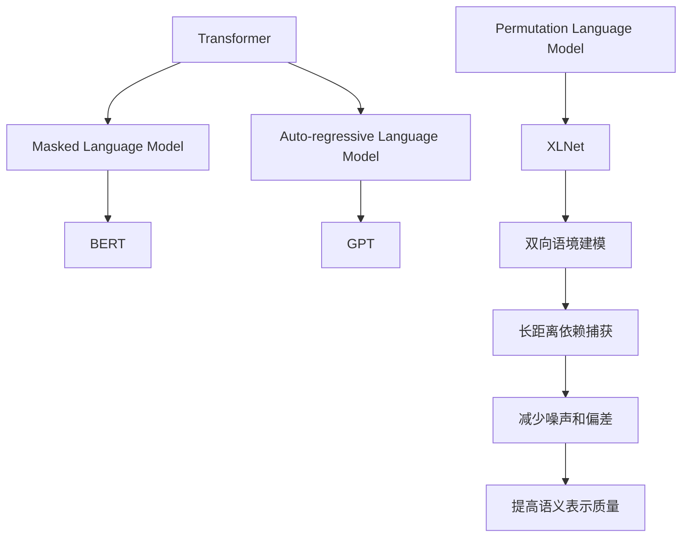

# XLNet原理与代码实例讲解

## 1. 背景介绍

### 1.1 问题的由来

在自然语言处理(NLP)领域,Transformer模型取得了巨大的成功,但它们在处理较长序列时仍然存在一些挑战。传统的语言模型通常采用自回归(auto-regressive)方式,从左到右生成文本,这种方式虽然简单直观,但存在以下几个问题:

1. 缺乏双向语境:自回归模型只能利用当前位置之前的上下文信息,忽视了后续上下文的重要性。
2. 预测偏置:由于生成过程是单向的,可能会导致生成结果存在偏差。
3. 计算效率低下:需要对每个位置进行预测,计算量较大。

为了解决这些问题,XLNet(eXtra Long for Transformer NeXt Transformer)应运而生。

### 1.2 研究现状

近年来,基于Transformer的语言模型取得了令人瞩目的进展,如GPT、BERT等。然而,这些模型仍然存在一些局限性,例如BERT在预训练阶段使用了Masked Language Model(MLM),虽然可以捕获双向上下文,但会引入噪声和预测偏差。

XLNet则采用了一种全新的自回归语言建模方式——Permutation Language Modeling(PLM),通过最大化所有可能的排列顺序的似然概率来学习双向语境表示,从而克服了传统语言模型的缺陷。

### 1.3 研究意义

XLNet的提出为NLP任务带来了新的视角和突破,它能够更好地捕获长距离依赖关系,提高语义表示的质量。同时,XLNet在多项NLP任务上取得了state-of-the-art的表现,展现了其强大的泛化能力。研究XLNet的原理和实现,有助于我们深入理解最新的自然语言处理技术,并为未来的模型创新提供借鉴。

### 1.4 本文结构

本文将全面介绍XLNet的核心思想、算法原理、数学模型以及实现细节,内容安排如下:

- 核心概念与联系
- 核心算法原理与具体操作步骤
- 数学模型和公式详细讲解与案例分析
- 项目实践:代码实例和详细解释说明
- 实际应用场景
- 工具和资源推荐
- 总结:未来发展趋势与挑战
- 附录:常见问题与解答

## 2. 核心概念与联系

XLNet的核心思想源于Transformer模型,并在Masked Language Model(MLM)和Auto-regressive Language Model的基础上,提出了全新的Permutation Language Modeling(PLM)方法。

- **Transformer**是一种基于Self-Attention机制的序列到序列模型,广泛应用于NLP和其他序列建模任务。
- **Masked Language Model(MLM)**是BERT等模型采用的预训练方式,通过掩蔽部分输入Token,学习预测被掩蔽Token的方法来捕获双向语境。但MLM引入了噪声和预测偏差。
- **Auto-regressive Language Model**是传统语言模型的方式,如GPT,从左到右生成序列,只利用了单向语境信息。
- **Permutation Language Modeling(PLM)**是XLNet提出的新颖方法,通过最大化所有可能排列顺序的似然概率,实现了双向语境建模,减少了噪声和偏差,提高了语义表示质量。

XLNet整合了Transformer的Self-Attention优势,并借鉴了MLM和Auto-regressive模型的思想,但采用了全新的PLM方式,使其能够更好地捕获长距离依赖关系,为下游NLP任务提供更优质的语义表示。

## 3. 核心算法原理与具体操作步骤

### 3.1 算法原理概述

XLNet的核心算法——Permutation Language Modeling(PLM),通过最大化所有可能的排列顺序的似然概率来学习双向语境表示。具体来说,PLM包含以下三个关键步骤:

1. **排列数据**:将原始输入序列按照某种规则进行排列,生成多个排列后的序列。
2. **保留位置信息**:为每个位置添加可学习的位置编码,以保留排列前后的位置信息。
3. **最大化排列似然**:对于每个排列后的序列,最大化该序列的似然概率。通过最大化所有排列序列的联合似然概率,实现双向语境建模。

通过这种方式,XLNet能够在预训练阶段同时利用序列中所有位置的上下文信息,避免了MLM引入的噪声和Auto-regressive模型的预测偏差,从而学习到更加准确的语义表示。

### 3.2 算法步骤详解

1. **排列数据**

   对于长度为n的输入序列$X = (x_1, x_2, ..., x_n)$,我们首先生成该序列的所有可能排列$\mathcal{Z}_n$,其中$\mathcal{Z}_n$是一个含有n!个元素的集合,每个元素代表一种排列顺序。

   例如,当$n=3$时,所有可能的排列为:
   $$\mathcal{Z}_3 = \{(x_1, x_2, x_3), (x_1, x_3, x_2), (x_2, x_1, x_3), (x_2, x_3, x_1), (x_3, x_1, x_2), (x_3, x_2, x_1)\}$$

2. **保留位置信息**

   为了保留排列前后的位置信息,XLNet为每个位置添加了可学习的位置编码$\mathbf{u}$。具体来说,对于排列$z \in \mathcal{Z}_n$中的第$i$个元素$z_i$,它对应的位置编码为$\mathbf{u}_{z^{-1}(i)}$,其中$z^{-1}(i)$表示元素$z_i$在原始序列中的位置索引。

3. **最大化排列似然**

   对于每个排列$z \in \mathcal{Z}_n$,XLNet的目标是最大化该排列序列的似然概率:

   $$\begin{aligned}
   \mathcal{L}(z) &= \sum_{i=1}^n \log P(z_i | z_{<i}, \mathbf{u}_{z^{-1}(i)}) \\
                  &= \sum_{i=1}^n \log \frac{\exp(h(z_{<i}, \mathbf{u}_{z^{-1}(i)})^\top e(z_i))}{\sum_{x' \in \mathcal{V}} \exp(h(z_{<i}, \mathbf{u}_{z^{-1}(i)})^\top e(x'))}
   \end{aligned}$$

   其中$h(\cdot)$是Transformer的编码器,输出当前位置的隐藏状态;$e(\cdot)$是词嵌入查找表;$\mathcal{V}$是词表。

   最终,XLNet的目标是最大化所有排列序列的联合似然:

   $$\mathcal{L} = \sum_{z \in \mathcal{Z}_n} \mathcal{L}(z)$$

通过这种方式,XLNet能够充分利用序列中所有位置的上下文信息,实现双向语境建模,从而学习到更加准确的语义表示。

### 3.3 算法优缺点

**优点**:

1. 双向语境建模:通过最大化所有排列序列的似然概率,XLNet能够同时利用序列中所有位置的上下文信息,捕获长距离依赖关系。
2. 减少噪声和偏差:与MLM相比,XLNet避免了引入噪声的问题;与Auto-regressive模型相比,XLNet减少了预测偏差。
3. 泛化能力强:XLNet在多项NLP任务上取得了state-of-the-art的表现,展现了其强大的泛化能力。

**缺点**:

1. 计算复杂度高:需要对所有可能的排列序列进行建模,计算量随序列长度的增加呈指数级增长。
2. 内存消耗大:需要存储所有排列序列的隐藏状态,对GPU内存的要求较高。
3. 缺乏插值能力:与Auto-regressive模型相比,XLNet无法像生成式模型那样进行插值生成。

### 3.4 算法应用领域

XLNet作为一种新型的语言表示模型,可以广泛应用于各种自然语言处理任务,包括但不限于:

- 文本分类
- 序列标注
- 机器阅读理解
- 文本生成
- 语义匹配
- 关系抽取
- 知识图谱构建
- 多模态任务

由于XLNet能够学习到更加准确的语义表示,因此在上述任务中都展现出了优异的性能表现。

## 4. 数学模型和公式详细讲解与举例说明

### 4.1 数学模型构建

XLNet的核心思想是通过最大化所有可能排列序列的联合似然概率,实现双向语境建模。因此,我们需要构建一个数学模型来描述这一过程。

假设我们有一个长度为$n$的输入序列$X = (x_1, x_2, ..., x_n)$,我们的目标是学习一个条件概率模型$P(X)$,使得该模型能够很好地捕获序列$X$中元素之间的依赖关系。

在XLNet中,我们首先生成输入序列$X$的所有可能排列$\mathcal{Z}_n$,其中$\mathcal{Z}_n$是一个含有$n!$个元素的集合,每个元素代表一种排列顺序。然后,我们为每个位置添加可学习的位置编码$\mathbf{u}$,以保留排列前后的位置信息。

对于每个排列$z \in \mathcal{Z}_n$,我们最大化该排列序列的似然概率:

$$\mathcal{L}(z) = \sum_{i=1}^n \log P(z_i | z_{<i}, \mathbf{u}_{z^{-1}(i)})$$

其中$z_{<i}$表示排列$z$中位置$i$之前的所有元素,而$\mathbf{u}_{z^{-1}(i)}$则是元素$z_i$在原始序列中对应的位置编码。

最终,XLNet的目标是最大化所有排列序列的联合似然:

$$\mathcal{L} = \sum_{z \in \mathcal{Z}_n} \mathcal{L}(z)$$

通过这种方式,XLNet能够充分利用序列中所有位置的上下文信息,实现双向语境建模,从而学习到更加准确的语义表示。

### 4.2 公式推导过程

在上一节中,我们给出了XLNet的核心目标函数:

$$\mathcal{L} = \sum_{z \in \mathcal{Z}_n} \sum_{i=1}^n \log P(z_i | z_{<i}, \mathbf{u}_{z^{-1}(i)})$$

接下来,我们将详细推导这个目标函数是如何计算的。

首先,我们利用Softmax函数来计算条件概率$P(z_i | z_{<i}, \mathbf{u}_{z^{-1}(i)})$:

$$P(z_i | z_{<i}, \mathbf{u}_{z^{-1}(i)}) = \frac{\exp(h(z_{<i}, \mathbf{u}_{z^{-1}(i)})^\top e(z_i))}{\sum_{x' \in \mathcal{V}} \exp(h(z_{<i}, \mathbf{u}_{z^{-1}(i)})^\top e(x'))}$$

其中:

- $h(\cdot)$是Transformer的编码器,输出当前位置的隐藏状态;
- $e(\cdot)$是词嵌入查找表;
- $\mathcal{V}$是词表。

将上式代入目标函数,我们得到:

$$\begin{aligned}
\mathcal{L} &= \sum_{z \in \mathcal{Z}_n} \sum_{i=1}^n \log \frac{\exp(h(z_{<i}, \mathbf{u}_{z^{-1}(i)})^\top e(z_i))}{\sum_{x' \in \mathcal{V}} \exp(h(z_{<i}, \mathbf{u}_{z^{-1}(i)})^\top e(x'))} \\
            &= \sum_{z \in \mathcal{Z}_n