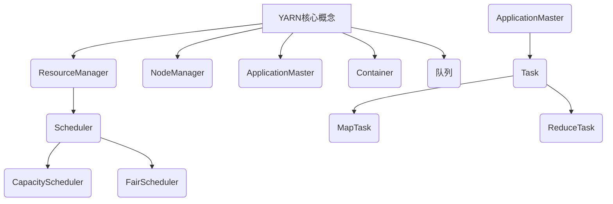

# Yarn 原理与代码实例讲解

## 1. 背景介绍

### 1.1 问题的由来

在大数据时代，数据处理和分析成为了一个关键的挑战。传统的单机系统已经无法满足日益增长的计算需求。因此，分布式计算框架应运而生,以提供可扩展、高效、容错的大数据处理能力。Apache Hadoop作为一个开源的分布式系统,为大数据处理提供了基础架构。然而,Hadoop的MapReduce计算模型存在一些缺陷,例如对于迭代计算和实时计算支持不足。

### 1.2 研究现状

为了解决MapReduce的局限性,Apache Spark等新一代的分布式计算框架被开发出来。Spark提供了内存计算、高度容错、通用的执行模型等优势,但它依赖于独立的资源管理系统(如YARN)来调度和管理集群资源。Apache Hadoop YARN(Yet Another Resource Negotiator)作为一个通用的资源管理框架,被广泛用于管理和调度Hadoop集群中的计算资源。

### 1.3 研究意义

理解YARN的原理和实现对于高效利用分布式计算资源、优化大数据应用程序的性能至关重要。本文旨在深入探讨YARN的架构设计、核心概念和算法,并通过代码示例帮助读者掌握YARN的实现细节和使用方法。

### 1.4 本文结构

本文首先介绍YARN的背景和核心概念,然后详细阐述YARN的架构设计和核心算法原理。接下来,通过数学模型和公式推导,深入解释YARN的资源调度策略。文章还提供了YARN的代码实例和详细解释,帮助读者理解YARN的实现细节。最后,本文讨论了YARN在实际应用场景中的使用,并总结了未来的发展趋势和挑战。

## 2. 核心概念与联系



YARN的核心概念包括:

1. **ResourceManager(RM)**: 是YARN的主要协调者和协调中心,负责全局资源管理和调度。
2. **NodeManager(NM)**: 运行在每个节点上,负责管理本节点上的资源和容器。
3. **ApplicationMaster(AM)**: 为每个应用程序分配一个AM实例,负责应用程序的执行和资源协调。
4. **Container**: 是YARN中资源分配和任务执行的基本单位,包括CPU、内存等资源。
5. **队列**: YARN支持将集群资源划分为多个队列,用于资源分配和访问控制。
6. **Scheduler**: RM中的调度器组件,负责根据特定策略对资源进行调度和分配。

YARN将资源管理和应用程序执行分离,提供了一个通用的资源管理框架。应用程序通过AM与RM协商资源,然后在分配的Container中执行任务。这种设计使得YARN能够支持不同类型的分布式应用程序,如批处理、流处理、机器学习等。

## 3. 核心算法原理 & 具体操作步骤

### 3.1 算法原理概述

YARN的资源调度算法主要包括两个部分:资源请求和资源分配。

1. **资源请求**: 应用程序的AM根据需求向RM发送资源请求,包括CPU、内存等资源的数量。
2. **资源分配**: RM的Scheduler根据特定的调度策略(如CapacityScheduler或FairScheduler)对请求进行排序,并将可用资源分配给优先级高的应用程序。

### 3.2 算法步骤详解

1. **应用程序提交**: 客户端向RM提交应用程序,RM为该应用程序分配一个AM容器。
2. **AM启动**: AM容器启动后,AM向RM注册并请求资源。
3. **资源请求**: AM根据应用程序的需求向RM发送资源请求。
4. **资源调度**: RM的Scheduler根据调度策略对请求进行排序和分配。
5. **容器分配**: RM将可用资源分配给优先级高的应用程序,并通知相应的NM启动容器。
6. **任务执行**: AM在分配的容器中启动任务,如MapTask或ReduceTask。
7. **资源释放**: 任务完成后,容器被释放,资源返回资源池供后续使用。
8. **应用程序完成**: 所有任务完成后,AM向RM注销并释放AM容器。

### 3.3 算法优缺点

**优点**:

- 资源统一管理和调度,提高集群资源利用率。
- 支持多种调度策略,如公平调度、容量调度等。
- 与具体应用程序解耦,支持不同类型的分布式应用程序。

**缺点**:

- 增加了一层资源协商的开销。
- 调度决策依赖于应用程序提供的资源需求估计,估计不准确可能导致资源浪费或性能下降。

### 3.4 算法应用领域

YARN的资源调度算法广泛应用于以下领域:

- 大数据处理: Hadoop MapReduce、Apache Spark等。
- 机器学习: TensorFlow on YARN、Apache Hadoop Ozone等。
- 流处理: Apache Kafka on YARN、Apache Storm on YARN等。
- 其他分布式应用程序,如Alluxio、HBase等。

## 4. 数学模型和公式 & 详细讲解 & 举例说明

### 4.1 数学模型构建

为了更好地理解YARN的资源调度策略,我们可以构建一个数学模型。假设集群中有N个节点,每个节点有$R_i$个可用资源(如CPU、内存等)。有M个应用程序在运行,每个应用程序$j$的资源需求为$D_j$。我们的目标是最大化集群资源的利用率,同时保证公平性。

### 4.2 公式推导过程

我们定义一个目标函数$F$,它是集群资源利用率和公平性之间的加权和:

$$F = \alpha \cdot U + (1 - \alpha) \cdot F_f$$

其中:

- $U$是集群资源利用率,定义为已分配资源与总资源的比值:$U = \frac{\sum_{j=1}^M D_j}{\sum_{i=1}^N R_i}$
- $F_f$是公平性指标,可以使用诸如Jain's fairness index等指标来衡量。
- $\alpha$是一个权重参数,用于平衡资源利用率和公平性之间的权衡。

为了最大化目标函数$F$,我们需要找到一种资源分配方式,使得$F$达到最大值。这可以通过约束优化算法或启发式算法来实现。

例如,对于CapacityScheduler,它采用了一种分层队列的方式来实现资源分配。每个队列都有一个预配置的资源容量,调度器会按照队列的优先级依次分配资源,直到所有资源被分配完毕或所有队列的需求都被满足。

### 4.3 案例分析与讲解

假设我们有一个4节点的YARN集群,每个节点有8个CPU核心和32GB内存。现在有3个应用程序在运行,它们的资源需求分别为:

- 应用程序1: 8 CPU核心,16GB内存
- 应用程序2: 4 CPU核心,8GB内存
- 应用程序3: 2 CPU核心,4GB内存

我们使用CapacityScheduler进行资源调度,并设置队列容量比为2:1:1。

根据CapacityScheduler的调度策略,应用程序1会被分配到第一个队列,获得一半的集群资源,即16 CPU核心和64GB内存。应用程序2和应用程序3会被分别分配到剩余的两个队列,每个队列获得一半的剩余资源,即8 CPU核心和32GB内存。

在这种资源分配方式下,集群资源利用率为:

$$U = \frac{8 + 4 + 2}{4 \times 8} = \frac{14}{32} \approx 0.44$$

公平性指标(使用Jain's fairness index)为:

$$F_f = \frac{(0.5^2 + 0.25^2 + 0.125^2)}{3 \times (1/3)^2} \approx 0.79$$

假设$\alpha = 0.6$,则目标函数$F$的值为:

$$F = 0.6 \cdot 0.44 + 0.4 \cdot 0.79 \approx 0.58$$

通过调整队列容量比或使用不同的调度策略,我们可以进一步优化目标函数$F$,以达到更好的资源利用率和公平性权衡。

### 4.4 常见问题解答

**Q: 如何确定应用程序的资源需求?**

A: 应用程序的资源需求通常由开发人员或运维人员根据经验和应用程序特征进行估计。一些技术,如Profiling和自动调优,也可以帮助确定合理的资源需求。

**Q: 如何处理资源过度使用或资源饥饿的情况?**

A: YARN提供了一些机制来处理这些情况,如资源预留、资源抢占和限制等。同时,合理的资源估计和调度策略也可以有效缓解这些问题。

**Q: YARN是否支持GPU等专用硬件资源的调度?**

A: 是的,YARN支持对GPU等专用硬件资源进行隔离和调度。开发人员需要实现相应的插件来管理和调度这些资源。

## 5. 项目实践:代码实例和详细解释说明

### 5.1 开发环境搭建

在开始YARN开发之前,我们需要准备以下环境:

1. **Hadoop环境**: 下载并安装Apache Hadoop发行版,包括HDFS和YARN组件。
2. **Java开发环境**: 安装JDK并配置相应的环境变量。
3. **构建工具**: 推荐使用Apache Maven作为构建和依赖管理工具。

### 5.2 源代码详细实现

我们将通过一个示例应用程序来演示如何在YARN上运行分布式计算任务。该应用程序实现了一个简单的单词计数器,它接受一个文本文件作为输入,统计每个单词出现的次数,并将结果输出到HDFS。

```java
// WordCountApp.java
import org.apache.hadoop.conf.Configured;
import org.apache.hadoop.util.Tool;
import org.apache.hadoop.util.ToolRunner;
import org.apache.hadoop.mapreduce.Job;
import org.apache.hadoop.mapreduce.lib.input.FileInputFormat;
import org.apache.hadoop.mapreduce.lib.output.FileOutputFormat;
import org.apache.hadoop.fs.Path;

public class WordCountApp extends Configured implements Tool {
    public static void main(String[] args) throws Exception {
        int exitCode = ToolRunner.run(new WordCountApp(), args);
        System.exit(exitCode);
    }

    public int run(String[] args) throws Exception {
        if (args.length != 2) {
            System.err.println("Usage: WordCountApp <input> <output>");
            return -1;
        }

        Job job = Job.getInstance(getConf());
        job.setJarByClass(WordCountApp.class);
        job.setJobName("Word Count");

        FileInputFormat.addInputPath(job, new Path(args[0]));
        FileOutputFormat.setOutputPath(job, new Path(args[1]));

        job.setMapperClass(WordCountMapper.class);
        job.setCombinerClass(WordCountReducer.class);
        job.setReducerClass(WordCountReducer.class);

        job.setOutputKeyClass(Text.class);
        job.setOutputValueClass(IntWritable.class);

        return job.waitForCompletion(true) ? 0 : 1;
    }
}
```

```java
// WordCountMapper.java
import java.io.IOException;
import org.apache.hadoop.io.IntWritable;
import org.apache.hadoop.io.LongWritable;
import org.apache.hadoop.io.Text;
import org.apache.hadoop.mapreduce.Mapper;

public class WordCountMapper extends Mapper<LongWritable, Text, Text, IntWritable> {
    private final IntWritable one = new IntWritable(1);
    private Text word = new Text();

    public void map(LongWritable key, Text value, Context context) throws IOException, InterruptedException {
        String line = value.toString();
        String[] words = line.split("\\W+");
        for (String w : words) {
            if (!w.isEmpty()) {
                word.set(w);
                context.write(word, one);
            }
        }
    }
}
```

```java
// WordCountReducer.java
import java.io.IOException;
import org.apache.hadoop.io.IntWritable;
import org.apache.hadoop.io.Text;
import org.apache.hadoop.mapre