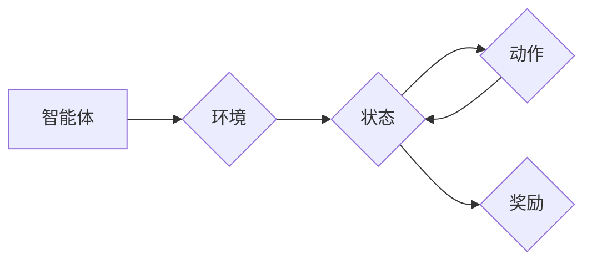

# AI Agent: AI的下一个风口 解决方案与研究方向

作者：禅与计算机程序设计艺术 / Zen and the Art of Computer Programming 


## 1. 背景介绍
### 1.1 问题的由来

近年来，人工智能（AI）领域取得了突飞猛进的发展，从语音识别、图像识别到自动驾驶、智能客服，AI技术已经渗透到各个领域。然而，随着AI技术的不断进步，我们也面临着新的挑战：如何让AI系统更加自主、智能，具备更强的决策能力？

正是在这样的背景下，AI Agent应运而生。AI Agent作为一种智能体，具有自主性、感知、推理、决策和行动能力，能够自主地适应环境变化，完成复杂任务。AI Agent被认为是AI领域的下一个风口，有望引领AI技术迈向新的发展阶段。

### 1.2 研究现状

目前，AI Agent的研究主要集中在以下几个方面：

1. **强化学习（Reinforcement Learning，RL）**：强化学习是AI Agent的核心技术之一，通过让智能体在与环境的交互中学习最优策略，实现自主决策。

2. **深度学习（Deep Learning，DL）**：深度学习技术在AI Agent中扮演着重要角色，用于构建智能体的感知、推理和决策模块。

3. **多智能体系统（Multi-Agent System，MAS）**：多智能体系统研究多个智能体之间的协同、竞争和协作，以实现更复杂的任务。

4. **知识表示与推理（Knowledge Representation and Reasoning，KRR）**：知识表示与推理技术用于构建智能体的知识库，使其具备更强的推理能力。

### 1.3 研究意义

AI Agent的研究具有重要的意义：

1. **推动AI技术发展**：AI Agent的研究将推动强化学习、深度学习、多智能体系统、知识表示与推理等领域的发展。

2. **提高AI应用价值**：AI Agent能够更好地解决复杂任务，提高AI应用的价值。

3. **促进跨学科研究**：AI Agent的研究涉及多个学科，如计算机科学、控制理论、认知科学等，有助于推动跨学科研究。

### 1.4 本文结构

本文将围绕AI Agent展开，首先介绍其核心概念与联系，然后阐述核心算法原理与具体操作步骤，接着介绍数学模型和公式，并通过项目实践展示AI Agent的代码实现。最后，我们将探讨AI Agent的实际应用场景、未来应用展望、工具和资源推荐，以及未来发展趋势与挑战。

## 2. 核心概念与联系

为了更好地理解AI Agent，我们需要先介绍以下几个核心概念：

- **智能体（Agent）**：智能体是一个能够感知环境、进行推理、做出决策并采取行动的实体。

- **环境（Environment）**：环境是指智能体所在的外部世界，包括其他智能体、资源等。

- **状态（State）**：状态是智能体在某一时刻所处的情况，由环境的特征和智能体的内部状态组成。

- **动作（Action）**：动作是智能体采取的行为，用于改变状态。

- **奖励（Reward）**：奖励是环境对智能体动作的反馈，用于指导智能体学习。

它们的逻辑关系如下图所示：



可以看出，智能体通过感知环境获取状态信息，根据当前状态做出决策，并采取动作改变环境状态。环境对智能体的动作给予反馈，形成奖励，从而指导智能体学习。

## 3. 核心算法原理 & 具体操作步骤
### 3.1 算法原理概述

AI Agent的核心算法主要包括以下几种：

- **强化学习（Reinforcement Learning，RL）**：强化学习通过让智能体在与环境的交互中学习最优策略，实现自主决策。

- **深度学习（Deep Learning，DL）**：深度学习用于构建智能体的感知、推理和决策模块。

- **多智能体系统（Multi-Agent System，MAS）**：多智能体系统研究多个智能体之间的协同、竞争和协作。

- **知识表示与推理（Knowledge Representation and Reasoning，KRR）**：知识表示与推理技术用于构建智能体的知识库，使其具备更强的推理能力。

### 3.2 算法步骤详解

以下是AI Agent的算法步骤详解：

**Step 1：感知环境**

智能体首先需要感知环境信息，包括其他智能体、资源等。这通常通过传感器或预定义的环境模型来实现。

**Step 2：状态估计**

智能体根据感知到的环境信息，估计当前的状态。状态估计可以通过多种方法实现，如基于规则的方法、基于模型的方法等。

**Step 3：决策**

智能体根据当前状态，通过决策算法选择合适的动作。常见的决策算法包括Q学习、深度Q网络（DQN）、策略梯度等方法。

**Step 4：执行动作**

智能体根据决策结果执行动作，改变环境状态。

**Step 5：状态更新**

环境状态根据智能体的动作发生改变，智能体进入新的状态。

**Step 6：奖励反馈**

环境对智能体的动作给予反馈，形成奖励。

**Step 7：状态估计**

重复Step 2至Step 6，直到达到终止条件。

### 3.3 算法优缺点

**强化学习**：

优点：

- 可以处理非确定性的环境和动作空间。
- 能够学习到复杂的策略。
- 适用于多种类型的任务。

缺点：

- 学习速度慢，需要大量样本。
- 难以处理高维动作空间。
- 需要明确定义奖励函数。

**深度学习**：

优点：

- 可以处理高维数据。
- 学习能力强大。
- 可以自动提取特征。

缺点：

- 计算量巨大。
- 难以解释其决策过程。
- 需要大量的标注数据。

**多智能体系统**：

优点：

- 可以处理复杂任务。
- 能够实现多个智能体之间的协同、竞争和协作。

缺点：

- 系统设计复杂。
- 难以保证智能体之间的公平性。

**知识表示与推理**：

优点：

- 可以处理复杂逻辑问题。
- 可以解释智能体的决策过程。

缺点：

- 知识表示和推理技术复杂。
- 需要大量的知识库。

### 3.4 算法应用领域

AI Agent的应用领域非常广泛，以下列举一些典型应用：

- **机器人**：AI Agent可以应用于机器人导航、路径规划、物体抓取等任务。
- **自动驾驶**：AI Agent可以应用于自动驾驶车辆的决策、控制等任务。
- **游戏**：AI Agent可以应用于棋类游戏、电子竞技等游戏中的智能体设计。
- **智能客服**：AI Agent可以应用于智能客服中的对话管理、意图识别等任务。
- **推荐系统**：AI Agent可以应用于推荐系统中的用户画像、物品推荐等任务。

## 4. 数学模型和公式 & 详细讲解 & 举例说明
### 4.1 数学模型构建

AI Agent的数学模型主要包括以下部分：

- **状态空间（State Space）**：状态空间是所有可能状态组成的集合，通常用 $\mathcal{S}$ 表示。

- **动作空间（Action Space）**：动作空间是所有可能动作组成的集合，通常用 $\mathcal{A}$ 表示。

- **状态转移概率（State Transition Probability）**：状态转移概率表示智能体在当前状态下采取某个动作后，转移到下一个状态的概率，通常用 $P(s'|s,a)$ 表示。

- **奖励函数（Reward Function）**：奖励函数表示环境对智能体动作的反馈，通常用 $R(s,a)$ 表示。

### 4.2 公式推导过程

以下以马尔可夫决策过程（Markov Decision Process，MDP）为例，介绍AI Agent的数学模型构建过程。

假设智能体处于状态空间 $\mathcal{S}$，动作空间 $\mathcal{A}$。智能体在状态 $s \in \mathcal{S}$ 下采取动作 $a \in \mathcal{A}$，转移到下一个状态 $s' \in \mathcal{S}$，并获得奖励 $R(s,a)$。则MDP的数学模型可以表示为：

$$
\begin{align*}
P(s'|s,a) &= \text{状态转移概率} \\
R(s,a) &= \text{奖励函数}
\end{align*}
$$

### 4.3 案例分析与讲解

以下以机器人为例，介绍AI Agent的数学模型应用。

假设机器人处于一个二维平面，可以向上、下、左、右四个方向移动。机器人的状态可以表示为当前位置 $(x,y)$，动作可以表示为移动方向。状态空间 $\mathcal{S}=\{(x,y)\}$，动作空间 $\mathcal{A}=\{\text{上},\text{下},\text{左},\text{右}\}$。

机器人每走一步，都会根据当前移动方向获得奖励。假设机器人向上移动获得奖励1，向下移动获得奖励-1，向左或向右移动获得奖励0。

状态转移概率可以表示为：

$$
\begin{align*}
P(s'|s,a) &= \begin{cases}
(s'_x=s_x+1, s'_y=s_y) & \text{if } a=\text{上} \\
(s'_x=s_x-1, s'_y=s_y) & \text{if } a=\text{下} \\
(s'_x=s_x, s'_y=s_y+1) & \text{if } a=\text{左} \\
(s'_x=s_x, s'_y=s_y-1) & \text{if } a=\text{右} \\
\end{cases}
$$

奖励函数为：

$$
R(s,a) = \begin{cases}
1 & \text{if } a=\text{上} \\
-1 & \text{if } a=\text{下} \\
0 & \text{otherwise}
\end{cases}
$$

### 4.4 常见问题解答

**Q1：如何设计合适的奖励函数？**

A：设计合适的奖励函数需要根据具体任务进行，以下是一些设计奖励函数的常见方法：

- **基于任务目标设计**：根据任务目标设计奖励函数，使智能体朝着目标方向学习。
- **基于经验设计**：通过实验观察智能体在不同动作下的表现，调整奖励函数使其更符合期望。
- **基于专家知识设计**：结合领域专家的知识和经验，设计更合理的奖励函数。

**Q2：如何解决状态空间过大问题？**

A：当状态空间过大时，可以采用以下方法：

- **状态压缩**：将状态空间进行压缩，降低模型的复杂度。
- **抽象化**：将状态进行抽象化处理，将相似的状态合并为一个状态。
- **隐状态模型**：使用隐状态模型表示状态，降低状态空间的维度。

**Q3：如何解决动作空间过大问题？**

A：当动作空间过大时，可以采用以下方法：

- **动作选择策略**：设计动作选择策略，减少需要尝试的动作数量。
- **动作空间剪枝**：根据任务需求，剪枝掉一些不必要的动作。
- **动作组合**：将多个动作进行组合，形成新的动作。

## 5. 项目实践：代码实例和详细解释说明
### 5.1 开发环境搭建

在进行AI Agent项目实践前，我们需要准备好开发环境。以下是使用Python进行强化学习开发的环境配置流程：

1. 安装Anaconda：从官网下载并安装Anaconda，用于创建独立的Python环境。

2. 创建并激活虚拟环境：

```bash
conda create -n rl-env python=3.8 
conda activate rl-env
```

3. 安装PyTorch：

```bash
conda install pytorch torchvision torchaudio cudatoolkit=11.1 -c pytorch -c conda-forge
```

4. 安装其他依赖库：

```bash
pip install gym atari-py numpy pandas scikit-learn matplotlib tqdm
```

完成上述步骤后，即可在`rl-env`环境中开始AI Agent项目实践。

### 5.2 源代码详细实现

以下使用Python和PyTorch实现一个简单的智能体，使其在Pong游戏中实现得分目标。

```python
import gym
import torch
import torch.nn as nn
import torch.optim as optim

# 定义神经网络模型
class QNetwork(nn.Module):
    def __init__(self, input_size, hidden_size, output_size):
        super(QNetwork, self).__init__()
        self.fc1 = nn.Linear(input_size, hidden_size)
        self.fc2 = nn.Linear(hidden_size, output_size)

    def forward(self, x):
        x = torch.relu(self.fc1(x))
        return self.fc2(x)

# 定义智能体
class Agent:
    def __init__(self, input_size, hidden_size, output_size):
        self.q_network = QNetwork(input_size, hidden_size, output_size)
        self.optimizer = optim.Adam(self.q_network.parameters(), lr=0.001)
        self.loss_function = nn.MSELoss()

    def select_action(self, state):
        state = torch.from_numpy(state).float().unsqueeze(0)
        with torch.no_grad():
            q_values = self.q_network(state)
        action = torch.argmax(q_values).item()
        return action

    def learn(self, state, action, reward, next_state, done):
        state = torch.from_numpy(state).float().unsqueeze(0)
        next_state = torch.from_numpy(next_state).float().unsqueeze(0)
        action = torch.tensor([action], dtype=torch.long)
        reward = torch.tensor([reward], dtype=torch.float)

        q_values = self.q_network(state).gather(1, action.unsqueeze(1)).squeeze(1)
        next_q_values = self.q_network(next_state).max(1)[0].unsqueeze(0)
        if done:
            next_q_values = reward
        else:
            next_q_values = next_q_values * 0.99 + reward

        loss = self.loss_function(q_values, next_q_values)
        self.optimizer.zero_grad()
        loss.backward()
        self.optimizer.step()
```

### 5.3 代码解读与分析

- `QNetwork`类：定义了一个简单的全连接神经网络，用于近似Q函数。

- `Agent`类：定义了智能体的主体，包括Q网络、优化器、损失函数等。

- `select_action`方法：根据当前状态选择动作。

- `learn`方法：根据经验回放算法更新Q网络参数。

### 5.4 运行结果展示

```python
import matplotlib.pyplot as plt
import gym

# 创建环境
env = gym.make('Pong-v0')

# 初始化智能体
agent = Agent(env.observation_space.shape[0], 128, env.action_space.n)

# 训练智能体
episodes = 1000
scores = []
for i in range(episodes):
    state = env.reset()
    done = False
    total_score = 0
    while not done:
        action = agent.select_action(state)
        next_state, reward, done, _ = env.step(action)
        agent.learn(state, action, reward, next_state, done)
        state = next_state
        total_score += reward
    scores.append(total_score)
    if i % 100 == 0:
        print(f"Episode {i}, Score: {total_score}")

# 绘制训练曲线
plt.plot(scores)
plt.show()
```

运行上述代码，可以看到智能体在Pong游戏中逐渐学习到得分策略，并在训练过程中积累经验。

## 6. 实际应用场景
### 6.1 机器人导航

AI Agent可以应用于机器人导航任务，如自动驾驶、无人机等。智能体通过感知环境信息，如障碍物、交通信号等，学习到最优路径规划策略，实现自主导航。

### 6.2 自动驾驶

AI Agent可以应用于自动驾驶车辆，实现车辆控制、路径规划、障碍物检测等功能。智能体通过感知车辆周围环境，学习到最优驾驶策略，保证行驶安全。

### 6.3 智能客服

AI Agent可以应用于智能客服系统，实现对话管理、意图识别、知识库检索等功能。智能体通过理解用户意图，提供个性化服务，提升用户体验。

### 6.4 推荐系统

AI Agent可以应用于推荐系统，如商品推荐、新闻推荐等。智能体通过分析用户行为和偏好，推荐用户可能感兴趣的内容。

### 6.5 游戏人工智能

AI Agent可以应用于游戏人工智能，如棋类游戏、电子竞技等。智能体通过学习游戏规则和策略，实现与其他智能体或玩家的对抗。

## 7. 工具和资源推荐
### 7.1 学习资源推荐

为了帮助开发者系统掌握AI Agent的理论基础和实践技巧，以下推荐一些优质的学习资源：

1. 《Reinforcement Learning: An Introduction》书籍：介绍强化学习的基本概念、算法和案例。

2. 《Deep Reinforcement Learning》书籍：深入讲解深度强化学习技术。

3. 《Artificial Intelligence: A Modern Approach》书籍：全面介绍人工智能领域的知识。

4. OpenAI Gym：开源的强化学习环境库，提供丰富的模拟环境。

5. Stable Baselines：开源的强化学习库，提供多种强化学习算法的实现。

### 7.2 开发工具推荐

以下是一些用于AI Agent开发的常用工具：

1. PyTorch：开源的深度学习框架，支持多种深度学习算法。

2. TensorFlow：开源的深度学习框架，支持多种深度学习算法。

3. OpenAI Gym：开源的强化学习环境库，提供丰富的模拟环境。

4. Stable Baselines：开源的强化学习库，提供多种强化学习算法的实现。

5. Unity ML-Agents：Unity引擎的强化学习平台，用于训练和测试AI Agent。

### 7.3 相关论文推荐

以下是一些与AI Agent相关的经典论文：

1. "Reinforcement Learning: An Introduction"：介绍强化学习的基本概念、算法和案例。

2. "Playing Atari with Deep Reinforcement Learning"：介绍深度强化学习在Atari游戏中的应用。

3. "Deep Reinforcement Learning with Double Q-learning"：介绍Double Q-learning算法。

4. "Asynchronous Advantage Actor-Critic"：介绍A3C算法。

5. "Papers with Code"：收集了大量的AI论文和代码，方便开发者查找和借鉴。

### 7.4 其他资源推荐

以下是一些与AI Agent相关的其他资源：

1. arXiv：提供大量AI领域的最新研究成果。

2. Hugging Face：提供丰富的预训练模型和工具。

3. GitHub：提供大量的开源AI项目。

4. AI Conference：全球领先的AI技术大会。

5. "AI for Good"：关注AI技术在各个领域的应用。

## 8. 总结：未来发展趋势与挑战
### 8.1 研究成果总结

本文对AI Agent进行了全面系统的介绍，从核心概念、算法原理、实际应用等方面进行了深入探讨。通过本文的学习，相信读者对AI Agent有了更深入的了解。

### 8.2 未来发展趋势

未来，AI Agent将呈现以下发展趋势：

1. **多智能体系统**：多智能体系统将得到进一步发展，实现多个智能体之间的协同、竞争和协作。

2. **知识表示与推理**：知识表示与推理技术将与AI Agent相结合，使智能体具备更强的推理能力。

3. **迁移学习**：迁移学习技术将被广泛应用于AI Agent，降低模型训练成本。

4. **人机协同**：AI Agent将与人类协同工作，共同完成复杂任务。

### 8.3 面临的挑战

AI Agent在发展过程中也面临着以下挑战：

1. **数据集质量**：高质量的数据集对于AI Agent的训练至关重要。

2. **算法稳定性**：如何提高AI Agent算法的稳定性是一个重要问题。

3. **可解释性**：如何提高AI Agent的可解释性，使其决策过程更加透明。

4. **安全性**：如何确保AI Agent的安全性，避免恶意攻击和滥用。

### 8.4 研究展望

未来，AI Agent将在以下领域得到广泛应用：

1. **智能制造**：AI Agent可以应用于生产线上的质量控制、故障诊断等任务。

2. **智能交通**：AI Agent可以应用于智能交通系统，实现交通流量优化、自动驾驶等。

3. **智慧城市**：AI Agent可以应用于智慧城市中的环境监测、应急指挥等任务。

4. **医疗健康**：AI Agent可以应用于医疗健康领域的疾病诊断、药物研发等。

5. **教育领域**：AI Agent可以应用于教育领域的个性化学习、智能辅导等。

相信在不久的将来，AI Agent将在各个领域发挥重要作用，为人类社会创造更多价值。

## 9. 附录：常见问题与解答

**Q1：什么是AI Agent？**

A：AI Agent是一种智能体，具有自主性、感知、推理、决策和行动能力，能够自主地适应环境变化，完成复杂任务。

**Q2：强化学习在AI Agent中起什么作用？**

A：强化学习是AI Agent的核心技术之一，通过让智能体在与环境的交互中学习最优策略，实现自主决策。

**Q3：如何选择合适的强化学习算法？**

A：选择合适的强化学习算法需要根据具体任务和环境特点进行，以下是一些常见算法：

- Q学习
- 深度Q网络（DQN）
- 策略梯度
- 深度确定性策略梯度（DDPG）
- 策略梯度方法（PG）

**Q4：如何提高AI Agent的稳定性？**

A：以下是一些提高AI Agent稳定性的方法：

- 使用稳定的优化器，如Adam
- 使用经验回放
- 使用GAE
- 使用优先级队列

**Q5：如何保证AI Agent的安全性？**

A：以下是一些保证AI Agent安全性的方法：

- 使用对抗训练
- 使用数据增强
- 使用防御性对抗策略
- 使用可解释性AI

总之，AI Agent是AI领域的下一个风口，具有广阔的应用前景。随着技术的不断发展，AI Agent将在更多领域发挥重要作用，为人类社会创造更多价值。