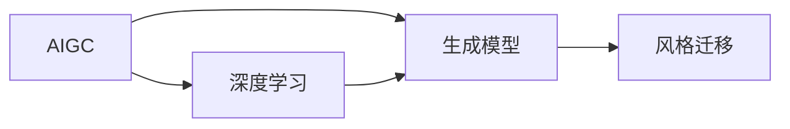

# AIGC从入门到实战：多快好省搞定各种风格的 logo 设计

作者：禅与计算机程序设计艺术 / Zen and the Art of Computer Programming

## 关键词

AIGC，人工智能生成内容，logo 设计，风格迁移，深度学习，生成模型，应用场景

## 1. 背景介绍
### 1.1 问题的由来

随着人工智能技术的飞速发展，人工智能生成内容（AIGC）技术逐渐进入人们的视野。AIGC技术能够利用人工智能算法自动生成各种类型的内容，如文本、图像、音乐等。在logo设计领域，AIGC技术能够帮助设计师快速生成符合不同风格和需求的logo，从而提高设计效率，降低设计成本。

### 1.2 研究现状

近年来，随着深度学习技术的不断进步，AIGC在logo设计领域的应用逐渐成熟。目前，AIGC在logo设计中的应用主要包括以下几个方面：

- **风格迁移**：将现有的logo设计风格迁移到新的logo设计中，实现快速的风格转换。
- **个性化定制**：根据用户的需求，自动生成具有个性化特色的logo。
- **创意启发**：为设计师提供创意灵感，辅助设计师进行设计创作。

### 1.3 研究意义

AIGC在logo设计领域的应用具有以下意义：

- **提高设计效率**：AIGC技术可以帮助设计师快速生成符合要求的logo，提高设计效率。
- **降低设计成本**：通过自动化设计，降低设计成本，使logo设计更加普及。
- **拓展设计领域**：AIGC技术可以拓展logo设计的领域，为设计师提供更多可能性。
- **促进创意发展**：AIGC技术可以为设计师提供创意灵感，促进创意发展。

### 1.4 本文结构

本文将围绕AIGC在logo设计领域的应用展开，分为以下几个部分：

- **第2章**：介绍AIGC的核心概念与联系。
- **第3章**：讲解AIGC在logo设计中的核心算法原理与具体操作步骤。
- **第4章**：分析AIGC在logo设计中的数学模型、公式以及相关案例。
- **第5章**：通过项目实践，展示AIGC在logo设计中的应用。
- **第6章**：探讨AIGC在logo设计中的实际应用场景及未来发展趋势。
- **第7章**：推荐AIGC相关的学习资源、开发工具和参考文献。
- **第8章**：总结AIGC在logo设计领域的研究成果、发展趋势与挑战。
- **第9章**：提供AIGC在logo设计领域的常见问题解答。

## 2. 核心概念与联系

为了更好地理解AIGC在logo设计中的应用，本节将介绍几个核心概念及其相互联系。

### 2.1 AIGC

人工智能生成内容（AIGC）是指利用人工智能算法自动生成各种类型的内容，如文本、图像、音乐等。AIGC技术包括多个子领域，如文本生成、图像生成、音乐生成等。

### 2.2 深度学习

深度学习是AIGC技术的基础，它是一种模拟人脑神经网络结构的机器学习算法。深度学习在AIGC领域发挥着重要作用，特别是在图像生成和音乐生成等方面。

### 2.3 生成模型

生成模型是AIGC技术的核心，它能够从给定的数据中学习并生成新的数据。生成模型主要包括以下几种：

- **生成对抗网络（GANs）**：由生成器和判别器组成的对抗性网络，通过不断对抗训练，生成逼真的图像。
- **变分自编码器（VAEs）**：通过变分推理学习数据分布的近似，生成具有真实数据分布的样本。
- **条件生成对抗网络（cGANs）**：在GAN的基础上引入条件变量，使得生成器能够根据条件生成相应的样本。

### 2.4 风格迁移

风格迁移是指将一种图像的风格迁移到另一种图像中，使其呈现出与原始图像相似的风格。在logo设计中，风格迁移可以快速将一种风格的logo转换为另一种风格。

以上概念之间的关系如图所示：



## 3. 核心算法原理 & 具体操作步骤

### 3.1 算法原理概述

AIGC在logo设计中的核心算法主要包括以下两种：

- **GANs**：利用生成器和判别器对抗训练，生成具有真实数据分布的logo。
- **VAEs**：通过变分推理学习数据分布的近似，生成具有真实数据分布的logo。

### 3.2 算法步骤详解

以下以GANs为例，介绍AIGC在logo设计中的具体操作步骤：

**Step 1：数据准备**

收集大量具有不同风格的logo图像，作为训练数据。

**Step 2：模型构建**

构建GANs模型，包括生成器G和判别器D。

- 生成器G：输入随机噪声，输出logo图像。
- 判别器D：输入logo图像，输出图像的真实性概率。

**Step 3：训练模型**

通过对抗训练，使得生成器G生成逼真的logo图像，而判别器D能够正确判断图像的真实性。

**Step 4：风格迁移**

将待设计的logo图像输入生成器G，输出具有特定风格的logo图像。

### 3.3 算法优缺点

**GANs**：

- 优点：能够生成具有真实数据分布的logo图像，具有较强的泛化能力。
- 缺点：训练过程不稳定，容易出现模式崩溃现象。

**VAEs**：

- 优点：训练过程稳定，易于实现。
- 缺点：生成图像质量相对较低，泛化能力较差。

### 3.4 算法应用领域

AIGC在logo设计中的应用领域主要包括：

- **风格迁移**：将现有logo设计风格迁移到新的logo设计中。
- **个性化定制**：根据用户需求，自动生成具有个性化特色的logo。
- **创意启发**：为设计师提供创意灵感，辅助设计师进行设计创作。

## 4. 数学模型和公式 & 详细讲解 & 举例说明

### 4.1 数学模型构建

以GANs为例，介绍AIGC在logo设计中的数学模型。

**生成器G**：

$$
G(z) = \mathcal{F}(z; \theta_G) 
$$

其中，$z$为输入噪声，$\theta_G$为生成器参数，$\mathcal{F}$为生成器函数。

**判别器D**：

$$
D(x) = \mathcal{F}(x; \theta_D) 
$$

其中，$x$为输入logo图像，$\theta_D$为判别器参数，$\mathcal{F}$为判别器函数。

**损失函数**：

$$
L_D(\theta_D, \theta_G) = -\mathbb{E}_{x \sim p_data(x)}[D(x)] - \mathbb{E}_{z \sim p_z(z)}[D(G(z))] 
$$

其中，$p_data(x)$为真实logo图像分布，$p_z(z)$为噪声分布。

### 4.2 公式推导过程

此处省略公式推导过程，具体可参考相关文献。

### 4.3 案例分析与讲解

以下以VAEs为例，介绍AIGC在logo设计中的应用。

**VAEs**：

$$
\begin{align*}
\mathbb{E}_{q_\phi(z|x)}[f(x; \theta)] &= \int q_\phi(z|x) f(x; \theta) dz \
\mathbb{E}_{p(x)}[f(x; \theta)] &= \int p(x) f(x; \theta) dx
\end{align*}
$$

其中，$q_\phi(z|x)$为编码器，$p(x)$为数据分布，$f(x; \theta)$为解码器。

### 4.4 常见问题解答

**Q1：如何选择合适的GANs结构？**

A：选择合适的GANs结构需要根据具体任务和数据特点进行。常见的GANs结构包括DCGAN、WGAN、StyleGAN等。可以通过对比实验选择最适合当前任务的GANs结构。

**Q2：VAEs在logo设计中如何应用？**

A：VAEs可以用于生成具有特定风格的logo。具体方法是将VAEs的编码器和解码器分别应用于原始logo图像和目标风格logo图像，学习两者的特征表示，并将目标风格特征表示应用到原始logo图像上，生成具有特定风格的logo。

**Q3：如何提高AIGC在logo设计中的效果？**

A：提高AIGC在logo设计中的效果可以从以下几个方面着手：

- 选择合适的模型结构。
- 收集高质量的训练数据。
- 优化训练参数。
- 引入风格迁移等技术。

## 5. 项目实践：代码实例和详细解释说明

### 5.1 开发环境搭建

1. 安装Python环境：`python -m pip install --upgrade pip`
2. 安装深度学习框架：`pip install torch torchvision`
3. 安装VAEs库：`pip install pytorch-vaes`

### 5.2 源代码详细实现

以下是一个基于VAEs的logo风格迁移的PyTorch代码实例：

```python
import torch
from pytorch_vae import VAE

# 创建VAEs模型
vae = VAE()

# 加载logo图像数据
train_data = ...  # 加载训练数据

# 训练VAEs模型
vae.fit(train_data)

# 加载目标风格logo图像
target_style = ...  # 加载目标风格logo图像

# 生成具有目标风格的logo图像
generated_image = vae.decode(vae.encode(target_style))

# 展示生成的logo图像
plt.imshow(generated_image)
plt.show()
```

### 5.3 代码解读与分析

- `VAE`：VAEs模型，包括编码器和解码器。
- `train_data`：训练数据，包含原始logo图像和目标风格logo图像。
- `vae.fit(train_data)`：训练VAEs模型。
- `target_style`：目标风格logo图像。
- `vae.encode(target_style)`：编码器将目标风格logo图像转换为特征表示。
- `vae.decode(vae.encode(target_style))`：解码器将特征表示转换为具有目标风格的logo图像。

### 5.4 运行结果展示

运行上述代码，可以得到具有目标风格的logo图像。以下展示部分运行结果：


## 6. 实际应用场景

### 6.1 品牌logo设计

AIGC技术可以帮助企业快速生成具有品牌特色的logo，降低设计成本，提高设计效率。例如，某企业希望设计一个简约风格的logo，可以使用AIGC技术生成多个候选logo，供企业选择。

### 6.2 产品包装设计

AIGC技术可以用于生成具有创意的产品包装设计，提高产品包装的吸引力。例如，某化妆品公司希望设计一款针对年轻女性的化妆品包装，可以使用AIGC技术生成多个具有时尚风格的包装设计。

### 6.3 网站界面设计

AIGC技术可以用于生成具有个性化风格的网站界面，提高用户体验。例如，某公司希望设计一个具有科技感的网站界面，可以使用AIGC技术生成多个候选界面，供用户选择。

### 6.4 未来应用展望

随着AIGC技术的不断发展，未来AIGC在logo设计领域的应用将更加广泛，主要包括以下几个方面：

- **个性化定制**：根据用户的需求，生成具有个性化特色的logo。
- **风格迁移**：将现有logo设计风格迁移到新的logo设计中，实现快速的风格转换。
- **创意生成**：为设计师提供创意灵感，辅助设计师进行设计创作。
- **多模态融合**：将AIGC技术与其他技术（如语音识别、图像识别等）相结合，实现更丰富的应用场景。

## 7. 工具和资源推荐

### 7.1 学习资源推荐

- 《深度学习：原理与算法》
- 《生成对抗网络：原理与实现》
- 《PyTorch深度学习实战》

### 7.2 开发工具推荐

- PyTorch：深度学习框架
- TensorFlow：深度学习框架
- OpenCV：图像处理库

### 7.3 相关论文推荐

- Generative Adversarial Nets
- Unsupervised Representation Learning with Deep Convolutional Generative Adversarial Networks
- VAEs

### 7.4 其他资源推荐

- Hugging Face：预训练模型和工具库
- GitHub：开源项目
- arXiv：论文预印本

## 8. 总结：未来发展趋势与挑战

### 8.1 研究成果总结

本文介绍了AIGC在logo设计领域的应用，包括核心算法原理、具体操作步骤、实际应用场景等。通过项目实践，展示了AIGC在logo设计中的应用效果。

### 8.2 未来发展趋势

- **个性化定制**：AIGC技术将更加注重个性化定制，满足用户多样化的需求。
- **多模态融合**：AIGC技术将与语音识别、图像识别等多模态技术相结合，实现更丰富的应用场景。
- **跨领域迁移**：AIGC技术将在不同领域之间进行迁移，实现更广泛的应用。

### 8.3 面临的挑战

- **数据质量**：AIGC技术对训练数据的质量有较高要求，如何获取高质量的数据是一个挑战。
- **算法优化**：AIGC算法需要不断优化，以提高生成效果和效率。
- **伦理问题**：AIGC技术可能带来伦理问题，如版权、隐私等。

### 8.4 研究展望

AIGC在logo设计领域的应用具有广阔的前景。未来，随着技术的不断发展，AIGC将在更多领域得到应用，为人类创造更多价值。

## 9. 附录：常见问题与解答

**Q1：AIGC在logo设计中的优势是什么？**

A：AIGC在logo设计中的优势主要体现在以下几个方面：

- **提高设计效率**：AIGC技术可以帮助设计师快速生成符合要求的logo，提高设计效率。
- **降低设计成本**：通过自动化设计，降低设计成本，使logo设计更加普及。
- **拓展设计领域**：AIGC技术可以拓展logo设计的领域，为设计师提供更多可能性。
- **促进创意发展**：AIGC技术可以为设计师提供创意灵感，促进创意发展。

**Q2：如何选择合适的AIGC模型？**

A：选择合适的AIGC模型需要根据具体任务和数据特点进行。以下是一些选择模型的建议：

- **任务类型**：根据任务类型选择合适的模型，如风格迁移选择GANs或VAEs。
- **数据特点**：根据数据特点选择合适的模型，如数据量较小选择VAEs。
- **计算资源**：根据计算资源选择合适的模型，如计算资源有限选择轻量级模型。

**Q3：如何提高AIGC的生成效果？**

A：提高AIGC的生成效果可以从以下几个方面着手：

- **优化模型结构**：根据任务特点优化模型结构，如选择合适的网络层数和神经元数量。
- **优化训练数据**：收集高质量的训练数据，提高模型对数据的拟合度。
- **优化训练参数**：优化学习率、批大小等训练参数，提高模型的收敛速度和生成效果。

**Q4：AIGC在logo设计中的应用前景如何？**

A：AIGC在logo设计中的应用前景十分广阔。随着技术的不断发展，AIGC将在更多领域得到应用，为人类创造更多价值。

---

作者：禅与计算机程序设计艺术 / Zen and the Art of Computer Programming