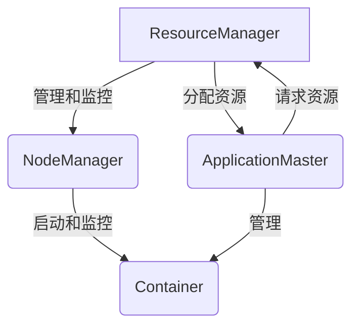
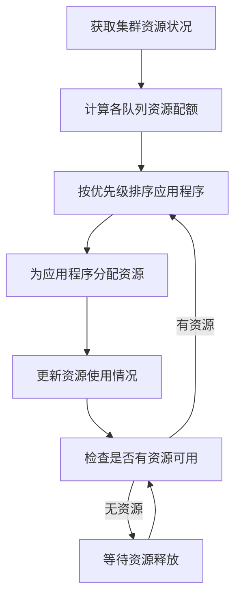
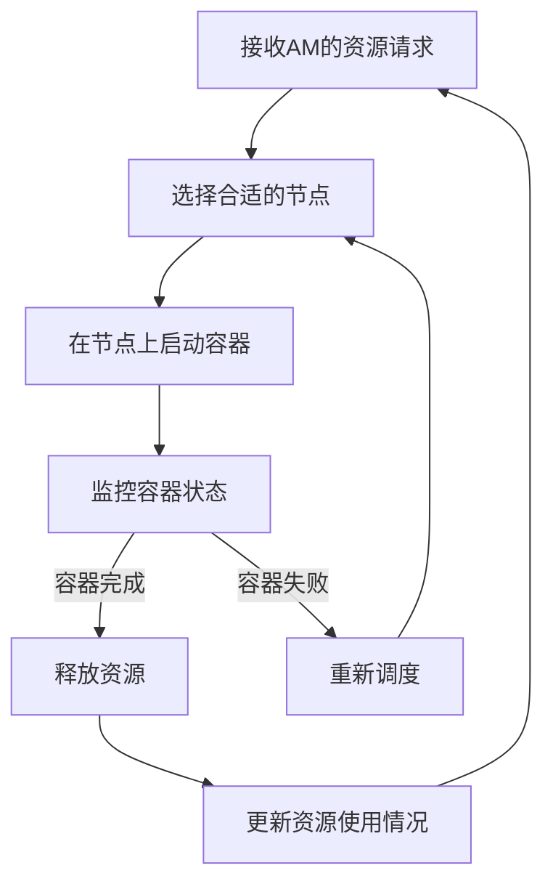

# YARN Resource Manager原理与代码实例讲解

## 1. 背景介绍

### 1.1 问题的由来

在大数据时代,数据量呈现出爆炸式增长,传统的单机计算架构已经无法满足日益增长的计算需求。为了解决这一问题,分布式计算框架应运而生。Apache Hadoop作为开源的分布式计算框架,为大数据处理提供了可靠、可扩展、高效的解决方案。

然而,在早期的Hadoop 1.x版本中,存在着单点故障问题和资源利用率低下等缺陷。为了解决这些问题,Hadoop 2.x版本引入了YARN(Yet Another Resource Negotiator)资源管理系统,旨在提高集群资源利用率、增强系统可靠性和可扩展性。

### 1.2 研究现状

YARN作为Hadoop 2.x版本的核心组件,已经在业界得到了广泛应用和研究。许多公司和组织都在生产环境中部署和使用YARN,并对其进行了定制化优化。同时,学术界也在不断探索YARN的新特性和优化方向,如资源调度算法、容错机制、安全性等方面。

### 1.3 研究意义

深入理解YARN资源管理器的原理和实现,对于构建高效、可靠的大数据处理平台具有重要意义。本文将从理论和实践两个角度全面剖析YARN,帮助读者掌握其核心概念、算法原理、数学模型、代码实现等方面的知识,为大数据应用的开发和优化提供参考和指导。

### 1.4 本文结构

本文将按照以下结构展开:

1. 背景介绍
2. 核心概念与联系
3. 核心算法原理与具体操作步骤
4. 数学模型和公式详细讲解与举例说明
5. 项目实践:代码实例和详细解释说明
6. 实际应用场景
7. 工具和资源推荐
8. 总结:未来发展趋势与挑战
9. 附录:常见问题与解答

## 2. 核心概念与联系

在深入探讨YARN的原理和实现之前,我们需要先了解一些核心概念及其之间的联系。

- **ResourceManager(RM)**: YARN集群的主节点,负责整个集群的资源管理和调度。
- **NodeManager(NM)**: 运行在每个节点上的代理,负责管理节点上的资源并监控容器的运行状态。
- **ApplicationMaster(AM)**: 每个应用程序的"大脑",负责向RM申请资源并与NM交互启动容器。
- **Container**: 封装了CPU、内存等资源的容器,用于运行应用程序的任务。

YARN采用了"先分配资源,后启动应用"的模式,具体流程如下:

1. 客户端向RM提交应用程序。
2. RM为应用程序分配第一个Container,用于运行AM。
3. AM向RM申请资源,用于启动任务的Container。
4. RM根据调度策略分配资源给AM。
5. AM与NM交互,在分配的Container中启动任务。

通过将资源管理和应用程序解耦,YARN实现了更好的资源共享和隔离,提高了集群利用率和系统稳定性。

## 3. 核心算法原理与具体操作步骤

### 3.1 算法原理概述

YARN的核心算法主要包括资源调度算法和容器启动算法。

**资源调度算法**负责根据应用程序的资源需求和集群的资源状况,合理分配资源给各个应用程序。YARN支持多种调度策略,如FIFO、Fair Scheduler和Capacity Scheduler等。

**容器启动算法**则负责在合适的节点上启动容器,并监控容器的运行状态。该算法需要考虑数据本地性、节点资源状况等因素,以提高任务执行效率。

### 3.2 算法步骤详解

#### 3.2.1 资源调度算法

以Capacity Scheduler为例,其资源调度算法的主要步骤如下:

1. 获取集群的当前资源状况,包括可用资源和已分配资源。
2. 根据队列的资源配额,计算每个队列可用的资源量。
3. 按照应用程序的优先级对队列中的应用程序进行排序。
4. 为排在前面的应用程序分配资源,直到该队列的资源用尽。
5. 更新队列和集群的资源使用情况。
6. 检查是否还有可用资源,如果有,则继续分配;如果无,则等待资源释放。

#### 3.2.2 容器启动算法

容器启动算法的主要步骤如下:

1. 接收AM的资源请求。
2. 根据数据本地性、节点资源状况等因素,选择合适的节点启动容器。
3. 与NM交互,在选定的节点上启动容器。
4. 监控容器的运行状态。
5. 如果容器正常完成,则释放分配的资源。
6. 如果容器失败,则重新调度该任务。
7. 更新集群和应用程序的资源使用情况。

### 3.3 算法优缺点

**优点**:

- 支持多种调度策略,可满足不同场景的需求。
- 通过集中式资源管理,提高了资源利用率。
- 容错机制保证了系统的可靠性和容错性。

**缺点**:

- 集中式资源管理可能会成为瓶颈,影响系统的可扩展性。
- 调度策略的复杂度较高,可能导致性能开销。
- 资源分配的粒度较粗,可能导致资源浪费。

### 3.4 算法应用领域

YARN的资源调度和容器启动算法广泛应用于以下领域:

- 大数据处理: Hadoop生态圈中的MapReduce、Spark、Flink等框架都依赖YARN进行资源管理。
- 机器学习: 分布式机器学习框架如TensorFlow、PyTorch等也可以在YARN上运行。
- 流处理: 如Apache Kafka、Apache Storm等流处理系统可以利用YARN进行资源调度。
- 服务部署: YARN可用于部署和管理各种分布式服务,如Web服务、数据库等。

## 4. 数学模型和公式详细讲解与举例说明

### 4.1 数学模型构建

为了更好地理解和优化YARN的资源调度算法,我们可以构建数学模型对其进行形式化描述。

假设集群中有$n$个节点,每个节点$i$拥有$R_i$个资源(如CPU核数、内存大小等)。有$m$个应用程序在运行,第$j$个应用程序的资源需求为$r_j$。我们的目标是最大化集群资源的利用率,同时满足每个应用程序的资源需求。

我们可以将这个问题建模为一个整数线性规划问题:

$$
\begin{aligned}
\max \quad & \sum_{i=1}^n \sum_{j=1}^m x_{ij} \\
\text{s.t.} \quad & \sum_{j=1}^m r_j x_{ij} \leq R_i, \quad \forall i \in \{1, \ldots, n\} \\
& \sum_{i=1}^n x_{ij} = 1, \quad \forall j \in \{1, \ldots, m\} \\
& x_{ij} \in \{0, 1\}, \quad \forall i \in \{1, \ldots, n\}, j \in \{1, \ldots, m\}
\end{aligned}
$$

其中,$x_{ij}$是一个二值变量,表示应用程序$j$是否被分配到节点$i$上运行。目标函数是最大化被分配的资源数量,约束条件保证每个节点的资源不被超分,并且每个应用程序只能被分配到一个节点上运行。

### 4.2 公式推导过程

在实际实现中,YARN采用了一种启发式算法来近似求解上述优化问题。该算法的核心思想是:

1. 根据应用程序的优先级对其进行排序。
2. 按顺序为每个应用程序分配资源,直到无法继续分配为止。
3. 对于无法分配的应用程序,等待资源释放后重新分配。

我们可以将这个过程形式化为以下公式:

设$A$为正在运行的应用程序集合,$U$为未分配资源的应用程序集合。对于每个时间步$t$,我们有:

$$
A^{(t+1)} = A^{(t)} \cup \{j \in U^{(t)} | \exists i, r_j \leq R_i^{(t)}\}
$$

$$
U^{(t+1)} = U^{(t)} \setminus A^{(t+1)}
$$

$$
R_i^{(t+1)} = R_i^{(t)} - \sum_{j \in A^{(t+1)}} r_j x_{ij}^{(t+1)}
$$

其中,$x_{ij}^{(t+1)}$表示在时间步$t+1$,应用程序$j$是否被分配到节点$i$上运行。

通过迭代上述公式,我们可以得到一个近似最优的资源分配方案。

### 4.3 案例分析与讲解

假设我们有一个3节点的YARN集群,每个节点拥有8个CPU核和16GB内存。现在有4个应用程序需要运行,它们的资源需求如下:

- 应用程序1: 3 CPU核,6GB内存
- 应用程序2: 2 CPU核,4GB内存  
- 应用程序3: 4 CPU核,8GB内存
- 应用程序4: 5 CPU核,10GB内存

我们将应用程序按照优先级排序为:应用程序4 > 应用程序3 > 应用程序1 > 应用程序2。

初始时,$A^{(0)} = \emptyset, U^{(0)} = \{1, 2, 3, 4\}$。

**时间步1**:
- 应用程序4无法分配,因为没有节点拥有足够的资源。
- 应用程序3被分配到节点1上运行。
- $A^{(1)} = \{3\}, U^{(1)} = \{1, 2, 4\}$
- 节点1剩余资源:4 CPU核,8GB内存

**时间步2**:
- 应用程序1被分配到节点2上运行。
- $A^{(2)} = \{1, 3\}, U^{(2)} = \{2, 4\}$
- 节点2剩余资源:5 CPU核,10GB内存

**时间步3**:
- 应用程序2被分配到节点3上运行。
- $A^{(3)} = \{1, 2, 3\}, U^{(3)} = \{4\}$
- 节点3剩余资源:6 CPU核,12GB内存

**时间步4**:
- 应用程序4无法分配,需要等待资源释放。

通过上述过程,我们得到了一个近似最优的资源分配方案,其中应用程序1、2、3被成功分配,应用程序4需要等待资源释放后再分配。

### 4.4 常见问题解答

**Q: YARN是如何保证应用程序的公平性的?**

A: YARN支持多种调度策略,如Fair Scheduler和Capacity Scheduler等,可以根据应用程序的优先级、队列配额等因素来保证资源分配的公平性。例如,Fair Scheduler会尽量使每个应用程序获得相同比例的资源,而Capacity Scheduler则根据队列的配额进行资源分配。

**Q: 如何提高YARN的容错性?**

A: YARN采用了多种容错机制来提高系统的可靠性,包括:

1. RM的高可用性(HA):通过运行备用的RM实