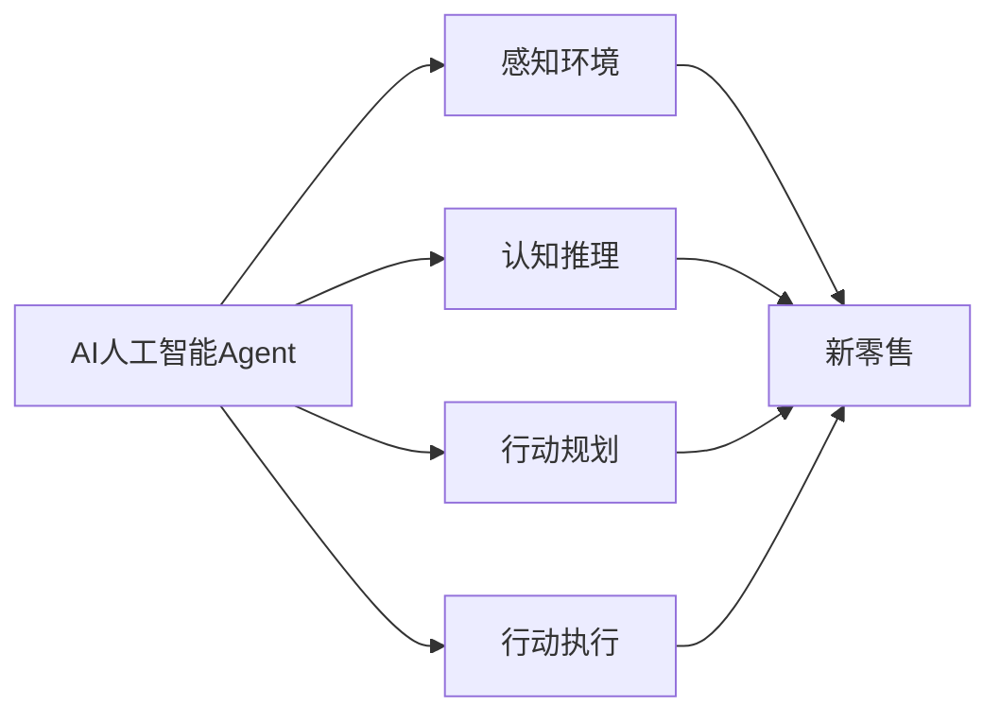

# AI人工智能 Agent：在新零售中的应用

作者：禅与计算机程序设计艺术 / Zen and the Art of Computer Programming

## 1. 背景介绍
### 1.1 问题的由来

新零售是近年来兴起的一种零售模式，它利用现代信息技术，如大数据、云计算、物联网、人工智能等，对传统零售业进行升级改造，以提高零售效率、提升消费者体验。随着AI技术的快速发展，AI人工智能Agent作为一种新兴的智能体技术，开始在零售行业得到广泛应用，并展现出巨大的应用潜力。

### 1.2 研究现状

目前，AI人工智能Agent在新零售中的应用主要集中在以下几个方面：

1. **智能客服**：通过聊天机器人、语音助手等AI Agent，提供7x24小时的在线客服服务，解答消费者疑问，提高服务效率。
2. **精准营销**：利用AI Agent分析消费者行为数据，进行个性化推荐，提高营销转化率。
3. **供应链优化**：通过AI Agent优化库存管理、物流配送等环节，降低运营成本。
4. **智能导购**：利用AR/VR等技术，为消费者提供沉浸式购物体验。

### 1.3 研究意义

AI人工智能Agent在新零售中的应用，不仅可以提升零售效率，降低运营成本，还可以提高消费者体验，促进零售业转型升级。因此，研究AI人工智能Agent在新零售中的应用，具有重要的理论意义和现实意义。

### 1.4 本文结构

本文将围绕AI人工智能Agent在新零售中的应用展开，主要内容包括：

- 核心概念与联系
- 核心算法原理与具体操作步骤
- 数学模型和公式
- 项目实践
- 实际应用场景
- 工具和资源推荐
- 总结与展望

## 2. 核心概念与联系

### 2.1 AI人工智能Agent

AI人工智能Agent是一种能够模拟人类智能行为，自主感知环境、规划行动、解决问题的智能体。它具有以下特点：

- 感知环境：通过传感器获取环境信息。
- 认知推理：根据感知到的信息进行推理，形成认知。
- 行动规划：根据认知结果，制定行动方案。
- 行动执行：执行行动方案，实现目标。

### 2.2 新零售

新零售是一种基于现代信息技术的零售模式，它通过数据驱动、技术赋能，实现零售业的升级改造。新零售具有以下特点：

- 数据驱动：以数据为核心，通过数据分析指导零售决策。
- 技术赋能：利用云计算、物联网、人工智能等技术，提升零售效率。
- 体验至上：以消费者为中心，提供优质的购物体验。

### 2.3 关系图

AI人工智能Agent与新零售之间的关系可以表示为：



## 3. 核心算法原理与具体操作步骤
### 3.1 算法原理概述

AI人工智能Agent的核心算法原理主要包括以下三个方面：

1. **感知算法**：通过传感器获取环境信息，如摄像头、麦克风、传感器等。
2. **认知算法**：对感知到的信息进行处理和分析，形成认知。
3. **行动算法**：根据认知结果，制定行动方案，并执行行动。

### 3.2 算法步骤详解

1. **感知阶段**：AI Agent通过传感器获取环境信息，如消费者行为、商品信息、库存信息等。
2. **认知阶段**：AI Agent对感知到的信息进行处理和分析，如文本分析、图像识别、语音识别等，形成认知。
3. **行动阶段**：根据认知结果，制定行动方案，如推荐商品、引导购物、客服服务等，并执行行动。

### 3.3 算法优缺点

**优点**：

- 提高效率：通过自动化处理，提高零售运营效率。
- 降低成本：减少人工成本，降低运营成本。
- 提升体验：提供个性化服务，提升消费者体验。

**缺点**：

- 技术门槛：需要较高的技术实力，对人才需求较高。
- 数据依赖：需要大量的数据支持，对数据质量要求较高。
- 伦理问题：需要关注数据安全和隐私保护。

### 3.4 算法应用领域

AI人工智能Agent在新零售中的应用领域包括：

- 智能客服
- 精准营销
- 供应链优化
- 智能导购
- 商品推荐

## 4. 数学模型和公式
### 4.1 数学模型构建

AI人工智能Agent的数学模型主要包括以下两个方面：

1. **感知模型**：用于描述AI Agent如何感知环境信息，如图像识别、语音识别等。
2. **决策模型**：用于描述AI Agent如何根据感知到的信息进行决策，如强化学习、决策树等。

### 4.2 公式推导过程

以强化学习为例，其基本公式如下：

$$
Q(s,a) = Q(s,a) + \alpha [R + \gamma \max_{a'} Q(s',a') - Q(s,a)]
$$

其中，$s$ 表示状态，$a$ 表示动作，$R$ 表示奖励，$\alpha$ 表示学习率，$\gamma$ 表示折扣因子。

### 4.3 案例分析与讲解

以智能客服为例，其数学模型可以表示为：

$$
P(a|s) = \frac{e^{\theta a}}{\sum_{a'} e^{\theta a'}}
$$

其中，$a$ 表示客服的回答，$s$ 表示用户的问题，$\theta$ 表示模型的参数。

### 4.4 常见问题解答

**Q1：如何选择合适的感知算法**？

A：选择合适的感知算法需要根据具体的应用场景和需求来确定。例如，对于图像识别任务，可以使用卷积神经网络(CNN)；对于语音识别任务，可以使用深度神经网络(DNN)。

**Q2：如何选择合适的决策算法**？

A：选择合适的决策算法需要根据具体的应用场景和需求来确定。例如，对于优化问题，可以使用线性规划；对于决策问题，可以使用强化学习。

## 5. 项目实践：代码实例和详细解释说明
### 5.1 开发环境搭建

1. 安装Python环境
2. 安装TensorFlow或PyTorch框架
3. 安装必要的库，如NumPy、Scikit-learn等

### 5.2 源代码详细实现

以下是一个简单的智能客服代码实例：

```python
import tensorflow as tf
from tensorflow.keras.layers import Dense, Embedding, LSTM

def create_model(input_shape, output_shape):
    model = tf.keras.Sequential([
        Embedding(input_shape, 64, input_length=input_shape[0]),
        LSTM(64),
        Dense(64, activation='relu'),
        Dense(output_shape, activation='softmax')
    ])
    model.compile(optimizer='adam', loss='categorical_crossentropy', metrics=['accuracy'])
    return model

# 创建模型
model = create_model(input_shape=100, output_shape=2)

# 训练模型
model.fit(x_train, y_train, epochs=10, batch_size=32, validation_data=(x_val, y_val))
```

### 5.3 代码解读与分析

- `create_model` 函数用于创建模型，其中 `input_shape` 表示输入特征维度，`output_shape` 表示输出类别数量。
- 使用 `Embedding` 层将输入特征进行嵌入表示。
- 使用 `LSTM` 层进行序列建模。
- 使用 `Dense` 层进行分类。
- 使用 `compile` 方法编译模型，指定优化器、损失函数和评价指标。
- 使用 `fit` 方法训练模型，指定训练数据、迭代轮数、批大小和验证数据。

### 5.4 运行结果展示

运行代码后，可以看到模型在训练集和验证集上的准确率。

## 6. 实际应用场景
### 6.1 智能客服

智能客服是AI人工智能Agent在新零售中最常见的应用场景之一。通过智能客服，可以提供7x24小时的在线客服服务，解答消费者疑问，提高服务效率。

### 6.2 精准营销

通过分析消费者行为数据，AI人工智能Agent可以为消费者提供个性化的商品推荐，提高营销转化率。

### 6.3 供应链优化

通过AI人工智能Agent优化库存管理、物流配送等环节，降低运营成本。

### 6.4 智能导购

利用AR/VR等技术，为消费者提供沉浸式购物体验。

## 7. 工具和资源推荐
### 7.1 学习资源推荐

1. 《深度学习》
2. 《Python深度学习》
3. TensorFlow官方文档
4. PyTorch官方文档

### 7.2 开发工具推荐

1. TensorFlow
2. PyTorch
3. Keras
4. Jupyter Notebook

### 7.3 相关论文推荐

1. "Deep Learning for Human-Robot Interaction"
2. "A Survey of Reinforcement Learning: From DQN to AlphaZero"
3. "Attention Is All You Need"
4. "BERT: Pre-training of Deep Bidirectional Transformers for Language Understanding"

### 7.4 其他资源推荐

1. OpenAI
2. DeepMind
3. Google AI
4. Stanford University CS231n

## 8. 总结：未来发展趋势与挑战
### 8.1 研究成果总结

本文介绍了AI人工智能Agent在新零售中的应用，包括核心概念、算法原理、实际应用场景等。通过本文的学习，相信读者能够对AI人工智能Agent在新零售中的应用有一个全面的认识。

### 8.2 未来发展趋势

未来，AI人工智能Agent在新零售中的应用将呈现以下发展趋势：

1. 跨学科融合：AI人工智能Agent将与其他学科（如心理学、社会学等）进行融合，实现更加智能、人性化的应用。
2. 模型轻量化：为了降低部署成本，AI人工智能Agent的模型将更加轻量化。
3. 硬件加速：随着硬件技术的发展，AI人工智能Agent的计算能力将得到进一步提升。

### 8.3 面临的挑战

AI人工智能Agent在新零售中的应用也面临着以下挑战：

1. 数据安全与隐私保护：如何保障消费者数据的安全和隐私，是一个重要的挑战。
2. 模型可解释性：如何提高模型的可解释性，让消费者了解模型的决策过程，也是一个重要的挑战。
3. 模型泛化能力：如何提高模型的泛化能力，使其适应不同的应用场景，也是一个重要的挑战。

### 8.4 研究展望

未来，AI人工智能Agent在新零售中的应用将取得更大的突破。通过不断探索和尝试，AI人工智能Agent将在新零售领域发挥更加重要的作用。

## 9. 附录：常见问题与解答

**Q1：什么是AI人工智能Agent**？

A：AI人工智能Agent是一种能够模拟人类智能行为，自主感知环境、规划行动、解决问题的智能体。

**Q2：AI人工智能Agent在新零售中有哪些应用**？

A：AI人工智能Agent在新零售中的应用主要包括智能客服、精准营销、供应链优化、智能导购等。

**Q3：如何选择合适的AI人工智能Agent模型**？

A：选择合适的AI人工智能Agent模型需要根据具体的应用场景和需求来确定。

**Q4：AI人工智能Agent在新零售中面临哪些挑战**？

A：AI人工智能Agent在新零售中面临的挑战主要包括数据安全与隐私保护、模型可解释性、模型泛化能力等。

**Q5：如何解决AI人工智能Agent在新零售中面临的挑战**？

A：解决AI人工智能Agent在新零售中面临的挑战需要从技术、法规、伦理等多个方面进行综合考虑。

---

作者：禅与计算机程序设计艺术 / Zen and the Art of Computer Programming