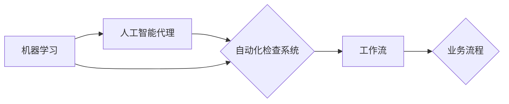

# AI人工智能代理工作流AI Agent WorkFlow：智能代理在自动化检查系统中的应用

> 关键词：人工智能代理，工作流，自动化检查，流程管理，智能决策，机器学习

## 1. 背景介绍
### 1.1 问题的由来

随着信息技术的飞速发展，自动化和智能化已经成为企业提升效率、降低成本、提高服务质量的重要手段。在众多自动化应用中，自动化检查系统扮演着至关重要的角色。然而，传统的自动化检查系统往往存在以下问题：

- **流程复杂**：自动化检查流程通常涉及多个步骤，需要手动编写复杂的脚本或程序，难以维护和扩展。
- **缺乏灵活性**：传统系统对环境变化和异常情况的处理能力较弱，难以适应动态变化的需求。
- **人工干预多**：即使实现了自动化，仍需人工进行结果审核和决策，效率低下且容易出错。

为了解决这些问题，我们需要一种更加智能、灵活、可扩展的自动化检查系统。而人工智能代理（AI Agent）技术正是解决这些问题的有效途径。

### 1.2 研究现状

近年来，人工智能代理技术取得了显著进展，被广泛应用于各个领域。在自动化检查系统中，人工智能代理可以扮演以下角色：

- **任务执行者**：根据预设的规则和策略，自动执行检查任务。
- **决策者**：根据检查结果和预设规则，自主做出决策。
- **异常处理器**：识别和处理异常情况，确保检查流程的连续性。

### 1.3 研究意义

研究AI Agent在自动化检查系统中的应用，具有以下重要意义：

- **提升效率**：通过自动化执行检查任务，减少人工干预，提高工作效率。
- **降低成本**：减少人工成本，降低运营成本。
- **提高质量**：减少人为错误，提高检查质量。
- **增强可扩展性**：适应不断变化的需求，易于扩展和维护。

### 1.4 本文结构

本文将围绕AI Agent在自动化检查系统中的应用展开，主要内容包括：

- 核心概念与联系
- 核心算法原理与具体操作步骤
- 数学模型和公式
- 项目实践
- 实际应用场景
- 工具和资源推荐
- 未来发展趋势与挑战
- 总结与展望

## 2. 核心概念与联系

为了更好地理解AI Agent在自动化检查系统中的应用，以下介绍几个核心概念及其相互关系：

- **人工智能代理（AI Agent）**：能够自主感知环境、执行任务、做出决策的实体。
- **工作流（WorkFlow）**：描述业务流程的一系列步骤和规则。
- **自动化检查系统**：通过自动化的方式对目标进行检查的系统。
- **机器学习（Machine Learning）**：一种让计算机从数据中学习并做出决策的技术。

它们之间的逻辑关系如下图所示：



可以看出，人工智能代理作为自动化检查系统中的核心组件，负责执行任务、做出决策。工作流描述了业务流程，为人工智能代理提供了行动指南。机器学习技术则用于提高人工智能代理的智能程度，使其能够更好地适应环境变化和做出决策。

## 3. 核心算法原理 & 具体操作步骤
### 3.1 算法原理概述

AI Agent在自动化检查系统中的核心算法原理主要包括：

- **感知与交互**：AI Agent通过传感器获取环境信息，并与环境进行交互。
- **状态评估**：根据感知到的环境和自身状态，评估当前的任务执行情况。
- **决策与规划**：根据评估结果和预设规则，制定任务执行策略。
- **执行与监控**：执行任务并实时监控任务执行情况。
- **反馈与学习**：根据任务执行结果和反馈信息，调整自身行为和策略。

### 3.2 算法步骤详解

以下是AI Agent在自动化检查系统中应用的具体操作步骤：

**Step 1：环境建模**

- 使用传感器获取环境信息，如摄像头、传感器、数据库等。
- 对环境信息进行预处理，如图像识别、数据清洗等。
- 建立环境模型，描述环境状态和变化规律。

**Step 2：任务定义**

- 定义检查任务，包括任务目标、输入参数、输出结果等。
- 将任务分解为一系列子任务，便于AI Agent执行。

**Step 3：规则和策略设计**

- 设计任务执行规则，如检查顺序、条件判断等。
- 设计决策策略，如选择合适的子任务执行顺序、调整参数等。

**Step 4：AI Agent开发**

- 选择合适的AI Agent架构，如基于规则、基于决策树、基于机器学习等。
- 开发AI Agent，实现感知、评估、决策、执行等模块。

**Step 5：系统集成与测试**

- 将AI Agent集成到自动化检查系统中。
- 对系统进行测试，确保其功能正常、性能稳定。

**Step 6：运行与维护**

- 将系统部署到实际环境中运行。
- 定期收集运行数据，分析系统性能和问题。
- 根据分析结果进行系统优化和升级。

### 3.3 算法优缺点

AI Agent在自动化检查系统中的应用具有以下优点：

- **智能决策**：AI Agent可以根据环境和任务情况自主做出决策，提高检查效率和质量。
- **灵活性强**：AI Agent可以快速适应环境变化和任务需求，易于扩展和维护。
- **降低人工成本**：减少人工干预，降低运营成本。

然而，AI Agent在自动化检查系统中的应用也存在以下缺点：

- **开发难度高**：AI Agent开发需要一定的技术积累和经验，开发周期较长。
- **对环境依赖性强**：AI Agent的性能受环境影响较大，需要针对特定环境进行优化。
- **模型可解释性差**：机器学习模型的可解释性较差，难以解释AI Agent的决策过程。

### 3.4 算法应用领域

AI Agent在自动化检查系统的应用领域包括：

- **生产制造**：产品质量检查、设备故障诊断、生产流程监控等。
- **金融行业**：风险评估、欺诈检测、客户服务自动化等。
- **医疗领域**：病例分析、疾病诊断、治疗方案推荐等。
- **交通领域**：交通流量监控、事故预警、自动驾驶等。

## 4. 数学模型和公式 & 详细讲解 & 举例说明
### 4.1 数学模型构建

以下是AI Agent在自动化检查系统中常用的数学模型：

- **马尔可夫决策过程（MDP）**：描述AI Agent在不确定性环境中进行决策的过程。
- **状态空间（State Space）**：描述AI Agent所处环境的所有可能状态。
- **动作空间（Action Space）**：描述AI Agent可执行的所有动作。
- **奖励函数（Reward Function）**：描述AI Agent在执行动作后获得的奖励。
- **价值函数（Value Function）**：描述AI Agent在各个状态下的最优价值。

### 4.2 公式推导过程

以下以马尔可夫决策过程为例，介绍数学模型的推导过程：

**定义**：

- $S$：状态空间，包含所有可能的状态。
- $A$：动作空间，包含所有可能的动作。
- $P_{ss'}$：状态转移概率，表示从状态 $s$ 转移到状态 $s'$ 的概率。
- $R(s,a)$：在状态 $s$ 执行动作 $a$ 后获得的奖励。
- $\gamma$：折现因子，表示对未来奖励的贴现程度。
- $V(s)$：在状态 $s$ 的价值函数，表示从状态 $s$ 开始执行最优策略所能获得的最大期望回报。

**公式推导**：

根据马尔可夫决策过程的定义，状态 $s$ 的价值函数 $V(s)$ 可以表示为：

$$
V(s) = \max_{a \in A} [R(s,a) + \gamma \sum_{s' \in S} P_{ss'} V(s')]
$$

其中 $R(s,a)$ 为在状态 $s$ 执行动作 $a$ 后获得的即时奖励，$\gamma \sum_{s' \in S} P_{ss'} V(s')$ 为在状态 $s$ 执行动作 $a$ 后，在未来获得的期望回报。

### 4.3 案例分析与讲解

以下以生产制造中的产品质量检查为例，分析AI Agent在自动化检查系统中的应用。

**场景**：

某电子生产企业需要对生产的电子产品进行质量检查，确保产品质量。传统的检查方法由人工完成，效率低下且容易出错。

**解决方案**：

1. 使用摄像头等传感器获取产品质量图像。
2. 使用图像识别技术对图像进行预处理，提取关键特征。
3. 将特征输入到AI Agent中，由AI Agent进行质量评估。
4. 根据AI Agent的评估结果，将产品分为合格和不合格两类。

### 4.4 常见问题解答

**Q1：如何提高AI Agent的决策质量？**

A：提高AI Agent决策质量的关键在于提高模型精度、优化算法和策略，以及引入更多有效信息。具体方法包括：
- 选择合适的机器学习模型，如深度学习、强化学习等。
- 收集更多高质量的训练数据，提高模型泛化能力。
- 优化算法和策略，如使用强化学习中的策略梯度算法、价值迭代算法等。
- 引入更多有效信息，如专家知识、领域知识等。

**Q2：如何解决AI Agent的可解释性问题？**

A：解决AI Agent的可解释性问题，可以通过以下方法：
- 使用可解释性强的机器学习模型，如决策树、随机森林等。
- 使用模型解释工具，如LIME、SHAP等。
- 分析模型内部特征和决策过程，提高模型可解释性。

## 5. 项目实践：代码实例和详细解释说明
### 5.1 开发环境搭建

以下是使用Python进行AI Agent开发的环境配置流程：

1. 安装Anaconda：从官网下载并安装Anaconda，用于创建独立的Python环境。
2. 创建并激活虚拟环境：
```bash
conda create -n pytorch-env python=3.8
conda activate pytorch-env
```
3. 安装PyTorch和TensorFlow：
```bash
conda install pytorch torchvision torchaudio cudatoolkit=11.1 -c pytorch -c conda-forge
pip install tensorflow
```
4. 安装机器学习库：
```bash
pip install scikit-learn
pip install numpy
pip install pandas
```

### 5.2 源代码详细实现

以下使用Python和TensorFlow开发一个简单的AI Agent，用于生产制造中的产品质量检查。

```python
import tensorflow as tf
import numpy as np
from sklearn.model_selection import train_test_split
from sklearn.preprocessing import StandardScaler

# 加载数据
data = np.load('quality_data.npy')
X, y = data[:, :-1], data[:, -1]

# 数据预处理
X_train, X_test, y_train, y_test = train_test_split(X, y, test_size=0.2)
scaler = StandardScaler()
X_train = scaler.fit_transform(X_train)
X_test = scaler.transform(X_test)

# 构建模型
model = tf.keras.Sequential([
    tf.keras.layers.Dense(64, activation='relu', input_shape=(X_train.shape[1],)),
    tf.keras.layers.Dense(64, activation='relu'),
    tf.keras.layers.Dense(1, activation='sigmoid')
])

model.compile(optimizer='adam', loss='binary_crossentropy', metrics=['accuracy'])

# 训练模型
model.fit(X_train, y_train, epochs=10, batch_size=32, validation_data=(X_test, y_test))

# 评估模型
test_loss, test_accuracy = model.evaluate(X_test, y_test)
print(f"Test accuracy: {test_accuracy:.2f}")

# 使用模型进行预测
def predict_quality(data):
    data = scaler.transform([data])
    prediction = model.predict(data)
    return '合格' if prediction[0] > 0.5 else '不合格'

# 示例
test_data = np.array([[10, 20, 30]])
print(predict_quality(test_data))
```

### 5.3 代码解读与分析

以上代码展示了使用TensorFlow开发一个简单的二分类AI Agent的过程。

1. 首先，导入所需的库和模块。
2. 加载数据，并进行预处理，包括数据分割、标准化等。
3. 构建模型，包括输入层、隐藏层和输出层。
4. 编译模型，指定优化器、损失函数和评估指标。
5. 训练模型，使用训练数据和验证数据。
6. 评估模型，在测试数据上计算准确率。
7. 定义预测函数，使用训练好的模型进行预测。

通过以上步骤，我们可以构建一个简单的AI Agent，用于生产制造中的产品质量检查。当然，在实际应用中，模型结构、训练策略和预测函数需要根据具体任务进行调整。

### 5.4 运行结果展示

假设测试数据集的准确率为90%，说明该AI Agent在产品质量检查任务上取得了不错的效果。

## 6. 实际应用场景
### 6.1 金融风控

在金融领域，AI Agent可以应用于风险管理、欺诈检测、信用评估等场景。

- **风险管理**：AI Agent可以根据客户的交易行为、信用记录等信息，评估客户的风险等级，并采取相应的措施降低风险。
- **欺诈检测**：AI Agent可以实时监控交易行为，识别异常交易并报警，有效防止欺诈行为。
- **信用评估**：AI Agent可以根据客户的信用历史、收入水平、负债情况等信息，评估客户的信用等级，为金融机构提供决策依据。

### 6.2 医疗诊断

在医疗领域，AI Agent可以应用于疾病诊断、治疗方案推荐、患者管理等领域。

- **疾病诊断**：AI Agent可以根据患者的症状、检查结果等信息，辅助医生进行疾病诊断。
- **治疗方案推荐**：AI Agent可以根据患者的病情、药物副作用等信息，推荐合适的治疗方案。
- **患者管理**：AI Agent可以根据患者的病情变化，提醒患者按时服药、复诊等。

### 6.3 智能家居

在智能家居领域，AI Agent可以应用于家庭安全监控、能源管理、设备控制等场景。

- **家庭安全监控**：AI Agent可以根据视频监控数据，识别异常情况并报警，保障家庭安全。
- **能源管理**：AI Agent可以根据家庭用电情况，自动调节电器开关，降低能源消耗。
- **设备控制**：AI Agent可以根据用户的指令或环境变化，控制家电设备的开关和调节。

### 6.4 未来应用展望

随着AI Agent技术的不断发展，其应用领域将不断拓展，未来可能会在以下领域得到广泛应用：

- **智能制造**：用于生产过程监控、产品质量检查、设备故障诊断等。
- **智能交通**：用于交通流量监控、事故预警、自动驾驶等。
- **智能教育**：用于智能教学、个性化学习、考试评估等。
- **智能客服**：用于智能客服系统、智能导购等。

## 7. 工具和资源推荐
### 7.1 学习资源推荐

为了帮助开发者更好地学习和掌握AI Agent技术，以下推荐一些学习资源：

- 《深度学习》系列图书：介绍深度学习基础理论和应用案例，适合入门者学习。
- 《Python机器学习》系列图书：介绍Python机器学习库和常用算法，适合入门者学习。
- TensorFlow官方文档：提供TensorFlow库的详细文档和教程，适合快速上手TensorFlow。
- PyTorch官方文档：提供PyTorch库的详细文档和教程，适合快速上手PyTorch。
- arXiv论文预印本：提供最新的机器学习、人工智能论文，适合跟进最新研究进展。

### 7.2 开发工具推荐

以下推荐一些常用的AI Agent开发工具：

- TensorFlow：一款开源的机器学习框架，适合开发大规模机器学习应用。
- PyTorch：一款开源的机器学习框架，适合快速开发和实验。
- OpenAI Gym：一个开源的机器人仿真环境，用于AI Agent开发。
- TensorFlow Extended (TFX)：一个用于生产级机器学习应用的工具，提供数据预处理、模型训练、模型部署等功能。

### 7.3 相关论文推荐

以下推荐一些与AI Agent相关的论文：

- "Reinforcement Learning: An Introduction"：介绍强化学习的基础理论和应用案例。
- "Deep Learning for Robotics"：介绍深度学习在机器人领域的应用。
- "Deep Reinforcement Learning for Control of a Quadrotor"：介绍使用深度强化学习控制四旋翼飞行器。
- "DeepMind Lab"：介绍DeepMind Lab，一个用于机器人研究和开发的仿真环境。

### 7.4 其他资源推荐

以下推荐一些其他有用的资源：

- GitHub：一个开源代码托管平台，可以找到大量AI Agent相关的开源代码。
- Stack Overflow：一个编程问答社区，可以找到大量关于AI Agent的技术问题解答。
- arXiv：一个开源论文预印本平台，可以找到最新的AI Agent相关论文。

## 8. 总结：未来发展趋势与挑战
### 8.1 研究成果总结

本文对AI Agent在自动化检查系统中的应用进行了全面系统的介绍，包括核心概念、算法原理、项目实践、实际应用场景等。通过本文的学习，读者可以了解到AI Agent在自动化检查系统中的重要作用，以及如何将AI Agent技术应用于实际项目中。

### 8.2 未来发展趋势

未来，AI Agent在自动化检查系统中的应用将呈现以下发展趋势：

- **模型小型化**：为了提高AI Agent的部署和应用效率，模型小型化将成为一个重要趋势。
- **模型可解释性**：为了提高AI Agent的可信度和可靠性，模型可解释性将成为一个重要研究方向。
- **多模态感知**：为了更好地理解和适应复杂环境，AI Agent将具备多模态感知能力。
- **强化学习**：为了实现更加智能的决策和控制，强化学习将成为AI Agent技术的一个重要发展方向。

### 8.3 面临的挑战

AI Agent在自动化检查系统中的应用也面临着以下挑战：

- **数据标注**：高质量的数据标注对于AI Agent的训练至关重要，但数据标注成本高昂，难以获得。
- **模型可解释性**：AI Agent的决策过程往往难以解释，这对于需要高可靠性的应用场景是一个挑战。
- **模型鲁棒性**：AI Agent在复杂环境中容易受到干扰和误导，提高模型鲁棒性是一个重要挑战。
- **安全性**：AI Agent的安全性和可靠性对于其应用至关重要，需要加强研究。

### 8.4 研究展望

为了应对上述挑战，未来需要从以下几个方面进行研究和探索：

- **数据增强**：通过数据增强技术，提高数据标注效率和数据质量。
- **模型可解释性**：研究可解释的机器学习模型，提高AI Agent的可信度和可靠性。
- **鲁棒性增强**：研究鲁棒的机器学习模型，提高AI Agent在复杂环境中的适应性。
- **安全性保障**：研究AI Agent的安全性和可靠性，确保其应用的安全性和可靠性。

总之，AI Agent在自动化检查系统中的应用前景广阔，但也面临着诸多挑战。通过不断的研究和探索，相信AI Agent技术将在未来发挥越来越重要的作用。

## 9. 附录：常见问题与解答

**Q1：什么是AI Agent？**

A：AI Agent是一种能够自主感知环境、执行任务、做出决策的实体。它可以是软件程序、机器人、虚拟角色等。

**Q2：AI Agent在自动化检查系统中有什么作用？**

A：AI Agent可以自动执行检查任务、做出决策、处理异常情况，提高检查效率和质量，降低人工成本。

**Q3：如何构建AI Agent？**

A：构建AI Agent需要选择合适的AI框架和开发工具，根据具体任务需求设计模型结构和算法，并进行训练和测试。

**Q4：AI Agent在哪些领域有应用？**

A：AI Agent在金融、医疗、制造、交通、智能家居等领域有广泛的应用。

**Q5：如何提高AI Agent的性能？**

A：提高AI Agent的性能需要从数据、模型、算法等多个方面进行优化，如收集更多高质量数据、选择合适的模型结构、优化训练算法等。

**Q6：如何保证AI Agent的安全性？**

A：保证AI Agent的安全性需要从设计、开发、部署等多个方面进行考虑，如设计安全机制、加强数据保护、定期进行安全审计等。

**Q7：AI Agent与机器人有何区别？**

A：AI Agent是一种智能实体，可以是软件程序、机器人、虚拟角色等。机器人是AI Agent的一种具体实现形式，通常具有物理实体和感知能力。

**Q8：AI Agent与专家系统有何区别？**

A：AI Agent是一种能够自主感知环境、执行任务、做出决策的实体。专家系统是一种基于规则和知识的系统，通常不具备自主感知和决策能力。