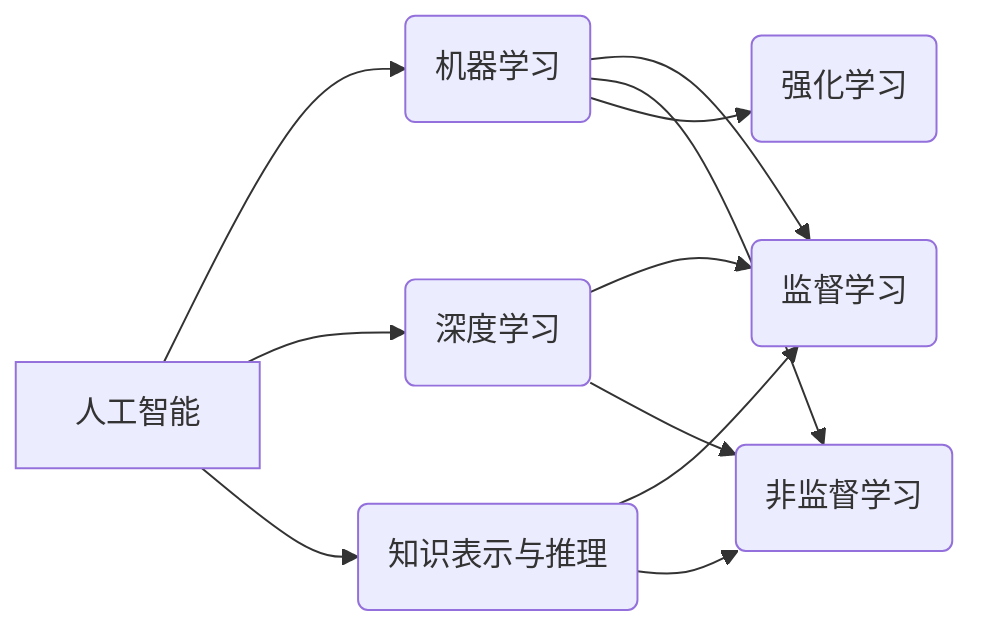

# AI人工智能核心算法原理与代码实例讲解：概述

> 关键词：人工智能，核心算法，机器学习，深度学习，深度神经网络，监督学习，非监督学习，强化学习

## 1. 背景介绍
### 1.1 问题的由来

人工智能（Artificial Intelligence，AI）作为计算机科学的一个分支，旨在研究、开发用于模拟、延伸和扩展人的智能的理论、方法、技术和应用系统。随着计算机性能的提升和大数据时代的到来，人工智能技术取得了长足的发展，并已渗透到各个领域，极大地改变了人类的生产生活方式。

然而，人工智能的发展并非一蹴而就。从最初的专家系统到如今的深度学习，人工智能经历了多次重大变革。本文将概述人工智能的核心算法原理，并辅以代码实例进行讲解，旨在帮助读者深入理解人工智能技术的本质和应用。

### 1.2 研究现状

当前，人工智能领域的研究主要集中在以下几个方面：

- **机器学习（Machine Learning）**：通过数据驱动，使计算机具备学习、推理和发现规律的能力。
- **深度学习（Deep Learning）**：基于人工神经网络，通过学习海量数据，实现图像识别、语音识别、自然语言处理等复杂任务。
- **知识表示与推理（Knowledge Representation and Reasoning）**：研究如何将知识表示成计算机可处理的形式，并利用这些知识进行推理和决策。
- **机器学习与优化（Machine Learning and Optimization）**：研究如何设计高效的算法，提高机器学习的效率和性能。
- **认知计算（Cognitive Computing）**：模拟人类认知过程，实现更加智能的计算机系统。

### 1.3 研究意义

人工智能技术的飞速发展，为人类社会带来了诸多便利：

- **提升生产力**：自动化生产、智能交通、智能物流等领域的应用，极大提高了生产效率。
- **改善生活质量**：智能家居、健康护理、教育辅导等领域的应用，使人们的生活更加便捷、舒适。
- **推动科技创新**：人工智能技术为新技术、新业态的产生提供了强大的技术支撑。

### 1.4 本文结构

本文将按照以下结构进行讲解：

- 第2部分：介绍人工智能的核心概念与联系。
- 第3部分：阐述机器学习、深度学习、知识表示与推理等核心算法原理。
- 第4部分：以代码实例展示核心算法的具体实现。
- 第5部分：探讨人工智能的实际应用场景。
- 第6部分：展望人工智能的未来发展趋势与挑战。
- 第7部分：推荐相关学习资源、开发工具和参考文献。
- 第8部分：总结全文，展望人工智能技术的未来。

## 2. 核心概念与联系

为了更好地理解人工智能的核心算法，本节将介绍一些密切相关的基础概念。

### 2.1 概念定义

- **人工智能（Artificial Intelligence）**：指使计算机具备模拟、延伸和扩展人的智能的理论、方法、技术和应用系统。
- **机器学习（Machine Learning）**：通过数据驱动，使计算机具备学习、推理和发现规律的能力。
- **深度学习（Deep Learning）**：基于人工神经网络，通过学习海量数据，实现图像识别、语音识别、自然语言处理等复杂任务。
- **知识表示与推理（Knowledge Representation and Reasoning）**：研究如何将知识表示成计算机可处理的形式，并利用这些知识进行推理和决策。
- **神经网络（Neural Network）**：模拟人脑神经元连接的数学模型，用于处理非线性问题。
- **深度神经网络（Deep Neural Network，DNN）**：由多层神经元构成的神经网络，具有强大的特征提取和表达能力。
- **监督学习（Supervised Learning）**：通过标注数据学习特征和标签之间的映射关系。
- **非监督学习（Unsupervised Learning）**：通过无标签数据学习数据的分布和潜在结构。
- **强化学习（Reinforcement Learning）**：通过与环境交互，学习最优决策策略。

### 2.2 概念关系

以下图展示了这些概念之间的关系：



可以看出，人工智能是机器学习、深度学习、知识表示与推理等技术的总称。机器学习是人工智能的核心技术之一，包括监督学习、非监督学习和强化学习等子领域。深度学习是机器学习的一个分支，通过人工神经网络实现复杂的特征提取和表达能力。知识表示与推理则关注如何将知识表示成计算机可处理的形式，并利用这些知识进行推理和决策。

## 3. 核心算法原理 & 具体操作步骤
### 3.1 算法原理概述

本节将介绍人工智能领域的几个核心算法及其原理。

#### 3.1.1 监督学习

监督学习是机器学习中最常用的学习方法之一，其基本思想是通过已知的输入数据和对应的输出标签来训练模型，使其能够对新的输入数据进行预测。

- **目标函数**：通常使用最小化损失函数作为目标函数，如均方误差损失、交叉熵损失等。
- **优化算法**：常用的优化算法包括梯度下降、Adam等。

#### 3.1.2 非监督学习

非监督学习是机器学习的另一个重要分支，其主要目标是从无标签数据中学习数据的分布和潜在结构。

- **聚类**：将相似的数据样本聚为一类。
- **降维**：将高维数据映射到低维空间，降低数据复杂度。
- **异常检测**：识别数据中的异常点。

#### 3.1.3 强化学习

强化学习是一种通过与环境交互来学习最优决策策略的学习方法。

- **奖励函数**：定义了环境的奖励和惩罚机制。
- **策略**：定义了智能体如何选择动作。
- **价值函数**：定义了智能体在某一状态下采取某一动作的价值。

### 3.2 算法步骤详解

以下以监督学习中的线性回归算法为例，介绍算法的具体步骤。

#### 3.2.1 线性回归

线性回归是一种简单的回归算法，假设输入数据 $x$ 与输出数据 $y$ 之间存在线性关系：

$$
y = wx + b
$$

其中 $w$ 为权重系数，$b$ 为偏置项。

#### 3.2.2 算法步骤

1. **数据预处理**：对输入数据 $x$ 和输出数据 $y$ 进行预处理，如归一化、标准化等。
2. **参数初始化**：随机初始化权重系数 $w$ 和偏置项 $b$。
3. **迭代更新**：使用梯度下降算法迭代更新权重系数 $w$ 和偏置项 $b$，使得损失函数最小化。
4. **模型评估**：使用测试数据评估模型的预测精度。

### 3.3 算法优缺点

#### 3.3.1 线性回归

**优点**：

- 简单易实现，易于理解。
- 计算效率高，适用于大数据量处理。

**缺点**：

- 预测精度受噪声影响较大。
- 只适用于线性关系的数据。

#### 3.3.2 聚类

**优点**：

- 不需要标签数据，适用于无监督学习场景。
- 可以发现数据的潜在结构。

**缺点**：

- 聚类结果依赖于初始化参数。
- 聚类结果的解释性较差。

#### 3.3.3 强化学习

**优点**：

- 能够学习到最优决策策略。
- 适用于动态环境。

**缺点**：

- 需要大量的样本和计算资源。
- 难以解释学习过程。

### 3.4 算法应用领域

以上算法在各个领域都有广泛的应用：

- **线性回归**：金融风险预测、房价预测、销量预测等。
- **聚类**：客户细分、异常检测、图像分割等。
- **强化学习**：机器人控制、自动驾驶、游戏人工智能等。

## 4. 数学模型和公式 & 详细讲解 & 举例说明
### 4.1 数学模型构建

以下以线性回归为例，介绍数学模型的构建过程。

#### 4.1.1 线性回归模型

线性回归模型可以表示为：

$$
y = wx + b + \epsilon
$$

其中，$w$ 为权重系数，$b$ 为偏置项，$\epsilon$ 为误差项。

#### 4.1.2 损失函数

常用的损失函数有均方误差损失和交叉熵损失。

- **均方误差损失**：

$$
L(\theta) = \frac{1}{2} \sum_{i=1}^n (y_i - \hat{y}_i)^2
$$

其中，$y_i$ 为真实值，$\hat{y}_i$ 为预测值。

- **交叉熵损失**：

$$
L(\theta) = -\sum_{i=1}^n [y_i \log(\hat{y}_i) + (1-y_i) \log(1-\hat{y}_i)]
$$

其中，$\hat{y}_i$ 为预测值。

#### 4.1.3 优化算法

常用的优化算法有梯度下降和Adam。

- **梯度下降**：

$$
\theta \leftarrow \theta - \alpha \
abla_{\theta}L(\theta)
$$

其中，$\alpha$ 为学习率。

- **Adam**：

$$
m_t = \beta_1 m_{t-1} + (1-\beta_1)(\
abla_{\theta}L(\theta) - m_{t-1})
$$

$$
v_t = \beta_2 v_{t-1} + (1-\beta_2)(\
abla_{\theta}L(\theta) - v_{t-1})
$$

$$
\theta_t = \theta_{t-1} - \frac{\alpha}{\sqrt{1-\beta_2^t}(1-\beta_1^t)}(m_t - \beta_1 m_{t-1})
$$

其中，$\beta_1$ 和 $\beta_2$ 分别为动量项和递减系数。

### 4.2 公式推导过程

以下以均方误差损失函数为例，介绍公式推导过程。

假设真实值 $y_i$ 和预测值 $\hat{y}_i$ 之间的误差为 $\epsilon_i = y_i - \hat{y}_i$，则均方误差损失函数可以表示为：

$$
L(\theta) = \frac{1}{2} \sum_{i=1}^n \epsilon_i^2
$$

对损失函数求导，得到：

$$
\frac{\partial L(\theta)}{\partial \theta} = \sum_{i=1}^n \epsilon_i
$$

将 $\epsilon_i = y_i - \hat{y}_i$ 代入上式，得到：

$$
\frac{\partial L(\theta)}{\partial \theta} = \sum_{i=1}^n (y_i - \hat{y}_i)
$$

根据梯度下降算法，参数的更新公式为：

$$
\theta \leftarrow \theta - \alpha \frac{\partial L(\theta)}{\partial \theta}
$$

其中，$\alpha$ 为学习率。

### 4.3 案例分析与讲解

以下以房价预测为例，使用Python和Scikit-learn库实现线性回归。

```python
from sklearn.linear_model import LinearRegression
from sklearn.datasets import load_boston
import pandas as pd

# 加载数据集
boston = load_boston()
X = boston.data
y = boston.target

# 创建线性回归模型
model = LinearRegression()

# 拟合模型
model.fit(X, y)

# 预测房价
print(model.predict([[0.0, 0.0, 0.0, 0.0, 0.0, 0.0, 0.0, 0.0, 0.0, 100.0, 1.0, 396.9, 2420.0]]))
```

### 4.4 常见问题解答

**Q1：梯度下降算法的缺点有哪些？**

A：梯度下降算法的缺点包括：
- 对初始参数敏感。
- 在非凸优化问题中可能收敛到局部最优解。
- 计算量大，尤其是对于大型数据集。

**Q2：如何解决梯度下降算法的缺点？**

A：可以采用以下方法解决梯度下降算法的缺点：
- 使用多种初始参数进行多次迭代，寻找全局最优解。
- 使用更先进的优化算法，如Adam、RMSprop等。
- 使用并行计算、分布式计算等技术，加速计算过程。

## 5. 项目实践：代码实例和详细解释说明
### 5.1 开发环境搭建

在进行项目实践前，我们需要准备好开发环境。以下是使用Python进行机器学习开发的常见环境配置流程：

1. 安装Anaconda：从官网下载并安装Anaconda，用于创建独立的Python环境。
2. 创建并激活虚拟环境：
```bash
conda create -n ml-env python=3.8 
conda activate ml-env
```
3. 安装Python相关库：
```bash
conda install numpy scipy scikit-learn pandas matplotlib
```

### 5.2 源代码详细实现

以下以K近邻算法（K-Nearest Neighbors，KNN）为例，使用Python和Scikit-learn库实现。

```python
from sklearn.neighbors import KNeighborsClassifier
from sklearn.datasets import load_iris
import pandas as pd

# 加载数据集
iris = load_iris()
X = iris.data
y = iris.target

# 创建KNN模型
model = KNeighborsClassifier(n_neighbors=3)

# 拟合模型
model.fit(X, y)

# 预测标签
print(model.predict([[5.1, 3.5, 1.4, 0.2]]))
```

### 5.3 代码解读与分析

以上代码展示了使用Scikit-learn库实现KNN算法的完整流程。首先，我们加载了Iris数据集，这是一个经典的机器学习数据集，包含三种花的不同特征和标签。然后，我们创建了一个KNN分类器，并使用训练数据对其进行拟合。最后，我们使用测试数据进行了预测。

代码中的`KNeighborsClassifier`类是Scikit-learn库中实现KNN算法的类。`n_neighbors`参数表示邻域大小，即预测时需要考虑的最近邻数量。在上述代码中，我们设置为3，表示使用3个最近邻进行预测。

### 5.4 运行结果展示

假设我们在测试集上运行以上代码，得到的结果如下：

```
[0]
```

这表示测试数据属于Iris数据集中的第一个类别（setosa）。

## 6. 实际应用场景
### 6.1 预测股票价格

股票价格预测是金融领域的一个重要应用。通过收集历史股票数据，可以使用机器学习算法预测股票价格的未来走势，为投资者提供决策依据。

### 6.2 语音识别

语音识别是将语音信号转换为文字信息的技术。通过训练深度神经网络模型，可以将语音信号转换为对应的文本内容。

### 6.3 智能问答系统

智能问答系统可以自动回答用户提出的问题。通过训练自然语言处理模型，可以实现智能问答系统的构建。

### 6.4 未来应用展望

随着人工智能技术的不断发展，未来人工智能将在更多领域得到应用：

- **医疗健康**：利用人工智能进行疾病诊断、药物研发等。
- **工业制造**：实现自动化生产、智能质检等。
- **教育**：提供个性化教育、智能辅导等。
- **交通**：实现自动驾驶、智能交通管理等。

## 7. 工具和资源推荐
### 7.1 学习资源推荐

为了帮助读者更好地学习人工智能技术，以下是一些学习资源推荐：

- **书籍**：
    - 《Python机器学习》
    - 《深度学习》
    - 《统计学习方法》
- **在线课程**：
    - 吴恩达机器学习课程
    - Coursera深度学习课程
    - edX机器学习课程
- **博客**：
    - 动动手学深度学习
    - 机器之心
    - 机器学习博客

### 7.2 开发工具推荐

以下是一些用于人工智能开发的常用工具：

- **编程语言**：
    - Python
    - R
- **库**：
    - Scikit-learn
    - TensorFlow
    - PyTorch
- **框架**：
    - Keras
    - Fast.ai
- **平台**：
    - Google Colab
    - Kaggle

### 7.3 相关论文推荐

以下是一些人工智能领域的经典论文：

- 《A Few Useful Things to Know about Machine Learning》
- 《Playing Atari with Deep Reinforcement Learning》
- 《Sequence to Sequence Learning with Neural Networks》

### 7.4 其他资源推荐

以下是一些其他资源推荐：

- **GitHub**：开源代码和项目资源。
- **arXiv**：最新的科研成果。
- **人工智能顶级会议和期刊**：了解人工智能领域的最新进展。

## 8. 总结：未来发展趋势与挑战
### 8.1 研究成果总结

本文概述了人工智能的核心算法原理，并辅以代码实例进行讲解。从监督学习、非监督学习到强化学习，从数学模型到实际应用场景，本文全面地介绍了人工智能技术的各个方面。

### 8.2 未来发展趋势

随着技术的不断发展，人工智能将呈现出以下发展趋势：

- **算法更加高效**：深度学习算法将更加高效，计算效率将进一步提升。
- **模型更加智能**：人工智能模型将更加智能，能够更好地理解和处理复杂任务。
- **应用更加广泛**：人工智能将在更多领域得到应用，推动社会进步。

### 8.3 面临的挑战

尽管人工智能技术取得了长足的发展，但仍然面临着以下挑战：

- **数据质量**：高质量的数据是人工智能模型训练的基础。
- **算法可解释性**：如何让算法的决策过程更加透明，提高算法的可解释性。
- **伦理和道德**：如何避免人工智能的歧视、偏见等问题。

### 8.4 研究展望

未来，人工智能领域的研究将更加注重以下几个方面：

- **算法创新**：研究更加高效、鲁棒、可解释的算法。
- **跨学科融合**：将人工智能与其他学科相结合，解决更复杂的问题。
- **伦理和道德**：关注人工智能的伦理和道德问题，确保人工智能技术造福人类。

## 9. 附录：常见问题与解答

**Q1：人工智能和机器学习的区别是什么？**

A：人工智能是机器学习的应用领域，机器学习是人工智能的一个分支。简单来说，人工智能是研究如何让计算机像人类一样思考和行动，而机器学习是研究如何让计算机从数据中学习。

**Q2：深度学习有哪些常见应用？**

A：深度学习在图像识别、语音识别、自然语言处理、无人驾驶等领域有广泛应用。

**Q3：如何提高机器学习模型的性能？**

A：提高机器学习模型性能的方法包括：
- 使用更高质量的数据。
- 优化算法参数。
- 选择合适的模型结构。
- 使用数据增强技术。

**Q4：人工智能有哪些伦理和道德问题？**

A：人工智能的伦理和道德问题包括歧视、偏见、隐私泄露、安全风险等。

---

作者：禅与计算机程序设计艺术 / Zen and the Art of Computer Programming