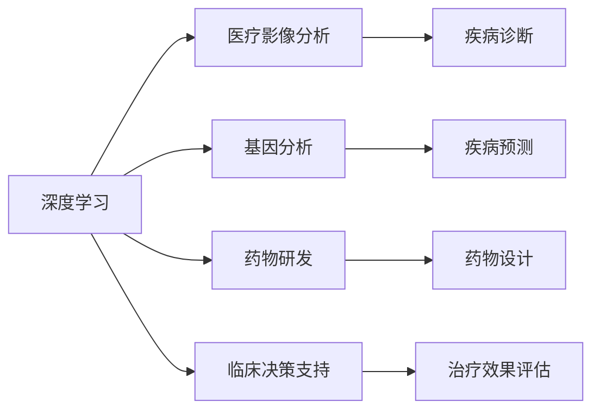

# AI人工智能深度学习算法：在精准医疗中的应用

作者：禅与计算机程序设计艺术 / Zen and the Art of Computer Programming

## 1. 背景介绍
### 1.1 问题的由来

精准医疗（Precision Medicine）是一种以个体差异为基础，针对特定患者群体进行个性化诊疗的新兴医疗模式。近年来，随着人工智能（AI）技术的快速发展，深度学习算法在精准医疗领域的应用越来越广泛，为疾病预防、诊断、治疗和康复等环节带来了革命性的变化。

### 1.2 研究现状

深度学习算法在精准医疗领域的应用主要集中在以下几个方面：

1. **医学影像分析**：利用卷积神经网络（CNN）对医学影像进行分类、分割、检测等任务，如肿瘤检测、病变识别等。

2. **基因分析**：利用循环神经网络（RNN）和图神经网络（GNN）对基因序列、蛋白质结构等生物信息进行建模和分析，如基因突变预测、药物靶点识别等。

3. **药物研发**：利用深度学习算法进行药物筛选、分子对接、虚拟筛选等，提高药物研发效率。

4. **临床决策支持**：利用深度学习算法辅助医生进行诊断、治疗方案的制定和疗效评估。

5. **健康管理**：利用深度学习算法进行健康风险评估、疾病预测等，实现早期预防和个性化干预。

### 1.3 研究意义

深度学习算法在精准医疗领域的应用具有重要意义：

1. **提高诊断准确率**：深度学习算法能够自动学习医学影像、基因序列等数据中的特征，提高诊断准确率。

2. **缩短诊断时间**：深度学习算法能够快速处理海量数据，缩短诊断时间，提高医疗效率。

3. **降低误诊率**：深度学习算法能够降低人为因素对诊断结果的影响，降低误诊率。

4. **实现个性化诊疗**：深度学习算法能够分析个体差异，为患者提供个性化诊疗方案。

5. **促进医学研究**：深度学习算法能够挖掘海量医学数据中的潜在规律，为医学研究提供新思路。

### 1.4 本文结构

本文将从以下几个方面对深度学习算法在精准医疗中的应用进行探讨：

1. 介绍核心概念和联系。

2. 阐述深度学习算法在精准医疗领域的核心算法原理和具体操作步骤。

3. 分析数学模型和公式，并举例说明。

4. 给出代码实例和详细解释说明。

5. 探讨实际应用场景和未来应用展望。

6. 推荐相关工具和资源。

7. 总结未来发展趋势与挑战。

## 2. 核心概念与联系

为了更好地理解深度学习算法在精准医疗中的应用，本节将介绍几个核心概念及其联系：

- **深度学习**：一种模拟人脑神经网络结构的机器学习算法，通过学习大量数据中的特征，实现对复杂问题的建模和预测。

- **医疗影像分析**：利用计算机技术对医学影像进行分类、分割、检测等任务。

- **基因分析**：利用生物信息学技术和计算方法对基因序列、蛋白质结构等生物信息进行建模和分析。

- **药物研发**：利用计算机模拟和机器学习技术进行药物筛选、分子对接、虚拟筛选等。

- **临床决策支持**：利用计算机技术辅助医生进行诊断、治疗方案的制定和疗效评估。

这些概念之间的关系如下所示：



可以看出，深度学习技术是支撑精准医疗领域各个应用的基础，而医疗影像分析、基因分析、药物研发、临床决策支持等应用则是深度学习在精准医疗领域的具体应用场景。

## 3. 核心算法原理 & 具体操作步骤
### 3.1 算法原理概述

深度学习算法在精准医疗领域的应用主要基于以下几种核心算法：

- **卷积神经网络（CNN）**：用于医学影像分析，提取图像特征。

- **循环神经网络（RNN）**：用于处理序列数据，如基因序列、蛋白质结构等。

- **图神经网络（GNN）**：用于分析生物信息学数据，如蛋白质相互作用网络、基因调控网络等。

- **生成对抗网络（GAN）**：用于生成新的医学图像、药物分子等。

- **长短期记忆网络（LSTM）**：用于处理长序列数据，如时间序列分析等。

### 3.2 算法步骤详解

以下以CNN在医学影像分析中的应用为例，详细讲解深度学习算法的操作步骤：

1. **数据预处理**：对医学影像数据进行预处理，如归一化、去噪等。

2. **数据增强**：通过旋转、翻转、缩放等方式增加数据多样性。

3. **模型构建**：选择合适的CNN模型结构，如ResNet、VGG等。

4. **模型训练**：使用训练集对模型进行训练，优化模型参数。

5. **模型评估**：使用验证集评估模型性能，如准确率、召回率等。

6. **模型部署**：将训练好的模型部署到实际应用场景中。

### 3.3 算法优缺点

深度学习算法在精准医疗领域的应用具有以下优点：

1. **高精度**：深度学习算法能够自动学习数据中的特征，提高诊断准确率。

2. **自动化**：深度学习算法可以自动处理海量数据，提高医疗效率。

3. **泛化能力强**：深度学习算法能够学习到通用特征，适用于不同类型的医学数据。

然而，深度学习算法在精准医疗领域的应用也存在一些缺点：

1. **数据依赖性强**：深度学习算法需要大量标注数据，获取标注数据成本较高。

2. **模型可解释性差**：深度学习模型的决策过程难以解释，难以满足某些对可解释性要求较高的应用场景。

3. **计算资源消耗大**：深度学习算法需要大量的计算资源，对硬件设备要求较高。

### 3.4 算法应用领域

深度学习算法在精准医疗领域的应用领域包括：

1. **医学影像分析**：如肿瘤检测、病变识别、骨折检测等。

2. **基因分析**：如基因突变预测、药物靶点识别、疾病预测等。

3. **药物研发**：如药物筛选、分子对接、虚拟筛选等。

4. **临床决策支持**：如疾病诊断、治疗方案的制定、疗效评估等。

5. **健康管理**：如健康风险评估、疾病预测、个性化干预等。

## 4. 数学模型和公式 & 详细讲解 & 举例说明
### 4.1 数学模型构建

以下以CNN在医学影像分析中的应用为例，介绍其数学模型构建：

1. **卷积层**：通过卷积操作提取图像特征。

$$
h^{(l)}_i = \sum_{j} w^{(l)}_{ij} \cdot h^{(l-1)}_j + b^{(l)}_i
$$

其中，$h^{(l)}_i$ 表示第 $l$ 层第 $i$ 个神经元输出，$w^{(l)}_{ij}$ 表示连接第 $l-1$ 层第 $j$ 个神经元和第 $l$ 层第 $i$ 个神经元的权重，$b^{(l)}_i$ 表示第 $l$ 层第 $i$ 个神经元的偏置。

2. **激活函数**：对卷积层输出进行非线性变换。

$$
f(x) = \max(0, x)
$$

3. **池化层**：降低特征维度，提高模型鲁棒性。

$$
p_i = \max_{k \in K_i} h^{(l)}_k
$$

其中，$p_i$ 表示第 $i$ 个池化单元输出，$K_i$ 表示第 $i$ 个池化单元覆盖的像素区域。

4. **全连接层**：将低层特征图拼接成向量，进行分类或回归。

$$
y = W \cdot h^{(l)} + b
$$

其中，$y$ 表示模型输出，$W$ 表示全连接层权重，$b$ 表示全连接层偏置。

### 4.2 公式推导过程

以下以CNN中卷积层和激活函数的公式推导为例，进行说明：

**卷积层**：

卷积层通过卷积操作提取图像特征。假设输入特征图 $h^{(l-1)}$ 的大小为 $m \times n \times d$，卷积核大小为 $k \times k \times d$，则卷积层输出 $h^{(l)}$ 的大小为 $(m-k+1) \times (n-k+1) \times d$。

卷积操作可以表示为：

$$
h^{(l)}_i = \sum_{j} w^{(l)}_{ij} \cdot h^{(l-1)}_j + b^{(l)}_i
$$

其中，$h^{(l)}_i$ 表示第 $l$ 层第 $i$ 个神经元输出，$w^{(l)}_{ij}$ 表示连接第 $l-1$ 层第 $j$ 个神经元和第 $l$ 层第 $i$ 个神经元的权重，$b^{(l)}_i$ 表示第 $l$ 层第 $i$ 个神经元的偏置。

**激活函数**：

激活函数用于对卷积层输出进行非线性变换，常用的激活函数有ReLU、Sigmoid、Tanh等。

以ReLU激活函数为例，其公式推导如下：

假设输入 $x$，ReLU激活函数的定义为：

$$
f(x) = \max(0, x)
$$

其导数为：

$$
f'(x) = \begin{cases} 
1, & x > 0 \
0, & x \leq 0 
\end{cases}
$$

### 4.3 案例分析与讲解

以下以深度学习在肿瘤检测中的应用为例，进行案例分析：

1. **数据集**：使用公开的医学影像数据集，如Cancer Imaging Archive（CancerICA）。

2. **模型**：选择合适的CNN模型结构，如ResNet。

3. **训练过程**：使用训练集对模型进行训练，优化模型参数。

4. **评估过程**：使用验证集评估模型性能，如准确率、召回率等。

5. **模型部署**：将训练好的模型部署到实际应用场景中。

通过以上步骤，可以实现肿瘤检测的应用。

### 4.4 常见问题解答

**Q1：深度学习算法在精准医疗领域的应用有哪些挑战？**

A1：深度学习算法在精准医疗领域的应用主要面临以下挑战：

1. 数据质量：医学数据往往存在数据缺失、噪声等问题，影响模型性能。

2. 数据隐私：医学数据涉及个人隐私，需要严格保护。

3. 模型可解释性：深度学习模型的决策过程难以解释，难以满足某些对可解释性要求较高的应用场景。

4. 计算资源：深度学习算法需要大量的计算资源，对硬件设备要求较高。

**Q2：如何提高深度学习算法在精准医疗领域的应用效果？**

A2：提高深度学习算法在精准医疗领域的应用效果，可以从以下几个方面入手：

1. 提高数据质量：对医学数据进行预处理，如去噪、缺失值填充等。

2. 加强模型可解释性：探索可解释深度学习算法，如注意力机制、LIME等。

3. 跨数据集学习：利用跨数据集学习技术，提高模型的泛化能力。

4. 多模型集成：训练多个模型，取平均输出，提高模型性能。

5. 资源优化：使用模型压缩、量化等技术，降低模型计算量。

## 5. 项目实践：代码实例和详细解释说明
### 5.1 开发环境搭建

以下以使用Python和TensorFlow实现CNN进行肿瘤检测为例，介绍开发环境搭建过程：

1. 安装TensorFlow：

```bash
pip install tensorflow
```

2. 安装其他依赖库：

```bash
pip install numpy matplotlib scikit-learn
```

### 5.2 源代码详细实现

以下为使用TensorFlow实现CNN进行肿瘤检测的源代码：

```python
import tensorflow as tf
from tensorflow.keras import layers
from tensorflow.keras.models import Model

def build_cnn(input_shape):
    model = tf.keras.Sequential()
    model.add(layers.Conv2D(32, (3, 3), activation='relu', input_shape=input_shape))
    model.add(layers.MaxPooling2D((2, 2)))
    model.add(layers.Conv2D(64, (3, 3), activation='relu'))
    model.add(layers.MaxPooling2D((2, 2)))
    model.add(layers.Conv2D(128, (3, 3), activation='relu'))
    model.add(layers.MaxPooling2D((2, 2)))
    model.add(layers.Flatten())
    model.add(layers.Dense(128, activation='relu'))
    model.add(layers.Dense(1, activation='sigmoid'))
    return model

model = build_cnn((256, 256, 3))
model.summary()
```

### 5.3 代码解读与分析

以上代码定义了一个简单的CNN模型，用于肿瘤检测：

1. `build_cnn` 函数：构建CNN模型，包括卷积层、池化层和全连接层。

2. `model`：使用`build_cnn`函数构建的CNN模型。

3. `model.summary()`：打印模型结构，包括层数、神经元数量、参数数量等。

### 5.4 运行结果展示

以下为使用TensorFlow训练和评估CNN模型的示例：

```python
import tensorflow as tf
from tensorflow.keras.optimizers import Adam
from sklearn.model_selection import train_test_split

# 加载数据
train_images, train_labels = load_data()
test_images, test_labels = load_data()

# 划分训练集和验证集
train_images, val_images, train_labels, val_labels = train_test_split(train_images, train_labels, test_size=0.2)

# 模型编译
model.compile(optimizer=Adam(), loss='binary_crossentropy', metrics=['accuracy'])

# 模型训练
history = model.fit(train_images, train_labels, epochs=10, validation_data=(val_images, val_labels))

# 模型评估
test_loss, test_accuracy = model.evaluate(test_images, test_labels)
print(f"Test accuracy: {test_accuracy:.4f}")
```

以上代码展示了使用TensorFlow训练和评估CNN模型的完整流程：

1. 加载数据：加载训练数据和测试数据。

2. 划分训练集和验证集：将训练数据划分为训练集和验证集。

3. 模型编译：设置优化器、损失函数和指标。

4. 模型训练：使用训练集和验证集对模型进行训练。

5. 模型评估：使用测试集评估模型性能。

## 6. 实际应用场景
### 6.1 医学影像分析

深度学习算法在医学影像分析中具有广泛的应用，如：

1. **肿瘤检测**：利用CNN识别图像中的肿瘤区域。

2. **病变识别**：利用CNN识别图像中的病变区域。

3. **骨折检测**：利用CNN识别图像中的骨折区域。

4. **视网膜病变检测**：利用CNN识别视网膜图像中的病变区域。

5. **乳腺X光片分析**：利用CNN识别乳腺X光片中的异常区域。

### 6.2 基因分析

深度学习算法在基因分析中具有以下应用：

1. **基因突变预测**：利用RNN分析基因序列，预测基因突变。

2. **药物靶点识别**：利用GNN分析蛋白质相互作用网络，识别药物靶点。

3. **疾病预测**：利用LSTM分析时间序列数据，预测疾病发生风险。

### 6.3 药物研发

深度学习算法在药物研发中具有以下应用：

1. **药物筛选**：利用深度学习算法进行虚拟筛选，筛选潜在的药物分子。

2. **分子对接**：利用深度学习算法模拟分子与靶点之间的相互作用。

3. **药物设计**：利用深度学习算法设计新的药物分子。

### 6.4 临床决策支持

深度学习算法在临床决策支持中具有以下应用：

1. **疾病诊断**：利用深度学习算法辅助医生进行疾病诊断。

2. **治疗方案制定**：利用深度学习算法为患者制定个性化的治疗方案。

3. **疗效评估**：利用深度学习算法评估治疗效果。

### 6.5 健康管理

深度学习算法在健康管理中具有以下应用：

1. **健康风险评估**：利用深度学习算法评估个体健康风险。

2. **疾病预测**：利用深度学习算法预测疾病发生风险。

3. **个性化干预**：利用深度学习算法为个体提供个性化的健康管理方案。

## 7. 工具和资源推荐
### 7.1 学习资源推荐

以下是一些学习资源，帮助开发者掌握深度学习算法在精准医疗领域的应用：

1. **《深度学习》**：Goodfellow、Bengio和Courville所著，介绍了深度学习的理论基础和应用案例。

2. **《Python深度学习》**：François Chollet所著，介绍了使用Python和TensorFlow实现深度学习算法的方法。

3. **《TensorFlow实战》**：TensorFlow官方教程，介绍了TensorFlow的使用方法。

4. **《深度学习在医学影像分析中的应用》**：介绍了深度学习在医学影像分析中的应用案例。

5. **《深度学习在生物信息学中的应用》**：介绍了深度学习在生物信息学中的应用案例。

### 7.2 开发工具推荐

以下是一些用于深度学习算法在精准医疗领域的开发工具：

1. **TensorFlow**：Google开源的深度学习框架。

2. **PyTorch**：Facebook开源的深度学习框架。

3. **Keras**：TensorFlow和PyTorch的封装库，简化了深度学习模型的构建和训练。

4. **Caffe**：Facebook开源的深度学习框架，主要用于图像识别和计算机视觉领域。

5. **Scikit-learn**：Python开源的机器学习库。

### 7.3 相关论文推荐

以下是一些关于深度学习算法在精准医疗领域的相关论文：

1. **"Deep Learning for Medical Image Analysis"**：介绍了深度学习在医学影像分析中的应用。

2. **"Deep Learning for Genomics"**：介绍了深度学习在基因分析中的应用。

3. **"Deep Learning for Drug Discovery"**：介绍了深度学习在药物研发中的应用。

4. **"Deep Learning for Healthcare"**：介绍了深度学习在医疗健康领域的应用。

5. **"Deep Learning in Radiology"**：介绍了深度学习在放射学领域的应用。

### 7.4 其他资源推荐

以下是一些其他资源，帮助开发者了解深度学习算法在精准医疗领域的应用：

1. **GitHub**：开源代码平台，可以找到许多深度学习算法在精准医疗领域的开源项目。

2. **arXiv**：预印本平台，可以找到许多关于深度学习算法在精准医疗领域的最新研究成果。

3. **Kaggle**：数据科学竞赛平台，可以找到许多与深度学习算法在精准医疗领域相关的竞赛数据集。

4. **医学影像数据集**：公开的医学影像数据集，如Cancer Imaging Archive、LSVRC等。

5. **生物信息学数据集**：公开的生物信息学数据集，如GenBank、UCSC Genome Browser等。

## 8. 总结：未来发展趋势与挑战
### 8.1 研究成果总结

本文从背景介绍、核心概念、算法原理、应用场景等方面对深度学习算法在精准医疗领域的应用进行了全面系统的介绍。通过本文的学习，读者可以了解到深度学习算法在精准医疗领域的广泛应用和巨大潜力。

### 8.2 未来发展趋势

未来，深度学习算法在精准医疗领域的应用将呈现以下发展趋势：

1. **模型轻量化**：随着移动设备的普及，模型轻量化技术将得到广泛应用，实现深度学习算法在移动设备上的实时应用。

2. **可解释性增强**：可解释深度学习算法将得到更多关注，提高模型的透明度和可信度。

3. **多模态融合**：将深度学习算法与其他模态数据（如影像、基因、蛋白质等）进行融合，实现更全面、准确的疾病诊断和治疗。

4. **个性化诊疗**：基于个体差异，实现个性化诊疗方案，提高治疗效果。

5. **预防医学**：利用深度学习算法进行疾病预测和早期筛查，实现疾病预防。

### 8.3 面临的挑战

尽管深度学习算法在精准医疗领域取得了显著成果，但仍然面临以下挑战：

1. **数据质量**：医学数据存在数据缺失、噪声等问题，影响模型性能。

2. **数据隐私**：医学数据涉及个人隐私，需要严格保护。

3. **模型可解释性**：深度学习模型的决策过程难以解释，难以满足某些对可解释性要求较高的应用场景。

4. **计算资源**：深度学习算法需要大量的计算资源，对硬件设备要求较高。

5. **伦理和法律问题**：深度学习算法在医疗领域的应用需要遵循伦理和法律规范。

### 8.4 研究展望

未来，深度学习算法在精准医疗领域的应用研究将重点关注以下方向：

1. **数据增强**：通过数据增强技术提高模型泛化能力，降低对标注数据的依赖。

2. **迁移学习**：利用迁移学习技术，将通用知识迁移到特定领域，提高模型性能。

3. **多任务学习**：将多个任务结合在一起进行训练，提高模型性能和泛化能力。

4. **模型压缩**：通过模型压缩技术，降低模型计算量和存储量，实现模型轻量化。

5. **隐私保护**：研究隐私保护技术，保护患者隐私。

相信在学术界和产业界的共同努力下，深度学习算法在精准医疗领域的应用将不断取得突破，为人类健康事业做出更大贡献。

---

作者：禅与计算机程序设计艺术 / Zen and the Art of Computer Programming