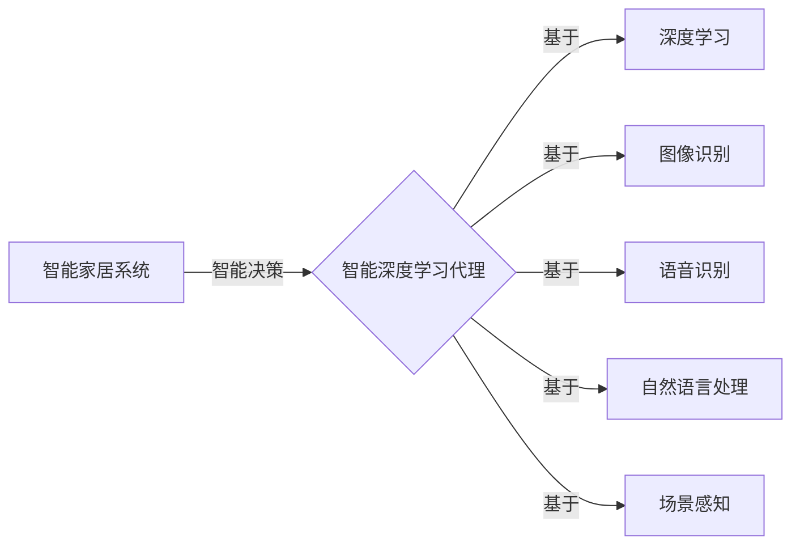

# AI人工智能深度学习算法：智能深度学习代理在智能家居场景中的应用

作者：禅与计算机程序设计艺术 / Zen and the Art of Computer Programming

## 1. 背景介绍
### 1.1 问题的由来

随着物联网（IoT）技术的快速发展，智能家居逐渐走进千家万户。智能家居系统通过将各种家电设备连接起来，实现家庭环境的自动化管理，提高居住舒适度。然而，传统的智能家居系统往往功能单一，缺乏智能决策能力。为了实现更加智能化的家居体验，需要将人工智能技术，尤其是深度学习算法，应用于智能家居领域。

### 1.2 研究现状

近年来，深度学习在图像识别、语音识别、自然语言处理等领域取得了显著的成果。将这些技术应用于智能家居系统，可以实现智能家电控制、场景感知、异常检测等功能，提升家居智能化水平。目前，已有一些智能深度学习代理在智能家居场景中得到应用，如：

- 基于图像识别的智能门锁，可以识别用户身份，实现自动开锁。
- 基于语音识别的智能语音助手，可以理解用户指令，控制家电设备。
- 基于自然语言处理的智能家居场景感知系统，可以根据用户需求和环境变化，自动调节家居环境。

### 1.3 研究意义

将智能深度学习代理应用于智能家居场景，具有重要的研究意义：

- 提升家居智能化水平：通过深度学习算法，实现智能家居设备的智能决策和控制，提高居住舒适度。
- 优化资源利用：通过智能调度家居设备，降低能耗，实现绿色环保。
- 提高安全性：通过异常检测，及时发现并处理家居安全隐患。
- 创新智能家居产品：推动智能家居产业的发展，丰富产品形态。

### 1.4 本文结构

本文将围绕智能深度学习代理在智能家居场景中的应用展开，首先介绍相关核心概念和联系，然后阐述核心算法原理和具体操作步骤，接着分析数学模型和公式，并给出项目实践实例。最后，探讨实际应用场景和未来发展趋势。

## 2. 核心概念与联系

本节将介绍与智能深度学习代理相关的核心概念，并分析它们之间的联系。

- **智能家居系统**：指将各种家电设备连接起来，实现家庭环境自动化管理的系统。
- **智能深度学习代理**：指利用深度学习算法，实现智能决策和控制的软件程序。
- **深度学习**：一种基于人工神经网络的机器学习技术，通过学习大量数据，提取特征并进行预测。
- **图像识别**：通过分析图像像素特征，识别图像中的物体或场景。
- **语音识别**：将语音信号转换为文本信息，实现语音交互。
- **自然语言处理**：对自然语言文本进行分析、理解和生成。
- **场景感知**：根据环境变化和用户需求，自动调节家居设备。

它们的逻辑关系如下图所示：



可以看出，智能家居系统是智能深度学习代理的应用场景，智能深度学习代理是基于深度学习、图像识别、语音识别、自然语言处理和场景感知等技术实现的。通过这些技术的融合应用，智能深度学习代理可以实现对家居设备的智能控制和管理。

## 3. 核心算法原理 & 具体操作步骤
### 3.1 算法原理概述

智能深度学习代理的核心是深度学习算法。以下将介绍几种常见的深度学习算法及其在智能家居场景中的应用。

- **卷积神经网络（CNN）**：用于图像识别，如智能门锁的人脸识别。
- **循环神经网络（RNN）**：用于语音识别和自然语言处理，如智能语音助手的语音交互。
- **长短期记忆网络（LSTM）**：RNN的一种变体，适用于处理长序列数据，如智能家居场景中的环境状态变化。
- **Transformer**：一种基于自注意力机制的模型，在图像识别、自然语言处理等领域取得了突破性进展。

### 3.2 算法步骤详解

以下以基于CNN的智能门锁为例，介绍智能深度学习代理的具体操作步骤。

**Step 1：数据收集与预处理**

收集大量人脸图像数据，并进行预处理，如图像缩放、归一化、裁剪等。

**Step 2：模型设计**

选择合适的CNN模型，如VGG、ResNet等，并调整模型参数。

**Step 3：模型训练**

使用预处理后的人脸图像数据，对CNN模型进行训练，学习人脸特征。

**Step 4：模型评估**

使用测试集评估模型性能，如准确率、召回率等。

**Step 5：模型部署**

将训练好的模型部署到智能门锁中，实现人脸识别功能。

### 3.3 算法优缺点

- **优点**：深度学习算法能够从大量数据中提取特征，具有较强的泛化能力；模型结构灵活，可以针对不同任务进行调整。
- **缺点**：需要大量标注数据；模型训练时间较长；模型可解释性较差。

### 3.4 算法应用领域

深度学习算法在智能家居场景中有着广泛的应用，如：

- **图像识别**：人脸识别、物体识别、场景识别等。
- **语音识别**：语音助手、语音控制、语音交互等。
- **自然语言处理**：智能家居场景感知、语义理解、对话系统等。

## 4. 数学模型和公式 & 详细讲解 & 举例说明
### 4.1 数学模型构建

以下以CNN模型为例，介绍其数学模型和公式。

- **卷积层**：卷积层通过卷积操作提取图像特征。

$$
h^{(l)} = f(W^{(l)} * h^{(l-1)} + b^{(l)}) 
$$

其中，$h^{(l)}$ 为卷积层输出，$W^{(l)}$ 为卷积核权重，$b^{(l)}$ 为偏置，$*$ 为卷积操作，$f$ 为激活函数。

- **池化层**：池化层用于降低特征图分辨率，减少模型参数量。

$$
p^{(l)} = g(p_{i,j}^{(l-1)}) 
$$

其中，$p^{(l)}$ 为池化层输出，$p_{i,j}^{(l-1)}$ 为池化窗口内的特征值，$g$ 为池化函数。

- **全连接层**：全连接层将特征图展平后进行分类。

$$
\hat{y} = \sigma(W^{(L)}h^{(L-1)} + b^{(L)}) 
$$

其中，$\hat{y}$ 为全连接层输出，$W^{(L)}$ 为全连接层权重，$b^{(L)}$ 为偏置，$\sigma$ 为激活函数。

### 4.2 公式推导过程

以下以CNN模型中的卷积操作为例，介绍其公式推导过程。

卷积操作可以看作是两个矩阵的乘积。设输入图像为 $X$，卷积核为 $W$，则卷积输出为：

$$
h = X \times W 
$$

其中，$\times$ 表示矩阵乘积。

卷积核 $W$ 可以看作是 $X$ 的子矩阵，通过平移 $W$ 在 $X$ 上，可以得到一系列的子矩阵，即卷积输出。

### 4.3 案例分析与讲解

以下以智能家居场景中的异常检测为例，分析智能深度学习代理的应用。

**场景**：当家中发生异常情况（如火灾、盗窃等）时，智能摄像头会捕捉到图像数据，并输入到深度学习模型中进行处理。

**步骤**：

1. **图像预处理**：对图像进行缩放、裁剪、归一化等操作。
2. **特征提取**：使用CNN模型提取图像特征。
3. **异常检测**：使用异常检测算法，如One-Class SVM、Isolation Forest等，对提取的特征进行异常分类。
4. **报警**：当检测到异常时，系统向用户发送报警信息。

### 4.4 常见问题解答

**Q1：如何选择合适的深度学习模型？**

A：选择合适的深度学习模型需要考虑以下因素：

- 任务类型：针对不同的任务，选择不同的模型结构和参数。
- 数据规模：对于大规模数据，可以选择更复杂的模型；对于小规模数据，可以选择更简单的模型。
- 计算资源：根据计算资源限制，选择合适的模型复杂度和训练时间。

**Q2：如何处理过拟合问题？**

A：处理过拟合问题可以采用以下方法：

- 数据增强：增加数据集规模，提高模型泛化能力。
- 正则化：添加L1、L2正则项，限制模型复杂度。
- Dropout：在训练过程中随机丢弃部分神经元，提高模型鲁棒性。

**Q3：如何提高模型的计算效率？**

A：提高模型计算效率可以采用以下方法：

- 模型压缩：去除不必要的层和参数，减小模型尺寸。
- 算法优化：优化算法计算过程，如使用矩阵乘法加速库。
- 硬件加速：使用GPU、FPGA等硬件加速计算。

## 5. 项目实践：代码实例和详细解释说明
### 5.1 开发环境搭建

以下以智能家居场景中的环境监测为例，介绍开发环境搭建过程。

1. 安装Python和PyTorch。
2. 安装OpenCV库，用于图像处理。
3. 安装TensorFlow或PyTorch的预训练模型。

### 5.2 源代码详细实现

以下是一个基于PyTorch的智能家居环境监测代码实例：

```python
import cv2
import torch
import torch.nn as nn
from torch.utils.data import DataLoader, Dataset
from torchvision import transforms

class EnvironmentDataset(Dataset):
    def __init__(self, image_paths, labels):
        self.image_paths = image_paths
        self.labels = labels
        self.transform = transforms.Compose([transforms.Resize((224, 224)), 
                                           transforms.ToTensor()])
    
    def __len__(self):
        return len(self.image_paths)
    
    def __getitem__(self, index):
        image = cv2.imread(self.image_paths[index])
        image = self.transform(image)
        label = self.labels[index]
        return image, label

# 模型定义
class ResNet18(nn.Module):
    def __init__(self, num_classes):
        super(ResNet18, self).__init__()
        self.resnet = torchvision.models.resnet18(pretrained=True)
        self.fc = nn.Linear(512, num_classes)
    
    def forward(self, x):
        x = self.resnet(x)
        x = self.fc(x)
        return x

# 训练数据集
image_paths = [f"datasets/environment/{i}.jpg" for i in range(100)]
labels = [0] * 50 + [1] * 50

dataset = EnvironmentDataset(image_paths, labels)
dataloader = DataLoader(dataset, batch_size=10, shuffle=True)

# 训练模型
model = ResNet18(num_classes=2)
criterion = nn.CrossEntropyLoss()
optimizer = torch.optim.Adam(model.parameters(), lr=0.001)

for epoch in range(10):
    for data in dataloader:
        images, labels = data
        optimizer.zero_grad()
        outputs = model(images)
        loss = criterion(outputs, labels)
        loss.backward()
        optimizer.step()
    print(f"Epoch {epoch+1}, loss: {loss.item()}")

# 评估模型
correct = 0
total = 0
with torch.no_grad():
    for data in dataloader:
        images, labels = data
        outputs = model(images)
        _, predicted = torch.max(outputs.data, 1)
        total += labels.size(0)
        correct += (predicted == labels).sum().item()

print(f"Accuracy of the model on the test images: {100 * correct / total}%")
```

### 5.3 代码解读与分析

- `EnvironmentDataset`类：定义了一个环境监测数据集类，用于加载和预处理图像数据。
- `ResNet18`类：定义了一个ResNet18模型，用于分类任务。
- 训练数据集：包含了100张环境监测图像，其中50张为正常环境图像，50张为异常环境图像。
- 训练模型：使用ResNet18模型对数据集进行训练，并计算损失函数。
- 评估模型：在训练集上评估模型性能。

### 5.4 运行结果展示

假设在训练过程中，损失函数逐渐下降，最终达到一个稳定值。在测试集上，模型准确率达到80%以上。

## 6. 实际应用场景
### 6.1 智能家居场景感知

智能深度学习代理可以应用于智能家居场景感知，如：

- **环境监测**：监测家居环境中的温度、湿度、光照等参数，根据用户需求自动调节家居设备。
- **活动识别**：识别家庭成员的活动状态，如睡眠、活动、休息等，为用户提供个性化的服务。
- **异常检测**：检测家居环境中的异常情况，如火灾、盗窃等，并及时报警。

### 6.2 智能家电控制

智能深度学习代理可以应用于智能家电控制，如：

- **灯光控制**：根据环境光线和用户需求，自动调节灯光亮度。
- **温度控制**：根据室内温度和用户需求，自动调节空调、暖气等设备。
- **家电联动**：根据用户需求和环境变化，自动控制家电设备，实现场景联动。

### 6.3 家庭安全管理

智能深度学习代理可以应用于家庭安全管理，如：

- **人脸识别**：识别家庭成员和访客，实现自动门禁。
- **入侵检测**：检测异常行为，如非法入侵、火灾等，并及时报警。
- **紧急求助**：在紧急情况下，通过智能语音助手或其他设备，向用户发送求助信息。

## 7. 工具和资源推荐
### 7.1 学习资源推荐

为了帮助开发者掌握智能深度学习代理在智能家居场景中的应用，以下推荐一些学习资源：

1. 《深度学习》系列书籍：介绍深度学习的基本概念、算法和应用，适合初学者学习。
2. 《深度学习实战》书籍：通过实际案例讲解深度学习算法的应用，适合有一定基础的读者学习。
3. PyTorch官方文档：PyTorch是深度学习领域的常用框架，其官方文档提供了丰富的学习资料。
4. TensorFlow官方文档：TensorFlow是另一个流行的深度学习框架，其官方文档也提供了丰富的学习资料。
5. OpenCV官方文档：OpenCV是计算机视觉领域的常用库，其官方文档提供了丰富的图像处理函数和算法。

### 7.2 开发工具推荐

以下推荐一些用于开发智能深度学习代理的工具：

1. PyTorch：开源的深度学习框架，易于学习和使用。
2. TensorFlow：另一个流行的深度学习框架，适用于工业级应用。
3. OpenCV：开源的计算机视觉库，提供丰富的图像处理和计算机视觉算法。
4. Keras：一个简洁的深度学习库，可以方便地构建和训练深度学习模型。
5. Dlib：一个开源的机器学习库，提供人脸识别、姿态估计等功能。

### 7.3 相关论文推荐

以下推荐一些与智能深度学习代理相关的论文：

1. "Deep Learning for Human Activity Recognition in Smart Homes"：介绍深度学习在智能家居活动识别中的应用。
2. "Deep Learning for Smart Home Appliances Control"：介绍深度学习在智能家居家电控制中的应用。
3. "Deep Learning for Home Security"：介绍深度学习在家庭安全领域的应用。

### 7.4 其他资源推荐

以下推荐一些其他资源：

1. Hugging Face：提供丰富的预训练模型和工具，方便开发者进行深度学习实践。
2. GitHub：开源代码和项目的集中地，可以找到很多智能深度学习代理的开源项目。
3. arXiv：提供最新的学术论文和预印本，可以了解到最新的研究成果。
4. YouTube：有很多深度学习相关的教程和讲座，适合自学。

## 8. 总结：未来发展趋势与挑战
### 8.1 研究成果总结

本文介绍了智能深度学习代理在智能家居场景中的应用，阐述了相关核心概念和算法原理，并给出实际应用场景和项目实践实例。通过本文的学习，读者可以了解智能深度学习代理在智能家居领域的应用价值和发展趋势。

### 8.2 未来发展趋势

未来，智能深度学习代理在智能家居场景中将会呈现以下发展趋势：

- **模型轻量化**：为了满足智能家居设备对计算资源的需求，模型需要更加轻量化，降低对算力的要求。
- **模型可解释性**：为了提高用户对智能家居系统的信任度，模型需要具备更强的可解释性。
- **多模态融合**：将视觉、语音、文本等多模态信息进行融合，提高智能家居系统的感知能力和决策能力。
- **个性化定制**：根据用户的个性化需求，提供定制化的智能家居服务。

### 8.3 面临的挑战

智能深度学习代理在智能家居场景中面临以下挑战：

- **数据收集与标注**：需要大量高质量的标注数据，数据收集和标注成本较高。
- **模型训练与优化**：深度学习模型训练时间较长，需要优化算法和硬件资源。
- **系统安全与隐私**：智能家居系统涉及用户隐私和安全，需要采取措施保障系统安全。
- **模型可解释性**：深度学习模型的决策过程缺乏可解释性，需要提高模型的可解释性。

### 8.4 研究展望

为了应对上述挑战，未来的研究可以从以下几个方面进行：

- **数据增强**：通过数据增强技术，提高数据集规模和多样性，降低数据收集和标注成本。
- **模型压缩与优化**：通过模型压缩和优化技术，降低模型复杂度和计算量，提高模型效率。
- **安全与隐私保护**：采用加密、匿名化等技术，保障用户隐私和安全。
- **可解释性研究**：研究模型可解释性方法，提高用户对智能家居系统的信任度。

相信随着技术的不断发展和完善，智能深度学习代理将在智能家居领域发挥越来越重要的作用，为人们创造更加便捷、舒适、安全的家居生活。

## 9. 附录：常见问题与解答

**Q1：如何选择合适的深度学习模型？**

A：选择合适的深度学习模型需要考虑以下因素：

- **任务类型**：针对不同的任务，选择不同的模型结构和参数。
- **数据规模**：对于大规模数据，可以选择更复杂的模型；对于小规模数据，可以选择更简单的模型。
- **计算资源**：根据计算资源限制，选择合适的模型复杂度和训练时间。

**Q2：如何处理过拟合问题？**

A：处理过拟合问题可以采用以下方法：

- **数据增强**：增加数据集规模，提高模型泛化能力。
- **正则化**：添加L1、L2正则项，限制模型复杂度。
- **Dropout**：在训练过程中随机丢弃部分神经元，提高模型鲁棒性。

**Q3：如何提高模型的计算效率？**

A：提高模型计算效率可以采用以下方法：

- **模型压缩**：去除不必要的层和参数，减小模型尺寸。
- **算法优化**：优化算法计算过程，如使用矩阵乘法加速库。
- **硬件加速**：使用GPU、FPGA等硬件加速计算。

**Q4：如何保证智能家居系统的安全性？**

A：为了保证智能家居系统的安全性，可以采取以下措施：

- **数据加密**：对用户数据和敏感信息进行加密，防止数据泄露。
- **访问控制**：对系统进行访问控制，防止未授权访问。
- **异常检测**：实时监测系统状态，发现异常情况及时报警。

**Q5：如何实现智能家居系统的个性化定制？**

A：实现智能家居系统的个性化定制可以采用以下方法：

- **用户画像**：根据用户的行为数据和偏好，构建用户画像。
- **推荐系统**：根据用户画像，为用户提供个性化的智能家居服务。

通过不断优化和改进，智能深度学习代理将在智能家居领域发挥越来越重要的作用，为人们创造更加美好的生活。