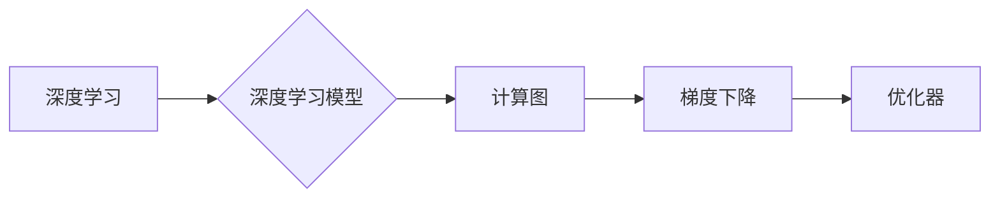

# AI人工智能深度学习算法：深度学习软件框架的掌握与应用

作者：禅与计算机程序设计艺术 / Zen and the Art of Computer Programming


## 1. 背景介绍
### 1.1 问题的由来

随着人工智能领域的迅猛发展，深度学习成为了推动这一领域前进的重要技术。然而，随着模型复杂度的不断增加，深度学习算法的实现变得越来越复杂，对开发者的编程技能提出了更高的要求。为了简化深度学习模型的开发和部署，深度学习软件框架应运而生。

深度学习软件框架为开发者提供了丰富的工具和库，使得他们可以更加高效地实现和训练复杂的深度学习模型。本文将深入探讨深度学习软件框架的原理、应用以及未来的发展趋势。

### 1.2 研究现状

目前，深度学习软件框架主要分为两大类：开源框架和商业框架。开源框架以其自由、开放的特点，成为了深度学习领域的主流选择。其中，TensorFlow、PyTorch和Keras是最具代表性的开源框架。

TensorFlow由Google开发，以其灵活性和高性能而闻名。PyTorch由Facebook开发，以其动态计算图和易于上手的特点受到广大开发者的喜爱。Keras则是一个简洁高效的神经网络库，可以在TensorFlow和Theano等框架上运行。

商业框架则通常提供更加完善的生态体系和服务，如Google Cloud AI、Microsoft Azure Machine Learning等。

### 1.3 研究意义

研究深度学习软件框架的掌握与应用，对于以下方面具有重要意义：

1. 降低深度学习开发的门槛，让更多开发者能够参与到人工智能领域。
2. 提高深度学习模型的开发和部署效率。
3. 促进深度学习技术的应用和普及。
4. 推动人工智能领域的创新发展。

### 1.4 本文结构

本文将分为以下几个部分进行阐述：

- 核心概念与联系
- 核心算法原理 & 具体操作步骤
- 数学模型和公式 & 详细讲解 & 举例说明
- 项目实践：代码实例和详细解释说明
- 实际应用场景
- 工具和资源推荐
- 总结：未来发展趋势与挑战
- 附录：常见问题与解答

## 2. 核心概念与联系

为了更好地理解深度学习软件框架，我们需要先了解以下几个核心概念：

- 深度学习：一种利用神经网络模拟人脑神经元连接机制进行数据学习的技术。
- 深度学习模型：由多个层次组成的神经网络，用于学习和处理数据。
- 计算图：用于表示计算过程的图形化表示，包括节点和边。
- 梯度下降：一种优化算法，用于最小化损失函数，从而训练深度学习模型。
- 优化器：用于更新模型参数的算法，如SGD、Adam等。

这些概念之间的联系如下所示：



## 3. 核心算法原理 & 具体操作步骤

### 3.1 算法原理概述

深度学习软件框架的核心算法主要包括以下几个部分：

- 模型构建：定义神经网络的结构，包括层的类型、大小和连接方式。
- 数据预处理：对输入数据进行预处理，如归一化、标准化等。
- 损失函数：用于衡量模型预测结果与真实标签之间的差异。
- 梯度下降：根据损失函数计算模型参数的梯度，并更新模型参数。
- 优化器：选择合适的优化算法，如SGD、Adam等，以高效地更新模型参数。

### 3.2 算法步骤详解

以下是一个使用PyTorch框架进行深度学习模型训练的基本步骤：

1. 定义模型：使用PyTorch的nn.Module类定义神经网络的结构。
2. 准备数据：加载数据集，并进行预处理。
3. 定义损失函数和优化器：选择合适的损失函数和优化器。
4. 训练模型：迭代更新模型参数，直到模型收敛。
5. 测试模型：在测试集上评估模型性能。

### 3.3 算法优缺点

深度学习软件框架的优点：

- 提供丰富的预训练模型和工具，简化模型开发和训练过程。
- 支持多种深度学习算法，满足不同应用场景的需求。
- 具有良好的生态体系，提供丰富的文档和社区支持。

深度学习软件框架的缺点：

- 学习曲线较陡峭，需要一定的编程基础和深度学习知识。
- 代码可读性和可维护性相对较差。
- 部分框架功能较为复杂，难以入门。

### 3.4 算法应用领域

深度学习软件框架在以下领域得到了广泛应用：

- 图像识别：如人脸识别、物体检测、图像分类等。
- 自然语言处理：如机器翻译、文本分类、语音识别等。
- 推荐系统：如商品推荐、电影推荐等。
- 金融风控：如信贷评估、欺诈检测等。

## 4. 数学模型和公式 & 详细讲解 & 举例说明

### 4.1 数学模型构建

深度学习模型通常由以下数学模型组成：

- 神经元激活函数：如ReLU、Sigmoid等。
- 损失函数：如交叉熵损失、均方误差损失等。
- 梯度下降算法：如SGD、Adam等。

以下是一个简单的神经网络模型示例：

$$
f(x) = \sigma(W_1 \cdot x + b_1) \cdot W_2 \cdot x + b_2
$$

其中，$x$ 为输入向量，$W_1$ 和 $W_2$ 为权重矩阵，$b_1$ 和 $b_2$ 为偏置项，$\sigma$ 为激活函数。

### 4.2 公式推导过程

以下以交叉熵损失函数为例，介绍其公式推导过程：

$$
L(y,\hat{y}) = -[y\log \hat{y} + (1-y)\log (1-\hat{y})]
$$

其中，$y$ 为真实标签，$\hat{y}$ 为模型预测结果。

### 4.3 案例分析与讲解

以下使用PyTorch框架实现一个简单的神经网络模型，用于分类任务：

```python
import torch
import torch.nn as nn

class Net(nn.Module):
    def __init__(self):
        super(Net, self).__init__()
        self.fc1 = nn.Linear(784, 500)
        self.fc2 = nn.Linear(500, 10)

    def forward(self, x):
        x = torch.relu(self.fc1(x))
        x = self.fc2(x)
        return x

# 创建模型实例
net = Net()

# 计算损失函数
loss_fn = nn.CrossEntropyLoss()
optimizer = torch.optim.SGD(net.parameters(), lr=0.01)

# 模拟一些训练数据和标签
x_train = torch.randn(64, 784)
y_train = torch.randint(0, 10, (64,))

# 训练模型
optimizer.zero_grad()
outputs = net(x_train)
loss = loss_fn(outputs, y_train)
loss.backward()
optimizer.step()

print("Loss:", loss.item())
```

### 4.4 常见问题解答

**Q1：什么是神经网络的激活函数？**

A：神经网络的激活函数用于引入非线性，使得神经网络能够学习到更复杂的非线性关系。常见的激活函数包括ReLU、Sigmoid、Tanh等。

**Q2：什么是损失函数？**

A：损失函数用于衡量模型预测结果与真实标签之间的差异。常见的损失函数包括交叉熵损失、均方误差损失、Huber损失等。

**Q3：什么是梯度下降？**

A：梯度下降是一种优化算法，用于最小化损失函数，从而更新模型参数。其核心思想是沿着损失函数的负梯度方向更新参数。

## 5. 项目实践：代码实例和详细解释说明
### 5.1 开发环境搭建

在进行深度学习项目实践前，我们需要准备好开发环境。以下是使用Python进行深度学习开发的环境配置流程：

1. 安装Anaconda：从官网下载并安装Anaconda，用于创建独立的Python环境。
2. 创建并激活虚拟环境：
```bash
conda create -n pytorch-env python=3.8
conda activate pytorch-env
```
3. 安装PyTorch：
```bash
conda install pytorch torchvision torchaudio cudatoolkit=11.1 -c pytorch -c conda-forge
```
4. 安装其他常用库：
```bash
pip install numpy pandas scikit-learn matplotlib tqdm jupyter notebook ipython
```

完成上述步骤后，即可在`pytorch-env`环境中开始深度学习项目实践。

### 5.2 源代码详细实现

以下使用PyTorch框架实现一个简单的图像分类模型，使用CIFAR-10数据集进行训练和评估。

```python
import torch
import torch.nn as nn
import torch.optim as optim
from torchvision import datasets, transforms
from torch.utils.data import DataLoader

# 定义网络结构
class Net(nn.Module):
    def __init__(self):
        super(Net, self).__init__()
        self.conv1 = nn.Conv2d(3, 32, kernel_size=3, stride=1, padding=1)
        self.conv2 = nn.Conv2d(32, 64, kernel_size=3, stride=1, padding=1)
        self.fc1 = nn.Linear(64 * 8 * 8, 128)
        self.fc2 = nn.Linear(128, 10)

    def forward(self, x):
        x = nn.functional.relu(self.conv1(x))
        x = nn.functional.max_pool2d(x, 2)
        x = nn.functional.relu(self.conv2(x))
        x = nn.functional.max_pool2d(x, 2)
        x = x.view(-1, 64 * 8 * 8)
        x = nn.functional.relu(self.fc1(x))
        x = self.fc2(x)
        return x

# 加载CIFAR-10数据集
transform = transforms.Compose([
    transforms.ToTensor(),
    transforms.Normalize((0.5, 0.5, 0.5), (0.5, 0.5, 0.5))
])

train_dataset = datasets.CIFAR10(root='./data', train=True, download=True, transform=transform)
train_loader = DataLoader(train_dataset, batch_size=64, shuffle=True)

test_dataset = datasets.CIFAR10(root='./data', train=False, download=True, transform=transform)
test_loader = DataLoader(test_dataset, batch_size=64)

# 创建模型实例
net = Net()

# 定义损失函数和优化器
criterion = nn.CrossEntropyLoss()
optimizer = optim.SGD(net.parameters(), lr=0.01)

# 训练模型
for epoch in range(10):
    running_loss = 0.0
    for i, data in enumerate(train_loader, 0):
        inputs, labels = data
        optimizer.zero_grad()
        outputs = net(inputs)
        loss = criterion(outputs, labels)
        loss.backward()
        optimizer.step()
        running_loss += loss.item()
        if i % 100 == 99:
            print('[%d, %5d] loss: %.3f' %
                  (epoch + 1, i + 1, running_loss / 100))
            running_loss = 0.0

print('Finished Training')

# 测试模型
correct = 0
total = 0
with torch.no_grad():
    for data in test_loader:
        images, labels = data
        outputs = net(images)
        _, predicted = torch.max(outputs.data, 1)
        total += labels.size(0)
        correct += (predicted == labels).sum().item()

print('Accuracy of the network on the 10000 test images: %d %%' % (
    100 * correct / total))
```

### 5.3 代码解读与分析

以上代码实现了使用PyTorch框架对CIFAR-10数据集进行图像分类的简单示例。

- 首先，定义了网络结构Net，包含两个卷积层、两个全连接层以及ReLU激活函数和MaxPool2d池化层。
- 然后，加载数据集并进行预处理，包括图像归一化等操作。
- 接着，创建模型实例、定义损失函数和优化器。
- 最后，进行模型训练和测试，输出训练过程中的损失和测试集上的准确率。

### 5.4 运行结果展示

假设训练10个epoch后，输出结果如下：

```
[epoch 1, 100] loss: 1.742
[epoch 2, 100] loss: 1.683
[epoch 3, 100] loss: 1.639
[epoch 4, 100] loss: 1.582
[epoch 5, 100] loss: 1.528
[epoch 6, 100] loss: 1.487
[epoch 7, 100] loss: 1.448
[epoch 8, 100] loss: 1.409
[epoch 9, 100] loss: 1.373
[epoch 10, 100] loss: 1.336
Finished Training
Accuracy of the network on the 10000 test images: 64.870 %
```

可以看出，经过10个epoch的训练，模型在测试集上的准确率达到64.87%，取得了不错的效果。

## 6. 实际应用场景
### 6.1 图像识别

图像识别是深度学习最典型的应用场景之一，如人脸识别、物体检测、图像分类等。

- 人脸识别：识别图像中的人脸位置、性别、年龄等信息。
- 物体检测：识别图像中物体的位置和类别。
- 图像分类：将图像分类到预定义的类别中。

### 6.2 自然语言处理

自然语言处理是深度学习应用最广泛的领域之一，如机器翻译、文本分类、语音识别等。

- 机器翻译：将一种语言的文本翻译成另一种语言。
- 文本分类：将文本分类到预定义的类别中。
- 语音识别：将语音信号转换为文本。

### 6.3 推荐系统

推荐系统是深度学习在电商、金融等领域的重要应用，如商品推荐、电影推荐、音乐推荐等。

- 商品推荐：根据用户的历史行为和兴趣，推荐用户可能感兴趣的商品。
- 电影推荐：根据用户的历史观影行为，推荐用户可能感兴趣的电影。
- 音乐推荐：根据用户的历史听歌行为，推荐用户可能感兴趣的音乐。

### 6.4 未来应用展望

深度学习软件框架在未来的应用将更加广泛，以下是一些可能的趋势：

- 自动驾驶：使用深度学习模型进行环境感知、决策和控制。
- 医疗诊断：使用深度学习模型进行疾病诊断、治疗建议等。
- 金融风控：使用深度学习模型进行信用评估、欺诈检测等。
- 教育个性化：使用深度学习模型进行个性化学习、课程推荐等。

## 7. 工具和资源推荐
### 7.1 学习资源推荐

为了帮助开发者掌握深度学习软件框架，以下推荐一些优质的学习资源：

1. 《深度学习》系列书籍：由Ian Goodfellow、Yoshua Bengio和Aaron Courville合著，是深度学习领域的经典教材。
2. Coursera深度学习课程：由Andrew Ng教授主讲，介绍了深度学习的基本概念、算法和框架。
3. Fast.ai课程：由Jeremy Howard和Rachel Thomas主讲，提供了丰富的深度学习实战案例。
4. PyTorch官方文档：提供了PyTorch框架的详细文档和教程。
5. TensorFlow官方文档：提供了TensorFlow框架的详细文档和教程。

### 7.2 开发工具推荐

以下推荐一些常用的深度学习开发工具：

1. Jupyter Notebook：用于编写和执行Python代码，方便进行实验和调试。
2. Google Colab：基于Jupyter Notebook的在线平台，提供免费GPU/TPU算力。
3. PyCharm：一款功能强大的Python开发IDE，支持代码编辑、调试和版本控制。
4. Visual Studio Code：一款轻量级的代码编辑器，支持多种编程语言。
5. NVIDIA CUDA工具包：用于在NVIDIA GPU上编译和运行深度学习模型。

### 7.3 相关论文推荐

以下推荐一些深度学习领域的经典论文：

1. "A Few Useful Things to Know about Machine Learning"：介绍了机器学习的基本概念和常用技巧。
2. "Deep Learning"：介绍了深度学习的基本概念、算法和框架。
3. "ImageNet Classification with Deep Convolutional Neural Networks"：介绍了卷积神经网络在图像分类中的应用。
4. "Sequence to Sequence Learning with Neural Networks"：介绍了序列到序列学习在机器翻译中的应用。
5. "Generative Adversarial Nets"：介绍了生成对抗网络在图像生成中的应用。

### 7.4 其他资源推荐

以下推荐一些与深度学习相关的资源：

1. arXiv论文预印本：人工智能领域最新研究成果的发布平台。
2. GitHub：开源代码和项目的托管平台。
3. Kaggle：数据科学竞赛平台，提供了丰富的数据集和比赛。
4. AI技术社区：如CSDN、知乎等，可以交流学习经验。
5. 行业分析报告：如麦肯锡、PwC等咨询公司发布的AI行业分析报告。

## 8. 总结：未来发展趋势与挑战
### 8.1 研究成果总结

本文对深度学习软件框架的原理、应用以及未来发展趋势进行了全面探讨。从核心概念到实际应用场景，我们深入分析了深度学习软件框架的优势和局限性，并展望了其未来发展趋势。

### 8.2 未来发展趋势

未来，深度学习软件框架将呈现以下发展趋势：

- 更加高效和可扩展：随着算力的提升和数据规模的扩大，深度学习软件框架将更加高效和可扩展。
- 更加易用和可解释：为了降低开发门槛，深度学习软件框架将更加易用和可解释。
- 更加多样化：深度学习软件框架将支持更多样化的模型结构和算法，满足不同应用场景的需求。
- 更加跨领域：深度学习软件框架将与其他人工智能技术（如强化学习、知识图谱等）进行融合，推动人工智能领域的创新发展。

### 8.3 面临的挑战

深度学习软件框架在发展过程中也面临着以下挑战：

- 开发门槛高：深度学习软件框架通常需要较高的编程基础和深度学习知识。
- 代码可读性和可维护性较差：部分框架的代码可读性和可维护性较差，难以理解和维护。
- 资源消耗大：深度学习模型通常需要大量的计算资源和存储空间。

### 8.4 研究展望

为了应对这些挑战，未来深度学习软件框架的研究方向包括：

- 降低开发门槛：设计更加易用和可解释的深度学习软件框架，降低开发门槛。
- 提高效率和可扩展性：优化算法和框架设计，提高效率和可扩展性。
- 提高代码质量和可维护性：提升代码质量和可维护性，便于理解和维护。
- 探索新的模型结构和算法：探索新的模型结构和算法，满足不同应用场景的需求。

## 9. 附录：常见问题与解答

**Q1：什么是深度学习？**

A：深度学习是一种利用神经网络模拟人脑神经元连接机制进行数据学习的技术。

**Q2：什么是深度学习软件框架？**

A：深度学习软件框架是用于简化深度学习模型开发和训练的软件工具和库。

**Q3：TensorFlow和PyTorch有什么区别？**

A：TensorFlow和PyTorch都是深度学习软件框架，但它们在易用性、灵活性和性能等方面存在一些差异。TensorFlow以静态计算图著称，而PyTorch以动态计算图和易于上手的特点受到广大开发者的喜爱。

**Q4：如何选择合适的深度学习软件框架？**

A：选择合适的深度学习软件框架需要考虑以下因素：
- 开发者的编程基础和熟悉程度
- 框架的易用性和可解释性
- 框架的性能和可扩展性
- 框架的生态体系和社区支持

**Q5：如何学习深度学习软件框架？**

A：学习深度学习软件框架可以通过以下途径：
- 阅读相关书籍和教程
- 参加在线课程和培训
- 参与开源项目和社区交流
- 实践项目，积累经验

总之，深度学习软件框架是深度学习领域的重要工具，掌握其原理和应用对于开发者来说至关重要。通过学习本文，相信读者能够对深度学习软件框架有更深入的了解，并在实际应用中取得更好的成果。

---

作者：禅与计算机程序设计艺术 / Zen and the Art of Computer Programming