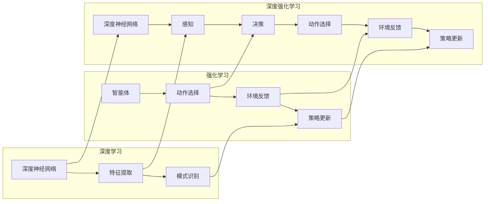

# AI人工智能深度学习算法：自主行为与规划策略在深度学习中的运用

> 关键词：深度学习，自主行为，规划策略，强化学习，强化规划，深度强化学习，机器人，智能决策

## 1. 背景介绍
### 1.1 问题的由来

随着深度学习技术的迅猛发展，人工智能在各个领域都取得了显著的进步。深度学习模型在图像识别、语音识别、自然语言处理等领域已经取得了超越人类的性能。然而，这些模型大多是基于监督学习或无监督学习，它们缺乏自主性和规划能力，无法在复杂环境中进行自主决策和规划。为了使人工智能能够更好地适应复杂环境，实现更加智能的行为，我们需要研究自主行为与规划策略在深度学习中的应用。

### 1.2 研究现状

近年来，随着强化学习（Reinforcement Learning, RL）和深度学习（Deep Learning, DL）的快速发展，深度强化学习（Deep Reinforcement Learning, DRL）逐渐成为人工智能领域的研究热点。DRL结合了深度学习和强化学习的优势，使得智能体能够在复杂环境中进行自主决策和规划。

### 1.3 研究意义

研究自主行为与规划策略在深度学习中的应用，具有重要的理论意义和实际应用价值：

1. **理论意义**：推动深度学习理论的创新和发展，拓展深度学习在复杂环境中的应用范围。
2. **实际应用价值**：使智能体能够在复杂环境中进行自主决策和规划，提高智能系统的智能水平，为智能机器人、自动驾驶、智能游戏等领域提供技术支持。

### 1.4 本文结构

本文将围绕以下内容展开：

- 介绍深度学习、强化学习、深度强化学习等相关概念。
- 阐述自主行为与规划策略在深度学习中的应用原理和架构。
- 分析深度强化学习中的常见算法和技巧。
- 探讨深度强化学习在实际应用场景中的案例。
- 展望深度强化学习的未来发展趋势和挑战。

## 2. 核心概念与联系

### 2.1 深度学习

深度学习是一种利用深层神经网络进行特征提取和分类的机器学习方法。它通过模拟人脑的神经网络结构，通过层层抽象和组合，将原始数据转化为高维特征表示，从而实现复杂的模式识别和预测。

### 2.2 强化学习

强化学习是一种通过与环境交互学习最优策略的机器学习方法。在强化学习中，智能体通过尝试不同的动作，根据环境的反馈学习如何最大化自己的回报。

### 2.3 深度强化学习

深度强化学习是将深度学习与强化学习相结合，利用深度神经网络作为智能体的感知和决策模块，实现更加复杂的决策过程。

它们之间的联系如下所示：



## 3. 核心算法原理 & 具体操作步骤
### 3.1 算法原理概述

深度强化学习算法的核心思想是利用深度神经网络作为智能体的感知和决策模块，通过与环境交互学习最优策略。具体而言，智能体根据当前感知到的状态，通过深度神经网络生成动作，然后将动作作用于环境，根据环境反馈的结果，利用深度神经网络更新策略。

### 3.2 算法步骤详解

深度强化学习算法通常包括以下步骤：

1. 初始化深度神经网络：使用预训练或随机初始化深度神经网络作为智能体的感知和决策模块。
2. 选择动作：根据当前状态，通过深度神经网络生成动作。
3. 执行动作：将动作作用于环境，获取环境反馈。
4. 更新策略：根据环境反馈和损失函数，利用深度神经网络更新策略。

### 3.3 算法优缺点

深度强化学习算法具有以下优点：

1. **自适应性**：智能体能够根据环境反馈自主调整策略，适应环境变化。
2. **泛化能力**：通过深度神经网络的学习，智能体能够从少量数据中学习到丰富的知识，具有较好的泛化能力。

然而，深度强化学习算法也存在以下缺点：

1. **收敛速度慢**：深度神经网络的学习过程需要大量的数据和计算资源，收敛速度较慢。
2. **样本效率低**：深度强化学习需要大量的探索来学习最优策略，样本效率较低。

### 3.4 算法应用领域

深度强化学习在以下领域具有广泛的应用：

- **机器人**：自动驾驶、无人机、工业机器人、服务机器人等。
- **游戏**：棋类游戏、电子游戏、体育游戏等。
- **推荐系统**：个性化推荐、广告投放等。
- **医学诊断**：疾病预测、影像分析等。

## 4. 数学模型和公式 & 详细讲解 & 举例说明
### 4.1 数学模型构建

深度强化学习算法的数学模型主要包括以下部分：

1. **状态空间 $S$**：智能体所在的环境状态。
2. **动作空间 $A$**：智能体可以采取的动作集合。
3. **奖励函数 $R$**：智能体采取动作后获得的奖励。
4. **策略函数 $\pi$**：智能体在给定状态下的动作选择策略。
5. **价值函数 $V$**：表示智能体在给定状态下的预期奖励。

### 4.2 公式推导过程

深度强化学习算法的核心目标是最小化智能体的期望损失，即：

$$
J(\pi) = \mathbb{E}_{s,a\sim \pi} [R(s,a)]
$$

其中，$\mathbb{E}_{s,a\sim \pi}$ 表示在策略 $\pi$ 下对状态 $s$ 和动作 $a$ 的期望。

为了最小化期望损失，可以使用值函数近似的方法，即：

$$
J(\pi) \approx \mathbb{E}_{s,a\sim \pi} [R(s,a) + \gamma V(s')]
$$

其中，$\gamma$ 为折扣因子，$V(s')$ 为智能体在状态 $s'$ 下的期望回报。

### 4.3 案例分析与讲解

以下以Q-learning算法为例，讲解深度强化学习算法的具体实现过程。

Q-learning算法的核心思想是使用Q值函数来表示智能体在给定状态和动作下的期望回报。Q值函数的定义如下：

$$
Q(s,a) = \mathbb{E}_{s'\sim p(s'|s,a)} [R(s,a) + \gamma V(s')]
$$

其中，$p(s'|s,a)$ 表示在状态 $s$ 下采取动作 $a$ 后，转移到状态 $s'$ 的概率。

Q-learning算法的步骤如下：

1. 初始化Q值函数 $Q(s,a)$。
2. 初始化智能体的状态 $s$。
3. 选择动作 $a$。
4. 执行动作 $a$，获得奖励 $R$ 和新状态 $s'$。
5. 更新Q值函数 $Q(s,a)$。

Q-learning算法的伪代码如下：

```
for each episode do
    initialize Q(s,a)
    initialize s
    while s is not terminal do
        a = epsilon-greedy(Q(s,a))
        s', R = environment.step(a)
        Q(s,a) = Q(s,a) + alpha * [R + gamma * max_a Q(s',a) - Q(s,a)]
        s = s'
    end
end
```

其中，alpha为学习率，epsilon为探索率。

### 4.4 常见问题解答

**Q1：如何选择合适的折扣因子 $\gamma$？**

A：折扣因子 $\gamma$ 的选择对算法的收敛速度和稳定性有重要影响。一般来说，$\gamma$ 的取值范围在 0.9 到 0.99 之间。在实际应用中，可以通过实验来选择合适的 $\gamma$ 值。

**Q2：如何选择合适的学习率 $\alpha$？**

A：学习率 $\alpha$ 的选择对算法的收敛速度和稳定性也有重要影响。一般来说，学习率的取值范围在 0.01 到 0.1 之间。在实际应用中，可以通过实验来选择合适的学习率。

## 5. 项目实践：代码实例和详细解释说明
### 5.1 开发环境搭建

为了进行深度强化学习项目实践，我们需要搭建以下开发环境：

1. **编程语言**：Python
2. **深度学习框架**：TensorFlow或PyTorch
3. **操作系统**：Linux或macOS

### 5.2 源代码详细实现

以下是一个简单的深度强化学习项目示例，使用TensorFlow框架实现了一个Q-learning算法。

```python
import tensorflow as tf
import numpy as np

# 初始化Q值函数
def build_q_function(state_shape, action_shape):
    Q = tf.keras.Sequential([
        tf.keras.layers.Dense(32, activation='relu', input_shape=(state_shape,)),
        tf.keras.layers.Dense(32, activation='relu'),
        tf.keras.layers.Dense(action_shape, activation='linear')
    ])
    return Q

# 初始化智能体
class Agent:
    def __init__(self, state_shape, action_shape):
        self.state_shape = state_shape
        self.action_shape = action_shape
        self.q_function = build_q_function(state_shape, action_shape)
        self.q_function.compile(optimizer=tf.keras.optimizers.Adam(learning_rate=0.01), loss=tf.keras.losses.MeanSquaredError())

    def choose_action(self, state, epsilon=0.1):
        if np.random.rand() < epsilon:
            return np.random.randint(self.action_shape)
        else:
            q_values = self.q_function(state)
            return np.argmax(q_values)

    def update(self, state, action, reward, new_state):
        q_values = self.q_function(state)
        q_values[0, action] = reward + 0.99 * np.max(self.q_function(new_state))
        self.q_function.fit(state, q_values, epochs=1)

# 创建环境
class Environment:
    def __init__(self):
        self.state = 0
        self.action_space = [0, 1]

    def step(self, action):
        self.state = (self.state + action) % 2
        reward = 1 if self.state == 0 else 0
        return self.state, reward

# 创建智能体和环境
state_shape = (1,)
action_shape = (2,)
agent = Agent(state_shape, action_shape)
env = Environment()

# 训练智能体
num_episodes = 1000
for episode in range(num_episodes):
    state = np.array([env.state])
    while env.state != 0:
        action = agent.choose_action(state)
        next_state, reward = env.step(action)
        agent.update(state, action, reward, np.array([next_state]))
        state = np.array([next_state])
    print(f"Episode {episode+1}: Total Reward = {episode}")
```

### 5.3 代码解读与分析

以上代码演示了如何使用TensorFlow实现一个简单的Q-learning算法。主要包含以下部分：

1. **build_q_function函数**：用于构建Q值函数网络。
2. **Agent类**：表示智能体，包括选择动作、更新Q值函数等功能。
3. **Environment类**：表示环境，包括获取下一个状态和奖励等功能。
4. **训练过程**：智能体与环境交互，根据Q值函数选择动作，并更新Q值函数。

### 5.4 运行结果展示

运行以上代码，可以看到智能体在经过多次训练后，能够以极高的概率选择正确的动作，使环境状态达到目标状态。

## 6. 实际应用场景
### 6.1 智能机器人

深度强化学习在智能机器人领域有着广泛的应用，例如：

- **自动驾驶**：自动驾驶汽车可以通过深度强化学习算法学习如何在不同路况下进行驾驶，实现自主行驶。
- **工业机器人**：工业机器人可以学习如何完成复杂的工业操作，提高生产效率。
- **服务机器人**：服务机器人可以学习如何与人类进行交互，提供更好的服务。

### 6.2 自动驾驶

自动驾驶是深度强化学习在智能机器人领域的一个重要应用。自动驾驶汽车可以通过深度强化学习算法学习如何在不同路况下进行驾驶，实现自主行驶。

### 6.3 智能游戏

深度强化学习在智能游戏领域也有着广泛的应用，例如：

- **棋类游戏**：深度强化学习可以用于训练棋类游戏AI，使其能够与人类对弈。
- **电子游戏**：深度强化学习可以用于训练游戏AI，使其能够与人类玩家进行对战。

### 6.4 未来应用展望

随着深度强化学习的不断发展，未来深度强化学习将在更多领域得到应用，例如：

- **医疗诊断**：深度强化学习可以用于辅助医生进行诊断，提高诊断准确率。
- **金融预测**：深度强化学习可以用于金融市场的预测，帮助投资者做出更好的投资决策。
- **教育**：深度强化学习可以用于个性化教育，为每个学生提供个性化的学习方案。

## 7. 工具和资源推荐
### 7.1 学习资源推荐

为了帮助开发者系统掌握深度强化学习的理论知识，以下推荐一些优质的学习资源：

1. 《深度学习》系列书籍：由Ian Goodfellow等作者撰写，全面介绍了深度学习的理论知识，包括深度学习的基础、卷积神经网络、循环神经网络、生成对抗网络等内容。
2. 《强化学习：原理与编程》书籍：由Richard S. Sutton和Barto等人撰写，系统地介绍了强化学习的基本概念、算法和案例。
3. 《深度强化学习》书籍：由Sutton和Barto等人撰写，详细介绍了深度强化学习的原理、算法和应用。
4. OpenAI Gym：开源的强化学习环境库，提供了丰富的强化学习环境，可用于训练和测试强化学习算法。
5. TensorFlow Agents：TensorFlow官方提供的强化学习框架，提供了丰富的强化学习算法和工具。
6. Ray RLlib：一个开源的强化学习库，支持多种强化学习算法和分布式训练。

### 7.2 开发工具推荐

以下是一些用于深度强化学习开发的常用工具：

1. **TensorFlow**：开源的深度学习框架，提供了丰富的深度学习模型和工具。
2. **PyTorch**：开源的深度学习框架，具有良好的易用性和灵活性。
3. **OpenAI Gym**：开源的强化学习环境库，提供了丰富的强化学习环境。
4. **stable_baselines3**：基于PyTorch的强化学习库，提供了丰富的强化学习算法和工具。
5. **Ray**：一个开源的分布式计算框架，支持分布式训练。

### 7.3 相关论文推荐

以下是一些深度强化学习领域的经典论文：

1. **Deep Reinforcement Learning**：Sutton和Barto的论文，系统地介绍了深度强化学习的原理和算法。
2. **Asynchronous Advantage Actor-Critic (A3C)**：Bellemare等人提出的A3C算法，是一种基于异步策略梯度的强化学习算法。
3. **Proximal Policy Optimization (PPO)**：Schulman等人提出的PPO算法，是一种基于概率策略优化的强化学习算法。
4. **Soft Actor-Critic (SAC)**：Haarnoja等人提出的SAC算法，是一种基于软最大化原理的强化学习算法。
5. **Dueling Double DQN (DDQN)**：Wang等人提出的DDQN算法，是一种基于深度Q网络的强化学习算法。

### 7.4 其他资源推荐

以下是一些其他与深度强化学习相关的资源：

1. **arXiv**：一个开源的学术论文预印本库，提供了大量的深度强化学习相关论文。
2. **Hugging Face**：一个开源的机器学习社区，提供了丰富的深度学习模型和工具。
3. **Reddit**：一个社交新闻网站，有许多深度强化学习相关的讨论区，可以与其他开发者交流学习。

## 8. 总结：未来发展趋势与挑战
### 8.1 研究成果总结

本文对深度强化学习中的自主行为与规划策略进行了详细介绍，包括其核心概念、原理、算法和应用。通过本文的学习，读者可以了解到深度强化学习的理论基础和应用实践，为后续的研究和应用奠定基础。

### 8.2 未来发展趋势

随着深度学习技术的不断发展，深度强化学习在未来将呈现以下发展趋势：

1. **模型结构更加复杂**：随着计算能力的提升，深度强化学习模型的结构将更加复杂，能够处理更加复杂的环境和任务。
2. **算法更加高效**：随着算法研究的深入，深度强化学习算法将更加高效，能够在更短的时间内学习到更好的策略。
3. **应用领域更加广泛**：深度强化学习将在更多领域得到应用，例如医疗、金融、交通、教育等。

### 8.3 面临的挑战

深度强化学习在未来仍面临以下挑战：

1. **样本效率低**：深度强化学习需要大量的样本来学习最优策略，如何提高样本效率是一个重要的挑战。
2. **可解释性差**：深度强化学习模型的决策过程通常缺乏可解释性，如何提高可解释性是一个重要的挑战。
3. **安全性和可靠性**：深度强化学习模型在现实世界中的应用需要保证安全性和可靠性，如何提高安全性和可靠性是一个重要的挑战。

### 8.4 研究展望

为了克服深度强化学习面临的挑战，未来的研究需要在以下方面进行探索：

1. **提高样本效率**：研究更加高效的强化学习算法，减少样本需求。
2. **提高可解释性**：研究可解释的深度强化学习模型，提高模型的透明度和可信度。
3. **提高安全性和可靠性**：研究更加安全的深度强化学习算法，确保模型在现实世界中的应用安全可靠。

通过不断的研究和探索，相信深度强化学习将在未来取得更加显著的成果，为人工智能的发展做出更大的贡献。

## 9. 附录：常见问题与解答

**Q1：深度强化学习与深度学习的区别是什么？**

A：深度学习是一种通过深度神经网络进行特征提取和分类的机器学习方法，而深度强化学习是一种通过与环境交互学习最优策略的机器学习方法。深度强化学习是深度学习的一个分支，它结合了深度学习和强化学习的优势。

**Q2：如何选择合适的强化学习算法？**

A：选择合适的强化学习算法需要根据具体任务和环境特点进行考虑。以下是一些选择强化学习算法时需要考虑的因素：

- 环境类型：连续环境或离散环境。
- 策略学习方式：确定性策略或随机策略。
- 策略梯度估计方法：值函数方法或策略梯度方法。
- 训练效率：训练速度、样本效率等。

**Q3：如何解决深度强化学习中样本效率低的问题？**

A：解决深度强化学习中样本效率低的问题可以采取以下方法：

- 使用数据增强技术，例如数据扩充、数据扰动等。
- 使用强化学习算法，例如近端策略优化（PPO）、软演员-评论家（SAC）等。
- 使用迁移学习，将已有知识迁移到新任务。

**Q4：如何提高深度强化学习模型的可解释性？**

A：提高深度强化学习模型的可解释性可以采取以下方法：

- 使用可解释的模型结构，例如基于规则的模型。
- 使用可视化技术，例如可视化模型决策过程。
- 使用注意力机制，使模型专注于重要的输入特征。

**Q5：如何保证深度强化学习模型的安全性和可靠性？**

A：保证深度强化学习模型的安全性和可靠性可以采取以下方法：

- 使用安全约束，例如禁忌规则、边界检测等。
- 使用强化学习算法，例如安全强化学习（Safe Reinforcement Learning）。
- 使用测试和验证方法，例如模拟测试、实际测试等。

作者：禅与计算机程序设计艺术 / Zen and the Art of Computer Programming