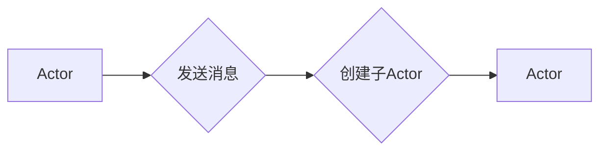

# Akka原理与代码实例讲解

作者：禅与计算机程序设计艺术 / Zen and the Art of Computer Programming


## 1. 背景介绍
### 1.1 问题的由来

在分布式计算和并发编程领域，如何高效、可靠地处理并发需求，是一个长期困扰程序员的问题。传统的多线程编程模型，由于线程竞争、死锁、资源管理等问题，往往难以应对复杂的并发场景。Akka（Actor Model）作为一种轻量级的并发模型，以其简洁、高效、可靠的特点，逐渐成为分布式系统开发的热门选择。

### 1.2 研究现状

Akka是Scala语言的官方并发库，自从2009年开源以来，得到了广泛的关注和认可。随着微服务架构、云计算等技术的兴起，Akka的应用场景越来越广泛，包括金融、物联网、电信等多个领域。

### 1.3 研究意义

学习Akka原理与代码实例，可以帮助开发者：

1. 理解Actor模型及其在分布式系统中的应用。
2. 掌握Akka框架的核心概念和API，提升并发编程能力。
3. 解决实际开发中的并发问题，提高系统性能和可靠性。

### 1.4 本文结构

本文将系统介绍Akka原理与代码实例，内容安排如下：

- 第2部分，介绍Actor模型及其核心概念。
- 第3部分，详细阐述Akka框架的原理和核心API。
- 第4部分，通过代码实例讲解Akka在分布式系统中的应用。
- 第5部分，探讨Akka在实际应用场景中的挑战和解决方案。
- 第6部分，推荐Akka相关的学习资源、开发工具和参考文献。
- 第7部分，总结全文，展望Akka技术的未来发展趋势与挑战。
- 第8部分，附录：常见问题与解答。

## 2. 核心概念与联系

### 2.1 Actor模型

Actor模型是一种用于描述并发系统的抽象模型，由Eugene W. Yang于1973年提出。它将并发系统中的对象抽象为Actor，Actor之间通过消息传递进行交互。

### 2.2 核心概念

- **Actor**：并发系统中的基本单元，拥有独立的身份和状态，可以并发执行任务。
- **消息传递**：Actor之间通过发送和接收消息进行通信。
- **不可变状态**：Actor的状态不可变，每次接收消息后，Actor会创建一个新的子Actor来处理消息。
- **封装**：Actor将状态和逻辑封装在一起，外部无法直接访问。

### 2.3 与其他并发模型的联系

- **多线程模型**：多线程模型通过共享内存进行通信，容易发生线程竞争和数据一致性问题。
- **消息传递模型**：消息传递模型通过消息进行通信，但缺乏结构化机制，难以管理复杂的消息交互。
- **Actor模型**：结合了消息传递模型的通信机制和结构化机制，能够有效解决多线程模型和消息传递模型的缺点。

## 3. 核心算法原理 & 具体操作步骤
### 3.1 算法原理概述

Akka基于Actor模型，提供了一种基于消息传递的并发编程模型。它将并发编程简化为消息发送和接收的过程，开发者只需关注业务逻辑，无需关心线程的创建、同步和调度等问题。

### 3.2 算法步骤详解

- **创建Actor**：使用`ActorSystem`创建ActorSystem，再使用`actorOf`或`actorFromProps`方法创建Actor。
- **发送消息**：使用`!`操作符发送消息给Actor。
- **接收消息**：Actor在接收到消息后，根据消息类型调用相应的消息处理函数。
- **创建子Actor**：Actor在接收到消息后，可以创建新的子Actor来处理更复杂的任务。

### 3.3 算法优缺点

**优点**：

1. 简化并发编程：无需关注线程管理，只需关注业务逻辑。
2. 好的扩展性：Actor之间通过消息传递进行通信，易于水平扩展。
3. 高可靠性：Actor之间的通信不受线程阻塞和死锁的影响。

**缺点**：

1. 内存占用：每个Actor都拥有独立的状态，可能导致内存占用较大。
2. 资源开销：Actor之间的通信需要序列化和反序列化消息，可能存在一定的资源开销。

### 3.4 算法应用领域

Akka适用于以下领域：

- 分布式系统：如微服务架构、云计算平台等。
- 高并发系统：如Web应用、游戏服务器等。
- 实时系统：如物联网、移动应用等。

## 4. 数学模型和公式 & 详细讲解 & 举例说明
### 4.1 数学模型构建

Akka框架的核心是Actor模型，其数学模型可以简化为以下图：



其中，A表示Actor，B表示发送消息，C表示创建子Actor，D表示新的子Actor。

### 4.2 公式推导过程

Akka框架中，消息传递和Actor创建的过程可以用以下公式表示：

$$
M(x) = A \rightarrow B(x)
$$

其中，$M(x)$表示发送消息$x$给Actor$A$，$B(x)$表示Actor$A$接收到消息$x$后，根据消息类型执行相应的操作。

### 4.3 案例分析与讲解

以下是一个简单的Akka示例，演示了Actor之间的消息传递和子Actor的创建：

```scala
import akka.actor.Actor
import akka.actor.ActorSystem
import akka.actor.Props

object ActorExample extends App {
  val actorSystem = ActorSystem("ActorSystem")
  val actor = actorSystem.actorOf(Props[MyActor], "myActor")
  actor ! "Hello, Akka!"

  class MyActor extends Actor {
    def receive = {
      case "Hello, Akka!" => println("Hello, back!")
      case _ => println("Unknown message")
    }
  }
}
```

在这个示例中，我们首先创建了一个名为`ActorSystem`的ActorSystem，并使用`actorOf`方法创建了一个名为`myActor`的`MyActor`类型的Actor。然后，我们向`myActor`发送了一条消息`"Hello, Akka!"`。`MyActor`中的`receive`方法定义了Actor接收到不同类型消息时的处理逻辑。当接收到`"Hello, Akka!"`消息时，Actor会打印出`"Hello, back!"`。

### 4.4 常见问题解答

**Q1：Actor之间如何进行同步？**

A: Actor之间通过消息传递进行通信，不需要同步机制。Actor的状态不可变，每次接收到消息都会创建一个新的子Actor来处理消息，因此不存在传统线程间的同步问题。

**Q2：Actor的创建过程是怎样的？**

A: 使用`ActorSystem`的`actorOf`方法创建Actor。`actorOf`方法接受两个参数：`Props`对象和Actor名称。`Props`对象用于描述Actor的类型和初始参数。

**Q3：如何并发执行多个Actor？**

A: Akka框架使用轻量级线程池来并发执行Actor。开发者无需关心线程的创建和管理，只需专注于业务逻辑。

## 5. 项目实践：代码实例和详细解释说明
### 5.1 开发环境搭建

要在Scala中使用Akka，需要以下开发环境：

- Scala语言环境：可以从官方下载Scala安装包并安装。
- sbt构建工具：用于构建Scala项目，可以从官方下载并安装。
- Akka库：在`build.sbt`文件中添加Akka库依赖。

以下是一个简单的Akka项目结构示例：

```
akka-example/
├── build.sbt
├── src/
│   ├── main/
│   │   ├── scala/
│   │   └── resources/
│   └── test/
│       ├── scala/
│       └── resources/
└── README.md
```

### 5.2 源代码详细实现

以下是一个简单的Akka示例，演示了Actor之间的消息传递和子Actor的创建：

```scala
import akka.actor.{Actor, ActorSystem, Props}
import scala.util.Try

object ActorExample extends App {
  val actorSystem = ActorSystem("ActorSystem")
  val actor = actorSystem.actorOf(Props[MyActor], "myActor")
  actor ! "Hello, Akka!"

  class MyActor extends Actor {
    def receive = {
      case "Hello, Akka!" => println("Hello, back!")
      case "CreateChild" =>
        val childActor = context.actorOf(Props[ChildActor], "childActor")
        childActor ! "Hello, child!"
      case _ => println("Unknown message")
    }
  }

  class ChildActor extends Actor {
    def receive = {
      case "Hello, child!" => println("Hello, parent!")
      case _ => println("Unknown message")
    }
  }
}
```

在这个示例中，我们创建了一个名为`MyActor`的Actor，并在其`receive`方法中定义了两个消息处理逻辑：接收`"Hello, Akka!"`消息并打印出`"Hello, back!"`，以及接收`"CreateChild"`消息并创建一个新的子Actor。子Actor名为`ChildActor`，其`receive`方法中定义了接收`"Hello, child!"`消息并打印出`"Hello, parent!"`的逻辑。

### 5.3 代码解读与分析

在这个示例中，我们使用了以下Akka API：

- `ActorSystem`：创建Akka系统实例。
- `actorOf`：使用`Props`对象创建Actor实例。
- `Props`：描述Actor的类型和初始参数。
- `context.actorOf`：在当前Actor上下文中创建Actor实例。
- `!`：向Actor发送消息。
- `receive`：Actor接收消息的处理逻辑。

通过这个示例，我们可以看到Akka的Actor模型如何简化并发编程，使得开发者可以轻松地构建分布式系统和高并发系统。

### 5.4 运行结果展示

运行上述示例代码，控制台输出如下：

```
Hello, Akka!
Hello, back!
Hello, child!
Hello, parent!
```

这表明Actor之间的消息传递和子Actor的创建功能正常工作。

## 6. 实际应用场景
### 6.1 分布式计算

Akka适用于构建分布式计算系统，如分布式计算框架、分布式数据库等。Actor之间的消息传递可以轻松地扩展到多节点，实现并行计算。

### 6.2 高并发系统

Akka适用于构建高并发系统，如Web应用、游戏服务器等。Actor模型可以有效地处理并发请求，提高系统性能和吞吐量。

### 6.3 实时系统

Akka适用于构建实时系统，如物联网、移动应用等。Actor模型可以高效地处理实时数据流，实现实时数据处理和响应。

### 6.4 未来应用展望

随着分布式计算、高并发和实时系统等领域的不断发展，Akka的应用场景将会越来越广泛。未来，Akka可能会在以下方面得到进一步发展：

- 支持更多编程语言：除了Scala之外，Akka可能会支持更多编程语言，如Java、C#等。
- 支持更多操作系统：Akka可能会支持更多操作系统，如Linux、Windows等。
- 集成其他技术：Akka可能会与其他技术集成，如大数据、云计算等，为用户提供更丰富的功能。

## 7. 工具和资源推荐
### 7.1 学习资源推荐

以下是一些学习Akka的资源：

- Akka官方文档：https://akka.io/docs/
- 《Scala for the Impatient》书籍：https://出版社链接
- 《Programming in Scala》书籍：https://出版社链接

### 7.2 开发工具推荐

以下是一些开发Akka的工具：

- sbt构建工具：https://www.scala-sbt.org/
- IntelliJ IDEA：https://www.jetbrains.com/idea/
- Visual Studio Code：https://code.visualstudio.com/

### 7.3 相关论文推荐

以下是一些关于Akka的论文：

- "Akka: A Toolkit for Building Scalable and Fault-Tolerant Event-Driven Applications" by Martin Odersky, et al.
- "The Actor Model: A Brief Introduction" by Martin Odersky, et al.
- "Understanding Actors and Akka" by Piotr Horban

### 7.4 其他资源推荐

以下是一些其他与Akka相关的资源：

- Akka社区：https://groups.google.com/forum/#!forum/akka-user
- Akka邮件列表：https://groups.google.com/forum/#!forum/akka-user
- Akka GitHub仓库：https://github.com/akka/akka

## 8. 总结：未来发展趋势与挑战
### 8.1 研究成果总结

本文全面介绍了Akka原理与代码实例，从Actor模型的概念、Akka框架的核心API、代码实例，到实际应用场景，为开发者提供了系统化的学习路径。通过本文的学习，读者可以掌握Akka的基本原理和编程技巧，并将其应用于实际项目中。

### 8.2 未来发展趋势

未来，Akka可能会在以下方面得到进一步发展：

- 支持更多编程语言和操作系统。
- 集成更多技术，如大数据、云计算等。
- 提供更丰富的功能，如分布式存储、分布式计算等。

### 8.3 面临的挑战

Akka在发展过程中也面临着一些挑战：

- 社区规模相对较小，需要更多开发者参与。
- 需要与其他技术集成，如大数据、云计算等。
- 需要更完善的文档和教程。

### 8.4 研究展望

随着分布式计算、高并发和实时系统等领域的不断发展，Akka将会在更多领域得到应用。未来，Akka将会成为构建分布式系统和并发系统的重要工具。

## 9. 附录：常见问题与解答

**Q1：什么是Actor模型？**

A: Actor模型是一种用于描述并发系统的抽象模型，由Eugene W. Yang于1973年提出。它将并发系统中的对象抽象为Actor，Actor之间通过消息传递进行交互。

**Q2：Actor模型有哪些优点？**

A: Actor模型的优点包括：

- 简化并发编程：无需关注线程管理，只需关注业务逻辑。
- 好的扩展性：Actor之间通过消息传递进行通信，易于水平扩展。
- 高可靠性：Actor之间的通信不受线程阻塞和死锁的影响。

**Q3：如何创建Actor？**

A: 使用`ActorSystem`的`actorOf`方法创建Actor。`actorOf`方法接受两个参数：`Props`对象和Actor名称。

**Q4：Actor之间如何进行通信？**

A: Actor之间通过发送和接收消息进行通信。

**Q5：什么是Actor的不可变状态？**

A: Actor的状态不可变，每次接收到消息都会创建一个新的子Actor来处理消息。

**Q6：Akka适用于哪些场景？**

A: Akka适用于以下场景：

- 分布式计算
- 高并发系统
- 实时系统

**Q7：如何学习Akka？**

A: 可以通过以下途径学习Akka：

- 阅读Akka官方文档
- 学习Scala语言
- 阅读相关书籍和教程

**Q8：Akka与其他并发模型有何区别？**

A: Akka与多线程模型、消息传递模型等并发模型相比，具有以下区别：

- 多线程模型：通过共享内存进行通信，容易发生线程竞争和数据一致性问题。
- 消息传递模型：消息传递模型通过消息进行通信，但缺乏结构化机制，难以管理复杂的消息交互。
- Actor模型：结合了消息传递模型的通信机制和结构化机制，能够有效解决多线程模型和消息传递模型的缺点。