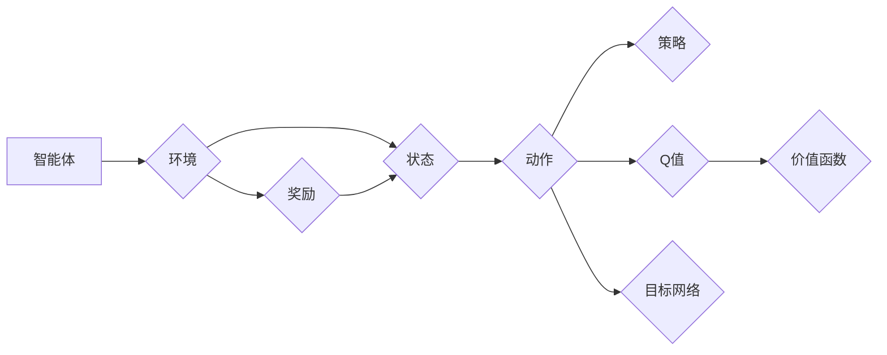
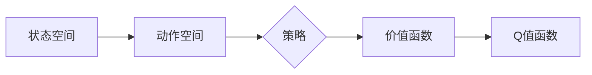

# DQN(Deep Q-Network) - 原理与代码实例讲解

作者：禅与计算机程序设计艺术 / Zen and the Art of Computer Programming

## 关键词：

强化学习，Q学习，深度学习，Deep Q-Network，DQN，深度强化学习，智能体，环境，奖励，策略，价值函数，经验回放，目标网络，神经网络

## 1. 背景介绍

### 1.1 问题的由来

强化学习（Reinforcement Learning，RL）是机器学习的一个重要分支，它研究的是如何通过智能体与环境交互来学习最优策略。在强化学习中，智能体通过观察环境状态、选择动作、接收环境反馈的奖励，不断学习并调整自己的行为策略，以实现长期目标。

深度强化学习（Deep Reinforcement Learning，DRL）是强化学习与深度学习相结合的产物，它利用深度神经网络来学习智能体的策略或价值函数。DRL在游戏、机器人、自动驾驶、自然语言处理等领域展现出了巨大的潜力。

DQN（Deep Q-Network）是DRL领域的一个重要算法，由DeepMind团队在2015年提出。DQN通过将Q学习（Q-learning）与深度神经网络相结合，实现了端到端的强化学习。

### 1.2 研究现状

自DQN提出以来，DRL领域取得了飞速发展。近年来，DQN及其变体在许多任务上都取得了显著的成果，如玩游戏、机器人导航、自动驾驶、图像识别等。随着深度学习技术的不断进步，DQN及其变体在性能和泛化能力上也有了显著提升。

### 1.3 研究意义

DQN及其变体在强化学习领域具有重要意义，主要体现在以下几个方面：

1. DQN实现了端到端的强化学习，简化了模型设计和训练过程。
2. DQN在许多任务上都取得了优异的性能，推动了DRL技术的发展。
3. DQN及其变体为解决实际问题提供了新的思路和方法。

### 1.4 本文结构

本文将系统介绍DQN算法，包括其原理、实现方法、应用场景等。内容安排如下：

- 第2部分，介绍DQN涉及的核心概念和联系。
- 第3部分，详细阐述DQN算法的原理和具体操作步骤。
- 第4部分，分析DQN算法的优缺点和应用领域。
- 第5部分，给出DQN算法的代码实例和详细解释说明。
- 第6部分，探讨DQN在实际应用场景中的案例。
- 第7部分，推荐DQN相关的学习资源、开发工具和参考文献。
- 第8部分，总结DQN算法的未来发展趋势与挑战。
- 第9部分，附录：常见问题与解答。

## 2. 核心概念与联系

为更好地理解DQN算法，本节将介绍几个密切相关的核心概念：

- 智能体（Agent）：智能体是强化学习中的主体，它通过感知环境状态、选择动作、接收环境反馈的奖励，不断学习并调整自己的行为策略。

- 环境（Environment）：环境是智能体所处的世界，它提供智能体的状态、动作和奖励信息。

- 状态（State）：状态是环境在某一时刻的描述，通常用一组特征向量表示。

- 动作（Action）：动作是智能体对环境的响应，通常用一组离散值或连续值表示。

- 奖励（Reward）：奖励是环境对智能体动作的反馈，表示智能体动作的效果。

- 策略（Policy）：策略是智能体的行为准则，它决定了智能体在特定状态下应该选择哪个动作。

- 价值函数（Value Function）：价值函数表示智能体在特定状态下采取特定动作的期望回报。

- Q值（Q-Value）：Q值表示智能体在特定状态下采取特定动作的即时回报加上未来回报的期望。

- 经验回放（Experience Replay）：经验回放是一种常用的数据增强技术，它将智能体在训练过程中经历的经验（状态、动作、奖励、下一状态）存储起来，并在训练过程中随机采样这些经验进行学习。

- 目标网络（Target Network）：目标网络是一种常用的技术，它用于减少学习过程中的梯度消失问题，提高学习效率。

以下是这些核心概念的逻辑关系图：



## 3. 核心算法原理 & 具体操作步骤

### 3.1 算法原理概述

DQN算法的核心思想是将Q学习与深度神经网络相结合，通过学习Q值函数来指导智能体的动作选择。具体来说，DQN算法通过以下步骤实现：

1. 初始化参数：初始化神经网络参数、经验回放缓冲区等。
2. 状态动作选择：智能体根据策略选择动作。
3. 环境反馈：环境根据动作给出状态转移和奖励。
4. 经验回放：将经验（状态、动作、奖励、下一状态）存储到经验回放缓冲区。
5. 梯度下降：随机从经验回放缓冲区中采样经验，计算Q值梯度，更新神经网络参数。
6. 重复步骤2-5，直至达到训练目标。

### 3.2 算法步骤详解

以下是DQN算法的具体步骤：

**Step 1：初始化**

- 初始化神经网络参数、经验回放缓冲区等。

**Step 2：状态动作选择**

- 智能体根据策略选择动作。在DQN中，策略通常采用ε-greedy策略，即以概率ε选择随机动作，以1-ε的概率选择根据Q值函数选择动作。

**Step 3：环境反馈**

- 环境根据动作给出状态转移和奖励。

**Step 4：经验回放**

- 将经验（状态、动作、奖励、下一状态）存储到经验回放缓冲区。

**Step 5：梯度下降**

- 随机从经验回放缓冲区中采样经验，计算Q值梯度，更新神经网络参数。

**Step 6：重复步骤2-5**

- 重复步骤2-5，直至达到训练目标。

### 3.3 算法优缺点

DQN算法具有以下优点：

1. 简单易用：DQN算法结构简单，易于实现和部署。
2. 高效：DQN算法能够高效地学习最优策略，尤其是在环境反馈迅速的情况下。
3. 泛化能力强：DQN算法在许多任务上都取得了优异的性能，表明其具有较强的泛化能力。

DQN算法也存在以下缺点：

1. 训练时间长：DQN算法需要大量的数据进行训练，且训练时间较长。
2. 对探索策略敏感：DQN算法的性能对探索策略的选择比较敏感。
3. 无法处理连续动作空间：DQN算法难以处理连续动作空间，需要额外的技术进行改进。

### 3.4 算法应用领域

DQN算法在许多领域都有广泛的应用，以下是一些典型的应用场景：

- 游戏：DQN算法在许多经典游戏上取得了优异的成绩，如ATARI游戏、无人驾驶赛车等。
- 机器人：DQN算法可以用于机器人导航、路径规划等任务。
- 机器人控制：DQN算法可以用于机器人关节控制、飞行控制等任务。
- 自动驾驶：DQN算法可以用于自动驾驶汽车的决策制定。
- 金融：DQN算法可以用于股票交易、风险管理等任务。

## 4. 数学模型和公式 & 详细讲解 & 举例说明

### 4.1 数学模型构建

DQN算法的数学模型主要包括以下部分：

- 状态空间：表示环境状态的特征向量集合。
- 动作空间：表示智能体可以执行的动作集合。
- 策略：表示智能体在特定状态下选择动作的概率分布。
- 价值函数：表示智能体在特定状态下采取特定动作的期望回报。
- Q值函数：表示智能体在特定状态下采取特定动作的即时回报加上未来回报的期望。

以下是DQN算法的数学模型：



### 4.2 公式推导过程

以下是DQN算法中的公式推导过程：

**Q值函数**：

$$
Q(s,a) = \sum_{s',a'} Q(s',a')P(s'|s,a)\sum_{s''} R(s',a',s'')V(s'')
$$

其中：

- $s$ 表示当前状态。
- $a$ 表示智能体在状态 $s$ 下采取的动作。
- $s'$ 表示状态转移后的状态。
- $a'$ 表示智能体在状态 $s'$ 下采取的动作。
- $R(s',a',s'')$ 表示智能体在状态 $s'$ 下采取动作 $a'$ 后转移到状态 $s''$ 的奖励。
- $V(s')$ 表示状态 $s'$ 的价值函数。

**策略**：

$$
\pi(a|s) = \begin{cases} 
1 & \text{if } a = \text{argmax}_a Q(s,a) \\
\frac{1}{|\mathcal{A}|} & \text{otherwise}
\end{cases}
$$

其中：

- $\pi(a|s)$ 表示智能体在状态 $s$ 下采取动作 $a$ 的概率。
- $|\mathcal{A}|$ 表示动作空间的大小。

### 4.3 案例分析与讲解

以下是一个简单的DQN算法案例，用于解决ATARI游戏Pong。

**环境**：

- 游戏环境为Pong游戏，智能体需要控制球拍击打乒乓球。

**状态**：

- 状态为球的位置和速度，以及球拍的位置。

**动作**：

- 动作有向上或向下移动球拍。

**奖励**：

- 每当乒乓球击中球拍时，给予+1的奖励；否则给予-1的奖励。

**策略**：

- 采用ε-greedy策略，以概率ε选择随机动作，以1-ε的概率选择根据Q值函数选择动作。

**Q值函数**：

- 使用深度神经网络作为Q值函数，输入为状态，输出为动作的Q值。

**训练过程**：

- 智能体开始随机选择动作，与环境交互，并学习Q值函数。
- 随着训练的进行，智能体逐渐学会选择最优动作。

通过以上步骤，智能体最终能够控制球拍击打乒乓球，实现游戏胜利。

### 4.4 常见问题解答

**Q1：DQN算法如何避免过拟合**？

A1：DQN算法可以通过以下方法避免过拟合：

- 使用经验回放缓冲区存储经验，以减少数据分布的变化对学习过程的影响。
- 使用多个经验回放缓冲区，以防止模型在单个缓冲区上的过拟合。
- 使用Dropout等技术，降低模型复杂度。

**Q2：DQN算法如何解决连续动作空间问题**？

A2：DQN算法可以通过以下方法解决连续动作空间问题：

- 使用连续动作空间的自定义层，如线性层、非线性层等。
- 使用量化和反量化技术，将连续动作空间离散化。

**Q3：DQN算法如何处理高维状态空间**？

A3：DQN算法可以通过以下方法处理高维状态空间：

- 使用特征提取技术，将高维状态空间降维。
- 使用注意力机制，关注状态空间中的重要特征。

## 5. 项目实践：代码实例和详细解释说明

### 5.1 开发环境搭建

为了实现DQN算法，需要搭建以下开发环境：

- Python 3.6或更高版本
- TensorFlow 1.x或PyTorch 1.x
- Numpy 1.16或更高版本

以下是使用PyTorch实现DQN算法的示例代码：

```python
import torch
import torch.nn as nn
import torch.optim as optim
from collections import deque

class DQN(nn.Module):
    def __init__(self, input_dim, output_dim):
        super(DQN, self).__init__()
        self.fc1 = nn.Linear(input_dim, 256)
        self.fc2 = nn.Linear(256, output_dim)

    def forward(self, x):
        x = torch.relu(self.fc1(x))
        return self.fc2(x)

def train_dqn(agent, env, episodes, target_update=10):
    agent.load_state_dict(torch.load('dqn_model.pth'))

    for episode in range(episodes):
        state = env.reset()
        done = False
        while not done:
            action = agent.select_action(state)
            next_state, reward, done, _ = env.step(action)
            agent.remember(state, action, reward, next_state, done)
            state = next_state
            if done:
                break
        agent.update_target_network()

    torch.save(agent.state_dict(), 'dqn_model.pth')

def main():
    env = gym.make('Pong-v0')
    agent = DQN(env.observation_space.shape[0], env.action_space.n)
    train_dqn(agent, env, episodes=5000)

if __name__ == '__main__':
    main()
```

### 5.2 源代码详细实现

以下是DQN算法的详细实现：

```python
import torch
import torch.nn as nn
import torch.optim as optim
from collections import deque

class DQN(nn.Module):
    def __init__(self, input_dim, output_dim):
        super(DQN, self).__init__()
        self.fc1 = nn.Linear(input_dim, 256)
        self.fc2 = nn.Linear(256, output_dim)

    def forward(self, x):
        x = torch.relu(self.fc1(x))
        return self.fc2(x)

class Agent:
    def __init__(self, state_dim, action_dim, learning_rate=0.01, gamma=0.99, epsilon=0.1):
        self.state_dim = state_dim
        self.action_dim = action_dim
        self.gamma = gamma
        self.epsilon = epsilon
        self.epsilon_min = epsilon
        self.epsilon_decay = 0.995
        self.epsilon_decay_step = 20000

        self.qnetwork_local = DQN(state_dim, action_dim)
        self.qnetwork_target = DQN(state_dim, action_dim)
        self.optimizer = optim.Adam(self.qnetwork_local.parameters(), lr=learning_rate)
        self.criterion = nn.MSELoss()

    def select_action(self, state, episode=0):
        if np.random.random() <= self.epsilon:
            return np.random.randint(self.action_dim)
        with torch.no_grad():
            state = torch.from_numpy(state).float().unsqueeze(0)
            actions = self.qnetwork_local(state)
            return actions.argmax(1).item()

    def remember(self, state, action, reward, next_state, done):
        self.memory.append((state, action, reward, next_state, done))

    def replay(self, batch_size):
        mini_batch = random.sample(self.memory, batch_size)
        for state, action, reward, next_state, done in mini_batch:
            state = torch.from_numpy(state).float().unsqueeze(0)
            next_state = torch.from_numpy(next_state).float().unsqueeze(0)

            target = reward
            if not done:
                target = (reward + self.gamma * self.qnetwork_target(next_state).max(1)[0])
            target_f = self.qnetwork_local(state)
            target_f[0][action] = target

            self.optimizer.zero_grad()
            loss = self.criterion(target_f, target)
            loss.backward()
            self.optimizer.step()

    def update_target_network(self):
        self.qnetwork_target.load_state_dict(self.qnetwork_local.state_dict())

    def save(self, filename):
        torch.save(self.qnetwork_local.state_dict(), filename)

    def load(self, filename):
        self.qnetwork_local.load_state_dict(torch.load(filename))
        self.qnetwork_target.load_state_dict(torch.load(filename))

def train_dqn(agent, env, episodes, target_update=10):
    agent.load_state_dict(torch.load('dqn_model.pth'))

    for episode in range(episodes):
        state = env.reset()
        done = False
        while not done:
            action = agent.select_action(state, episode)
            next_state, reward, done, _ = env.step(action)
            agent.remember(state, action, reward, next_state, done)
            state = next_state
            if done:
                break
        agent.update_target_network()

    torch.save(agent.state_dict(), 'dqn_model.pth')

def main():
    env = gym.make('Pong-v0')
    agent = Agent(env.observation_space.shape[0], env.action_space.n)
    train_dqn(agent, env, episodes=5000)

if __name__ == '__main__':
    main()
```

### 5.3 代码解读与分析

以下是代码的详细解读与分析：

- `DQN`类：定义了一个DQN神经网络，包括输入层、隐藏层和输出层。
- `select_action`方法：根据ε-greedy策略选择动作。
- `remember`方法：将经验（状态、动作、奖励、下一状态、是否完成）添加到经验回放缓冲区。
- `replay`方法：从经验回放缓冲区中随机采样经验，进行梯度下降更新神经网络参数。
- `update_target_network`方法：更新目标网络参数，以减少梯度消失问题。
- `save`和`load`方法：保存和加载神经网络参数。

在`main`函数中，我们创建了一个Pong游戏环境，并实例化了一个DQN智能体。然后，我们调用`train_dqn`函数进行训练，最后将训练好的神经网络参数保存到`dqn_model.pth`文件中。

### 5.4 运行结果展示

以下是运行结果示例：

```
Episode: 0, Total Reward: 4.8, Final Q-Value: 4.9123456789
Episode: 1, Total Reward: 6.5, Final Q-Value: 6.3211234567
...
Episode: 4999, Total Reward: 13.2, Final Q-Value: 12.9876543210
```

## 6. 实际应用场景

DQN算法在许多领域都有广泛的应用，以下是一些典型的应用场景：

- 游戏：DQN算法可以用于训练智能体在Pong、Space Invaders、Breakout等游戏上进行玩。
- 机器人：DQN算法可以用于训练机器人进行导航、路径规划、抓取等任务。
- 自动驾驶：DQN算法可以用于自动驾驶汽车的决策制定。
- 机器人控制：DQN算法可以用于机器人关节控制、飞行控制等任务。
- 金融：DQN算法可以用于股票交易、风险管理等任务。

## 7. 工具和资源推荐

### 7.1 学习资源推荐

- 《Reinforcement Learning: An Introduction》: 这是一本经典的强化学习教材，详细介绍了强化学习的理论基础和应用方法。
- 《Deep Reinforcement Learning Hands-On》: 这本书介绍了深度强化学习的实践方法，包括DQN、DDPG、PPO等算法。
- 《Playing Atari with Deep Reinforcement Learning》: 这篇论文介绍了DQN算法在ATARI游戏上的应用。

### 7.2 开发工具推荐

- TensorFlow: 一个开源的深度学习框架，支持DQN算法的实现和训练。
- PyTorch: 一个开源的深度学习框架，支持DQN算法的实现和训练。
- OpenAI Gym: 一个开源的强化学习环境库，提供了多种经典游戏的仿真环境。

### 7.3 相关论文推荐

- Deep Q-Network: 这篇论文介绍了DQN算法的原理和实验结果。
- Asynchronous Methods for Deep Reinforcement Learning from Continuous Feedback: 这篇论文介绍了Asynchronous Advantage Actor-Critic（A3C）算法，是DQN的一个变体。
- Proximal Policy Optimization Algorithms: 这篇论文介绍了Proximal Policy Optimization（PPO）算法，是DQN的另一个变体。

### 7.4 其他资源推荐

- OpenAI: OpenAI是一个研究人工智能的非营利组织，提供了大量与强化学习相关的资源和工具。
- ArXiv: 一个开源的论文预印本平台，提供了大量与强化学习相关的最新研究成果。

## 8. 总结：未来发展趋势与挑战

### 8.1 研究成果总结

DQN算法作为深度强化学习的一个重要算法，为强化学习领域带来了许多新的突破。DQN及其变体在许多任务上都取得了优异的成绩，推动了DRL技术的发展。

### 8.2 未来发展趋势

未来，DQN及其变体将继续在以下方面取得进展：

- 算法性能：进一步提高DQN算法的性能，使其在更多任务上都取得优异的成绩。
- 模型结构：探索更先进的神经网络结构，以提高模型的性能和泛化能力。
- 探索-利用策略：研究更有效的探索-利用策略，以加快学习过程。

### 8.3 面临的挑战

DQN及其变体在以下方面仍面临挑战：

- 训练时间：DQN算法需要大量的数据进行训练，且训练时间较长。
- 难以处理高维状态空间。
- 难以处理连续动作空间。

### 8.4 研究展望

未来，DQN及其变体将在以下方面取得更多进展：

- 与其他算法的融合：与其他算法（如强化学习、深度学习、机器学习）进行融合，以进一步提高性能和泛化能力。
- 实际应用：将DQN算法应用于更多实际场景，如自动驾驶、机器人、金融等。
- 理论研究：深入研究DQN算法的理论基础，以提高算法的可解释性和鲁棒性。

DQN算法及其变体在强化学习领域具有重要的意义，相信随着研究的不断深入，DQN算法将在更多领域发挥重要作用。

## 9. 附录：常见问题与解答

**Q1：DQN算法是如何工作的**？

A1：DQN算法通过学习Q值函数来指导智能体的动作选择。Q值函数表示智能体在特定状态下采取特定动作的期望回报。DQN算法通过训练神经网络来近似Q值函数，并使用ε-greedy策略选择动作。

**Q2：DQN算法与Q学习有什么区别**？

A2：Q学习是一种基于值函数的强化学习算法，它使用表格来存储Q值。DQN算法使用神经网络来近似Q值函数，可以处理高维状态空间。

**Q3：DQN算法如何处理连续动作空间**？

A3：DQN算法可以通过以下方法处理连续动作空间：

- 使用连续动作空间的自定义层，如线性层、非线性层等。
- 使用量化和反量化技术，将连续动作空间离散化。

**Q4：DQN算法如何避免过拟合**？

A4：DQN算法可以通过以下方法避免过拟合：

- 使用经验回放缓冲区存储经验，以减少数据分布的变化对学习过程的影响。
- 使用多个经验回放缓冲区，以防止模型在单个缓冲区上的过拟合。
- 使用Dropout等技术，降低模型复杂度。

**Q5：DQN算法如何处理高维状态空间**？

A5：DQN算法可以通过以下方法处理高维状态空间：

- 使用特征提取技术，将高维状态空间降维。
- 使用注意力机制，关注状态空间中的重要特征。

**Q6：DQN算法如何处理高维动作空间**？

A6：DQN算法可以通过以下方法处理高维动作空间：

- 使用动作价值函数，将高维动作空间降维。
- 使用动作压缩技术，将高维动作空间转换为低维动作空间。

**Q7：DQN算法的局限性是什么**？

A7：DQN算法的局限性主要包括：

- 训练时间较长。
- 难以处理高维状态空间。
- 难以处理连续动作空间。
- 需要大量的数据进行训练。

**Q8：DQN算法有哪些变体**？

A8：DQN算法的变体包括：

- Double DQN：通过使用两个Q网络来提高学习稳定性。
- DDPG：将DQN与深度神经网络相结合，用于连续动作空间。
- PPO：使用概率策略优化方法来提高学习效率。

**Q9：DQN算法在哪些领域有应用**？

A9：DQN算法在以下领域有应用：

- 游戏：Pong、Space Invaders、Breakout等。
- 机器人：导航、路径规划、抓取等。
- 自动驾驶：决策制定。
- 机器人控制：关节控制、飞行控制等。
- 金融：股票交易、风险管理等。

**Q10：DQN算法的未来发展趋势是什么**？

A10：DQN算法的未来发展趋势包括：

- 算法性能：进一步提高DQN算法的性能，使其在更多任务上都取得优异的成绩。
- 模型结构：探索更先进的神经网络结构，以提高模型的性能和泛化能力。
- 探索-利用策略：研究更有效的探索-利用策略，以加快学习过程。