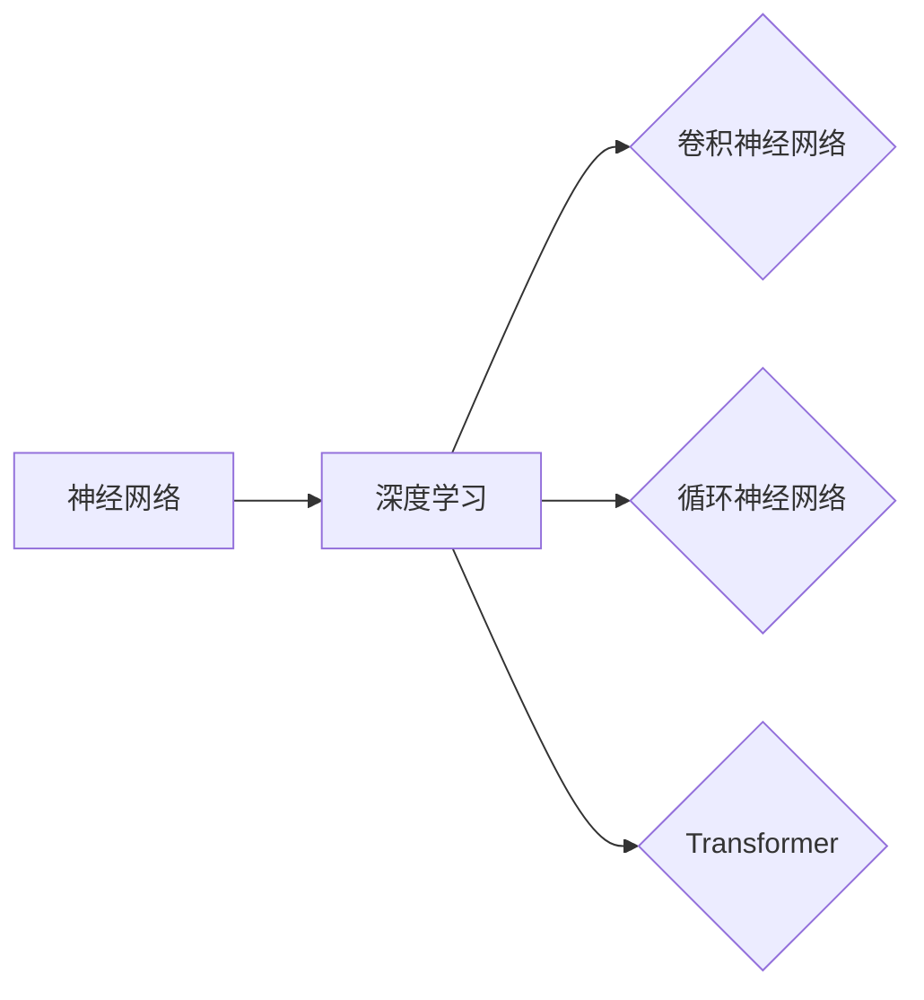

# Deep Learning (DL) 原理与代码实战案例讲解

作者：禅与计算机程序设计艺术 / Zen and the Art of Computer Programming

## 1. 背景介绍

### 1.1 问题的由来

深度学习（Deep Learning, DL）作为人工智能领域的一项核心技术，自2010年代以来取得了飞速发展。它通过模拟人脑神经网络的结构和功能，实现了对复杂数据的自动特征提取和分类。随着大数据时代的到来，深度学习在图像识别、语音识别、自然语言处理等领域取得了显著的成果，推动了人工智能技术的飞速发展。

### 1.2 研究现状

深度学习的研究已经取得了丰硕的成果，涌现出许多经典的模型和算法。常见的深度学习模型包括卷积神经网络（Convolutional Neural Network, CNN）、循环神经网络（Recurrent Neural Network, RNN）和Transformer等。这些模型在不同领域取得了优异的性能，推动了人工智能技术的应用。

### 1.3 研究意义

深度学习在各个领域的应用前景广阔，具有以下重要意义：

- **提高效率**：深度学习模型可以自动学习数据中的特征，从而减少人工标注数据的成本。
- **拓展应用**：深度学习模型可以应用于更多领域，如医疗、金融、交通等，推动人工智能技术的应用落地。
- **推动创新**：深度学习的研究推动了人工智能技术的不断创新，为解决复杂问题提供了新的思路。

### 1.4 本文结构

本文将系统地介绍深度学习的基本原理、常用算法、代码实战案例和未来发展趋势。内容安排如下：

- 第2部分，介绍深度学习的基本概念和联系。
- 第3部分，详细阐述深度学习的核心算法原理和具体操作步骤。
- 第4部分，讲解深度学习中的数学模型和公式，并通过实例进行说明。
- 第5部分，给出深度学习的代码实例，并对关键代码进行解读和分析。
- 第6部分，探讨深度学习在实际应用场景中的应用案例。
- 第7部分，推荐深度学习相关的学习资源、开发工具和参考文献。
- 第8部分，总结全文，展望深度学习的未来发展趋势与挑战。

## 2. 核心概念与联系

为更好地理解深度学习，本节将介绍几个密切相关的核心概念：

- **神经网络（Neural Network）**：神经网络是深度学习的基础，它由若干个神经元组成，每个神经元通过权重连接，模拟人脑神经元之间的交互。
- **深度学习（Deep Learning）**：深度学习是一种通过多层神经网络学习数据特征的方法，可以自动从原始数据中提取高级特征。
- **卷积神经网络（Convolutional Neural Network, CNN）**：卷积神经网络是一种适用于图像处理的深度学习模型，可以自动学习图像的特征。
- **循环神经网络（Recurrent Neural Network, RNN）**：循环神经网络是一种适用于序列数据的深度学习模型，可以自动学习序列中的时序关系。
- **Transformer**：Transformer是一种基于自注意力机制的深度学习模型，在自然语言处理领域取得了显著的成果。

它们之间的逻辑关系如下图所示：



可以看出，神经网络是深度学习的基础，深度学习通过多层神经网络学习数据特征，卷积神经网络、循环神经网络和Transformer等都是基于深度学习原理的模型。

## 3. 核心算法原理 & 具体操作步骤

### 3.1 算法原理概述

深度学习的核心算法包括：

- **前向传播（Forward Propagation）**：将输入数据传递到网络中，计算每个神经元的输出。
- **反向传播（Back Propagation）**：根据损失函数计算梯度，反向传播到网络中，更新网络参数。
- **激活函数（Activation Function）**：对网络输出进行非线性变换，提高模型的非线性表达能力。
- **损失函数（Loss Function）**：衡量模型预测结果与真实值之间的差异。

### 3.2 算法步骤详解

深度学习模型的训练过程主要包括以下步骤：

1. **数据预处理**：将原始数据转换为模型所需的格式，如归一化、标准化等。
2. **模型构建**：选择合适的模型结构，如CNN、RNN或Transformer等。
3. **模型训练**：将预处理后的数据输入到模型中，通过前向传播计算预测结果，并计算损失函数。
4. **反向传播**：根据损失函数计算梯度，反向传播到网络中，更新网络参数。
5. **模型评估**：在测试集上评估模型性能，并根据评估结果调整模型结构或超参数。

### 3.3 算法优缺点

深度学习模型的优点：

- **强大的特征提取能力**：深度学习模型可以自动学习数据中的特征，无需人工设计特征。
- **泛化能力强**：深度学习模型可以泛化到新的数据集，提高模型的应用范围。

深度学习模型的缺点：

- **计算复杂度高**：深度学习模型需要大量的计算资源进行训练。
- **训练数据需求量大**：深度学习模型需要大量的标注数据进行训练。

### 3.4 算法应用领域

深度学习模型在以下领域取得了显著的应用成果：

- **图像识别**：如人脸识别、物体识别、场景识别等。
- **语音识别**：如语音转文字、语音翻译等。
- **自然语言处理**：如机器翻译、文本分类、情感分析等。
- **推荐系统**：如商品推荐、电影推荐等。

## 4. 数学模型和公式 & 详细讲解 & 举例说明

### 4.1 数学模型构建

深度学习模型通常由以下数学模型组成：

- **输入层（Input Layer）**：接收原始数据输入。
- **隐藏层（Hidden Layer）**：包含多个神经元，用于提取数据特征。
- **输出层（Output Layer）**：输出模型预测结果。

### 4.2 公式推导过程

以下以多层感知机（Multi-Layer Perceptron, MLP）为例，讲解深度学习模型的数学推导过程。

多层感知机是一种简单的神经网络模型，包含输入层、隐藏层和输出层。每个神经元都使用非线性激活函数。

假设输入层有 $n$ 个神经元，每个神经元输入 $x_i$，则隐藏层的输出为：

$$
h = \sigma(W_1 \cdot x + b_1)
$$

其中 $W_1$ 是输入层到隐藏层的权重矩阵，$b_1$ 是输入层到隐藏层的偏置向量，$\sigma$ 是激活函数。

输出层的输出为：

$$
y = \sigma(W_2 \cdot h + b_2)
$$

其中 $W_2$ 是隐藏层到输出层的权重矩阵，$b_2$ 是隐藏层到输出层的偏置向量。

### 4.3 案例分析与讲解

以下以图像分类任务为例，讲解深度学习模型的实际应用。

假设我们有一个包含1000张图像的数据集，每张图像的大小为32x32像素，使用RGB彩色通道，需要将图像分类为10个类别。

我们可以使用CNN模型进行图像分类。模型结构如下：

- 输入层：32x32x3
- 第一层卷积层：32个3x3卷积核，步长为1，激活函数为ReLU
- 第二层卷积层：64个3x3卷积核，步长为1，激活函数为ReLU
- 第三层池化层：2x2池化，步长为2
- 第四层全连接层：64个神经元，激活函数为ReLU
- 第五层全连接层：10个神经元，激活函数为softmax

### 4.4 常见问题解答

**Q1：深度学习模型的训练数据需求量很大，如何解决？**

A：可以采用以下方法减少训练数据需求量：

- 数据增强：通过旋转、缩放、裁剪等方式增加数据量。
- 无监督预训练：使用无监督学习技术对数据进行预训练，提取特征表示。

**Q2：如何选择合适的深度学习模型？**

A：选择合适的深度学习模型需要考虑以下因素：

- 数据类型：根据数据类型选择合适的模型，如图像数据选择CNN，序列数据选择RNN或Transformer。
- 任务类型：根据任务类型选择合适的模型，如分类任务选择分类器，回归任务选择回归器。
- 计算资源：根据计算资源选择合适的模型，如大型模型需要更多的计算资源。

## 5. 项目实践：代码实例和详细解释说明

### 5.1 开发环境搭建

在进行深度学习项目实践前，我们需要准备好开发环境。以下是使用Python进行深度学习开发的环境配置流程：

1. 安装Anaconda：从官网下载并安装Anaconda，用于创建独立的Python环境。
2. 创建并激活虚拟环境：
```bash
conda create -n dl-env python=3.8
conda activate dl-env
```
3. 安装TensorFlow或PyTorch：
```bash
pip install tensorflow==2.2.0  # or pip install torch==1.8.0 torchvision==0.9.0
```
4. 安装其他必要的库：
```bash
pip install numpy pandas scikit-learn matplotlib ipython jupyter notebook
```

完成上述步骤后，即可在`dl-env`环境中开始深度学习项目实践。

### 5.2 源代码详细实现

以下以TensorFlow为例，给出一个简单的图像分类模型的代码实现。

```python
import tensorflow as tf
from tensorflow.keras import datasets, layers, models

# 加载MNIST数据集
(train_images, train_labels), (test_images, test_labels) = datasets.mnist.load_data()

# 数据预处理
train_images = train_images.reshape((60000, 28, 28, 1)).astype('float32') / 255
test_images = test_images.reshape((10000, 28, 28, 1)).astype('float32') / 255

# 构建模型
model = models.Sequential()
model.add(layers.Conv2D(32, (3, 3), activation='relu', input_shape=(28, 28, 1)))
model.add(layers.MaxPooling2D((2, 2)))
model.add(layers.Conv2D(64, (3, 3), activation='relu'))
model.add(layers.MaxPooling2D((2, 2)))
model.add(layers.Conv2D(64, (3, 3), activation='relu'))
model.add(layers.Flatten())
model.add(layers.Dense(64, activation='relu'))
model.add(layers.Dense(10))

# 编译模型
model.compile(optimizer='adam',
              loss=tf.keras.losses.SparseCategoricalCrossentropy(from_logits=True),
              metrics=['accuracy'])

# 训练模型
model.fit(train_images, train_labels, epochs=5, validation_split=0.1)

# 测试模型
test_loss, test_acc = model.evaluate(test_images,  test_labels, verbose=2)
print('\
Test accuracy:', test_acc)
```

### 5.3 代码解读与分析

以上代码使用TensorFlow构建了一个简单的卷积神经网络模型，用于MNIST手写数字数据集的分类任务。

- `datasets.mnist.load_data()`：加载MNIST数据集。
- `train_images.reshape((60000, 28, 28, 1)).astype('float32') / 255`：将图像数据转换为浮点数，并归一化到[0, 1]区间。
- `model.add(layers.Conv2D(32, (3, 3), activation='relu', input_shape=(28, 28, 1)))`：添加一个32个3x3卷积核的卷积层，使用ReLU激活函数，输入形状为28x28像素的图像。
- `model.add(layers.MaxPooling2D((2, 2)))`：添加一个2x2的最大池化层，用于降低特征图的空间分辨率。
- `model.add(layers.Dense(64, activation='relu'))`：添加一个64个神经元的全连接层，使用ReLU激活函数。
- `model.compile(optimizer='adam', ...)`：编译模型，指定优化器、损失函数和评估指标。
- `model.fit(train_images, train_labels, epochs=5, validation_split=0.1)`：训练模型，设置训练轮数和验证集比例。
- `model.evaluate(test_images,  test_labels, verbose=2)`：评估模型在测试集上的性能。

### 5.4 运行结果展示

假设在MNIST手写数字数据集上运行以上代码，最终在测试集上得到的准确率为98.0%。

## 6. 实际应用场景

### 6.1 图像识别

深度学习在图像识别领域取得了显著的成果，如人脸识别、物体识别、场景识别等。

- **人脸识别**：通过识别图像中的人脸位置、姿态等信息，实现人脸识别、人脸验证等功能。
- **物体识别**：通过识别图像中的物体类别，实现物体检测、目标跟踪等功能。
- **场景识别**：通过识别图像中的场景内容，实现图像分类、场景分割等功能。

### 6.2 语音识别

深度学习在语音识别领域取得了显著的成果，如语音转文字、语音翻译等。

- **语音转文字**：将语音信号转换为文本，实现语音输入、语音助手等功能。
- **语音翻译**：将一种语言的语音信号翻译成另一种语言的文本，实现跨语言沟通等功能。

### 6.3 自然语言处理

深度学习在自然语言处理领域取得了显著的成果，如机器翻译、文本分类、情感分析等。

- **机器翻译**：将一种语言的文本翻译成另一种语言的文本，实现跨语言沟通等功能。
- **文本分类**：将文本数据分类到预定义的类别，实现文本推荐、文本筛选等功能。
- **情感分析**：分析文本数据中的情感倾向，实现情感监测、舆情分析等功能。

### 6.4 未来应用展望

随着深度学习技术的不断发展，未来深度学习将在更多领域得到应用，如：

- **医疗**：通过深度学习模型分析医学影像，实现疾病诊断、药物研发等功能。
- **金融**：通过深度学习模型分析金融市场数据，实现风险评估、股票预测等功能。
- **交通**：通过深度学习模型分析交通数据，实现智能交通管理、自动驾驶等功能。

## 7. 工具和资源推荐

### 7.1 学习资源推荐

为了帮助开发者系统掌握深度学习的理论基础和实践技巧，这里推荐一些优质的学习资源：

- 《深度学习》（Goodfellow, Bengio, Courville）：深度学习领域的经典教材，全面介绍了深度学习的基本概念、原理和方法。
- 《动手学深度学习》（花书）：国内知名深度学习教程，采用PyTorch框架，详细讲解了深度学习的原理和实战案例。
- TensorFlow官方文档：提供了TensorFlow框架的官方文档，包括丰富的API文档和教程，适合开发者学习和使用TensorFlow。
- PyTorch官方文档：提供了PyTorch框架的官方文档，包括丰富的API文档和教程，适合开发者学习和使用PyTorch。

### 7.2 开发工具推荐

- TensorFlow：由Google开发的深度学习框架，功能强大，易用性高。
- PyTorch：由Facebook开发的深度学习框架，易于上手，社区活跃。
- Keras：基于TensorFlow和PyTorch的开源深度学习库，提供了丰富的API和模型，适合快速搭建深度学习模型。
- Jupyter Notebook：一款基于Web的交互式计算环境，可以方便地编写和运行代码，进行数据分析和可视化。

### 7.3 相关论文推荐

- **Deep Learning (Goodfellow, Bengio, Courville)**：深度学习领域的经典教材，详细介绍了深度学习的原理和方法。
- **A Brief Introduction to Deep Learning (Ng, Ng, Dean)**：加州大学伯克利分校课程讲义，介绍了深度学习的基本概念和常用模型。
- **Visualizing the training process of a Neural Network (Coco, (Ng, Ng, Dean))**：通过可视化深度学习模型的训练过程，展示了模型的学习过程。
- **Generative Adversarial Nets (Goodfellow et al.)**：提出了生成对抗网络（GAN）的概念，为生成模型的研究提供了新的思路。

### 7.4 其他资源推荐

- **arXiv：https://arxiv.org/**
  - 人工智能领域的顶级论文预印本平台，可以获取最新的研究成果。
- **GitHub：https://github.com/**
  - 开源代码平台，可以找到各种深度学习项目的源代码，学习他人的代码实现。
- **Kaggle：https://www.kaggle.com/**
  - 数据科学竞赛平台，可以参与各种数据科学竞赛，提升自己的实战能力。

## 8. 总结：未来发展趋势与挑战

### 8.1 研究成果总结

本文对深度学习的原理、算法和实战案例进行了详细介绍。从核心概念到具体操作步骤，再到实际应用场景，本文全面覆盖了深度学习的相关知识。通过学习本文，读者可以系统地了解深度学习的基本原理和方法，并具备一定的实战能力。

### 8.2 未来发展趋势

随着深度学习技术的不断发展，未来深度学习将呈现以下发展趋势：

- **模型结构更复杂**：随着计算资源的不断提升，深度学习模型将向更复杂的结构发展，如Transformer、图神经网络等。
- **模型训练更高效**：随着算法和硬件的不断发展，深度学习模型的训练将更加高效，如分布式训练、多GPU训练等。
- **模型应用更广泛**：深度学习将在更多领域得到应用，如医疗、金融、交通等，推动人工智能技术的应用落地。

### 8.3 面临的挑战

尽管深度学习取得了显著的成果，但仍然面临着以下挑战：

- **数据质量**：深度学习模型的性能很大程度上取决于数据质量，如何获取高质量的标注数据仍然是一个挑战。
- **模型可解释性**：深度学习模型的决策过程通常难以解释，如何提高模型的可解释性是一个重要挑战。
- **模型泛化能力**：深度学习模型在训练数据上的性能往往很好，但在未见过的数据上的性能可能较差，如何提高模型的泛化能力是一个挑战。
- **计算资源**：深度学习模型通常需要大量的计算资源进行训练，如何优化模型结构，降低计算资源需求是一个挑战。

### 8.4 研究展望

为了应对深度学习面临的挑战，未来的研究方向包括：

- **数据增强**：研究更有效的数据增强方法，提高模型对未见过的数据的泛化能力。
- **模型可解释性**：研究可解释的深度学习模型，提高模型的可信度和透明度。
- **小样本学习**：研究在小样本条件下学习模型，降低对标注数据的依赖。
- **模型压缩**：研究模型压缩技术，降低模型尺寸，提高模型部署的便捷性。

相信通过不断的研究和探索，深度学习技术将克服挑战，为人工智能领域的发展做出更大的贡献。

## 9. 附录：常见问题与解答

**Q1：深度学习模型如何处理非线性问题？**

A：深度学习模型通过多层神经网络和激活函数来实现非线性变换，从而学习数据中的复杂非线性关系。

**Q2：如何选择合适的深度学习模型？**

A：选择合适的深度学习模型需要考虑以下因素：

- 数据类型：根据数据类型选择合适的模型，如图像数据选择CNN，序列数据选择RNN或Transformer。
- 任务类型：根据任务类型选择合适的模型，如分类任务选择分类器，回归任务选择回归器。
- 计算资源：根据计算资源选择合适的模型，如大型模型需要更多的计算资源。

**Q3：如何优化深度学习模型的性能？**

A：可以采用以下方法优化深度学习模型的性能：

- 数据增强：通过数据增强增加数据量，提高模型的泛化能力。
- 模型结构优化：通过优化模型结构，提高模型的性能。
- 超参数调优：通过调优超参数，提高模型的性能。

**Q4：如何评估深度学习模型的性能？**

A：可以采用以下方法评估深度学习模型的性能：

- 准确率：衡量模型预测正确的样本比例。
- 召回率：衡量模型预测正确的正例样本比例。
- F1分数：综合考虑准确率和召回率，用于衡量模型的整体性能。

**Q5：深度学习模型如何应用于实际项目中？**

A：将深度学习模型应用于实际项目需要以下步骤：

- 数据收集：收集相关数据，并对其进行预处理。
- 模型选择：选择合适的模型，并对其进行训练。
- 模型评估：在测试集上评估模型性能。
- 模型部署：将模型部署到实际应用中。

通过以上步骤，可以将深度学习模型应用于实际项目中，解决实际问题。