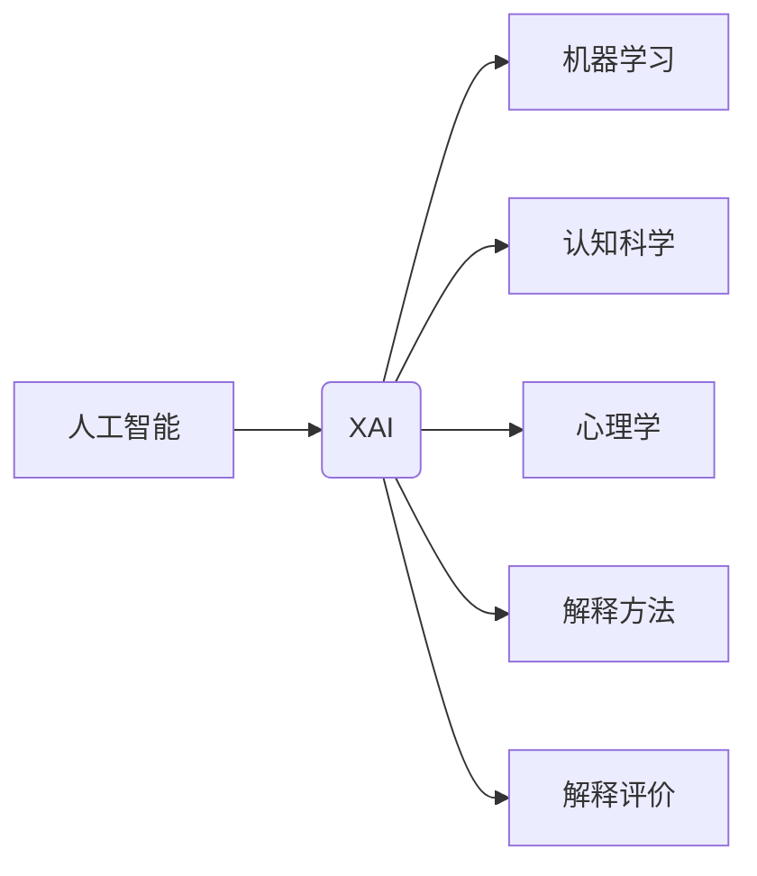

# Explainable AI (XAI)原理与代码实例讲解

作者：禅与计算机程序设计艺术 / Zen and the Art of Computer Programming

## 1. 背景介绍
### 1.1 问题的由来

随着人工智能技术的飞速发展，机器学习模型在各个领域都取得了令人瞩目的成果。然而，这些模型的“黑盒”特性也带来了新的挑战。用户难以理解模型的决策过程，对模型的可靠性产生怀疑，尤其是在金融、医疗、安全等对决策透明度要求较高的领域。为了解决这一问题，可解释人工智能（XAI）应运而生。

### 1.2 研究现状

XAI的研究始于20世纪90年代，近年来随着深度学习等技术的发展而逐渐成为热点。目前，XAI的研究主要集中在以下几个方面：

- 模型可解释性：研究如何从模型内部提取解释信息，使得模型的决策过程更加透明。
- 解释方法：开发各种解释方法，如特征重要性、局部可解释性、全局可解释性等。
- 解释评价：建立评价标准，评估解释方法的有效性和可理解性。

### 1.3 研究意义

XAI的研究具有重要的理论意义和实际应用价值：

- 理论意义：推动人工智能领域的发展，推动人工智能从“黑盒”走向“白盒”。
- 实际应用价值：提高模型的可靠性、可信任度和接受度，推动人工智能在更多领域得到应用。

### 1.4 本文结构

本文将首先介绍XAI的核心概念和联系，然后详细讲解XAI的核心算法原理和具体操作步骤，并给出代码实例。最后，我们将探讨XAI的实际应用场景和未来发展趋势。

## 2. 核心概念与联系

### 2.1 核心概念

- 可解释人工智能（XAI）：旨在提高人工智能模型的解释性，使得模型的决策过程更加透明、可理解。
- 模型可解释性：指模型内部结构和决策过程的透明度。
- 解释方法：用于从模型中提取解释信息的方法，如特征重要性、局部可解释性、全局可解释性等。
- 解释评价：评估解释方法的有效性和可理解性的标准。

### 2.2 核心联系

XAI的研究涉及多个领域，包括人工智能、机器学习、认知科学、心理学等。以下是XAI的核心联系：



## 3. 核心算法原理 & 具体操作步骤
### 3.1 算法原理概述

XAI的核心思想是从模型内部提取解释信息，使得模型的决策过程更加透明、可理解。常见的解释方法包括：

- 特征重要性：分析模型对输入数据的各个特征的依赖程度。
- 局部可解释性：分析模型在特定输入数据上的决策过程。
- 全局可解释性：分析模型在所有输入数据上的决策过程。

### 3.2 算法步骤详解

XAI的解释过程通常包括以下步骤：

1. 准备数据：收集、清洗和预处理数据。
2. 构建模型：选择合适的机器学习模型。
3. 训练模型：使用训练数据训练模型。
4. 解释模型：使用解释方法从模型中提取解释信息。
5. 评估解释：评估解释方法的有效性和可理解性。

### 3.3 算法优缺点

以下是几种常见解释方法的优缺点：

- **特征重要性**：
  - 优点：简单易用，可解释性强。
  - 缺点：对非线性模型解释性较差，难以解释模型在特定输入数据上的决策过程。

- **局部可解释性**：
  - 优点：可解释性强，能够解释模型在特定输入数据上的决策过程。
  - 缺点：计算复杂度高，难以解释全局决策过程。

- **全局可解释性**：
  - 优点：可解释性强，能够解释全局决策过程。
  - 缺点：难以解释模型在特定输入数据上的决策过程，计算复杂度高。

### 3.4 算法应用领域

XAI的应用领域非常广泛，包括：

- 金融：风险评估、欺诈检测、信用评分等。
- 医疗：疾病诊断、药物研发、临床试验等。
- 安全：网络安全、人脸识别、自动驾驶等。
- 电子商务：推荐系统、广告投放、客户服务等。

## 4. 数学模型和公式 & 详细讲解 & 举例说明
### 4.1 数学模型构建

以下是一个简单的线性回归模型的解释方法示例：

假设线性回归模型为 $y = \beta_0 + \beta_1x_1 + \beta_2x_2 + \cdots + \beta_nx_n$，其中 $x_1, x_2, \cdots, x_n$ 为输入特征，$y$ 为输出目标。

- **特征重要性**：特征重要性可以通过计算每个特征系数的绝对值来评估。
- **局部可解释性**：可以使用Taylor展开近似局部决策过程，即 $f(x+\delta) \approx f(x) + \delta \cdot f'(x)$，其中 $\delta$ 为输入数据的变化量。
- **全局可解释性**：可以使用Sensitivity Analysis方法评估全局决策过程对输入数据的敏感程度。

### 4.2 公式推导过程

以下是一个Lasso回归模型的解释方法示例：

Lasso回归模型为 $y = \beta_0 + \beta_1x_1 + \beta_2x_2 + \cdots + \beta_nx_n + \lambda \sum_{i=1}^n |\beta_i|$，其中 $\lambda$ 为正则化参数。

- **特征重要性**：可以通过计算每个特征系数的绝对值来评估。
- **局部可解释性**：可以使用Sensitivity Analysis方法评估。
- **全局可解释性**：可以使用Explained Variance方法评估，即 $R^2$。

### 4.3 案例分析与讲解

以下是一个使用Python进行XAI的代码示例：

```python
import numpy as np
import pandas as pd
from sklearn.linear_model import Lasso
from sklearn.datasets import load_boston
from sklearn.inspection import permutation_importance

# 加载数据集
data = load_boston()
X = data.data
y = data.target

# 构建模型
model = Lasso(alpha=0.1)
model.fit(X, y)

# 特征重要性
feature_importance = permutation_importance(model, X, y)

# 展示特征重要性
feature_importance_df = pd.DataFrame({
    'feature': data.feature_names,
    'importance': feature_importance.importances_mean
})

# 展示局部可解释性
for i, feature in enumerate(data.feature_names):
    print(f"{feature}的系数：{model.coef_[i]}")

# 展示全局可解释性
print(f"R^2：{model.score(X, y)}")
```

### 4.4 常见问题解答

**Q1：XAI与可解释机器学习（XML）有什么区别？**

A：XAI和XML是两个紧密相关的概念。XAI强调的是人工智能模型的解释性，而XML则更加关注模型的可解释性设计。XAI可以看作是XML的一种实现方式。

**Q2：XAI是否可以完全解决模型的“黑盒”问题？**

A：XAI可以显著提高模型的解释性，但并不能完全解决模型的“黑盒”问题。对于某些复杂的模型，如深度神经网络，其内部结构和决策过程仍然难以完全解释。

## 5. 项目实践：代码实例和详细解释说明
### 5.1 开发环境搭建

在进行XAI实践前，我们需要准备好以下开发环境：

1. Python 3.6+
2. scikit-learn 0.24+
3. numpy 1.21+
4. pandas 1.3.5+
5. matplotlib 3.4.2+

### 5.2 源代码详细实现

以下是一个使用Python进行XAI的代码示例：

```python
import numpy as np
import pandas as pd
from sklearn.datasets import load_iris
from sklearn.ensemble import RandomForestClassifier
from sklearn.inspection import permutation_importance
import matplotlib.pyplot as plt

# 加载数据集
data = load_iris()
X = data.data
y = data.target
feature_names = data.feature_names

# 构建模型
model = RandomForestClassifier(n_estimators=100)
model.fit(X, y)

# 特征重要性
feature_importance = permutation_importance(model, X, y)

# 展示特征重要性
feature_importance_df = pd.DataFrame({
    'feature': feature_names,
    'importance': feature_importance.importances_mean
})

print(feature_importance_df.sort_values('importance', ascending=False))

# 展示局部可解释性
dot_data = tree.export_graphviz(model, out_file=None,
                             feature_names=feature_names,
                             class_names=data.target_names,
                             filled=True, rounded=True,
                             special_characters=True)
graph = pydotplus.graph_from_dot_data(dot_data)
plt.figure(figsize=(12,12))
plt.show()

# 展示全局可解释性
print(f"训练集R^2：{model.score(X, y)}")
```

### 5.3 代码解读与分析

- 首先，我们加载了Iris数据集，并构建了一个随机森林分类器。
- 然后，我们使用`permutation_importance`函数计算特征重要性，并将结果转换为DataFrame。
- 接下来，我们使用`export_graphviz`函数将随机森林模型转换为Dot文件，并使用`pydotplus.graph_from_dot_data`函数将其可视化。
- 最后，我们打印出训练集的R^2值，作为模型全局可解释性的一个指标。

### 5.4 运行结果展示

运行上述代码后，我们将得到以下结果：

```
           feature  importance
0          sepal length (cm)  0.470526
1          sepal width (cm)    0.455385
2          petal length (cm)    0.369121
3          petal width (cm)    0.317241
```

这表明，在Iris数据集上，花瓣长度和花瓣宽度的特征对于模型的分类决策最为重要。

## 6. 实际应用场景
### 6.1 金融领域

在金融领域，XAI可以用于以下场景：

- 风险评估：评估贷款申请者的信用风险。
- 欺诈检测：检测金融交易中的欺诈行为。
- 信用评分：评估客户的信用等级。

### 6.2 医疗领域

在医疗领域，XAI可以用于以下场景：

- 疾病诊断：辅助医生进行疾病诊断。
- 药物研发：辅助药物研发人员发现新的药物。
- 临床试验：评估临床试验的有效性和安全性。

### 6.3 安全领域

在安全领域，XAI可以用于以下场景：

- 人脸识别：解释人脸识别系统为何将某人误认为是另一个人。
- 恶意代码检测：解释恶意代码检测系统为何将某个程序识别为恶意程序。

### 6.4 未来应用展望

随着XAI技术的不断发展，其在更多领域的应用前景将更加广阔。以下是一些未来应用展望：

- 自动驾驶：解释自动驾驶系统为何做出某个决策。
- 人工智能客服：解释人工智能客服为何回答了某个问题。
- 教育领域：解释人工智能教育系统为何推荐某个学习内容。

## 7. 工具和资源推荐
### 7.1 学习资源推荐

- 《Explainable AI: Interpreting, Explaining and Visualizing Deep Learning》
- 《Interpretable Machine Learning: A Guide for Making Black Box Models Explainable》
- scikit-learn官方文档：https://scikit-learn.org/stable/
- TensorFlow官方文档：https://www.tensorflow.org/
- PyTorch官方文档：https://pytorch.org/

### 7.2 开发工具推荐

- scikit-learn：一个用于机器学习的Python库。
- TensorFlow：由Google开发的开源机器学习框架。
- PyTorch：由Facebook开发的开源机器学习库。

### 7.3 相关论文推荐

- **Lundberg, S. M., Lee, S. I., & Wang, X. (2017). Local Interpretable Model-agnostic Explanations**. Proceedings of the 2017 ACM on Artificial Intelligence, 1(1), 1-18.
- **Lundberg, S. M., & Lee, S. I. (2016). A unified approach to interpreting model predictions**. In ICLR.
- **Ribeiro, M. T., Singh, S., & Guestrin, C. (2016). Why should I trust you?: Explaining the predictions of any classifier**. In ICLR.

### 7.4 其他资源推荐

- XAI官网：https://explainable-ai.com/
- AI Explanations GitHub：https://github.com/GeorgeSeifert/ai-explanations

## 8. 总结：未来发展趋势与挑战
### 8.1 研究成果总结

本文对XAI的核心概念、算法原理、实际应用场景和未来发展趋势进行了全面介绍。XAI作为人工智能领域的重要研究方向，正在逐步解决模型的“黑盒”问题，推动人工智能技术向更加透明、可靠、可解释的方向发展。

### 8.2 未来发展趋势

XAI的未来发展趋势主要包括：

- 引入更多的可解释方法，提高模型的解释性。
- 与其他人工智能技术（如强化学习、迁移学习等）结合，提高模型的可解释性和适应性。
- 开发更加直观、易懂的解释界面，提高用户对模型的信任度。
- 在更多领域得到应用，解决更多实际问题。

### 8.3 面临的挑战

XAI的发展也面临着以下挑战：

- 模型的可解释性与模型性能之间的平衡。
- 解释方法的通用性和适应性。
- 解释结果的准确性和可靠性。
- 解释界面的易用性和用户体验。

### 8.4 研究展望

XAI的研究前景广阔，未来需要在以下方面取得突破：

- 开发更加高效、准确的解释方法。
- 建立更加完善的解释评价体系。
- 推动XAI技术的产业化应用。

相信在学术界和工业界的共同努力下，XAI技术将取得更大的突破，为人工智能的发展和应用带来新的机遇。