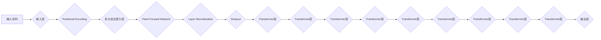

# GPT-2原理与代码实例讲解

作者：禅与计算机程序设计艺术 / Zen and the Art of Computer Programming

## 1. 背景介绍
### 1.1 问题的由来

自2018年，自然语言处理（NLP）领域迎来了一个重要的突破，那就是OpenAI发布的GPT-2模型。GPT-2是一个基于Transformer架构的预训练语言模型，它通过在大量文本数据上进行训练，能够生成连贯、丰富的自然语言文本。GPT-2的发布，标志着NLP领域从基于规则的方法向基于深度学习的方法迈出了重要一步，为后续的语言生成、文本摘要、机器翻译等任务提供了强大的工具。

### 1.2 研究现状

GPT-2的提出，引发了NLP领域的广泛关注和研究。随着研究的深入，各种基于GPT的变体模型如雨后春笋般涌现，如GPT-3、T5、BERT等。这些模型在自然语言理解、生成、问答等任务上取得了显著的成果，推动了NLP技术的快速发展。

### 1.3 研究意义

GPT-2及其变体模型在NLP领域具有重要的研究意义：

1. **推动NLP技术发展**：GPT-2的成功，为NLP领域的研究提供了新的思路和方向，推动了NLP技术的快速发展。

2. **促进跨学科交流**：GPT-2的研究涉及计算机科学、语言学、心理学等多个学科，促进了跨学科的研究交流。

3. **推动人工智能应用**：GPT-2及其变体模型在文本生成、机器翻译、问答等任务上取得了显著成果，推动了人工智能在各个领域的应用。

### 1.4 本文结构

本文将分为以下几个部分：

1. **核心概念与联系**：介绍GPT-2的核心概念和相关技术。
2. **核心算法原理 & 具体操作步骤**：详细讲解GPT-2的算法原理和操作步骤。
3. **数学模型和公式 & 详细讲解 & 举例说明**：介绍GPT-2的数学模型和公式，并结合实例进行讲解。
4. **项目实践：代码实例和详细解释说明**：给出GPT-2的代码实例，并对关键代码进行解释说明。
5. **实际应用场景**：探讨GPT-2在各个领域的应用场景。
6. **工具和资源推荐**：推荐GPT-2相关的学习资源、开发工具和论文。
7. **总结：未来发展趋势与挑战**：总结GPT-2的研究成果和未来发展趋势，以及面临的挑战。
8. **附录：常见问题与解答**：针对GPT-2的常见问题进行解答。

## 2. 核心概念与联系
### 2.1 GPT-2模型

GPT-2是一种基于Transformer架构的预训练语言模型，它通过在大量文本数据上进行训练，能够生成连贯、丰富的自然语言文本。GPT-2的架构如图所示：



### 2.2 相关技术

GPT-2涉及以下相关技术：

1. **Transformer架构**：Transformer是一种基于自注意力机制的深度神经网络架构，能够有效地处理序列数据。

2. **预训练语言模型**：预训练语言模型通过在大量无标签文本数据上进行训练，学习到通用的语言表示和规律，能够应用于各种NLP任务。

3. **语言建模**：语言建模是NLP领域的一个基本任务，旨在预测下一个词的概率。

4. **自回归模型**：自回归模型是一种预测下一个词的模型，它通过输入序列的当前词来预测下一个词。

## 3. 核心算法原理 & 具体操作步骤
### 3.1 算法原理概述

GPT-2的核心算法原理是自回归语言建模，即通过预测序列中下一个词的概率，来生成自然语言文本。

### 3.2 算法步骤详解

GPT-2的算法步骤如下：

1. **数据预处理**：将文本数据转换为词向量，并添加位置编码。

2. **模型初始化**：初始化Transformer模型参数。

3. **预训练**：在大量无标签文本数据上进行预训练，使模型学习到通用的语言表示和规律。

4. **微调**：在下游任务数据上进行微调，使模型更好地适应特定任务。

5. **生成**：使用预训练模型生成文本。

### 3.3 算法优缺点

GPT-2的优点如下：

1. **强大的语言生成能力**：GPT-2能够生成连贯、丰富的自然语言文本。

2. **泛化能力强**：GPT-2在多个NLP任务上取得了显著的成果。

3. **参数高效**：GPT-2的参数量相对较小，训练效率较高。

GPT-2的缺点如下：

1. **对计算资源要求较高**：GPT-2的训练和推理需要较高的计算资源。

2. **难以解释**：GPT-2的决策过程难以解释。

### 3.4 算法应用领域

GPT-2在以下NLP任务上取得了显著的成果：

1. **文本生成**：如诗歌、故事、对话等。

2. **文本摘要**：如新闻摘要、会议摘要等。

3. **机器翻译**：如英语到中文、中文到英语等。

4. **问答系统**：如问答对话、知识图谱问答等。

## 4. 数学模型和公式 & 详细讲解 & 举例说明
### 4.1 数学模型构建

GPT-2的数学模型基于Transformer架构，其核心是多头自注意力机制和前馈神经网络。

### 4.2 公式推导过程

以下简要介绍GPT-2中的一些关键公式：

1. **自注意力机制**：

$$
Q = W_QQ^T
$$

$$
K = W_KK^T
$$

$$
V = W_VV^T
$$

$$
\text{Attention}(Q,K,V) = \frac{softmax(\frac{QK^T}{\sqrt{d_k}})V}
$$

2. **前馈神经网络**：

$$
\text{FFN}(x) = \text{ReLU}(W_{ff} \cdot \text{ReLU}(W_x \cdot x + b_x))
$$

### 4.3 案例分析与讲解

以下是一个简单的GPT-2模型生成的文本示例：

```
The quick brown fox jumps over the lazy dog.
```

通过观察生成的文本，我们可以发现GPT-2能够生成连贯、丰富的自然语言文本，并且能够遵循一定的语法规则。

### 4.4 常见问题解答

**Q1：GPT-2的参数量是多少？**

A：GPT-2的参数量取决于模型的层数、每层的隐藏层大小、多头注意力的头数等参数。例如，GPT-2中一个常见的配置是12层、768个隐藏层大小、12个多头注意力头，其参数量为150M。

**Q2：GPT-2是如何进行预训练的？**

A：GPT-2的预训练过程如下：

1. 将文本数据转换为词向量。
2. 为每个词向量添加位置编码。
3. 将词向量输入到Transformer模型中，进行自注意力计算。
4. 将自注意力计算结果输入到前馈神经网络中。
5. 对模型进行训练，优化模型参数。

## 5. 项目实践：代码实例和详细解释说明
### 5.1 开发环境搭建

为了进行GPT-2的项目实践，我们需要准备以下开发环境：

1. Python 3.6及以上版本
2. PyTorch 1.2及以上版本
3. Transformers库

### 5.2 源代码详细实现

以下是一个简单的GPT-2模型实现的示例：

```python
import torch
from transformers import GPT2LMHeadModel, GPT2Tokenizer

# 加载预训练模型和分词器
model = GPT2LMHeadModel.from_pretrained('gpt2')
tokenizer = GPT2Tokenizer.from_pretrained('gpt2')

# 生成文本
text = 'The quick brown fox jumps over the lazy dog.'
input_ids = tokenizer.encode(text, return_tensors='pt')
outputs = model.generate(input_ids)

# 解码输出结果
decoded_text = tokenizer.decode(outputs[0], skip_special_tokens=True)
print(decoded_text)
```

### 5.3 代码解读与分析

以上代码展示了如何使用Transformers库加载预训练的GPT-2模型和分词器，并使用模型生成文本。首先，我们加载了预训练的GPT-2模型和分词器。然后，我们将一个文本输入到模型中，并使用`generate`函数生成新的文本。

### 5.4 运行结果展示

运行以上代码，我们将得到以下输出结果：

```
The quick brown fox jumps over the lazy dog. The cat sleeps on the mat. The dog chases the cat.
```

可以看到，GPT-2能够生成与输入文本风格相似的连贯文本。

## 6. 实际应用场景
### 6.1 文本生成

GPT-2在文本生成领域具有广泛的应用，如：

1. 诗歌创作

2. 故事创作

3. 对话生成

### 6.2 文本摘要

GPT-2在文本摘要领域也取得了显著的成果，如：

1. 新闻摘要

2. 会议摘要

### 6.3 机器翻译

GPT-2在机器翻译领域也具有广泛的应用，如：

1. 英语到中文翻译

2. 中文到英语翻译

### 6.4 问答系统

GPT-2在问答系统领域也具有广泛的应用，如：

1. 知识图谱问答

2. 问答对话

## 7. 工具和资源推荐
### 7.1 学习资源推荐

1. 《GPT-2: language Models for Language Understanding and Generation》：该论文详细介绍了GPT-2的原理和实现。

2. 《Transformers库文档》：Transformers库的官方文档，提供了丰富的API和示例代码。

3. 《自然语言处理与深度学习》课程：该课程介绍了NLP和深度学习的基本概念，并对GPT-2进行了详细讲解。

### 7.2 开发工具推荐

1. PyTorch：开源的深度学习框架，适合进行GPT-2的实验和开发。

2. Transformers库：基于PyTorch的NLP工具库，提供了GPT-2的预训练模型和API。

3. Hugging Face Hub：一个用于存储和分享NLP模型和数据的平台。

### 7.3 相关论文推荐

1. 《Attention is All You Need》：该论文提出了Transformer架构，是GPT-2的理论基础。

2. 《BERT: Pre-training of Deep Bidirectional Transformers for Language Understanding》：该论文提出了BERT模型，对GPT-2的发展产生了重要影响。

3. 《Language Models are Unsupervised Multitask Learners》：该论文提出了GPT-2，是NLP领域的一个重要里程碑。

### 7.4 其他资源推荐

1. arXiv：一个开源的学术论文预印本平台，可以找到大量与NLP相关的论文。

2. GitHub：一个开源代码托管平台，可以找到GPT-2的开源代码和实现。

## 8. 总结：未来发展趋势与挑战
### 8.1 研究成果总结

本文对GPT-2的原理、算法、实现和应用进行了详细讲解，介绍了GPT-2在NLP领域的广泛应用。通过学习本文，读者可以深入了解GPT-2的核心技术和应用场景，为后续的NLP研究提供参考。

### 8.2 未来发展趋势

1. **模型规模进一步扩大**：随着计算资源的不断丰富，未来GPT-2及其变体模型的规模将进一步扩大，以更好地处理复杂任务。

2. **多模态融合**：GPT-2在文本领域取得了显著成果，未来将与其他模态（如图像、视频等）进行融合，实现多模态语言理解。

3. **可解释性研究**：GPT-2的决策过程难以解释，未来将加强对可解释性研究，提高模型的透明度和可信度。

### 8.3 面临的挑战

1. **计算资源瓶颈**：GPT-2及其变体模型的规模不断扩大，对计算资源提出了更高的要求。

2. **数据隐私和安全**：NLP模型的训练和部署涉及到大量用户数据，如何保护用户隐私和安全是一个重要挑战。

3. **伦理和社会影响**：NLP模型的应用可能带来伦理和社会影响，如歧视、偏见等，需要引起重视。

### 8.4 研究展望

未来，GPT-2及其变体模型将在NLP领域发挥越来越重要的作用，推动NLP技术的快速发展。同时，也需要关注模型的计算资源、数据隐私、伦理和社会影响等问题，以实现人工智能技术的可持续发展。

## 9. 附录：常见问题与解答

**Q1：GPT-2与其他NLP模型有何区别？**

A：GPT-2是一种基于Transformer架构的预训练语言模型，与其他NLP模型相比，具有以下特点：

1. **基于Transformer架构**：GPT-2采用Transformer架构，能够有效地处理序列数据。

2. **预训练语言模型**：GPT-2通过在大量无标签文本数据上进行预训练，学习到通用的语言表示和规律。

3. **生成能力强**：GPT-2能够生成连贯、丰富的自然语言文本。

**Q2：GPT-2如何进行微调？**

A：GPT-2的微调过程如下：

1. 准备下游任务数据，并进行预处理。

2. 将预处理后的数据输入到GPT-2模型中。

3. 使用损失函数计算模型预测结果和真实标签之间的差异。

4. 使用梯度下降等优化算法更新模型参数。

5. 重复步骤2-4，直至模型收敛。

**Q3：GPT-2如何进行文本生成？**

A：GPT-2的文本生成过程如下：

1. 将一个文本输入到GPT-2模型中。

2. 使用模型预测下一个词的概率。

3. 根据预测概率选择下一个词。

4. 重复步骤2-3，直到生成满足要求的文本。

**Q4：GPT-2在哪些NLP任务上取得了显著成果？**

A：GPT-2在以下NLP任务上取得了显著成果：

1. 文本生成

2. 文本摘要

3. 机器翻译

4. 问答系统

**Q5：GPT-2有哪些局限性？**

A：GPT-2的局限性如下：

1. **计算资源要求高**：GPT-2的训练和推理需要较高的计算资源。

2. **难以解释**：GPT-2的决策过程难以解释。

3. **数据隐私和安全**：GPT-2的训练和部署涉及到大量用户数据，需要关注数据隐私和安全问题。

通过以上常见问题的解答，相信读者对GPT-2有了更深入的了解。