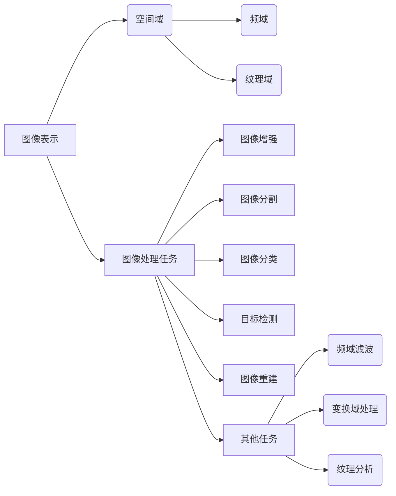

# Image Processing 原理与代码实战案例讲解

作者：禅与计算机程序设计艺术 / Zen and the Art of Computer Programming

## 1. 背景介绍

### 1.1 问题的由来

图像处理是计算机视觉领域的基础，广泛应用于图像分析、计算机辅助设计、医学影像、遥感、机器人等众多领域。随着深度学习的兴起，图像处理技术取得了巨大的进步，使得机器能够从图像中提取信息、进行理解、甚至生成新的图像。

然而，图像处理技术的应用并非一蹴而就，需要深入了解其原理，掌握相关算法，并通过实战案例进行应用。本文将系统地介绍图像处理的基本原理、常用算法、代码实现以及实际应用场景，帮助读者全面掌握图像处理技术。

### 1.2 研究现状

近年来，图像处理技术取得了长足的进步，主要表现在以下几个方面：

- 深度学习技术的快速发展，使得图像分类、目标检测、图像分割等任务取得了突破性的成果。
- 计算能力的提升，使得复杂的图像处理算法能够得到有效实现。
- 大规模图像数据集的涌现，为图像处理研究提供了丰富的资源。

### 1.3 研究意义

掌握图像处理技术对于相关领域的科研人员和工程技术人员具有重要意义：

- 提升科研能力：帮助研究人员更好地理解和应用图像处理技术，推动相关领域的研究发展。
- 提高工程实践能力：帮助工程技术人员将图像处理技术应用于实际工程项目中，提升工程实践能力。
- 推动产业发展：促进图像处理技术的产业化应用，推动相关产业的发展。

### 1.4 本文结构

本文将分为以下几个部分：

- 第2部分：介绍图像处理的核心概念与联系。
- 第3部分：详细讲解图像处理的基本算法原理和具体操作步骤。
- 第4部分：给出图像处理的数学模型和公式，并进行详细讲解和举例说明。
- 第5部分：提供图像处理的代码实例，并进行详细解释和分析。
- 第6部分：探讨图像处理在各个领域的实际应用场景。
- 第7部分：推荐图像处理的学习资源、开发工具和参考文献。
- 第8部分：总结图像处理技术的未来发展趋势与挑战。

## 2. 核心概念与联系

为了更好地理解图像处理技术，本节将介绍几个核心概念及其相互联系。

### 2.1 图像表示

图像表示是图像处理的基础，常见的图像表示方法包括：

- 空间域表示：使用像素值直接表示图像，方便进行直观的图像操作。
- 频域表示：将图像分解为不同频率成分，方便进行滤波、变换等操作。
- 纹理表示：通过纹理特征描述图像的纹理信息，方便进行纹理分析。

### 2.2 图像处理任务

图像处理任务主要包括：

- 图像增强：提高图像质量，使其更符合人眼视觉特性。
- 图像分割：将图像划分为若干区域，提取感兴趣的目标区域。
- 图像分类：将图像划分为不同的类别，如猫、狗、植物等。
- 目标检测：定位图像中的目标位置和类别。
- 图像重建：从退化、噪声等图像中恢复出原始图像。

### 2.3 图像处理算法

图像处理算法主要包括：

- 频域滤波：对图像进行滤波，去除噪声、边缘检测等。
- 变换域处理：将图像转换到频域、小波域等，进行滤波、压缩等操作。
- 纹理分析：分析图像的纹理特征，进行纹理分类、纹理分割等。

以上概念之间的联系可以用以下图示表示：



从图中可以看出，图像处理技术是一个复杂的系统，涉及多个概念和算法。

## 3. 核心算法原理 & 具体操作步骤

### 3.1 算法原理概述

本节将介绍图像处理中常用的几种核心算法原理。

#### 3.1.1 空间域滤波

空间域滤波是通过卷积运算对图像进行局部邻域操作，去除噪声、边缘检测等。常见的空间域滤波器包括：

- 均值滤波：对邻域像素进行平均，去除噪声。
- 中值滤波：对邻域像素进行排序，取中值，去除椒盐噪声。
- 高斯滤波：对邻域像素进行加权平均，平滑图像。

#### 3.1.2 频域滤波

频域滤波是将图像转换到频域，进行滤波、压缩等操作。常见的频域滤波器包括：

- 低通滤波：保留低频成分，抑制高频噪声。
- 高通滤波：抑制低频成分，保留高频噪声。

#### 3.1.3 纹理分析

纹理分析是通过分析图像的纹理特征，进行纹理分类、纹理分割等。常见的纹理分析算法包括：

- 灰度共生矩阵：描述图像纹理的统计特征。
- 纹理能量：描述纹理的强度。
- 纹理方向：描述纹理的方向。

### 3.2 算法步骤详解

以下以中值滤波为例，介绍空间域滤波的具体操作步骤。

**步骤 1：定义滤波器**

首先，需要定义一个中值滤波器。以下是一个3x3的中值滤波器：

```
0 1 0
1 1 1
0 1 0
```

**步骤 2：卷积运算**

将图像与滤波器进行卷积运算，得到新的图像。具体步骤如下：

1. 将滤波器中心对齐到图像的左上角。
2. 对滤波器覆盖范围内的像素值进行排序，取中值，作为新图像的对应像素值。
3. 重复步骤 1 和 2，直到完成整个图像的卷积运算。

### 3.3 算法优缺点

#### 3.3.1 空间域滤波

优点：

- 实现简单，计算效率高。
- 对噪声抑制能力强。

缺点：

- 对边缘信息抑制严重。
- 可能产生伪影。

#### 3.3.2 频域滤波

优点：

- 可以精确控制滤波效果。
- 可以实现多种滤波效果，如锐化、浮雕等。

缺点：

- 实现复杂，计算效率低。
- 可能引入新的噪声。

#### 3.3.3 纹理分析

优点：

- 可以有效描述图像的纹理特征。
- 可以进行纹理分类、纹理分割等。

缺点：

- 算法复杂，计算效率低。
- 难以处理复杂的纹理特征。

### 3.4 算法应用领域

空间域滤波、频域滤波和纹理分析等算法在图像处理领域有着广泛的应用，例如：

- 图像去噪：使用均值滤波、中值滤波等方法去除图像噪声。
- 图像增强：使用锐化、浮雕等方法增强图像特征。
- 图像分割：使用边缘检测、纹理分割等方法进行图像分割。
- 目标检测：使用特征提取、分类等方法检测图像中的目标。

## 4. 数学模型和公式 & 详细讲解 & 举例说明

### 4.1 数学模型构建

本节将介绍图像处理中常用的数学模型和公式。

#### 4.1.1 卷积运算

卷积运算是图像处理中常用的数学模型，用于图像滤波、特征提取等。其数学公式如下：

$$
(f * g)(x,y) = \sum_{i=-\infty}^{+\infty} \sum_{j=-\infty}^{+\infty} f(i,j)g(x-i,y-j)
$$

其中，$f(x,y)$ 和 $g(x,y)$ 分别为两个图像，$*$ 表示卷积运算。

#### 4.1.2 频域变换

图像的频域变换是将图像从空间域转换到频域的过程。常见的频域变换包括傅里叶变换和小波变换。以下以傅里叶变换为例，介绍其数学公式：

$$
F(u,v) = \frac{1}{M \cdot N} \sum_{i=1}^{M} \sum_{j=1}^{N} f(i,j) e^{-i 2 \pi (u \frac{i}{M} + v \frac{j}{N})}
$$

其中，$f(x,y)$ 为原始图像，$F(u,v)$ 为频域图像，$M$ 和 $N$ 分别为图像的行数和列数。

### 4.2 公式推导过程

以下以傅里叶变换为例，介绍其推导过程。

**步骤 1：定义二维傅里叶变换**

设 $f(x,y)$ 为二维实值连续函数，其二维傅里叶变换为：

$$
F(u,v) = \int_{-\infty}^{+\infty} \int_{-\infty}^{+\infty} f(x,y) e^{-i 2 \pi (u x + v y)} dx dy
$$

**步骤 2：离散化傅里叶变换**

将连续函数离散化，得到二维离散傅里叶变换：

$$
F(m,n) = \sum_{i=1}^{M} \sum_{j=1}^{N} f(i,j) e^{-i 2 \pi (m \frac{i}{M} + n \frac{j}{N})}
$$

其中，$F(m,n)$ 为离散傅里叶变换后的频域图像。

### 4.3 案例分析与讲解

以下以图像去噪为例，介绍如何使用傅里叶变换进行图像去噪。

**步骤 1：获取图像**

首先，需要获取一张含有噪声的图像。

**步骤 2：傅里叶变换**

对图像进行傅里叶变换，得到频域图像。

**步骤 3：频域滤波**

在频域图像上，使用高通滤波器去除噪声。

**步骤 4：逆傅里叶变换**

将经过滤波的频域图像进行逆傅里叶变换，得到去噪后的图像。

**步骤 5：显示结果**

显示去噪后的图像，并与原始图像进行对比。

### 4.4 常见问题解答

**Q1：为什么需要使用傅里叶变换进行图像去噪？**

A：傅里叶变换可以将图像从空间域转换到频域，方便进行滤波、压缩等操作。在频域上，噪声通常分布在高频区域，通过高通滤波器可以去除噪声。

**Q2：如何选择合适的滤波器？**

A：选择合适的滤波器取决于具体的应用场景和噪声类型。例如，对于椒盐噪声，可以使用中值滤波；对于高斯噪声，可以使用高斯滤波。

## 5. 项目实践：代码实例和详细解释说明

### 5.1 开发环境搭建

在进行图像处理项目实践前，需要搭建以下开发环境：

- Python 3.7及以上版本
- OpenCV库：用于图像处理
- NumPy库：用于数值计算
- Matplotlib库：用于图像显示

### 5.2 源代码详细实现

以下是一个使用OpenCV库进行图像去噪的示例代码：

```python
import cv2
import numpy as np

# 读取图像
image = cv2.imread('noise_image.jpg')

# 转换为灰度图像
gray = cv2.cvtColor(image, cv2.COLOR_BGR2GRAY)

# 使用高斯滤波器去除噪声
blurred = cv2.GaussianBlur(gray, (5, 5), 0)

# 显示结果
cv2.imshow('Original Image', image)
cv2.imshow('Blurred Image', blurred)
cv2.waitKey(0)
cv2.destroyAllWindows()
```

### 5.3 代码解读与分析

以上代码展示了如何使用OpenCV库读取图像、转换图像格式、使用高斯滤波器去除噪声，并显示结果。

- `cv2.imread()` 函数用于读取图像。
- `cv2.cvtColor()` 函数用于将图像转换为灰度图像。
- `cv2.GaussianBlur()` 函数用于使用高斯滤波器去除噪声。
- `cv2.imshow()` 函数用于显示图像。
- `cv2.waitKey(0)` 和 `cv2.destroyAllWindows()` 函数用于等待用户按键并关闭窗口。

### 5.4 运行结果展示

运行以上代码，将显示原始图像和去噪后的图像。

## 6. 实际应用场景

### 6.1 医学影像分析

图像处理技术在医学影像分析中有着广泛的应用，例如：

- 病灶检测：检测图像中的异常区域，如肿瘤、血管等。
- 组织分割：将图像分割为不同的组织类型，如肌肉、骨骼等。
- 图像重建：从二维图像重建三维图像，如CT、MRI等。

### 6.2 计算机视觉

图像处理技术在计算机视觉中有着广泛的应用，例如：

- 目标检测：检测图像中的目标位置和类别。
- 人脸识别：识别图像中的人脸。
- 行人检测：检测图像中的行人。

### 6.3 遥感

图像处理技术在遥感领域有着广泛的应用，例如：

- 地貌分析：分析地表地貌特征。
- 环境监测：监测环境污染、灾害预警等。

### 6.4 其他应用

图像处理技术在其他领域也有着广泛的应用，例如：

- 图像识别：识别图像中的物体、场景等。
- 图像合成：合成新的图像。
- 图像编辑：编辑图像内容。

## 7. 工具和资源推荐

### 7.1 学习资源推荐

以下是一些学习图像处理技术的推荐资源：

- OpenCV官方文档：https://opencv.org/docs/
- Python OpenCV教程：https://opencv-python-tutorial.readthedocs.io/en/latest/
- 计算机视觉基础：https://www.cnblogs.com/luoming1993/p/11025980.html

### 7.2 开发工具推荐

以下是一些常用的图像处理开发工具：

- OpenCV库：https://opencv.org/
- NumPy库：https://numpy.org/
- Matplotlib库：https://matplotlib.org/

### 7.3 相关论文推荐

以下是一些与图像处理相关的论文推荐：

- SIFT：Distinctive Image Features from Scale-Invariant Keypoints
- SURF：Speeded Up Robust Features
- ORB：Oriented FAST and Rotated BRIEF
- R-CNN：Rich Features for Accurate Object Detection and Segmentation

### 7.4 其他资源推荐

以下是一些其他与图像处理相关的资源：

- 计算机视觉基础教程：https://www.jianshu.com/p/6d10a4a5b1b6
- 图像处理实战案例：https://github.com/jyangcs/opencv_practice

## 8. 总结：未来发展趋势与挑战

### 8.1 研究成果总结

本文对图像处理的基本原理、常用算法、代码实现以及实际应用场景进行了系统介绍。通过本文的学习，读者可以全面掌握图像处理技术。

### 8.2 未来发展趋势

未来图像处理技术将呈现以下发展趋势：

- 深度学习技术的进一步发展，使得图像处理任务能够取得更高的精度。
- 图像处理算法的进一步优化，使得计算效率更高。
- 图像处理技术的进一步融合，与其他人工智能技术相结合，实现更智能化的应用。

### 8.3 面临的挑战

图像处理技术在实际应用中仍面临以下挑战：

- 数据量巨大：图像数据量巨大，对存储和计算资源提出更高要求。
- 算法复杂：一些图像处理算法计算复杂，需要高性能计算设备。
- 模型可解释性：深度学习模型的可解释性较差，难以理解其内部工作机制。

### 8.4 研究展望

未来图像处理技术研究将从以下几个方面进行：

- 开发更有效的图像处理算法，提高计算效率。
- 研究更先进的深度学习模型，提高图像处理精度。
- 研究图像处理算法的可解释性，提高模型的可信度。
- 将图像处理技术与其他人工智能技术相结合，实现更智能化的应用。

## 9. 附录：常见问题与解答

**Q1：什么是图像处理？**

A：图像处理是指使用计算机技术和算法对图像进行分析、处理和优化的过程。

**Q2：什么是图像增强？**

A：图像增强是指提高图像质量，使其更符合人眼视觉特性的过程。

**Q3：什么是图像分割？**

A：图像分割是指将图像划分为若干区域，提取感兴趣的目标区域的过程。

**Q4：什么是目标检测？**

A：目标检测是指定位图像中的目标位置和类别的过程。

**Q5：什么是深度学习？**

A：深度学习是一种模拟人脑神经网络结构和功能的人工智能技术，能够自动从数据中学习特征和模式。

**Q6：什么是卷积神经网络(CNN)？**

A：卷积神经网络是一种深度学习模型，能够有效地提取图像特征。

**Q7：什么是图像去噪？**

A：图像去噪是指去除图像中的噪声，提高图像质量的过程。

**Q8：什么是图像分割？**

A：图像分割是指将图像划分为若干区域，提取感兴趣的目标区域的过程。

**Q9：什么是目标检测？**

A：目标检测是指定位图像中的目标位置和类别的过程。

**Q10：图像处理技术在哪些领域有应用？**

A：图像处理技术在医学影像、计算机视觉、遥感、图像识别等领域有广泛的应用。

---

作者：禅与计算机程序设计艺术 / Zen and the Art of Computer Programming